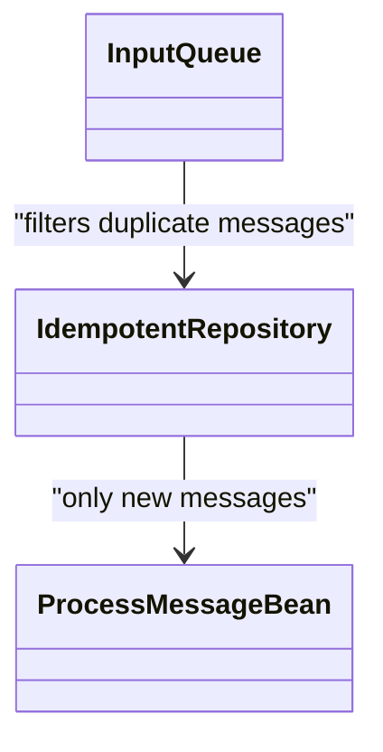
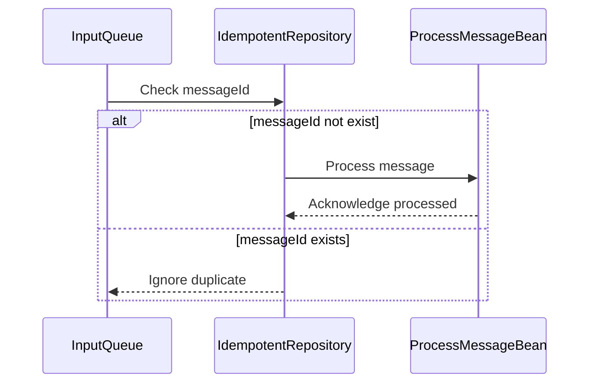

## Definition

An **Idempotent Receiver** is a design pattern used in message-oriented middleware systems to ensure that the processing of messages is idempotent. This means that regardless of how many times a particular message is received and processed, the outcome remains the same.

## Intent

The intent of the **Idempotent Receiver** pattern is to:

- Ensure exactly-once message processing.
- Prevent side effects from reprocessing duplicate messages.
- Maintain data consistency across distributed systems.

## Also Known As

- Idempotent Consumer
- Idempotent Endpoint

## Detailed Definitions and Explanations

An Idempotent Receiver ensures that an application can safely process a message even if it is delivered multiple times due to network failures, producer retries, or other issues. It does this by checking if a message has already been processed before acting on it.

### Key Features

- **Idempotency**: Ensures that processing a message multiple times does not affect the result after the first time.
- **Consistency**: Maintains consistent state across distributed components.
- **Resilience**: Makes the system more robust against message delivery failures.

### When to Use

- When guaranteed exactly-once processing of messages is crucial.
- When duplicate messages are a common scenario due to architecture or network limitations.
- In distributed systems where data consistency is vital.

## Code Examples

### Java Example with Apache Camel

```java
from("jms:queue:inputQueue")
    .idempotentConsumer(header("messageId"), new MemoryIdempotentRepository())
    .log("Processing message: ${body}")
    .to("bean:processMessageBean");
```

### Scala Example with Akka and Apache Kafka

```scala
import akka.actor.ActorSystem
import akka.kafka.ConsumerSettings
import akka.stream.alpakka.kafka.scaladsl.Consumer
import akka.stream.scaladsl.Sink
import org.apache.kafka.common.serialization.StringDeserializer

val system = ActorSystem("IdempotentReceiverSystem")
val kafkaConsumerSettings = ConsumerSettings(system, new StringDeserializer, new StringDeserializer)
  .withBootstrapServers("localhost:9092")
  .withGroupId("groupId")

val idempotentRepository = new InMemoryIdempotentRepository[String]

Consumer
  .plainSource(kafkaConsumerSettings, Subscriptions.topics("inputTopic"))
  .filterNot(msg => idempotentRepository.contains(msg.key))
  .map { msg =>
    idempotentRepository.add(msg.key)
    msg.value
  }
  .runWith(Sink.foreach(println))
```

## Example Class Diagram

### Class Diagram



#### Explanation

- `InputQueue` receives messages possibly including duplicates.
- `IdempotentRepository` keeps track of processed messages.
- `ProcessMessageBean` processes only the unique messages.

## Example Sequence Diagram

### Sequence Diagram



#### Explanation

- The message is first checked against the `IdempotentRepository`.
- If the message is new, it proceeds to be processed.
- If a duplicate message is detected, it's ignored.

## Benefits

- **Data Integrity**: Avoids duplicate message processing, ensuring that the data stays consistent.
- **Fault Tolerance**: Increases the robustness of the system against message delivery issues.
- **Simplified Logic**: Reduces the need to handle duplicates manually in the business logic.

## Trade-offs

- **Storage Overhead**: Requires storing states of processed messages.
- **Performance**: Potentially adds latency due to extra checking step.

## When Not to Use

- When duplicate messages can be tolerated or are rare.
- When performance is critically important and added latency cannot be justified.

## Anti-patterns

- **Ignoring Duplicates**: Simply ignoring duplicates without logging or handling can lead to data inconsistency.
- **Complex Idempotency Check**: Overly complex checks can degrade system performance.

## Related Design Patterns

- **Message Filter**: Can be combined with Idempotent Receiver to filter out unwanted messages.
- **Event Sourcing**: Helps track state changes and could be used to manage idempotency.

## References

- Gregory Hohpe, Bobby Woolf, _Enterprise Integration Patterns_.
- Apache Camel documentation: [Idempotent Consumer](https://camel.apache.org/components/latest/eips/idempotent-consumer-eip.html).
- Akka documentation: [Kafka Idempotent Consumers](https://doc.akka.io/docs/alpakka-kafka/current/consumer.html)
- Spring Integration documentation: [Idempotent Receiver](https://spring.io/projects/spring-integration).

## Open Source Frameworks

- Apache Camel
- Mule ESB
- Spring Integration
- Akka Streams
- Apache Kafka Streams

## Cloud Computing Integration

- **PAAS** (Platform as a Service): Utilize managed services that provide built-in idempotency features.
- **DAAS** (Data as a Service): Ensure exactly-once delivery semantics when integrating with third-party data services.

## Books for Further Studies

- [Enterprise Integration Patterns: Designing, Building, and Deploying Messaging Solutions](https://amzn.to/3XXncn8) by Gregor Hohpe and Bobby Woolf
- _Designing Data-Intensive Applications: The Big Ideas Behind Reliable, Scalable, and Maintainable Systems_ by Martin Kleppmann
