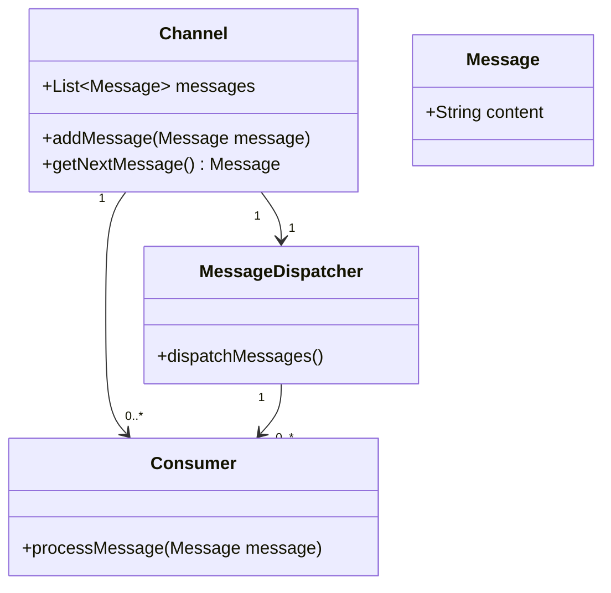
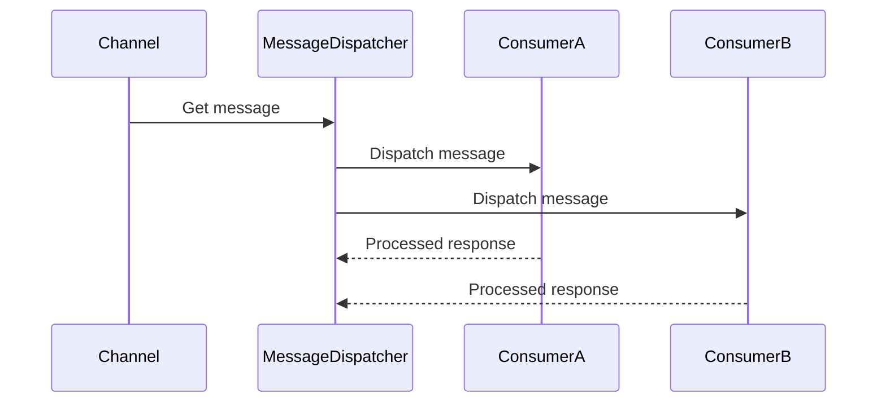

## **Message Dispatcher**

### **Intent**
The Message Dispatcher pattern helps to coordinate the processing of messages from a single channel among multiple consumers. It ensures that messages are delivered and processed without duplication and in an orderly fashion.

### **Also Known As**
- Message Broker
- Event Distributor
- Task Dispatcher

### **Detailed Definition and Explanation**
A Message Dispatcher facilitates the distribution of messages from a single channel to multiple consumers. It acts as a mediator to balance workloads among different consumers, ensuring that each message is processed once and only once.

### **Key Features**
- Centralized control of message delivery.
- Load balancing among multiple consumers.
- Ensures that messages are not lost or duplicated.
- Provides orderly processing of messages.

### **Class Diagram**


### **Detailed Explanation**
- `Channel`: Acts as the message source.
- `Message`: Represents the message content.
- `MessageDispatcher`: Manages the dispatching of messages.
- `Consumer`: Processes the messages.

### **Code Examples**

#### **Java (Apache Camel)**
```java
from("direct:input")
    .multicast()
    .parallelProcessing()
    .to("bean:consumerA", "bean:consumerB", "bean:consumerC");
```

#### **Scala (Akka)**
```scala
val system = ActorSystem("MessageDispatcherSystem")
val dispatcher = system.actorOf(Props[MessageDispatcher], "dispatcher")
dispatcher ! EnqueueMessages(List(Message("msg1"), Message("msg2")))
```

### **Sequence Diagram**


### **Benefits**
- Improved Resource Utilization: Distributes the load across multiple consumers.
- Scalability: Easily add or remove consumers based on demand.
- Fault Tolerance: Redundancy in consumers ensures that message processing can continue even if one consumer fails.

### **Trade-offs**
- Complexity: Adds architectural complexity to the system.
- Latency: Message routing may introduce additional latency.

### **When to Use**
- High throughput systems that need to process a large volume of messages.
- Scenarios where messages need to be processed by different consumers for scaling purposes.

### **Example Use Cases**
- Job queue handling where tasks are dispatched to various worker nodes.
- Processing events from a real-time data feed where multiple analytics engines consume the data.

### **When Not to Use**
- For simple message handling with only one consumer.
- If the overhead of message routing outweighs the benefits in low throughput systems.

### **Anti-patterns**
- Single Consumer Anti-pattern: Using a dispatcher but only having a single consumer, defeating the purpose of load distribution.

### **Related Design Patterns**
- **Message Channel**: Defines how messages are sent and received, forming the basis for dispatchers.
- **Message Router**: Provides routing based on message content, complementing the dispatcher in complex scenarios.

### **References and Credits**
- [Enterprise Integration Patterns: Designing, Building, and Deploying Messaging Solutions](https://amzn.to/3XXncn8) by Gregor Hohpe and Bobby Woolf

### **Open-Source Frameworks**
- **Apache Camel**: Provides a variety of EIPs including message dispatching.
- **Akka**: Actor-based concurrency suitable for implementing dispatchers.

### **Cloud Computing (SAAS, DAAS, PAAS)**
- **AWS SQS**: Queue service implementing message dispatching in the cloud.
- **Azure Service Bus**: Offers functionalities for message dispatching and processing.

### **Further Reading**
- [Designing Data-Intensive Applications](https://amzn.to/4cuX2Na) by Martin Kleppmann
- *Building Microservices* by Sam Newman

