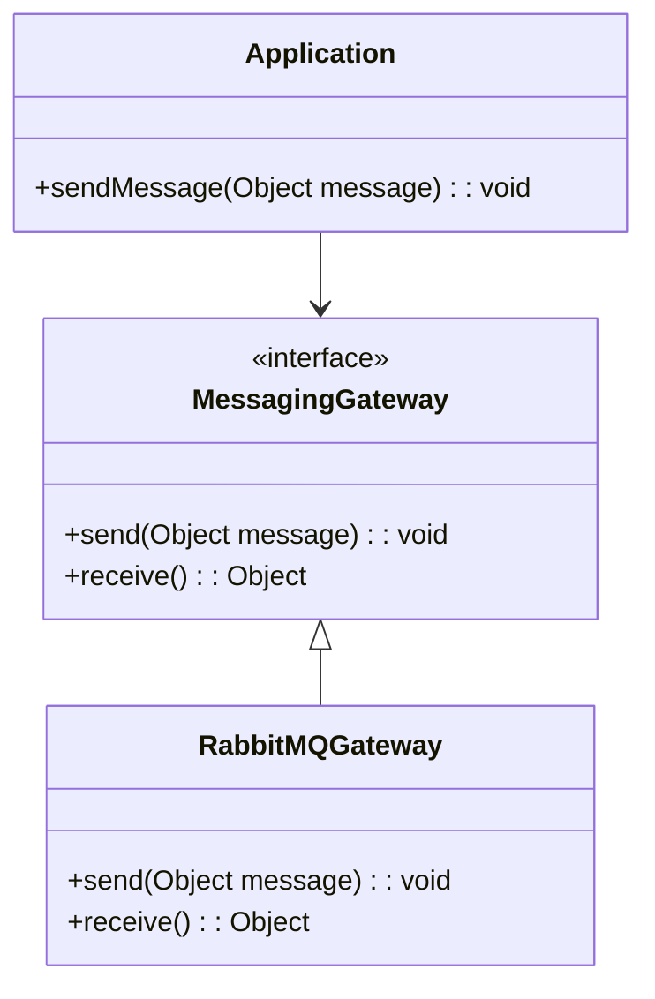
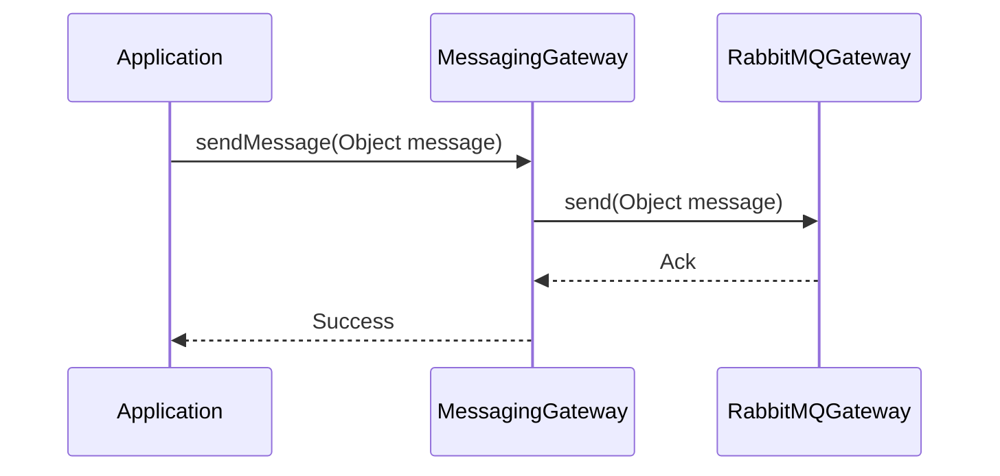
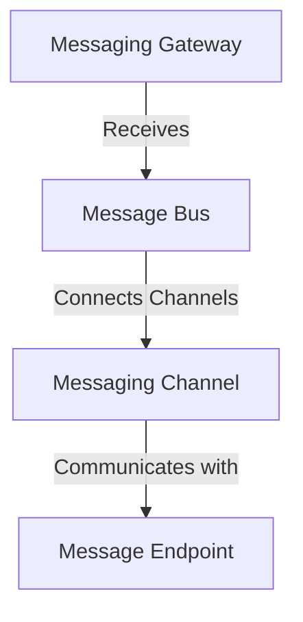

## Messaging Gateway

### Definition
The Messaging Gateway pattern encapsulates the access to the messaging system, providing a simple interface for applications to send and receive messages. This pattern abstracts the complexities of interacting with the messaging infrastructure.

### Intent
The intent of the Messaging Gateway pattern is to decouple the business logic of an application from the underlying messaging system. This allows the application to communicate with the messaging system without being tightly coupled to its APIs and protocols.

### Also Known As
- Messaging Adapter
- Message Portal
- Message Abstraction

### Detailed Explanation
A Messaging Gateway is a key integration design pattern used to encapsulate the messaging system, providing simplified access to it. By doing so, it hides the complexities of message handling from the rest of the application, making the application code cleaner and easier to maintain.

#### Key Features
- **Encapsulation**: Hides the details of the messaging infrastructure.
- **Decoupling**: Reduces the dependency of application code on the messaging system.
- **Simplified Interaction**: Provides a simple API for sending and receiving messages.

#### Example Class Diagram

- **Application**: Interacts with the `MessagingGateway` to send and receive messages.
- **MessagingGateway**: Defines the interface for sending and receiving messages.
- **RabbitMQGateway**: Provides the implementation of `MessagingGateway` using RabbitMQ.

#### Example Sequence Diagram

- **Application**: Calls `sendMessage` on the `MessagingGateway`.
- **MessagingGateway**: Calls the `send` method on the `RabbitMQGateway`.
- **RabbitMQGateway**: Sends the message to the RabbitMQ and returns an acknowledgment.

### Benefits
- **Abstraction**: Provides a simple interface to hide the complexities of the messaging system.
- **Flexibility**: Allows the underlying messaging system to be changed with minimal impact on the application.
- **Ease of Use**: Simplifies the interaction with the messaging system for the application.

### Trade-offs
- **Overhead**: Adds an extra layer of abstraction which may introduce overhead.
- **Complexity**: Requires careful design to ensure that the interface of the gateway remains simple and intuitive.

### When to Use
- When you need to decouple the application logic from the messaging infrastructure.
- When you want to simplify the code that interacts with the messaging system.
- When you anticipate changes to the underlying messaging system in the future.

### Example Use Cases
- An enterprise application that integrates with various external systems using a message-oriented middleware (MOM).
- A cloud-native application that relies on message brokers like Apache Kafka or RabbitMQ.

### When Not to Use
- When the messaging system is tightly integrated within a small, simple application where abstraction would add unnecessary complexity.
- When performance overhead of an additional abstraction layer is not acceptable.

### Anti-patterns
- **Tight Coupling**: Directly interacting with the messaging system across various parts of the application code.
- **Complex Gateway**: Making the gateway too complex, defeating the purpose of having an easy-to-use abstraction.

### Related Design Patterns
- **Message Bus**: Facilitates message exchange between different systems.
- **Messaging Channel**: Defines a conduit through which messages are sent and received.
- **Message Endpoint**: Represents a point of contact within the messaging system.

### Code Examples

#### Java with Spring Boot and RabbitMQ
```java
import org.springframework.amqp.rabbit.core.RabbitTemplate;
import org.springframework.stereotype.Component;

@Component
public class RabbitMQGateway {

    private final RabbitTemplate rabbitTemplate;

    public RabbitMQGateway(RabbitTemplate rabbitTemplate) {
        this.rabbitTemplate = rabbitTemplate;
    }

    public void send(Object message) {
        rabbitTemplate.convertAndSend("myExchange", "routingKey", message);
    }

    public Object receive() {
        return rabbitTemplate.receiveAndConvert("queueName");
    }
}
```

#### Scala with Akka and Kafka
```scala
import akka.actor.ActorSystem
import akka.kafka.ProducerSettings
import akka.kafka.scaladsl.SendProducer
import akka.kafka.ConsumerSettings
import akka.kafka.scaladsl.Consumer
import akka.stream.scaladsl.Source
import org.apache.kafka.clients.producer.ProducerRecord
import org.apache.kafka.clients.consumer.ConsumerRecord
import scala.concurrent.Future

class KafkaGateway {

  val system = ActorSystem("KafkaSystem")
  val producerSettings = ProducerSettings(system, serializers.String.serializer, serializers.String.serializer)
  val sendProducer = SendProducer(producerSettings)

  def send(topic: String, message: String): Future[RecordMetadata] = {
    sendProducer.send(new ProducerRecord[String, String](topic, message))
  }

  val consumerSettings = ConsumerSettings(system, deserializers.String.deserializer, deserializers.String.deserializer)
  val kafkaConsumer: Source[ConsumerRecord[String, String], Control] = Consumer.plainSource(consumerSettings, Subscriptions.topics("topicName"))

  def receive(): Source[ConsumerRecord[String, String], Control] = kafkaConsumer
}
```

### References
- Enterprise Integration Patterns: Designing, Building, and Deploying Messaging Solutions by Gregor Hohpe and Bobby Woolf
- Spring Integration in Action by Mark Fisher, Jonas Partner, Marius Bogoevici, and Iwein Fuld

### Credits
- Gregor Hohpe and Bobby Woolf for formalizing the Enterprise Integration Patterns.

### Open Source Frameworks and Tools
- Spring Integration
- Apache Camel
- MuleSoft
- Akka Streams
- Apache Kafka
- RabbitMQ

### Cloud Computing Considerations
- **PAAS (Platform as a Service)**: Using service platforms like AWS SQS, Azure Service Bus, or Google Pub/Sub to manage messaging infrastructure.
- **SAAS (Software as a Service)**: Utilizing third-party services such as Twilio or SendGrid for messaging services.
- **DAAS (Data as a Service)**: Accessing messaging infrastructure as a managed service to offload operational responsibilities.

### Further Reading
- [Enterprise Integration Patterns: Designing, Building, and Deploying Messaging Solutions](https://amzn.to/3XXncn8) by Gregor Hohpe and Bobby Woolf
- "Spring Integration in Action" by Mark Fisher and various authors

### Grouping Related Patterns
#### Messaging Patterns



- **Messaging Gateway**: Encapsulates messaging system access.
- **Message Bus**: Facilitates message exchange.
- **Messaging Channel**: Defines communication paths.
- **Message Endpoint**: Represents connection points.

### Guidance for Effective Problem Solving
When tackling enterprise integration challenges, consider using a Messaging Gateway to encapsulate message handling intricacies, coupled with other related messaging patterns to build a scalable, maintainable messaging architecture.

---

This structured format includes a well-rounded exploration of the Messaging Gateway pattern, integrating imagery, code examples, diagrams, and references on a journey in learning and applying the pattern.
