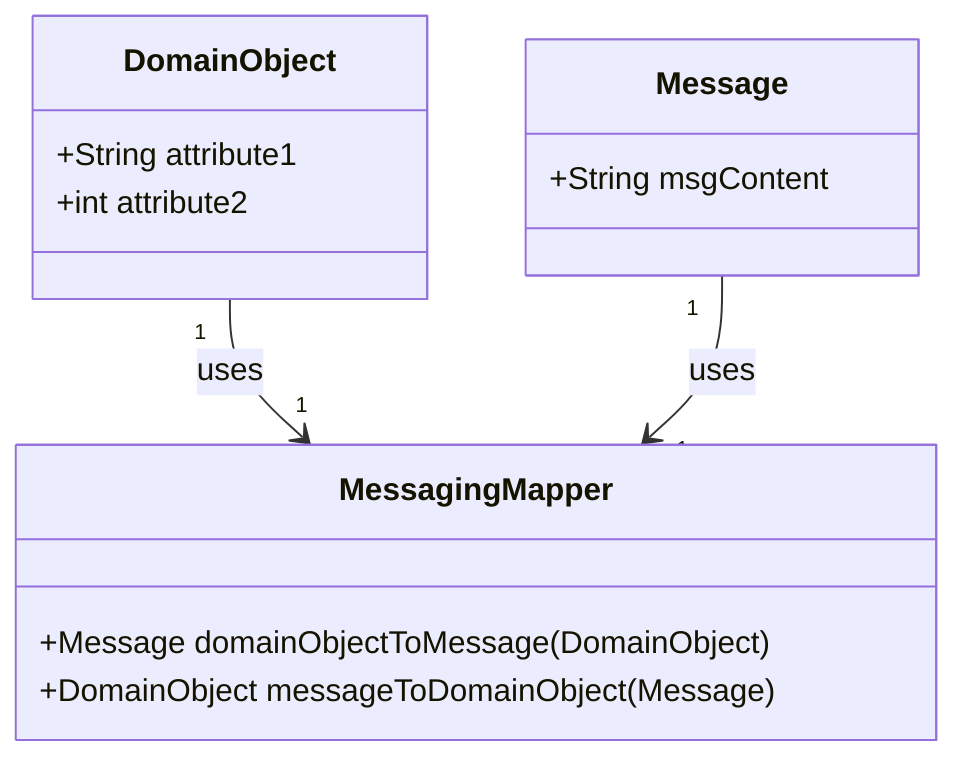
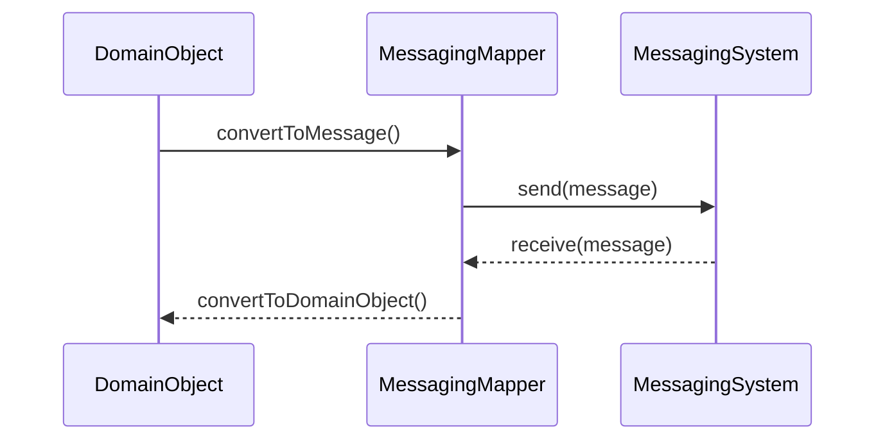

## Definition

The **Messaging Mapper** pattern ensures that data is accurately moved between domain objects and the messaging infrastructure without binding the two tightly together. This separation allows for changes in the messaging infrastructure without affecting the domain model and vice versa.

## Intent

- **Primary Intent**: To segregate the concerns of business logic and communication logic.
- **Secondary Intent**: To allow flexibility and maintainability of the system by ensuring changes in business logic or messaging infrastructure do not cause rippling changes across the system.

## Also Known As

- **Message Translator**: Because it translates data between the domain model and the messaging format.

## Detailed Explanation and Features

### Merits of Separation

- **Decoupling**: Keeps the messaging infrastructure separate from the core domain logic.
- **Flexibility**: Easier to change the messaging format or transport layer without impacting the domain model.
- **Maintenance**: Business rules and messaging protocols can evolve independently.

### Key Features

1. **Data Mapping**: Transforms application-specific data structures into a format suitable for messaging (e.g., JSON, XML).
2. **Bidirectional Conversion**: Supports two-way conversion between domain objects and messages.
3. **Independence**: Ensures that the domain logic and messaging framework operate independently.

### Example Class Diagram



### Explanation

1. **DomainObject**: Represents the business logic data structure.
2. **Message**: Represents the messaging format.
3. **MessagingMapper**: The utility that transforms **DomainObject** to **Message** and vice-versa.

### Example Sequence Diagram



### Detailed Workflow

1. **Preparing a Message**: The `DomainObject` is converted into a `Message` format for transport.
2. **Sending a Message**: The `Message` is sent through the `MessagingSystem`.
3. **Receiving a Message**: The received `Message` is converted back into the `DomainObject`.

## Code Examples

### Java with Spring Boot and Apache Kafka

```java
@Entity
public class User {
    private String firstName;
    private String lastName;
    // Getters and setters
}

public class UserMessage {
    private String nameConcatenated;
    // Constructor, getters, and setters
}

@Component
public class UserMessagingMapper {

    public UserMessage userToMessage(User user) {
        String fullName = user.getFirstName() + " " + user.getLastName();
        return new UserMessage(fullName);
    }

    public User messageToUser(UserMessage message) {
        String[] names = message.getNameConcatenated().split(" ");
        return new User(names[0], names[1]);
    }
}

@Service
public class UserService {

    @Autowired
    private UserMessagingMapper messagingMapper;
    @Autowired
    private KafkaTemplate<String, UserMessage> kafkaTemplate;
    
    public void processUser(User user) {
        UserMessage message = messagingMapper.userToMessage(user);
        kafkaTemplate.send("user_topic", message);
    }
}
```

### Scala with Akka

```scala
case class User(firstName: String, lastName: String)
case class UserMessage(nameConcatenated: String)

class UserMessagingMapper {
  def userToMessage(user: User): UserMessage = {
    val fullName = s"${user.firstName} ${user.lastName}"
    UserMessage(fullName)
  }

  def messageToUser(message: UserMessage): User = {
    val names = message.nameConcatenated.split(" ")
    User(names(0), names(1))
  }
}

import akka.actor.ActorSystem
import akka.kafka.ProducerSettings
import org.apache.kafka.common.serialization.StringSerializer
import akka.stream.scaladsl.{Source, Sink}
import akka.kafka.scaladsl.Producer

object UserService {
  def sendMessage(system: ActorSystem, user: User, mapper: UserMessagingMapper): Unit = {
    import system.dispatcher

    val producerSettings = ProducerSettings(system, new StringSerializer, new StringSerializer)
    val userMessage = mapper.userToMessage(user)

    val source = Source.single(userMessage).map { msg =>
      new ProducerRecord[String, String]("user_topic", userMessage.nameConcatenated)
    }
    
    source.runWith(Producer.plainSink(producerSettings)).onComplete {
      case Success(_) => println("Message sent")
      case Failure(ex) => println(s"Failed to send message: ${ex.getMessage}")
    }
  }
}
```

## Benefits

- **Extensibility**: Easily extend to support more message types or formats.
- **Reusability**: The mapper can be reused across different parts of the application.

## Trade-offs

- **Overhead**: Requires additional effort to maintain mappings between domain objects and messages.
- **Complexity**: Can introduce complexity if the transformation logic becomes intricate.

## When to Use

- When you need to decouple your domain model from the messaging infrastructure.
- When there is a need to change message structures without affecting business logic.

## When Not to Use

- When domain objects and messaging structures are so closely aligned that a separate mapper is redundant.
- When performance is a primary concern, as transformation operations introduce latency.

## Anti-patterns

- **Tight Coupling**: Binding your domain model directly to your messaging infrastructure, leading to poor separation of concerns.
- **Overengineering**: Unnecessarily complex mapping logic for simple data structures.

## Related Design Patterns

- **Data Transfer Object (DTO)**: Similar to Messaging Mapper but often used for transferring data between processes rather than for messaging.
- **Adapter Pattern**: Converts one interface to another but generally within a single system context rather than for messaging.

## References and Further Reading

- **Enterprise Integration Patterns** by Gregor Hohpe and Bobby Woolf.
- [Designing Data-Intensive Applications](https://amzn.to/4cuX2Na) by Martin Kleppmann.
- Official [Apache Camel documentation](https://camel.apache.org/manual/latest/enterprise-integration-patterns.html).

## Open Source Frameworks and Third-Party Tools

- **Apache Camel**: Provides built-in components and processors to enable transformation and mapping.
- **Spring Integration**: Offers a messaging mapper through integration endpoints.

## Cloud Computing Relevance

- **SAAS**: Ensure your SaaS applications neatly transform messages to match the application's data model without coupling the two systems.
- **PAAS**: Use PAAS solutions like AWS Lambda or Azure Functions to implement Messaging Mappers for scalable solutions.
- **DAAS**: To abstract data storage and ensure that data files conveyed between services are formatted optimally.

---
