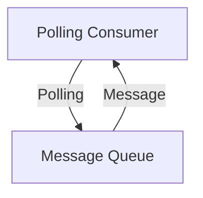
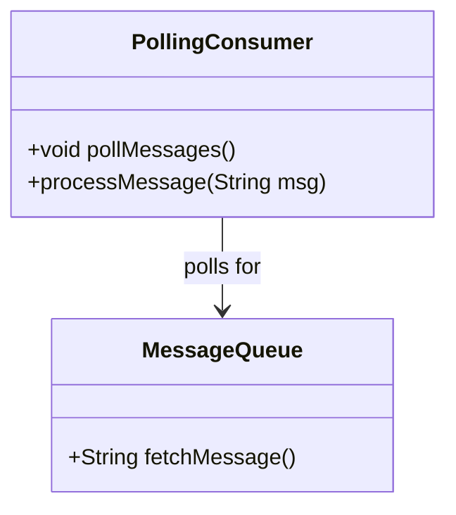
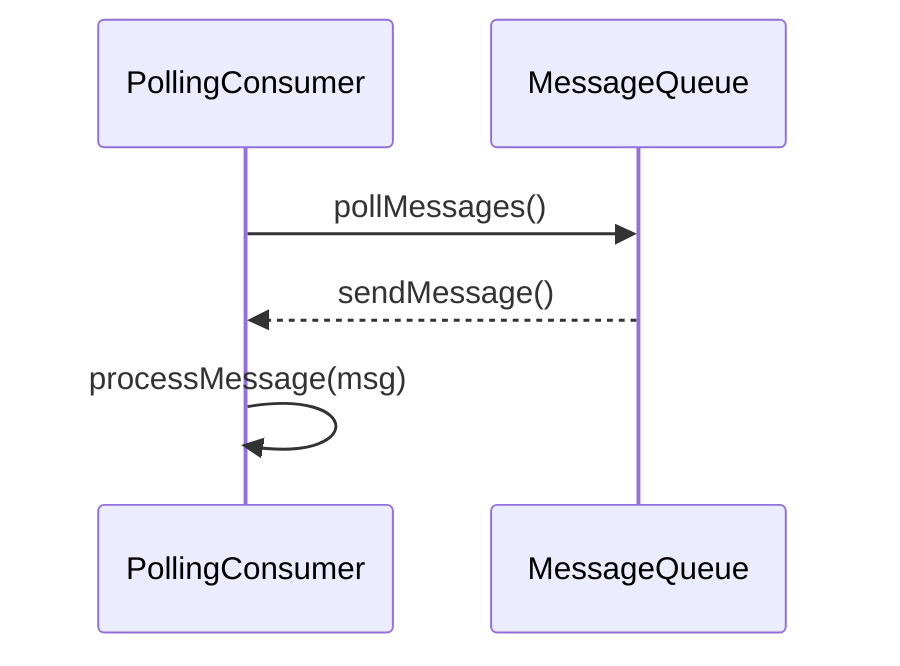

## Polling Consumer

### Definition
A **Polling Consumer** is a design pattern where an application periodically checks for messages and retrieves them for processing. Unlike push-based consumption, it allows the application to control when and how often it fetches messages from the queue.

### Intent
The intent of the Polling Consumer is to enable an application to consume messages when it is ready, rather than being forced to process messages immediately when they are produced.

### Also Known As
- Pull Consumer

### Detailed Definition and Explanation
The Polling Consumer periodically checks a message endpoint for new messages, fetching and processing them at the discretion of the application. This pattern is especially useful when the application has varying loads or when it's important to process messages at specific intervals.



### Key Features
- **Controlled Consumption:** Application determines when to check and fetch messages.
- **Decoupled Producer and Consumer:** Producers and consumers operate independently.
- **Scalability:** Easy to scale by adjusting the polling frequency and number of consumers.

### Code Examples

#### Java (Apache Camel)
```java
import org.apache.camel.CamelContext;
import org.apache.camel.builder.RouteBuilder;
import org.apache.camel.impl.DefaultCamelContext;

public class PollingConsumer {
    public static void main(String[] args) throws Exception {
        CamelContext context = new DefaultCamelContext();
        context.addRoutes(new RouteBuilder() {
            @Override
            public void configure() throws Exception {
                from("direct:pollingConsumer")
                  .pollEnrich("file:inputFolder?noop=true", 1000)
                  .to("log:received-message?level=INFO");
            }
        });
        context.start();
        Thread.sleep(5000); // Run for 5 seconds
        context.stop();
    }
}
```

#### Scala (Akka Streams)
```scala
import akka.actor.ActorSystem
import akka.stream.ActorMaterializer
import akka.stream.scaladsl.{FileIO, Framing, Sink}
import akka.util.ByteString
import java.nio.file.Paths

object PollingConsumer extends App {
  implicit val system = ActorSystem("PollingConsumerSystem")
  implicit val materializer = ActorMaterializer()

  val source = FileIO.fromPath(Paths.get("inputFolder/pollingConsumer.txt"))
    .via(Framing.delimiter(ByteString("\n"), maximumFrameLength = 256, allowTruncation = true))
    .map(_.utf8String)

  source.runWith(Sink.foreach(println))
}
```

### Example Class Diagrams


### Example Sequence Diagrams


### Benefits
- Grants applications control over when and how messages are consumed.
- Reduces risk of overloading the consumer by overwhelming message rates.
- Improves the fault tolerance by not relying on continuous message streams.

### Trade-offs
- May introduce latency in message processing if polling intervals are too long.
- Requires careful tuning of polling frequency to balance load and response time.
- Potentially more complex implementation compared to push-based patterns.

### When to Use
- When the consumer needs complete control over message processing timing.
- In scenarios where messages need to be processed in batches.
- When dealing with legacy systems that cannot handle push-based consumption.

### Example Use Cases
- Legacy systems integration where computes are expensive and need to be batched.
- Any application requiring controlled and conditional message consumption.
- Data aggregation applications that periodically poll data sources.

### When Not to Use
- When low latency message processing is critical.
- Real-time systems where immediate message consumption is required.

### Anti-Patterns
- Too frequent polling that leads to system overhead and redundant checks.
- Overly complex polling logic that impacts system maintainability and clarity.

### Related Design Patterns
- **Message Broker:** Intermediary module to decouple message producers and consumers.
- **Event-Driven Consumer:** Consumes messages immediately as they are delivered.
- **Durable Subscriber:** Ensures the consumer gets all messages even if it’s offline.

### References and Credits
- Gregor Hohpe, Bobby Woolf, "Enterprise Integration Patterns"
- [Apache Camel Documentation](https://camel.apache.org/)
- [Akka Streams Documentation](https://doc.akka.io/docs/akka/current/stream/index.html)

### Open Source Frameworks and Tools
- **Apache Camel:** Powerful integration framework based on Enterprise Integration Patterns.
- **Akka Streams:** Reactive stream processing for building resilient systems.
- **Spring Integration:** An implementation of Enterprise Integration Patterns.

### Cloud Computing
- **AWS SQS/SNS:** Managed message queue services by Amazon Web Services.
- **Google Pub/Sub:** Real-time messaging solution by Google Cloud Platform.
- **Azure Service Bus:** Highly-reliable cloud messaging service by Microsoft Azure.

### Suggested Books for Further Studies
- [Enterprise Integration Patterns: Designing, Building, and Deploying Messaging Solutions](https://amzn.to/3XXncn8) by Gregor Hohpe and Bobby Woolf
- "Camel in Action" by Claus Ibsen and Jonathan Anstey
- "Reactive Messaging Patterns with the Actor Model" by Vaughn Vernon
