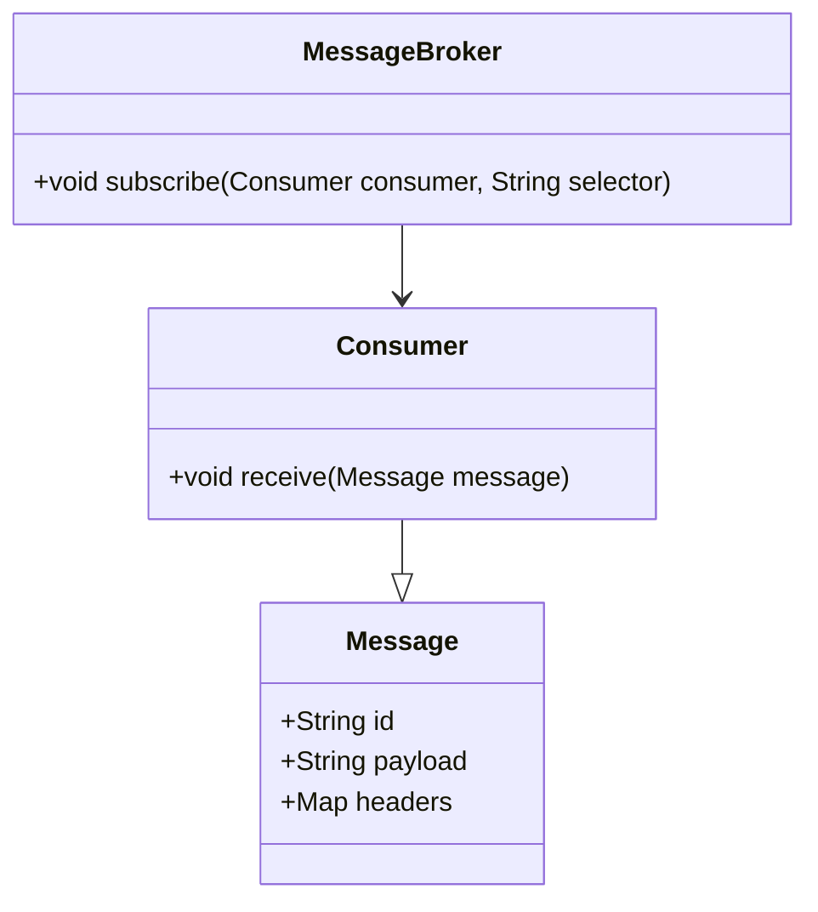
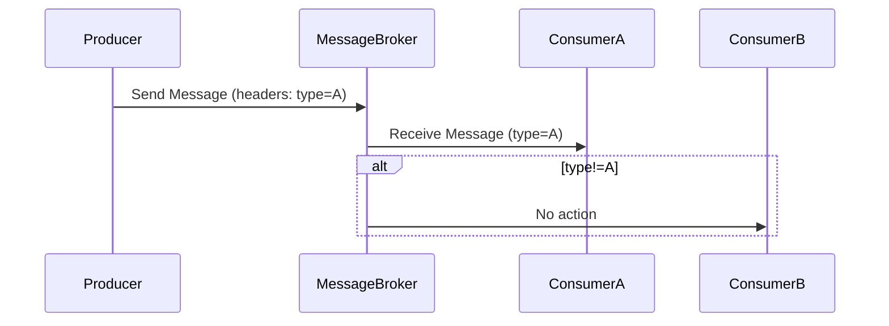
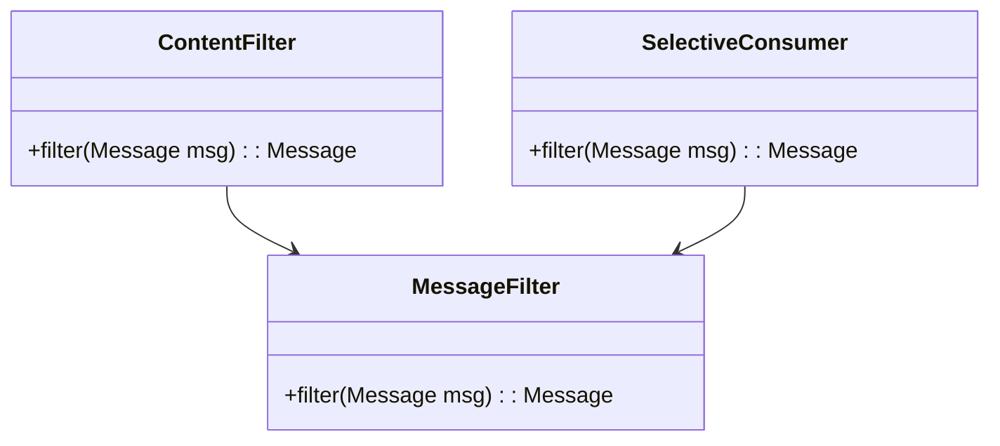

## Selective Consumer

### Definition

The Selective Consumer pattern allows a message consumer to specify which messages it wishes to receive by applying filters or selectors based on message headers or properties.

### Intent

The intent of the Selective Consumer pattern is to enable consumers to receive only the messages that they are interested in, thus optimizing message processing efficiency and reducing unnecessary loads on the consumer.

### Also Known As

- Message Selector
- Filtered Consumer

### Detailed Explanation

In an enterprise integration scenario, not every consumer needs to process all messages from a message channel. Instead, consumers often have specific criteria for the messages they are interested in. The Selective Consumer pattern uses message selectors to specify these criteria.

#### Key Features

- **Filtering Mechanism**: Allows consumers to receive only specific messages based on header or property criteria.
- **Selective Delivery**: Ensures that only relevant messages are sent to each consumer.
- **Reduced Load**: Prevents consumers from being overloaded with unwanted messages.

### Structure


### Sequence Diagram


### Code Examples

**Java Example using Apache Camel:**
```java
import org.apache.camel.CamelContext;
import org.apache.camel.impl.DefaultCamelContext;
import org.apache.camel.builder.RouteBuilder;
import org.apache.camel.component.activemq.ActiveMQComponent;

public class SelectiveConsumerExample {

    public static void main(String[] args) throws Exception {
        CamelContext context = new DefaultCamelContext();
        context.addComponent("activemq", ActiveMQComponent.activeMQComponent("tcp://localhost:61616"));

        context.addRoutes(new RouteBuilder() {
            @Override
            public void configure() throws Exception {
                from("activemq:queue:inputQueue?selector=type='A'")
                    .to("log:ConsumerA?level=INFO");
                
                from("activemq:queue:inputQueue?selector=type='B'")
                    .to("log:ConsumerB?level=INFO");
            }
        });

        context.start();
        Thread.sleep(5000);
        context.stop();
    }
}
```

**Scala Example using Akka Streams:**
```scala
import akka.actor.ActorSystem
import akka.stream.ActorMaterializer
import akka.stream.alpakka.jms.scaladsl._
import akka.stream.scaladsl.Source
import javax.jms.TextMessage

object SelectiveConsumerExample extends App {
  implicit val system = ActorSystem("SelectiveConsumerSystem")
  implicit val materializer = ActorMaterializer()

  val jmsSource = JmsConsumer.textSource(
    JmsConsumerSettings(system, connectionFactory)
      .withBufferSize(10)
      .withQueue("inputQueue")
      .withSelector("type = 'A'")
  )
  
  val done = jmsSource.runForeach { msg: TextMessage =>
    println(s"Received message: ${msg.getText}")
  }

  scala.concurrent.Await.result(done, scala.concurrent.duration.Duration.Inf)
}
```

### Benefits

- **Efficiency**: Reduces processing overhead by filtering irrelevant messages.
- **Scalability**: Enhances scalability by allowing multiple consumers to handle different types of messages efficiently.
- **Flexibility**: Consumers can change selection criteria dynamically based on business needs.

### Trade-offs

- **Overhead**: The filtering process itself may introduce a small overhead.
- **Complexity**: Introducing multiple selectors can complicate the architecture and message routing logic.

### When to Use

- When you have multiple consumers interested only in specific types of messages.
- When you need to optimize message processing and reduce unnecessary load on consumers.

### Example Use Cases

- Filtering messages by priority or type in a logging system.
- Selecting orders based on region or status for a regional order processing system.

### When Not to Use

- When all messages are needed by all consumers.
- When the filtering criteria are too complex and require intricate processing.

### Anti-patterns

- **Overusing Selectors**: Overuse may lead to complex routing logic and reduced performance.
- **Ignoring Consumer Logic**: If a consumer eventually processes all messages, this pattern adds unnecessary complexity.

### Related Patterns

- **Content-Based Router**: Routes messages to different endpoints based on message content.
- **Message Filter**: Removes unwanted messages before they reach the consumer.

### References and Credits

- *Enterprise Integration Patterns* by Gregor Hohpe and Bobby Woolf
- Apache Camel documentation
- Akka Streams documentation

### Open Source Frameworks

- **Apache Camel**: A versatile integration framework offering message routing and filtering.
- **Mule**: Provides ESB functionalities and powerful routing capabilities.
- **Spring Integration**: Facilitates message filtering using Spring's ecosystem.

### Cloud Computing Context

- **SAAS**: Selective Consumer can be leveraged in SaaS applications for efficient message processing.
- **DAAS**: In a data aggregation service, this pattern helps in selectively consuming relevant data streams.
- **PAAS**: Cloud platforms offering message brokering services can implement selector-based routing.

### Suggested Books for Further Studies

- *Enterprise Integration Patterns* by Gregor Hohpe and Bobby Woolf
- [Designing Data-Intensive Applications](https://amzn.to/4cuX2Na) by Martin Kleppmann

### Related Pattern Group

#### Message Filtering Patterns

- **Message Filter**: Generic name for patterns that filter messages.
- **Content Filter**: A specific type of filter that removes parts of the message content according to criteria.

Filtering patterns help manage message flows efficiently, ensuring that only pertinent information reaches the consumer endpoints.
