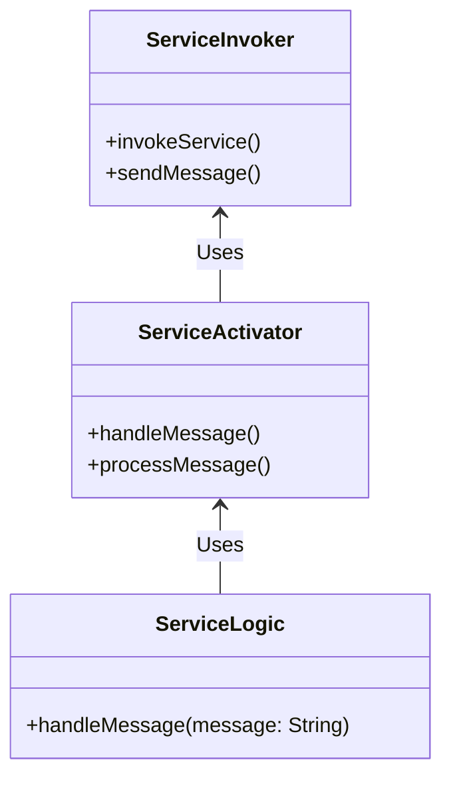
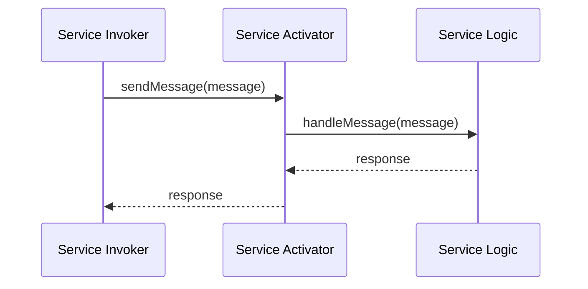

## Definition
The **Service Activator** pattern design allows an application to integrate with various messaging platforms and non-messaging techniques, facilitating seamless communication and service invocation.

## Intent
The intent of the Service Activator pattern is to enable an application service to be triggered both through asynchronous message exchanges and synchronous calls, abstracting the complexities of differing invocation methods.

## Also Known As
- Command Message Handler
- Message-Driven POJO (Plain Old Java Object)
- Invoker

## Detailed Definition and Explanation
A Service Activator acts as an intermediary between the application logic (service) and various invocation mechanisms (messaging or direct calls). It handles translating messages from the messaging system into method calls on the service, as well as invoking the service directly for non-messaging inputs.

### Key Features
- **Decoupling**: Separates the application logic from the messaging infrastructure.
- **Reusability**: Allows the same service to be reused across different communication channels.
- **Flexibility**: Supports both synchronous and asynchronous invocation.
- **Scalability**: Facilitates horizontal scaling by allowing multiple instances to process messages concurrently.

### Diagram
```mermaid
graph TD
  A[Service Invoker (Messaging)] -- Message Queue --> S[Service Activator] --> B((Service Logic))
  C[Service Invoker (Direct Call)] --> S
```

## Code Examples

### Java Using Spring Boot and Apache Camel
```java
import org.apache.camel.builder.RouteBuilder;
import org.springframework.stereotype.Component;
import org.springframework.boot.CommandLineRunner;
import org.springframework.boot.SpringApplication;
import org.springframework.boot.autoconfigure.SpringBootApplication;

@SpringBootApplication
public class ServiceActivatorApp {

    public static void main(String[] args) {
        SpringApplication.run(ServiceActivatorApp.class, args);
    }
}

@Component
class ServiceActivatorRoute extends RouteBuilder {
    @Override
    public void configure() {
        from("jms:queue:ServiceQueue")
            .log("Received JMS message: ${body}")
            .bean(ServiceLogic.class, "handleMessage");

        rest("/service")
            .post("/invoke")
            .to("direct:serviceInvoke");

        from("direct:serviceInvoke")
            .log("Received Direct call: ${body}")
            .bean(ServiceLogic.class, "handleMessage");
    }
}

class ServiceLogic {
    public void handleMessage(String message) {
        // Service logic here
    }
}
```

### Scala Using Akka
```scala
import akka.actor.{Actor, ActorSystem, Props}
import akka.http.scaladsl.Http
import akka.http.scaladsl.model.HttpMethods._
import akka.http.scaladsl.model._
import akka.http.scaladsl.server.Directives._
import akka.kafka.{ConsumerSettings, Subscriptions}
import akka.kafka.scaladsl.Consumer
import org.apache.kafka.common.serialization.StringDeserializer
import akka.stream.scaladsl.Sink

object ServiceActivatorApp extends App {
  implicit val system = ActorSystem("ServiceActivatorSystem")
  implicit val materializer = akka.stream.ActorMaterializer()

  val serviceActor = system.actorOf(Props[ServiceActor], "serviceActor")

  val route =
    path("service" / "invoke") {
      post {
        entity(as[String]) { message =>
          serviceActor ! message
          complete(HttpResponse(StatusCodes.OK, entity = "Request processed"))
        }
      }
    }

  Http().bindAndHandle(route, "localhost", 8080)

  val consumerSettings = 
      ConsumerSettings(system, new StringDeserializer, new StringDeserializer)
      .withGroupId("group1")

  Consumer
    .committableSource(consumerSettings, Subscriptions.topics("ServiceQueue"))
    .mapAsync(1) { msg =>
        Future { 
            serviceActor ! msg.record.value() 
            msg.committableOffset.commitScaladsl()
        }
    }
    .runWith(Sink.ignore)
}

class ServiceActor extends Actor {
  def receive: Receive = {
    case message: String => 
      // Service logic here
      println(s"Received message: $message")
  }
}
```

### Example Class Diagram


**Explanation**: The `ServiceInvoker` handles invoking the service via various mechanisms, the `ServiceActivator` processes these invocations, and the `ServiceLogic` contains the core business logic.

### Example Sequence Diagram


**Explanation**: The sequence diagram demonstrates a flow where the `ServiceInvoker` sends a message to the `Activator`, which then calls the `ServiceLogic`.

## Benefits
- **Modularity**: Cleanly separates service logic from communication mechanisms.
- **Flexibility**: Enables the same logic to be invoked via different protocols.
- **Scalability**: Easy to scale, particularly for message-driven architectures.

## Trade-offs
- **Complexity**: Introduces additional complexity by adding another layer of abstraction.
- **Overhead**: Potential performance overhead due to message processing.

## When to Use
- When you need to support both synchronous and asynchronous service invocations.
- When your service needs to be accessible via multiple communication methods.

## Example Use Cases
- Processing orders from both a web interface and a message queue.
- A service that needs to handle HTTP requests and message-driven batch jobs.

## When Not to Use
- For applications where all invocations are homogenous.
- If the added abstraction layer is deemed unnecessary or overly complex for the use case.

## Anti-patterns
- **Service Anonymizer**: Mixing business logic with invocation logic leading to tight coupling.
- **Overgeneralization**: Creating overly flexible services at the cost of performance or maintainability.

## Related Design Patterns
- **Channel Adapter**: A channel-specific adapter for integrating channels with applications.
- **Message Broker**: Provides a mechanism for routing and translating messages between services.
- **Messaging Gateway**: Act as a gateway for messaging solutions and create a clean API for sending/receiving messages.

## References & Credits
- **Enterprise Integration Patterns by Gregor Hohpe and Bobby Woolf**
- **Apache Camel, Scala Akka Documentation**
- **Spring Boot Documentation**

## Open Source Frameworks
- **Apache Camel**: Integration framework based on Enterprise Integration Patterns.
- **Akka**: Toolkit for building asynchronous, concurrent, and distributed applications.
- **Spring Integration**: Provides extensions to the Spring programming model to support messaging.

## Cloud Computing
- **SaaS**: This pattern is suitable for multi-tenant SaaS applications needing diverse integration points.
- **PaaS/DaaS**: Platforms offering integration services (e.g., AWS Lambda, Google Cloud Functions) can leverage this pattern to invoke services via various protocols.

## Suggested Books for Further Studies
- **[Enterprise Integration Patterns: Designing, Building, and Deploying Messaging Solutions](https://amzn.to/3XXncn8) by Gregor Hohpe and Bobby Woolf**
- **"Spring Integration in Action" by Mark Fisher**
- **[Designing Data-Intensive Applications](https://amzn.to/4cuX2Na) by Martin Kleppmann**

By utilizing the Service Activator pattern, developers can create more adaptable, modular, and scalable applications that can seamlessly integrate with various messaging and non-messaging protocols. This pattern enhances reusability and helps in cleanly decoupling business logic from the communication infrastructure.горОНОМж gren text-------------------------
