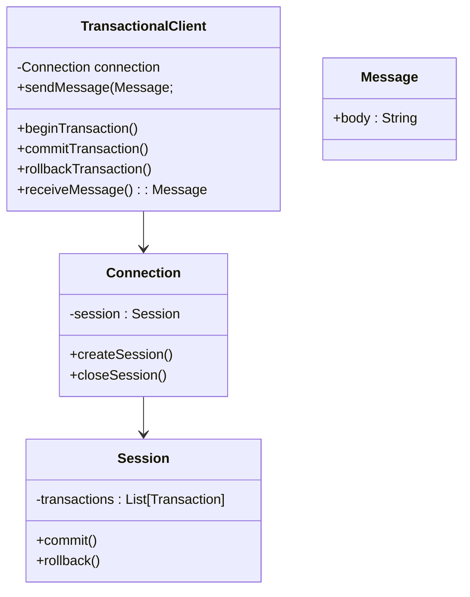

## Definition
The Transactional Client pattern ensures that a client controls transactions with the messaging system to guarantee data consistency and integrity. 

## Intent
The primary intent of the Transactional Client pattern is to manage and control transactions in a messaging system, often to ensure that messages are reliably sent and received without data loss or inconsistency.

## Also Known As
- Message-Oriented Transaction Management

## Detailed Explanation
The Transactional Client pattern enables the client to either complete a set of operations as a single unit of work or rollback all operations. Standard operations include sending, receiving, processing messages, and ensuring messages are neither lost nor duplicated.

### Key Features:
- **Atomicity:** Ensures all operations within a transaction are completed successfully, or none are.
- **Consistency:** Ensures the system moves from one valid state to another.
- **Isolation:** Ensures intermediate states are invisible to other operations.
- **Durability:** Ensures the outcome of a transaction persists, even in the event of system failures.

### Diagrams
#### Example Class Diagram


#### Example Sequence Diagram
```mermaid
sequenceDiagram
    participant Client
    participant TransactionalClient: TransactionalClient
    participant Connection: Connection
    participant Session: Session
    
    Client->>TransactionalClient: beginTransaction()
    TransactionalClient->>Connection: createSession()
    Connection->>Session: new Session()
    Client->>TransactionalClient: sendMessage(message)
    TransactionalClient->>Session: addMessageToTransaction(message)
    Client->>TransactionalClient: commitTransaction()
    TransactionalClient->>Session: commit()
```

### Code Examples
#### Java Example with Spring Boot and Apache Kafka
```java
import org.apache.kafka.clients.producer.KafkaProducer;
import org.apache.kafka.clients.producer.ProducerRecord;
import org.springframework.kafka.core.KafkaTemplate;
import org.springframework.kafka.transaction.KafkaTransactionManager;
import org.springframework.transaction.annotation.Transactional;

public class KafkaTransactionalClient {

    private KafkaTemplate<String, String> kafkaTemplate;
    private KafkaTransactionManager<String, String> transactionManager;

    public KafkaTransactionalClient(KafkaTemplate<String, String> kafkaTemplate, KafkaTransactionManager<String, String> transactionManager) {
        this.kafkaTemplate = kafkaTemplate;
        this.transactionManager = transactionManager;
    }

    @Transactional
    public void sendMessage(String topic, String message) {
        ProducerRecord<String, String> producerRecord = new ProducerRecord<>(topic, message);
        kafkaTemplate.send(producerRecord);
    }
}
```

#### Scala Example with Akka
```scala
import akka.actor.typed.ActorSystem
import akka.kafka.{ConsumerSettings, ProducerSettings}
import akka.kafka.scaladsl.{Consumer, Producer}
import akka.stream.scaladsl.{Keep, RestartSource}
import org.apache.kafka.common.serialization.{StringDeserializer, StringSerializer}
import org.apache.kafka.clients.producer.ProducerRecord

object KafkaTransactionalClient {
  implicit val system: ActorSystem[_] = ActorSystem(Behaviors.empty, "example")

  val producerSettings = ProducerSettings(system, new StringSerializer, new StringSerializer)
  val consumerSettings = ConsumerSettings(system, new StringDeserializer, new StringDeserializer)

  def sendMessage(topic: String, message: String): Unit = {
    val producer = producerSettings.createKafkaProducer()
    producer.initTransactions()
    try {
      producer.beginTransaction()
      producer.send(new ProducerRecord[String, String](topic, message))
      producer.commitTransaction()
    } catch {
      case ex: Exception =>
        producer.abortTransaction()
        throw ex
    } finally {
      producer.close()
    }
  }
}
```

### Benefits
- **Data Integrity:** Ensures all client operations within a transaction are executed consistently.
- **Reliability:** Guarantees message delivery and transaction completion.
- **Error Handling:** Facilitates rollback in case of failure.

### Trade-offs
- **Complex Configuration:** Requires appropriate configuration of the messaging system and client.
- **Performance Overhead:** Transaction management introduces some latency.
- **Resource Management:** Transactions consume resources and may lock messages or client sessions.

### When to Use
- When consistent transaction management for sending and receiving messages is required.
- Ensuring data accuracy and integrity in systems using message queues.

### Example Use Cases
- Financial systems ensuring that money transfers are either completely processed or not at all.
- E-commerce platforms maintaining order states consistent with corresponding accounting records.

### When Not to Use
- Systems with loose requirements for consistency where it is acceptable to have eventual consistency.
- High-performance scenarios where the overhead of transaction management cannot be tolerated.

### Anti-patterns
- **Ignoring Error Handling:** Failing to implement rollback mechanisms, leading to partial transactions and data corruption.
- **Over-Reliance on Transactions:** Utilizing transactions for operations where eventual consistency would suffice, causing unnecessary complexity and overhead.

## Related Design Patterns
- **Saga Pattern:** Manages long-running transactions using a series of compensating transactions.
- **Idempotent Receiver:** Ensures that message processing produces the same result, avoiding multiple transaction executions.

## References and Further Reading
1. [Enterprise Integration Patterns](https://www.enterpriseintegrationpatterns.com)
2. [Spring Kafka Documentation](https://spring.io/projects/spring-kafka)
3. [Akka Streams Documentation](https://doc.akka.io/docs/akka/current/index.html)

## Tools & Open Source Frameworks
- **Apache Camel**
- **Mule ESB**
- **Spring Boot**
- **Akka**
- **Apache Kafka**

## Cloud Computing
- PaaS solutions such as AWS, Google Cloud, and Azure offer managed services for handling transactions across messaging systems.

## Books for Further Studies
- [Enterprise Integration Patterns: Designing, Building, and Deploying Messaging Solutions](https://amzn.to/3XXncn8) by Gregor Hohpe and Bobby Woolf
- [Designing Data-Intensive Applications](https://amzn.to/4cuX2Na) by Martin Kleppmann
- [Domain-Driven Design: Tackling Complexity in the Heart of Software](https://amzn.to/3zyYxeB) by Eric Evans
