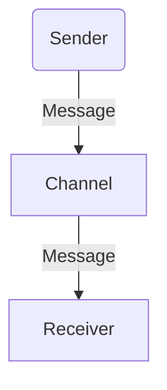
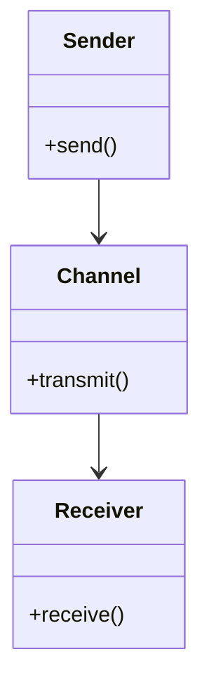
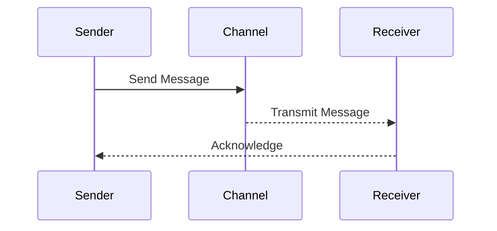
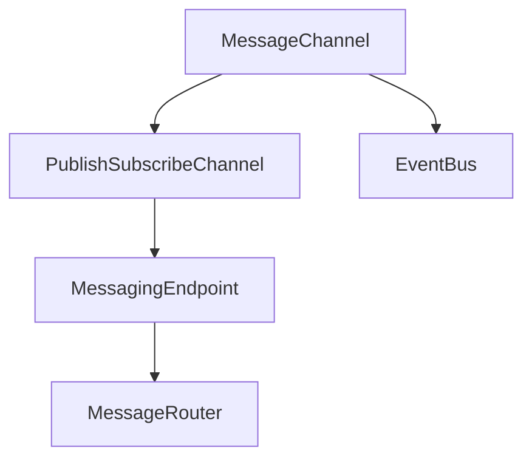

## Definition
The **Message Channel** pattern provides a means for different parts of a system to communicate by exchanging messages through a channel. Each channel implements a communication path that carries data between a sender and one or more receivers.

## Intent
The intention behind the Message Channel pattern is to decouple the sender of a message from its receiver. This enables parallel development, promotes separation of concerns, and scales distributed applications more effectively.

## Also Known As
- Message Pipe

## Detailed Explanation and Mermaid Diagram

**Message Channel** can be visualized as follows:



- **A** represents the application or component acting as the sender.
- **C** represents the message channel.
- **R** denotes the receiver application or component.

The communication model ensures complete decoupling between the sender and receiver, with the channel acting as an intermediary that handles the transmission of messages.

### Key Features
- **Decoupling:** Separates the sender and receiver, allowing independent development and scaling.
- **Asynchronous Communication:** Supports non-blocking operations, making systems more resilient and responsive.
- **Scalability:** Facilitates easy addition of multiple senders and receivers.
- **Flexibility:** Can be implemented across various technologies and frameworks.

## Code Examples

### Java with Apache Camel

```java
import org.apache.camel.CamelContext;
import org.apache.camel.builder.RouteBuilder;
import org.apache.camel.impl.DefaultCamelContext;

public class MessageChannelExample {
    public static void main(String[] args) throws Exception {
        CamelContext camelContext = new DefaultCamelContext();
        camelContext.addRoutes(new RouteBuilder() {
            @Override
            public void configure() {
                from("file:messages/input")
                .to("jms:queue:messageChannel");
            }
        });
        camelContext.start();
        Thread.sleep(5000);
        camelContext.stop();
    }
}
```

### Scala with Akka Streams

```scala
import akka.actor.ActorSystem
import akka.stream._
import akka.stream.scaladsl._

object MessageChannelExample extends App {
  implicit val system = ActorSystem("MessageChannelSystem")
  implicit val materializer = ActorMaterializer()

  val source = Source.single("HELLO, WORLD!")
  val sink = Sink.foreach[String](println)

  val runnable = source.to(sink)
  runnable.run()
}
```

### Class Diagram

Here is a simplified representation of the components involved:


In this diagram:
- `Sender` encapsulates the logic for preparing and sending messages.
- `Channel` acts as the intermediary.
- `Receiver` deals with message consumption or processing.

### Sequence Diagram

Illustration of message flow using:



## Benefits

- **Improved Decoupling:** Allows sender and receivers to operate independently.
- **Better Scalability:** Handles significant loads with dynamic sender/receiver scaling.
- **Enhanced Reliability:** The asynchronous nature avoids bottlenecks and overloading.

## Trade-offs

- **Complexity:** Sometimes adds unnecessary complexity if simple direct interaction suffices.
- **Latent Issues:** Asynchronous systems can introduce latency in delivering messages.
- **Guarantees:** Ensuring delivery guarantees (like transactions) can be challenging.

## When to Use

- **Distributed Systems:** Ideal for environments where components operate over a network.
- **High Scalability Needs:** Suitable for systems expected to handle dynamic load increases.
- **Asynchronous Processes:** When tasks do not require instant responses.

## Example Use Cases

- **Order Processing Systems:** Where orders come from varied sources and take different processing paths.
- **Microservices:** Enables microservices to communicate without intimate system knowledge.

## When Not to Use and Anti-Patterns

- **Simple Applications:** Overkill for systems with straightforward interactions.
- **Heavy Synchronous Needs:** If near-instantaneous acknowledgment is essential, going for direct calls might be apt.
  
## Related Design Patterns

- **Event Bus:** Shares similar traits but emphasizes broadcast to multiple subscribers.
- **Publish-Subscribe Channels:** Variant where messages are pushed to multiple receivers.

## References and Further Reading

- **Books:**
  - [Enterprise Integration Patterns: Designing, Building, and Deploying Messaging Solutions](https://amzn.to/3XXncn8) by Gregor Hohpe and Bobby Woolf
  - [Designing Data-Intensive Applications](https://amzn.to/4cuX2Na) by Martin Kleppmann
  
- **Open Source Frameworks:**
  - Apache Camel
  - Akka
  - Spring Integration

## Clouds and Tools

- **Cloud Providers:** AWS SQS/SNS, Google Cloud Pub/Sub.
- **Managed Services:** Apache Kafka (Confluent Cloud).

## Grouped Patterns

### Messaging Patterns



- **Message Channel:** The basic communication path.
- **Publish-Subscribe Channel:** Extends channel to broadcast.
- **Event Bus:** Facilitates system-wide event distribution.
- **Messaging Endpoint:** Ties channels to system points such as routers and processors.

### Solving Asynchronous Communication

When tasked with integrating complex systems asynchronously, a combination of these patterns facilitates seamless data flow and task scalability.

By employing **Message Channel**, decoupling is achieved, with flexibility to fine-tune _how_ (Event Bus) and _who_ (Publish-Subscribe) processes data—fitting diverse use box needs.

### Conclusion

Overall, the **Message Channel** pattern lays the necessary structure for decoupled, efficient data transfer within and between systems, providing a robust foundation for scalable architectures.
