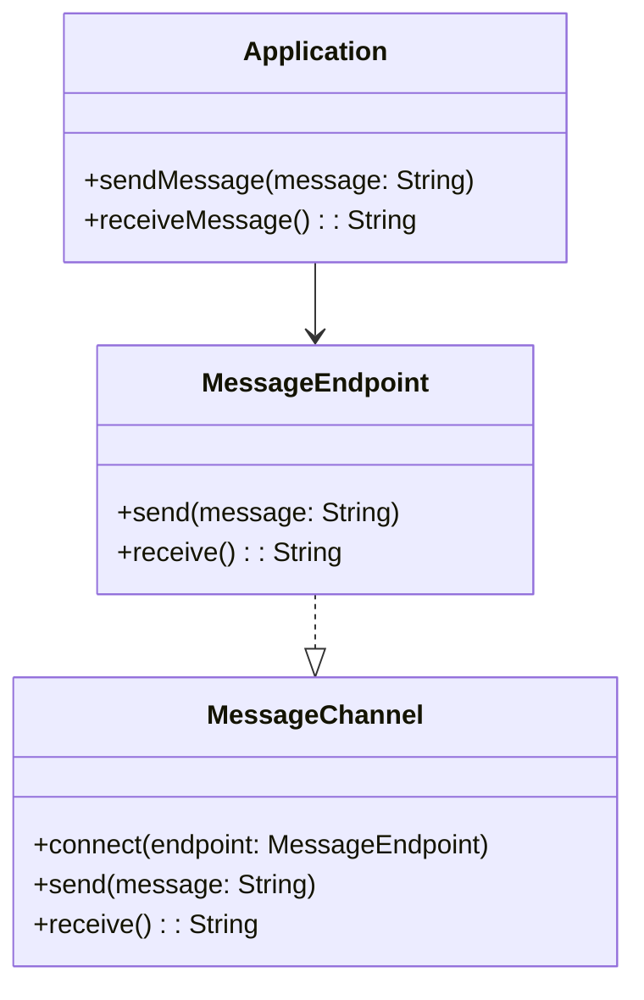
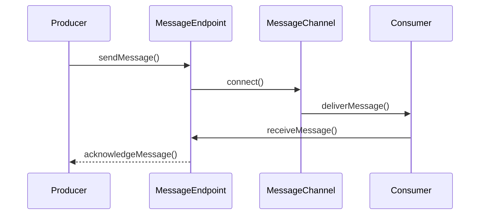

## Definition
The **Message Endpoint** pattern describes how an application can connect to a messaging channel to send and receive messages. It acts as an interface for the messaging system, facilitating communication between participates in a messaging system.

## Intent
The intent of the Message Endpoint pattern is to decouple the application logic from the messaging infrastructure, allowing the system components to communicate asynchronously and enabling better scalability and flexibility.

## Also Known As
- Communication Endpoint
- Messaging Endpoint.

## Detailed Definitions and Explanations
A Message Endpoint is a generic term for resources within the system that send, receive, or otherwise interact with messages. It provides an abstraction between the application's business logic and the complexity of the messaging infrastructure, thereby isolating message-handling logic from communication specifics.

### Key Features
- Decouples message handling from business logic.
- Abstracts messaging protocols.
- Facilitates asynchronous communication.
- Handles data transformation and routing.

### Diagram


## Example Implementation

### Java Example with Spring Boot and Apache Kafka

#### SpringBootKafkaProducer.java
```java
import org.springframework.beans.factory.annotation.Autowired;
import org.springframework.kafka.core.KafkaTemplate;
import org.springframework.stereotype.Service;

@Service
public class SpringBootKafkaProducer {

    private final KafkaTemplate<String, String> kafkaTemplate;

    @Autowired
    public SpringBootKafkaProducer(KafkaTemplate<String, String> kafkaTemplate) {
        this.kafkaTemplate = kafkaTemplate;
    }

    public void sendMessage(String message) {
        kafkaTemplate.send("myTopic", message);
    }
}
```

#### SpringBootKafkaConsumer.java
```java
import org.springframework.kafka.annotation.KafkaListener;
import org.springframework.stereotype.Service;

@Service
public class SpringBootKafkaConsumer {

    @KafkaListener(topics = "myTopic", groupId = "group_id")
    public void consume(String message) {
        System.out.println("Consumed message: " + message);
    }
}
```

### Scala Example with Akka
#### AkkaProducer.scala
```scala
import akka.actor.Actor
import akka.kafka.ProducerSettings
import org.apache.kafka.clients.producer.ProducerRecord
import akka.kafka.scaladsl.SendProducer

class AkkaProducer(producerSettings: ProducerSettings[String, String]) extends Actor {
  val producer: SendProducer[String, String] = SendProducer(producerSettings)
  
  def receive: Receive = {
    case msg: String => producer.send(new ProducerRecord("myTopic", msg))
  }
}
```

#### AkkaConsumer.scala
```scala
import akka.actor.Actor
import akka.kafka.ConsumerSettings
import akka.kafka.Subscriptions
import akka.kafka.scaladsl.Consumer
import org.apache.kafka.clients.consumer.ConsumerConfig

class AkkaConsumer(consumerSettings: ConsumerSettings[String, String]) extends Actor {
  def receive: Receive = {
    case "start" =>
      Consumer.plainSource(consumerSettings, Subscriptions.topics("myTopic"))
        .runForeach(record => println(s"Consumed message: ${record.value()}"))
  }
}
```

## Example Use Case 
A retail commerce system that uses an event-driven architecture to handle orders, inventory updates, and notifications.

### Sequence Diagram


## Benefits
- **Loose Coupling:** Decouples the implementation of business logic from message handling.
- **Scalability:** Enables asynchronous processing, making the system more scalable.
- **Maintainability:** Promotes separation of concerns, making maintenance easier.

## Trade-offs
- **Complexity:** Adds complexity due to the need for additional message handling logic.
- **Latency:** Could introduce latency due to asynchronous communication.

## When to Use
- When building distributed systems that require components to communicate asynchronously.
- When attempting to decouple services and improve system scalability.

## When Not to Use and Anti-patterns
- For systems that require strong synchronous communication.
- When adding messaging infrastructure unnecessarily complicates the architecture.

## Related Design Patterns
- **Message Channel:** Represents the medium through which messages are sent or received.
- **Message Router:** Directs messages to the correct message endpoint.
- **Service Activator:** Activates the business service upon message reception.

## References and Credits
- *Enterprise Integration Patterns* by Gregor Hohpe and Bobby Woolf
- Apache Kafka Documentation
- Akka Documentation

## Open Source Frameworks and Tools
- Spring Boot
- Apache Camel
- MuleSoft
- Akka
- Apache Kafka
- Apache Flink

## Cloud Computing and Services
- Amazon Web Services (AWS) Kinesis
- Google Cloud Pub/Sub
- Microsoft Azure Event Grid and Service Bus

## Suggested Books for Further Studies
- [Enterprise Integration Patterns: Designing, Building, and Deploying Messaging Solutions](https://amzn.to/3XXncn8) by Gregor Hohpe and Bobby Woolf.
- [Designing Data-Intensive Applications](https://amzn.to/4cuX2Na) by Martin Kleppmann.
- [Building Microservices: Designing Fine-Grained Systems](https://amzn.to/3RYRz96) by Sam Newman.

