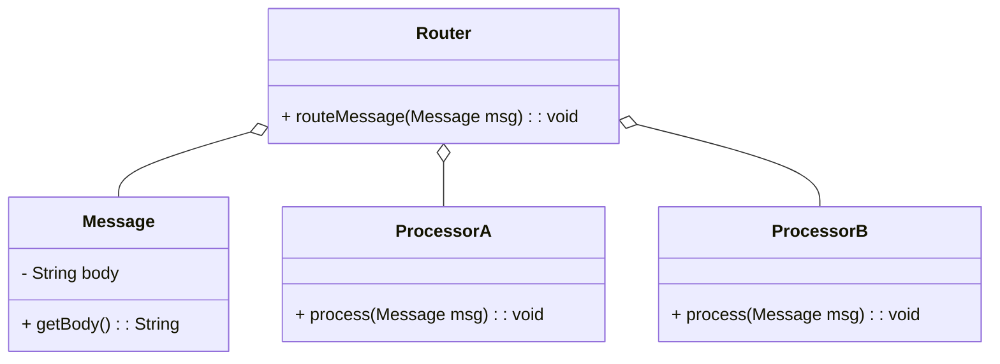
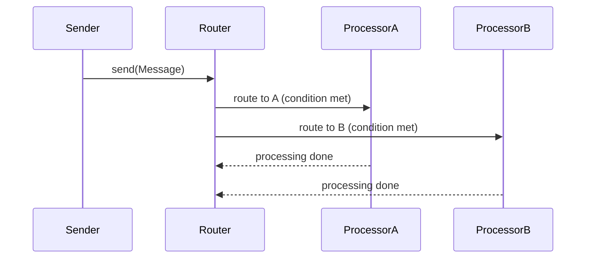

## Introduction

The Message Router Pattern handles the routing of messages to different processing steps based on a set of conditions, enabling decoupled and flexible message processing strategies.

## Intent

To route messages to different processing paths based on specific conditions or rules to ensure that each message is handled appropriately.

## Also Known As

- Conditional Router
- Routing Slip

## Detailed Explanation

In the simplest form, a Message Router filters incoming messages and forwards each message to the appropriate downstream channels dependent upon specific conditions.

### Key Features

- **Dynamic Routing**: The ability to route messages at runtime based on message content or external conditions.
- **Decoupling**: Decouples message sender from the processing logic.
- **Flexibility**: Messages can be routed to one or more destinations dynamically.

### Diagrams

#### Example Class Diagram



#### Example Sequence Diagram



## Code Examples

### Java with Apache Camel

```java
import org.apache.camel.builder.RouteBuilder;
import org.apache.camel.main.Main;

public class MessageRouterExample {
    public static void main(String[] args) throws Exception {
        Main main = new Main();
        main.configure().addRoutesBuilder(new RouteBuilder() {
            @Override
            public void configure() {
                from("direct:start")
                    .choice()
                        .when(simple("${body} contains 'A'"))
                            .to("direct:processorA")
                        .otherwise()
                            .to("direct:processorB");

                from("direct:processorA")
                    .log("Processing in Processor A");

                from("direct:processorB")
                    .log("Processing in Processor B");
            }
        });
        main.start();
    }
}
```

### Scala with Akka Streams

```scala
import akka.actor.ActorSystem
import akka.stream.ActorMaterializer
import akka.stream.scaladsl._

implicit val system = ActorSystem("MessageRouterSystem")
implicit val materializer = ActorMaterializer()

val source = Source(List("Message A1", "Message B1", "Message A2", "Message B2"))

val router = source.map { msg =>
  if (msg.contains("A")) Left(msg)
  else Right(msg)
}

val processorA = Flow[String].map(msg => {
  println(s"Processing in Processor A: $msg")
  msg
})

val processorB = Flow[String].map(msg => {
  println(s"Processing in Processor B: $msg")
  msg
})

val graph = router.map(_.left.get) via processorA to Sink.ignore merge 
              (router.map(_.right.get) via processorB to Sink.ignore)

graph.run()
```

## Benefits
- Increases modularity and separation of concerns.
- Enables dynamic routing logic that can evolve over time.
- Improves scalability and maintainability by isolating routing logic from the core processing.

## Trade-offs
- Increased complexity in routing logic.
- Potential performance overhead due to message inspection and routing.

## When to Use
- When different types of messages require different processing pathways.
- When there's a need for dynamic and flexible message routing at runtime.
- In event-driven and microservices architectures.

## Example Use Cases
- Routing of incoming HTTP requests to different microservice endpoints.
- Dynamic allocation of tasks in a distributed processing system.
- Channeling of IoT data to different processors or storage systems.

## When Not to Use
- When message routing is static and simple. Overhead might not justify the use.
- In highly performance-sensitive environments where parsing conditions might be a bottleneck.

## Anti-patterns
- Monolithic Message Handler: Embedding all processing logic within a single handler instead of decoupling routes can lead to complex and unscalable applications.

## Related Design Patterns
- **Message Filter**: Pared with the Message Router to selectively route and block certain messages.
- **Content-Based Router**: A specialized type of message router that routes messages based on specific data in the message content.

## References
- [Enterprise Integration Patterns: Designing, Building, and Deploying Messaging Solutions](https://amzn.to/3XXncn8) by Gregor Hohpe and Bobby Woolf.
- [Apache Camel Documentation](https://camel.apache.org/manual/latest/router-eip.html)
- [Akka Streams Documentation](https://doc.akka.io/docs/akka/current/stream/index.html)

## Credits
- Inspired by the book [Enterprise Integration Patterns: Designing, Building, and Deploying Messaging Solutions](https://amzn.to/3XXncn8) by Gregor Hohpe and Bobby Woolf.
- Examples based on Apache Camel and Akka Streams documentation.

## Open Source Frameworks
- **Apache Camel**: Enables building message routing and mediation rules in a variety of domain-specific languages.
- **Akka Streams**: Provides a powerful way to process streams of data with backpressure on the JVM.

## Cloud Computing (SaaS, PaaS, IaaS)
- **Amazon Web Services (AWS) Step Functions**: Allows orchestration of workflows that include conditional routing.
- **Azure Logic Apps**: Enables building and running automated workflows with conditional routing capabilities.

## Suggested Books for Further Studies
- ["Enterprise Integration Patterns"](https://www.amazon.com/Enterprise-Integration-Patterns-Designing-Deploying/dp/0321200683) by Gregor Hohpe and Bobby Woolf

---

By separating individual processing steps and enabling dynamic routing, the Message Router Pattern allows for flexible and modular systems suited to varying runtime conditions.
