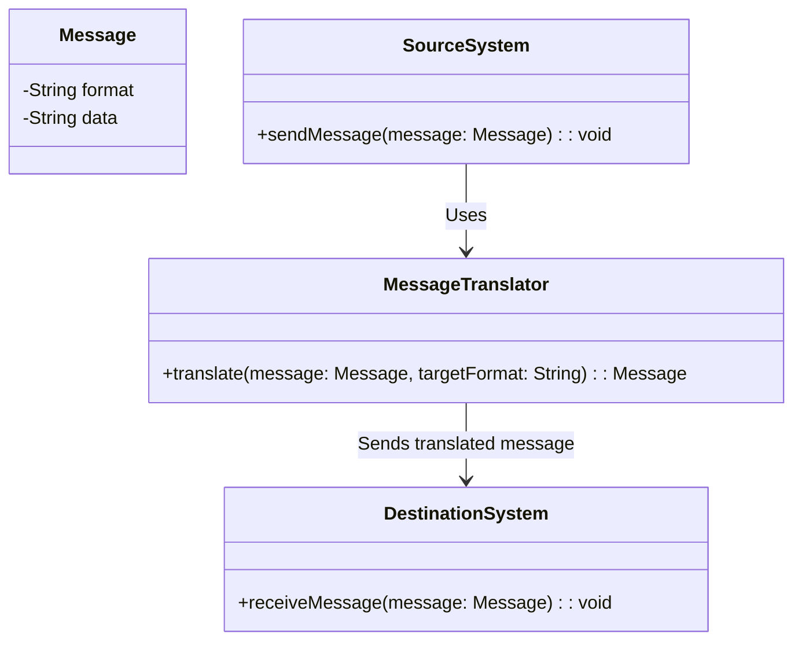
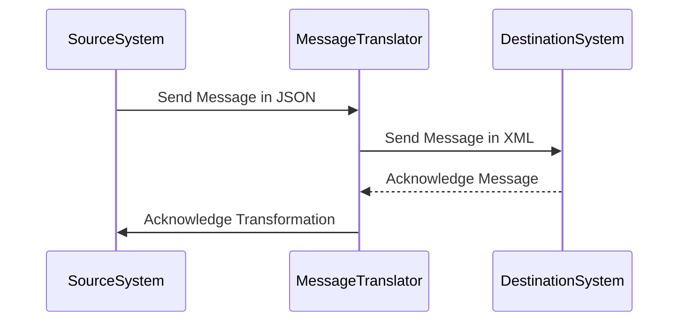
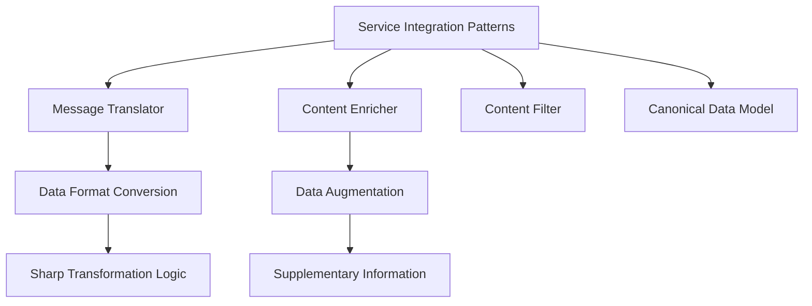

## Definition
The Message Translator is an Enterprise Integration Pattern (EIP) that translates one data format into another to enable systems with differing data formats to communicate through messaging. The pattern allows systems that speak different languages (data formats) to interoperate by translating messages into the appropriate format for each system involved.

## Intent
The intent of the Message Translator pattern is to facilitate communication between applications by converting messages from one format to another to ensure compatibility and interoperability.

### Also Known As
- Data Transformer
- Format Converter

## Detailed Definitions and Explanations with Mermaid Diagrams

### Key Features
- Enables interoperability between disparate systems.
- Decouples system integration from individual application logic.
- Provides a centralized point of message format transformation.
- Implements seamless data format changes.

### Code Examples

#### Java Example Using Apache Camel
```java
import org.apache.camel.builder.RouteBuilder;
import org.apache.camel.main.Main;

public class MessageTranslatorExample {
    public static void main(String[] args) throws Exception {
        Main main = new Main();
        main.configure().addRoutesBuilder(new RouteBuilder() {
            @Override
            public void configure() {
                from("direct:start")
                .unmarshal().json() // Assuming input is in JSON format
                .marshal().xmljson() // Converts to XML format
                .to("direct:destination");
            }
        });

        main.start();
    }
}
```

#### Scala Example Using Akka Streams
```scala
import akka.actor.ActorSystem
import akka.stream.ActorMaterializer
import akka.stream.scaladsl.{Flow, Sink, Source}
import spray.json._

object MessageTranslatorExample extends App with DefaultJsonProtocol {
    implicit val system: ActorSystem = ActorSystem("MessageTranslatorSystem")
    implicit val materializer: ActorMaterializer = ActorMaterializer()

    val jsonToXmlFlow: Flow[String, String, _] = Flow[String].map { jsonString =>
        val jsonObj = jsonString.parseJson.asJsObject
        // Implement JSON to XML transformation logic here
        "<message>" + jsonObj.fields("message").convertTo[String] + "</message>"
    }

    Source.single("""{"message":"hello"}""")
    .via(jsonToXmlFlow)
    .runWith(Sink.foreach(println))
}
```

### Example Class Diagrams with Explanation

In this diagram,
- A `SourceSystem` sends a `Message` to the `MessageTranslator`.
- The `MessageTranslator` transforms the message into the target format required by the `DestinationSystem`.
- The `DestinationSystem` receives the translated message.

### Example Sequence Diagrams with Explanation

In this sequence diagram:
- The `SourceSystem` sends a message in JSON format to the `MessageTranslator`.
- The `MessageTranslator` converts the message to XML format and forwards it to the `DestinationSystem`.
- The `DestinationSystem` acknowledges receipt, and the `MessageTranslator` confirms the successful transformation back to the `SourceSystem`.

## Benefits
- Promotes interoperability between heterogeneous systems.
- Centralizes message transformation logic, simplifying maintenance.
- Decouples application logic from data format specifics.

## Trade-offs
- Introduces additional processing overhead due to message transformation.
- Increases complexity in managing transformations for large-scale systems.
- May need to handle schema evolution and compatibility issues.

## When to Use
- When integrating systems with disparate data formats.
- When decoupling message processing logic from format specifics is desired.
- When standardizing message transformations in a centralized location.

## Example Use Cases
- Communication between legacy systems and modern applications.
- Interfacing different services in a microservices architecture that uses distinct data formats.
- Bridging external partners’ data formats with internal system formats.

## When Not to Use
- When all integrated systems use the same data format.
- When the overhead of transformation negatively impacts system performance critically.
- When transformations are simple and can be managed within individual applications' logic.

## Anti-patterns
- Hardcoding transformation logic in application services instead of centralizing it.
- Creating multiple translators with inconsistent logic across the system.

## Related Design Patterns with Descriptions and Comparisons
- **Content Enricher**: Adds additional information to a message necessary for processing.
- **Content Filter**: Removes unwanted parts of a message.
- **Canonical Data Model**: Ensures all systems communicate using a standardized format, reducing the need for individual transformations.

## References
- Enterprise Integration Patterns by Gregor Hohpe and Bobby Woolf
- Apache Camel, Akka Streams documentation

## Credits
- Pattern originated from the book *Enterprise Integration Patterns* by Gregor Hohpe and Bobby Woolf
- Examples inspired by Apache Camel and Akka Streams documentation

## Open Source Frameworks and Tools
- [Apache Camel](https://camel.apache.org/)
- [Akka Streams](https://doc.akka.io/docs/akka/current/stream/index.html)
- [MuleSoft](https://www.mulesoft.com/)

## Cloud Computing
- Implementing in integration platforms like AWS Step Functions, Azure Logic Apps, and Google Cloud Pub/Sub.

## Suggested Books for Further Studies
- *Enterprise Integration Patterns* by Gregor Hohpe and Bobby Woolf
- *Spring Integration in Action* by Iwein Fuld and Jonas Partner
- *Reactive Systems Architecture* by Jonas Bonér, Viktor Klang, and others

## Grouping Related Patterns



- **Message Translator**: Focuses on data format conversion.
- **Content Enricher**: Enriches message with additional data requiring minimal transformation logic.
- **Content Filter**: Filters the undesired data from messages.
- **Canonical Data Model**: Centralized data model approach reducing the number of transformations needed.

In conclusion, the Message Translator is essential for enabling seamless communication between systems with differing data formats. It provides a way to centralize and manage data transformation, ensuring smooth operation within a heterogeneous environment.
