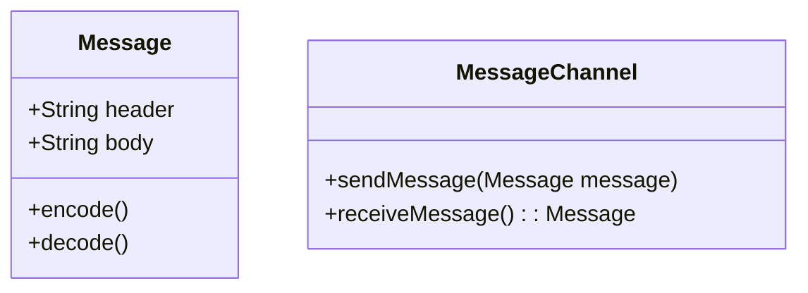

## Message

### Definition
A **Message** is a data payload that travels between systems and applications to enable communication. Messages are used to asynchronously send information from a sender to a receiver through a message channel.

### Intent
The purpose of the Message pattern is to allow two applications to communicate by exchanging information through a common intermediary (message channel), ensuring decoupling and higher flexibility in architecture.

### Also Known As
- Event
- Notification

### Detailed Explanation

A message generally consists of a header and a body. The header contains meta-information (such as type, timestamp, and priority), while the body contains the actual data payload.

### Key Features

- **Asynchronous Communication**: Applications communicate without waiting for each other.
- **Decoupling**: Sender and receiver decouple, allowing changes or failures in one to not affect the other.
- **Scalability**: Can handle a large amount of communication by relaying messages through a channel.
- **Reliability**: Messages can be stored and forwarded to ensure delivery even in cases of temporary receiver unavailability.

### Class Diagram



#### Explanation
`Message` class will encapsulate the data to be transferred. `MessageChannel` class will manage sending and receiving messages.

### Sequence Diagram

```mermaid
sequenceDiagram
    actor Sender
    participant Channel as MessageChannel
    participant Receiver

    Sender->>Channel: sendMessage(message)
    activate Channel
    Channel-->>Receiver: storeMessage(message)
    deactivate Channel
    Receiver-->>Channel: receiveMessage(): message
    deactivate Receiver
```

#### Explanation
1. The Sender sends a message to MessageChannel.
2. MessageChannel stores the message and relays it to the Receiver.
3. The Receiver receives the message from the MessageChannel.

### Code Examples

#### Java Example using Apache Camel

```java
import org.apache.camel.CamelContext;
import org.apache.camel.impl.DefaultCamelContext;
import org.apache.camel.builder.RouteBuilder;

public class MessageExample {
    public static void main(String[] args) throws Exception {
        CamelContext context = new DefaultCamelContext();

        context.addRoutes(new RouteBuilder() {
            @Override
            public void configure() {
                from("direct:start")
                  .to("log:received-message")
                  .to("mock:end");
            }
        });

        context.start();
        context.createProducerTemplate().sendBody("direct:start", "Hello, Apache Camel!");
        context.stop();
    }
}
```

#### Scala Example using Akka

```scala
import akka.actor.{Actor, ActorSystem, Props}

class MessageActor extends Actor {
  def receive: Receive = {
    case message: String =>
      println(s"Received message: $message")
  }
}

object MessageExample {
  def main(args: Array[String]): Unit = {
    val system = ActorSystem("MessageSystem")
    val messageActor = system.actorOf(Props[MessageActor], "messageActor")

    messageActor ! "Hello, Akka!"
    system.terminate()
  }
}
```

### Benefits

- **Reduced coupling between components**
- **Improved fault tolerance and reliability**
- **Scalable architecture**
- **Asynchronous processing**

### Trade-offs

- **Complexity in error handling**: Ensuring message delivery and handling failures can be complex.
- **Latency**: Asynchronous communication introduces latency.
- **Resource consumption**: Requires additional components (message brokers, queues).

### When to Use

- For systems requiring high decoupling.
- When scalable and resilient communication is needed.
- When systems must interact asynchronously.

### Example Use Cases

- Microservices architecture
- Event-driven systems
- Stock trading platforms
- Messaging applications

### When Not to Use

- In simple systems with minimal interactions.
- For tightly coupled systems where immediate responses are necessary.
- In low-latency or real-time communication scenarios.

### Anti-patterns

- **Over-complication**: Unnecessarily using messaging in simple systems.
- **Improper Error Handling**: Failing to account for message loss or failures.

### Related Design Patterns

- **Message Channel**: Provides the medium for the message to travel.
- **Message Broker**: Mediates and routes messages from sender to receiver.
- **Event-Driven Architecture**: Systems built around messages as events.

### References

- [Enterprise Integration Patterns](https://www.enterpriseintegrationpatterns.com/)
- [Apache Camel Official Documentation](https://camel.apache.org/manual/latest/index.html)
- [Akka Official Documentation](https://doc.akka.io/docs/akka/current/)

### Credits

- Apache Camel, Akka

### Open Source Frameworks, Third Party Tools

- **Apache Kafka**
- **RabbitMQ**
- **ActiveMQ**
- **ZeroMQ**

### Cloud Computing and SAAS

- **AWS SNS/SQS**
- **Azure Service Bus**
- **Google Cloud Pub/Sub**

### Suggested Books

- **Enterprise Integration Patterns** by Gregor Hohpe and Bobby Woolf
- [Designing Data-Intensive Applications](https://amzn.to/4cuX2Na) by Martin Kleppmann
- **Building Microservices** by Sam Newman
