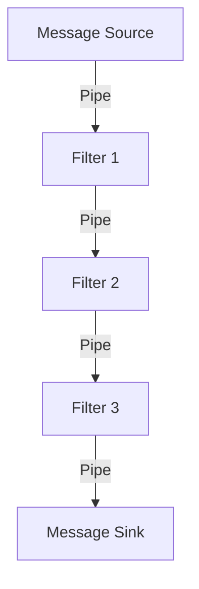
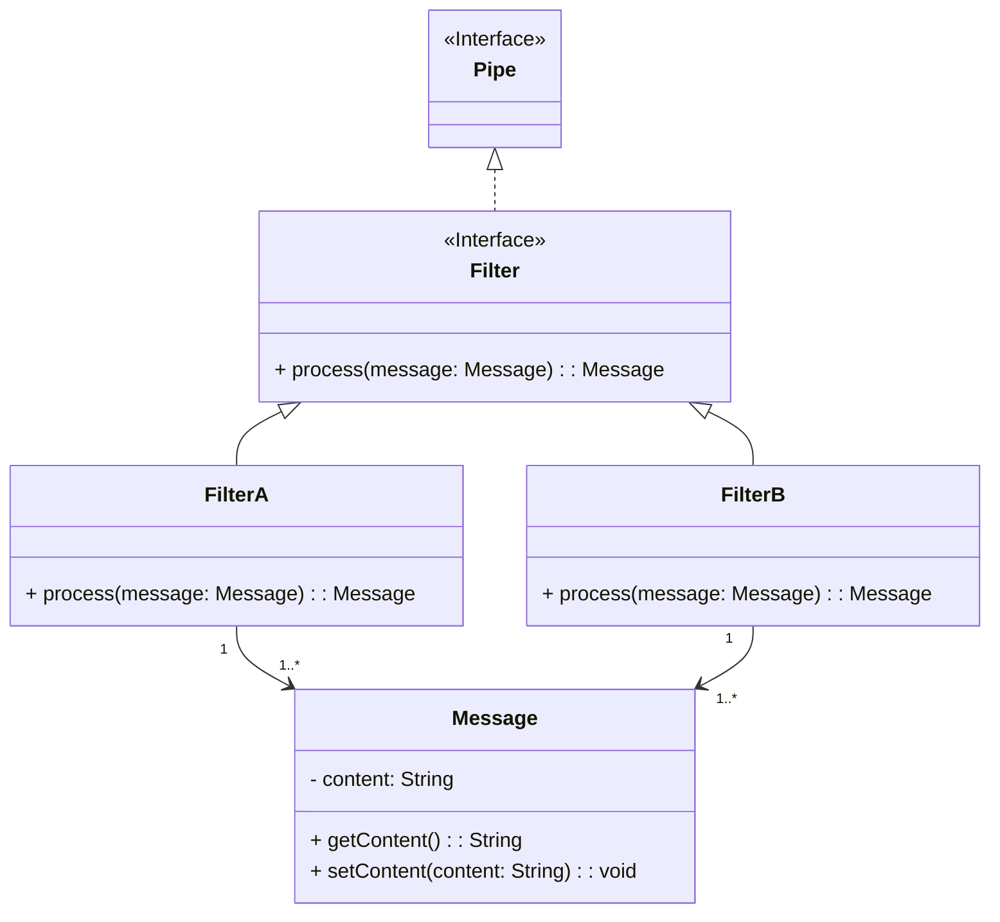
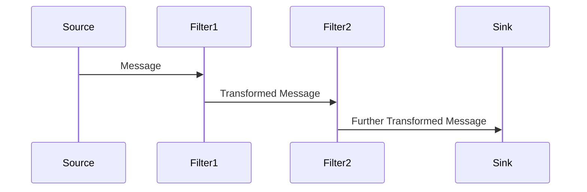

The **Pipes and Filters** pattern enables complex processing by dividing the overall process into a series of independent steps (filters) connected by channels (pipes). Each filter performs a specific transformation, enhancing flexibility and reusability.

## Intent

To structure the processing of complex tasks by breaking them down into sequences of independent filters connected by pipes, ensuring modularity and ease of maintenance.

## Usages

**Also Known As**: Data Flow Architecture

## Key Features

- **Modularity**: Separate processing into independent stages.
- **Reusability**: Use filters across different contexts.
- **Scalability**: Add or remove filters to adjust the pipeline.
- **Maintainability**: Change individual filters without affecting others.

## Detailed Explanation

A filter processes the incoming message, performs a specific task, and produces an output. Multiple filters connected by pipes form a pipeline, facilitating complex data processing.



### Code Examples

#### Java with Apache Camel

```java
import org.apache.camel.CamelContext;
import org.apache.camel.builder.RouteBuilder;
import org.apache.camel.impl.DefaultCamelContext;

public class PipesAndFiltersExample {
    public static void main(String[] args) throws Exception {
        CamelContext context = new DefaultCamelContext();
        context.addRoutes(new RouteBuilder() {
            @Override
            public void configure() {
                from("file:input")
                  .to("file:filter1")
                  .to("file:filter2")
                  .to("file:output");
            }
        });

        context.start();
        Thread.sleep(10000);
        context.stop();
    }
}
```

#### Scala with Akka Streams

```scala
import akka.actor.ActorSystem
import akka.stream.ActorMaterializer
import akka.stream.scaladsl.{Flow, Sink, Source}

object PipesAndFiltersApp extends App {
  implicit val system = ActorSystem("PipesAndFiltersSystem")
  implicit val materializer = ActorMaterializer()

  val source = Source(List("message1", "message2"))
  val filter1 = Flow[String].map(msg => s"filter1: $msg")
  val filter2 = Flow[String].map(msg => s"filter2: $msg")
  val sink = Sink.foreach[String](println)

  val stream = source.via(filter1).via(filter2).to(sink)
  stream.run()
}
```

## Example Class and Sequence Diagrams

### Class Diagram



### Sequence Diagram



## Benefits

- **Scalability**: Easily add, remove, or rearrange filters.
- **Modularity**: Each filter has a single responsibility.
- **Flexibility**: Different pipelines can share filters.

## Trade-offs

- **Latency**: Increased processing time due to multiple stages.
- **Complexity in Orchestration**: Managing the sequence and state of filters.

## When to Use

- Complex data processing requiring multiple steps.
- Stream processing where data flows through independent transformations.
- Scenarios requiring modular and reusable processing components.

## Example Use Cases

- **ETL Pipelines**: Transform, filter, and load data in stages.
- **Image Processing**: Apply a series of transformations to process images.
- **Log Aggregation**: Collect, filter, and analyze log data from various sources.

## When Not to Use and Anti-patterns

- Simple tasks solvable with a single processing step (adds unnecessary complexity).
- Too fine-grained filters causing splitting of simple transformations (increased orchestration complexity).

## Related Design Patterns

- **Chain of Responsibility**: Similar but passes control to the next handler dynamically.
- **Mediator**: Manages the interaction between several objects by introducing a mediator.
- **Message Router**: Routes the message to different endpoints based on specific conditions.

## References, Credits, and Tools

- **Apache Camel**: Integration framework implementing Pipes and Filters.
- **Mule ESB**: Enterprise Service Bus solution supporting data flow processing.
- **Spring Integration**: Provides support for Pipes and Filters within Spring applications.
- **Akka Streams**: Reactive Streams implementation for building data processing pipelines.
- **Cloud Platforms**: Also supported by cloud-based solutions like AWS Lambda (FaaS) and AWS Step Functions (orchestration).

### Suggested Books for Further Studies

- [Enterprise Integration Patterns: Designing, Building, and Deploying Messaging Solutions](https://amzn.to/3XXncn8) by Gregor Hohpe and Bobby Woolf
- [Designing Data-Intensive Applications](https://amzn.to/4cuX2Na) by Martin Kleppmann
- [Building Microservices: Designing Fine-Grained Systems](https://amzn.to/3RYRz96) by Sam Newman
