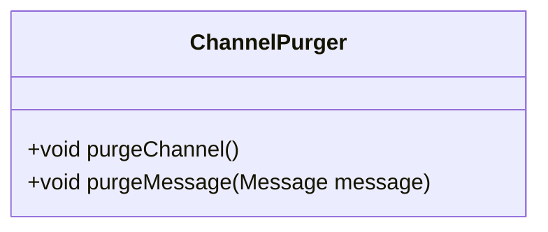
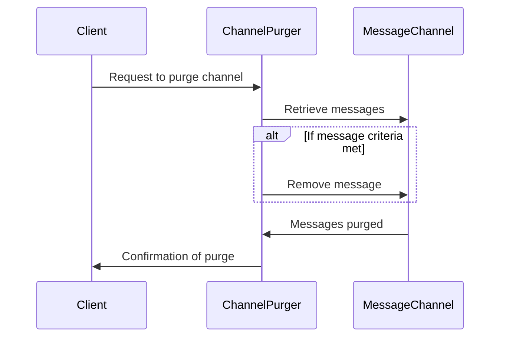
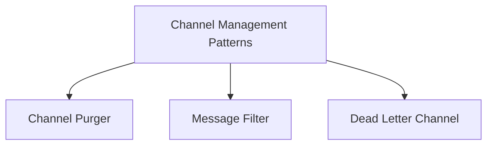

## Channel Purger

### Definition
The Channel Purger pattern ensures that any obsolete, mismatched, or test messages left on a messaging channel are removed, so they do not interfere with ongoing tests or running systems.

### Intent
The primary intent of the Channel Purger pattern is to clear channels of any stale or deprecated messages to ensure message integrity and flow in the system.

### Also Known As
- Message Cleaner
- Queue Purger

### Detailed Explanation

Channels in messaging systems can sometimes have obsolete messages that might disrupt normal operations or tests. This pattern helps in purging such messages effectively.

### Key Features
- Clean-up of messages that do not satisfy specific criteria
- Ensuring consistency in message channels
- Enhancing reliability by preventing old messages from interfering with new processes

### Code Examples

#### Java with Apache Camel

```java
import org.apache.camel.CamelContext;
import org.apache.camel.impl.DefaultCamelContext;
import org.apache.camel.builder.RouteBuilder;

public class ChannelPurgerExample {
    public static void main(String[] args) throws Exception {
        CamelContext context = new DefaultCamelContext();
        
        context.addRoutes(new RouteBuilder() {
            @Override
            public void configure() throws Exception {
                from("file:input?noop=true&delete=true")
                    .filter(xpath("/message[purge = 'true']"))
                    .to("file:purged");
            }
        });

        context.start();
        Thread.sleep(5000);
        context.stop();
    }
}
```

#### Scala with Akka Streams

```scala
import akka.actor.ActorSystem
import akka.stream.scaladsl.{Sink, Source, Flow}
import akka.stream.{ActorMaterializer, Materializer}
import scala.concurrent.ExecutionContext

object ChannelPurgerApp extends App {
  implicit val system: ActorSystem = ActorSystem("channel-purger-system")
  implicit val materializer: Materializer = ActorMaterializer()
  implicit val ec: ExecutionContext = system.dispatcher
  
  val source = Source(List(
    "<message purge='true'>...</message>",
    "<message purge='false'>...</message>"
  ))
  
  val purgeFlow = Flow[String].filter(msg => msg.contains("purge='true'"))
  
  val sink = Sink.foreach[String](println)
  
  source.via(purgeFlow).runWith(sink)
}
```

### Class Diagram Example



*Explanation*: The `ChannelPurger` class includes methods to purge messages from a channel and evaluate each message for purging.

### Sequence Diagram Example



*Explanation*: This diagram outlines the steps taken to purge messages from a channel upon the client's request.

### Benefits
- Ensures clean channels for message passing
- Prevents interference from obsolete messages
- Enhances test reliability by removing extraneous messages

### Trade-offs
- Additional processing required to inspect and purge messages
- Might lead to temporary performance decline due to purging activities

### When to Use
- Channels have mixed (old and new) messages
- Ensuring clean message infrastructure for testing scenarios

### Example Use Cases
- QA environments with frequent test cases
- Systems undergoing rapid development and integration

### When Not to Use and Anti-Patterns
- Real-time systems with stringent performance constraints
- Systems with auto-clean features

### Related Design Patterns
- **Message Filter**: Filters out messages that meet certain criteria.
- **Dead Letter Channel**: Handles messages that could not be processed.

### References and Credits
- Enterprise Integration Patterns by Gregor Hohpe and Bobby Woolf
- Apache Camel Documentation
- Akka Streams Documentation

### Open Source Frameworks and Tools
- Apache Camel
- Spring Integration
- Akka Streams

### Cloud Computing
- AWS SQS with message lifecycle management
- Google Cloud Pub/Sub with message retention policies
- Azure Service Bus with support for dead-letter queues

### Suggested Books for Further Studies
- Enterprise Integrations Patterns by Gregor Hohpe and Bobby Woolf
- Camel in Action by Claus Ibsen and Jonathan Anstey
- Akka Concurrency by Derek Wyatt

## Pattern Groups Using Mermaid Diagrams



### Description of Related Patterns
- **Message Filter**: Focuses on filtering out undesired messages based on specific criteria.
- **Dead Letter Channel**: Provides a way to handle unprocessable messages ensuring they don’t get lost.

By grouping related patterns, you effectively provide a comprehensive solution for managing message channels’ integrity.

