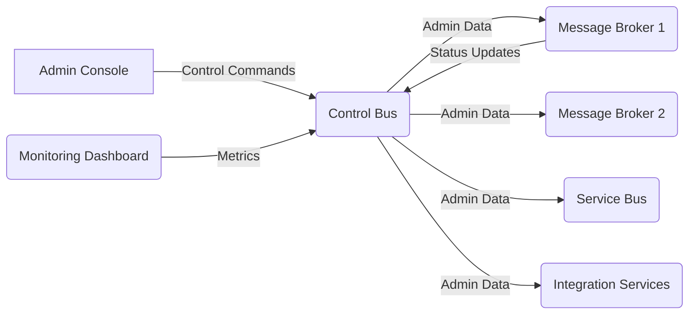
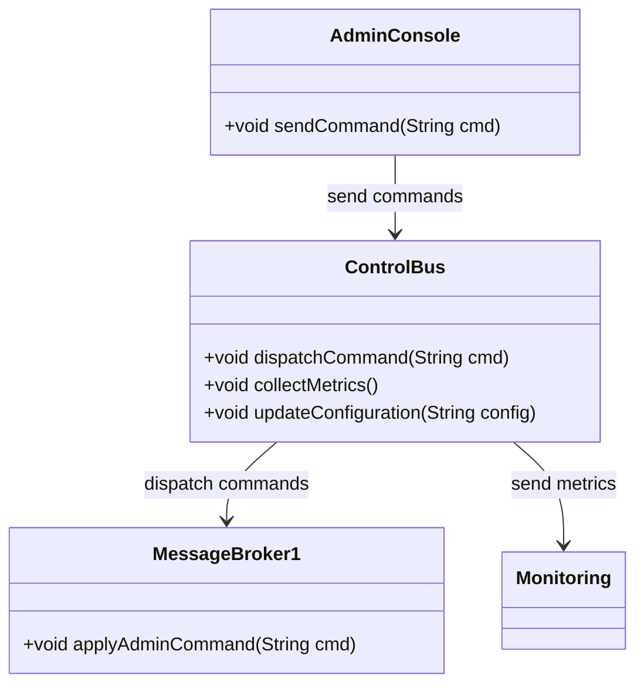
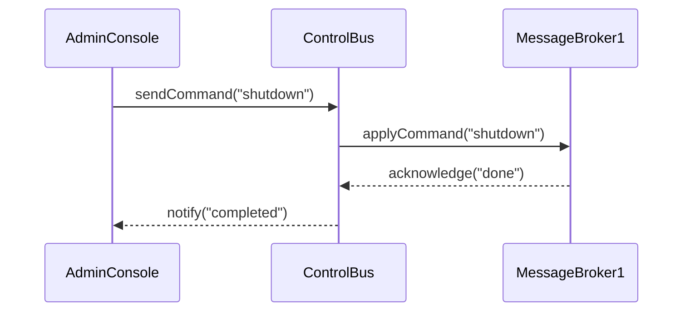
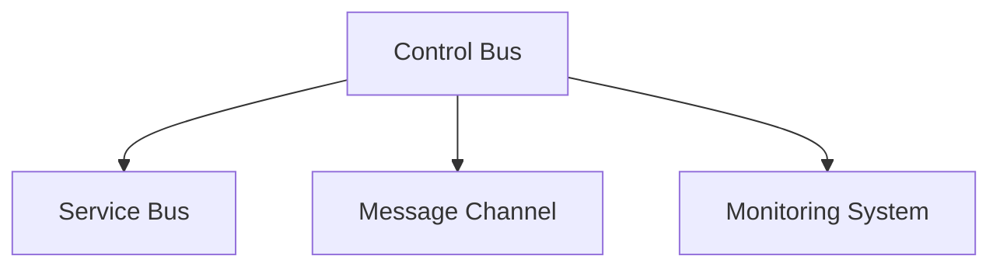

## Definition
The Control Bus is an integration pattern that leverages a dedicated channel to manage and control the components of a messaging system. It delivers administrative commands and configuration changes across a distributed network of messaging services, ensuring a robust, scalable, and flexible architecture.

## Intent
The intent of the Control Bus pattern is to provide a standardized way to perform administrative tasks, collect metrics, manage configuration, and monitor the health and state of various components in a distributed messaging system. 

## Also Known As
- Management Bus

## Detailed Explanations with Mermaid Diagrams

### Architecture



### Key Features
1. **Unified Control:** Centralizes administrative functionalities.
2. **Scalability:** Supports growth of the distributed messaging system.
3. **Monitoring:** Provides real-time monitoring and status updates.
4. **Configuration Management:** Eases the modification and deployment of configurations.

## Code Examples

### Example in Java using Spring Boot

```java
import org.springframework.boot.SpringApplication;
import org.springframework.boot.autoconfigure.SpringBootApplication;
import org.springframework.integration.annotation.IntegrationComponentScan;
import org.springframework.integration.config.EnableIntegration;
import org.springframework.integration.core.MessagingTemplate;
import org.springframework.messaging.Message;
import org.springframework.messaging.support.MessageBuilder;

@SpringBootApplication
@EnableIntegration
@IntegrationComponentScan
public class ControlBusApplication {

    public static void main(String[] args) {
        SpringApplication.run(ControlBusApplication.class, args);
    }
    
    public void sendControlCommand() {
        MessagingTemplate template = new MessagingTemplate();
        Message<String> message = MessageBuilder.withPayload("shutdown").build();
        template.send("controlBusInputChannel", message);
    }
}
```

### Example in Scala using Akka

```scala
import akka.actor.{ Actor, ActorSystem, Props }
import scala.concurrent.duration._

case class ControlCommand(command: String)

class ControlBusActor extends Actor {
  def receive: Receive = {
    case ControlCommand(command) =>
      println(s"Executing command: $command")
  }
}

object ControlBusApp extends App {
  val system = ActorSystem("ControlBusSystem")
  val controlBusActor = system.actorOf(Props[ControlBusActor], "controlBusActor")

  controlBusActor ! ControlCommand("shutdown")
}
```

### Example Class Diagrams



### Example Sequence Diagrams



## Benefits
1. **Centralized Management:** Facilitates easy management of numerous widely distributed services.
2. **Improved Monitoring:** Keeps the system robust by providing critical insights in real time.
3. **Simplified Configuration Changes:** Enables quick updates to configurations reducing manual interventions.
4. **Enhanced Coordination:** Helps coordinate system tasks and operations efficiently.

## Trade-offs
- **Complexity:** Adds complexity to the system due to the additional infrastructure needed to manage and maintain the Control Bus.
- **Single Point of Failure:** Could potentially become a single point of failure if not designed redundantly.
- **Latency:** Introduces some latency due to the added layer of communication between system components.

## When to Use
- To manage distributed messaging systems across various platforms.
- For systems requiring efficient monitoring and centralized control.
- When scalability and real-time updates are critical.

## Example Use Cases
- Controlling and configuring large-scale distributed message brokers.
- Centralized monitoring of microservices.
- Administering multi-region deployments ensuring system integrity.

## When Not to Use and Anti-patterns
- Small scale applications that don't require centralized control.
- Systems where the added complexity may outweigh the benefits.
- Implementing control mechanisms directly within each distributed component, potentially leading to redundancy and inconsistent state.

## Related Design Patterns
- **Service Bus:** A communication pattern that facilitates communication and coordination across different services.
- **Message Channel:** Defines a mechanism to transport messages from the sender to the receiver.
- **Monitoring System:** Systems dedicated to tracking the health and status of components.

## References and Credits
1. [Enterprise Integration Patterns: Designing, Building, and Deploying Messaging Solutions](https://amzn.to/3XXncn8) by Gregor Hohpe and Bobby Woolf

## Open Source Frameworks
- **Apache Camel:** Provides extensive routing capabilities and assists in integration.
- **Spring Integration:** Part of Spring framework and similar to Apache Camel in terms of integration features.
- **Akka:** Suitable for creating distributed applications with actors.

## Cloud Computing and SaaS
- Suitable for integrating cloud-based services through automated control and monitoring.

## Further Reading
- *Building Microservices* by Sam Newman
- [Designing Data-Intensive Applications](https://amzn.to/4cuX2Na) by Martin Kleppmann

## Patterns Grouped by Problem Area

### Monitoring and Control


**Monitoring and Control Patterns Solution:**
These patterns collectively provide mechanisms for central management, transport, and monitoring of messages within a distributed system. They collectively allow efficient governance and health checking across multiple platforms and services.

## Conclusion
The Control Bus is an essential pattern for managing, controlling, and monitoring distributed messaging systems. Its relevance grows in proportion with the scalability demands and distributed nature of modern applications, helping maintain system integrity and operational efficiency.
