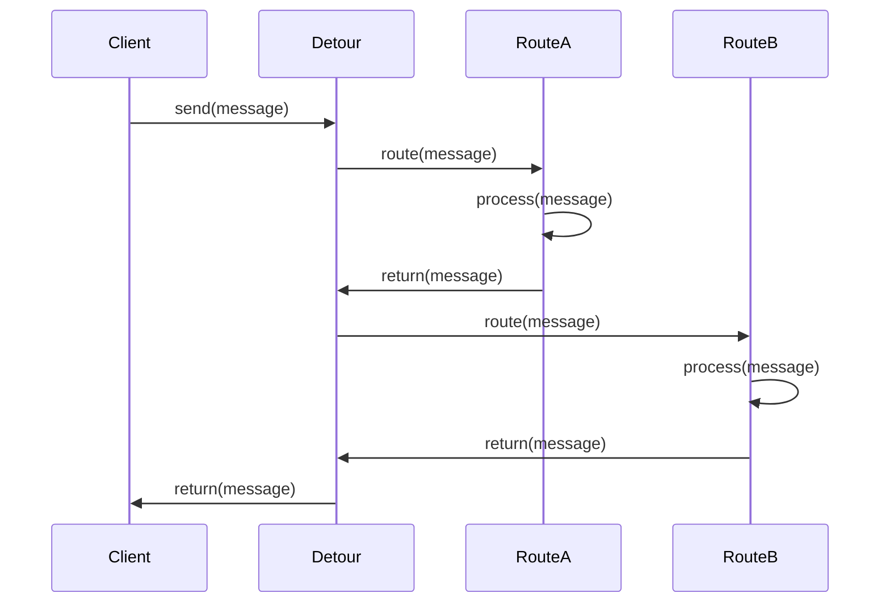

## Definition
The **Detour Pattern** routes a message through intermediate steps to perform validation, testing, or debugging functions. This pattern is used primarily for monitoring and diagnostic purposes, allowing developers to ensure the smooth functioning of the message flow without disrupting the main processing pipeline.

## Intent
The intent of the Detour Pattern is to provide a mechanism for temporarily diverting messages through additional processing steps for validation, debugging, or testing purposes. This can be especially useful during development or when troubleshooting issues in production systems.

## Also Known As
- Bypass
- Diagnostic Route

## Detailed Definitions and Explanations

### Key Features
1. **Temporary Routing**: Messages can be rerouted through additional processes without permanent changes.
2. **Flexibility**: Enables dynamic inclusion of validation and testing steps.
3. **Non-Intrusive**: Does not alter the original message structure or the core processing logic.

### Example Class Diagram
Here is a class diagram illustrating the Detour Pattern:

```mermaid
classDiagram
    Class Detour {
        - originalRoute : Route
        - detourRoute : Route
        + route(message:Message)
    }

    Detour --> Route
    Detour --> Message
    Route <|-- RouteA
    Route <|-- RouteB
```
**Explanation**:
- `Detour`: The detour class responsible for temporarily rerouting the message.
- `Route`: Abstract representation of a route that handles messages.
- `RouteA`, `RouteB`: Concrete routes for actual processing. These can represent validation, testing, or debugging routes.

### Example Sequence Diagram


**Explanation**:
- `Client`: Sends a message that needs temporary rerouting.
- `Detour`: Handles the rerouting of the message through `RouteA` and `RouteB`.
- `RouteA` and `RouteB`: Perform specific validation, testing, or debugging operations.

## Benefits
- Enhanced Debugging: Simplifies identification and resolution of issues.
- Temporary Validation: Validate messages without modifying the core message flow.
- Non-Disruptive: Ensures that core message processing remains unaffected.

## Trade-Offs
- Additional Latency: Increases the time taken for message processing due to extra steps.
- Complexity: Adds extra complexity to the routing logic.
- Resource Utilization: Utilizes additional computational resources.

## When to Use
- To validate or test messages during development and debugging.
- When you need to establish diagnostic steps in a live system without disruptive impacts.
- For temporarily activating additional routes for specific messages.

## Example Use Cases
- Message content validation in an application that processes financial transactions.
- Debugging and testing specific types of messages in a microservice architecture.
- Monitoring and logging specific messages without altering the main processing flow.

## When Not to Use and Anti-Patterns
- When the detour processing significantly degrades system performance.
- If the detour introduces substantial complexity into the system.
- Persistent detours leading to anti-patterns such as "Tunnel Vision," where such detours become deeply rooted in the architecture.

## Related Design Patterns
- **Message Router**: The overarching pattern that determines the route for a message based on routing logic.
- **Message Filter**: Used to filter out unwanted messages; can be complementary to Detour when combined with selective routing for debugging.

## References and Credits
- *Enterprise Integration Patterns*: Gregor Hohpe and Bobby Woolf
- [Apache Camel](https://camel.apache.org/)
- [Spring Integration](https://spring.io/projects/spring-integration)
- [MuleSoft](https://www.mulesoft.com/)
- [Akka](https://akka.io/)

## Open Source Frameworks and Tools
- **Apache Camel**: A robust integration framework that supports message routing, including detours.
- **Spring Integration**: Provides support for enterprise integration patterns within the Spring ecosystem.
- **MuleSoft**: A lightweight Java-based Enterprise Service Bus (ESB) and integration framework.

## Cloud Computing and SaaS Integration
With the rise of cloud computing platforms (SaaS, PaaS, IaaS), the Detour Pattern is increasingly relevant for their diagnostic and monitoring functionalities.

## Suggested Books for Further Studies
- [Enterprise Integration Patterns: Designing, Building, and Deploying Messaging Solutions](https://amzn.to/3XXncn8) by Gregor Hohpe and Bobby Woolf
- *Programming Scala* by Dean Wampler, Alex Payne
- *Spring in Action* by Craig Walls
