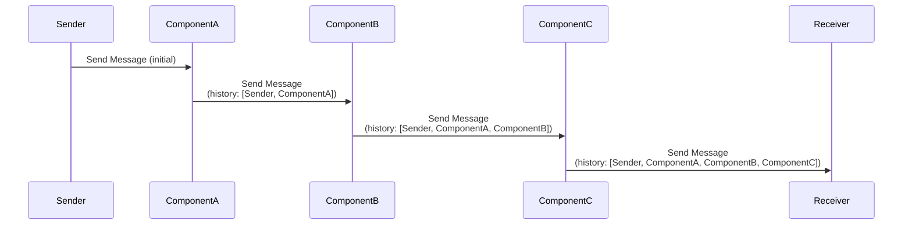
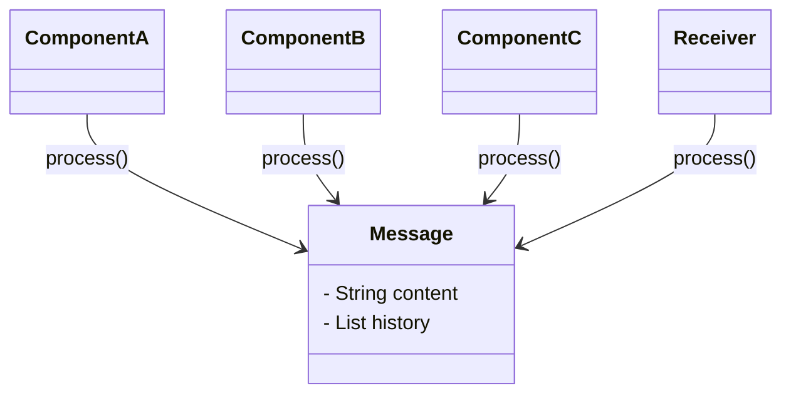

## Definition

The **Message History** pattern allows tracking of the flow of messages in a loosely coupled system by attaching a history to each message. This history records all components that the message has passed through, facilitating analysis and debugging.

## Intent

To effectively analyze and debug the flow of messages in a loosely coupled system by appending a history of all components that the message has traversed.

## Also Known As

- Message Trace

## Detailed Explanation with Mermaid Diagram

The Message History maintains a list of all components that the message passed through since its origination. Every component that processes the message (including the originator) adds one entry to the list. The Message History should be part of the message header because it contains system-specific control information. Keeping this information in the header separates it from the message body that contains application-specific data.

### Key Features

1. **Traceability:** Allows tracking the path of messages through the system.
2. **Debugging:** Simplifies the process of identifying where an issue occurred in the flow of messages.
3. **Auditability:** Maintains a record of all components that have processed the message.

### Example Workflow



## Code Examples
### Java with Apache Camel

```java
from("direct:start")
    .process(exchange -> {
        List<String> history = exchange.getMessage().getHeader("MessageHistory", new ArrayList<>(), List.class);
        history.add("ComponentA");
        exchange.getMessage().setHeader("MessageHistory", history);
    })
    .to("direct:componentB");

from("direct:componentB")
    .process(exchange -> {
        List<String> history = exchange.getMessage().getHeader("MessageHistory", new ArrayList<>(), List.class);
        history.add("ComponentB");
        exchange.getMessage().setHeader("MessageHistory", history);
    })
    .to("direct:componentC");

from("direct:componentC")
    .process(exchange -> {
        List<String> history = exchange.getMessage().getHeader("MessageHistory", new ArrayList<>(), List.class);
        history.add("ComponentC");
        exchange.getMessage().setHeader("MessageHistory", history);
    })
    .to("mock:result");
```

### Scala with Akka

```scala
import akka.actor.Actor
import akka.actor.ActorSystem
import akka.actor.Props

case class Message(content: String, history: List[String])

class ComponentA extends Actor {
  def receive = {
    case Message(content, history) =>
      val newHistory = history :+ "ComponentA"
      context.actorSelection("../componentB") ! Message(content, newHistory)
  }
}

class ComponentB extends Actor {
  def receive = {
    case Message(content, history) =>
      val newHistory = history :+ "ComponentB"
      context.actorSelection("../componentC") ! Message(content, newHistory)
  }
}

class ComponentC extends Actor {
  def receive = {
    case Message(content, history) =>
      val newHistory = history :+ "ComponentC"
      context.actorSelection("../receiver") ! Message(content, newHistory)
  }
}

class Receiver extends Actor {
  def receive = {
    case Message(content, history) =>
      println(s"Received message with history: $history")
  }
}

val system = ActorSystem("MessageHistorySystem")
val componentA = system.actorOf(Props[ComponentA], "componentA")
val componentB = system.actorOf(Props[ComponentB], "componentB")
val componentC = system.actorOf(Props[ComponentC], "componentC")
val receiver = system.actorOf(Props[Receiver], "receiver")

componentA ! Message("Start Processing", List("Sender"))
```

### Example Class Diagram


## Benefits
- **Enhanced Debugging:** Facilitates easy identification of where an issue occurred in the message flow.
- **Improved Traceability:** Enables comprehensive tracking of message paths within the system.
- **Better Auditability:** Maintains a record for audit purposes.

## Trade-offs
- **Increased Message Size:** Adds overhead to the message size due to the additional history information.
- **Processing Overhead:** Requires each component to update the message history, adding to processing time.

## When to Use
- **Complex Systems:** Use this pattern in systems with complex message flows where understanding the path of messages is crucial.
- **Debugging Needs:** When there is a need to quickly identify and debug issues related to message processing.


## Example Use Cases
- **Order Processing Systems:** Track down where an order got delayed or failed.
- **Financial Services:** Trace the path of transactions for compliance and debugging.
- **Event-Driven Architectures:** Analyze the flow of events through different microservices.

## When Not to Use and Anti-patterns
- **Simplistic Flows:** Not needed for straightforward, linear message processing flows.
- **Overhead Sensitivity:** Avoid in systems where message size and processing time are critical constraints.

## Related Design Patterns
- **Correlation Identifier:** Helps in matching related messages over a period.
- **Message Store:** Allows for storing messages for retrieval and analysis.

## References
- [Enterprise Integration Patterns: Designing, Building, and Deploying Messaging Solutions](https://amzn.to/3XXncn8) by Gregor Hohpe and Bobby Woolf.

## Credits
- Inspired by the work of Gregor Hohpe and Bobby Woolf in their book "Enterprise Integration Patterns."

## Open Source Frameworks
- **Apache Camel:** Provides a rich set of patterns for creating integration solutions.
- **Akka:** Offers actor-based concurrency model suitable for building message-driven systems.

## Cloud Computing, SAAS, DAAS, PAAS
- **Amazon MQ:** Fully managed message broker service for Apache ActiveMQ.
- **Azure Service Bus:** Reliable cloud messaging as a service.
- **Google Pub/Sub:** Scalable messaging middleware for event-driven systems.

## Suggested Books for Further Studies
- [Enterprise Integration Patterns: Designing, Building, and Deploying Messaging Solutions](https://amzn.to/3XXncn8) by Gregor Hohpe and Bobby Woolf.
- [Designing Data-Intensive Applications](https://amzn.to/4cuX2Na) by Martin Kleppmann.