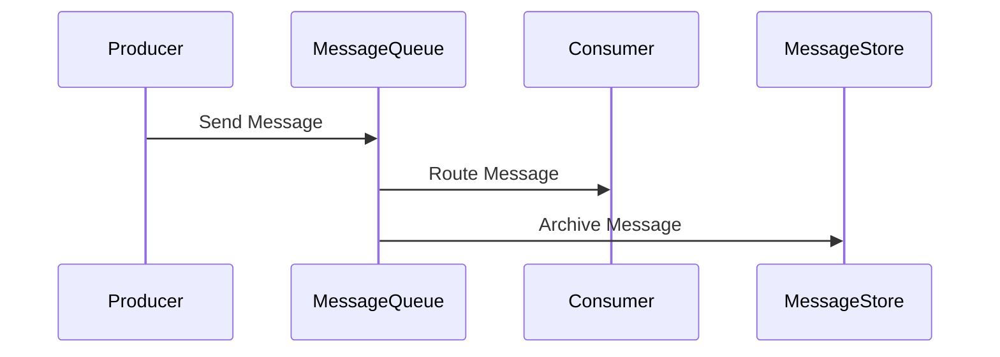
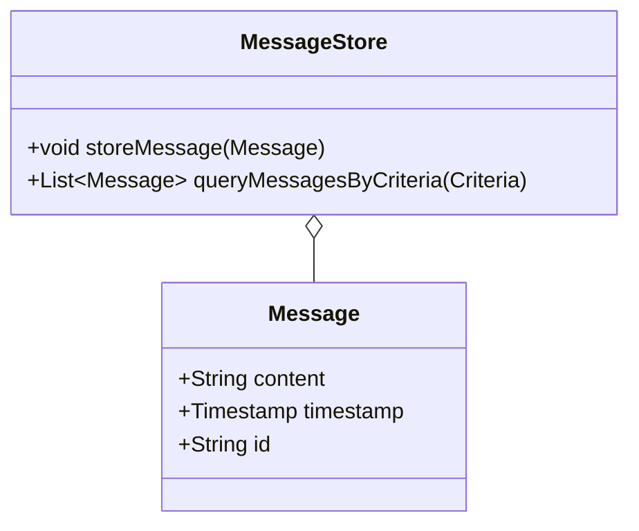

## Message Store
### Definition
The Message Store pattern captures the messages flowing through a messaging system and stores them in a repository where they can be archived, indexed, and queried without affecting the system’s operation.

### Intent
To retain a history of all messages exchanged within the system to facilitate reporting, auditing, and troubleshooting, without interfering with the real-time processing and routing of messages.

### Also Known As
- Message Archive
- Message Repository

### Detailed Explanation and Mermaid Diagram
The Message Store Pattern allows an enterprise to keep an ordered, query-able record of all messages sent through its messaging system. This record allows for analytics and troubleshooting in a manner that complements a loosely coupled system.

Here is a simplified representation in sequence diagram:



### Key Features
- **Persistence**: Stores messages in a persistent store, which can be a database or a file system.
- **Query Capability**: Allows querying of message history for reporting, auditing, and debugging.
- **Decoupling**: Operates independently from the real-time message routing system.

### Code Examples
#### Java with Apache Camel
Here is how you can implement a Message Store using Apache Camel in Java:

```java
import org.apache.camel.builder.RouteBuilder;
import org.apache.camel.main.Main;

public class MessageStoreRoute extends RouteBuilder {
    public static void main(String[] args) throws Exception {
        Main main = new Main();
        main.addRouteBuilder(new MessageStoreRoute());
        main.run(args);
    }

    @Override
    public void configure() {
        from("jms:queue:input")
            .to("jpa:com.example.MessageEntity")
            .to("jms:queue:output");
    }
}
```

#### Scala with Akka
Below is an example using Akka in Scala:

```scala
import akka.actor.{ Actor, ActorSystem, Props }
import akka.persistence.{ PersistentActor, SaveSnapshotSuccess, SnapshotOffer }
import scala.collection.mutable.ListBuffer

case class Message(content: String)

class MessageStoreActor extends PersistentActor {
  override def persistenceId = "message-store-actor"
  var messages = ListBuffer.empty[Message]

  def receiveCommand: Receive = {
    case message: Message =>
      persist(message) { msg =>
        messages += msg
        saveSnapshot(messages)
      }
    case SaveSnapshotSuccess(metadata) => // Handle snapshot save success
  }

  def receiveRecover: Receive = {
    case message: Message =>
      messages += message
    case SnapshotOffer(_, snapshot: ListBuffer[Message]) =>
      messages = snapshot
  }
}

object MessageStoreApp extends App {
  val system = ActorSystem("MessageStoreSystem")
  val storeActor = system.actorOf(Props[MessageStoreActor], "storeActor")

  storeActor ! Message("First message")
  storeActor ! Message("Second message")
}
```

### Example Class Diagram



### Example Sequence Diagram


### Benefits
- **Historical Auditing**: Enables auditing and troubleshooting by maintaining a persistent store of messages.
- **Data Analysis**: Facilitates reporting and analytics on message flow.
- **Decoupled Design**: Ensures that the main message processing workflow remains unaffected.

### Trade-offs
- **Storage Overhead**: Requires additional storage to archive messages.
- **Performance Impact**: May impact system performance if not designed correctly, due to the overhead of storing messages.

### When to Use
- When you need to archive messages for later auditing or reporting.
- In systems that require strict compliance and traceability.

### Example Use Cases
- Financial systems needing an audit trail of transactions.
- Applications requiring compliance with regulatory standards.
- Debugging message flow in a distributed messaging system.

### When Not to Use and Anti-Patterns
- **Not Immediate**: Avoid using this when real-time performance is more critical than historical analysis.
- **Excessive Storage Costs**: Avoid if storing messages may become too costly.

### Related Design Patterns
- **Message Deduplication**: To handle duplicate messages.
- **Message Channel**: For the transport of messages within a messaging system.

### References and Credits
- [Apache Camel Documentation](https://camel.apache.org/manual/latest/index.html)
- [Akka Persistence Documentation](https://doc.akka.io/docs/akka/current/typed/persistence.html)

### Open Source Frameworks
- **Apache Camel**: Provides integration with various endpoints including JPA for message storing.
- **Akka**: Use Akka Persistence for durable message storage.

### Cloud Computing and SAAS Solutions
- **AWS SQS**: Provides a way to manage message queuing.
- **Azure Service Bus**: Allows for reliable messaging as part of your enterprise integration solutions.

### Further Reading
- **[Enterprise Integration Patterns: Designing, Building, and Deploying Messaging Solutions](https://amzn.to/3XXncn8) by Gregor Hohpe and Bobby Woolf**: Explores various integration patterns in detail.
- **[Designing Data-Intensive Applications](https://amzn.to/4cuX2Na) by Martin Kleppmann**: Discusses robust data transaction systems.
