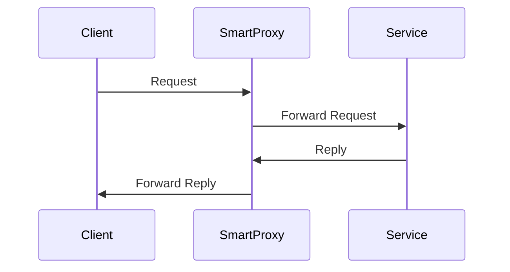
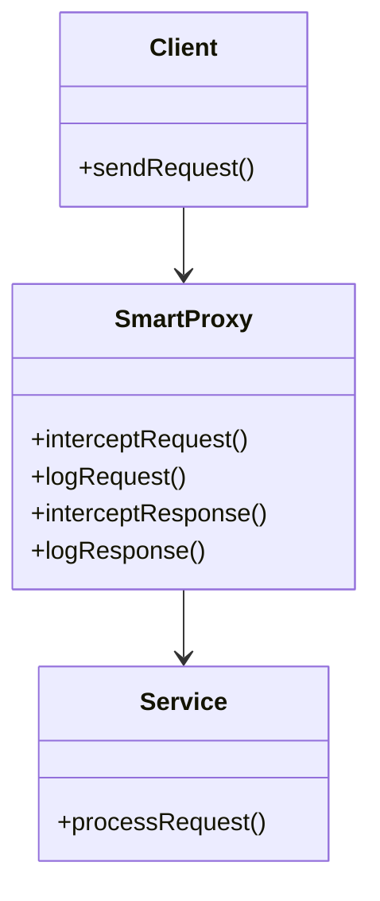
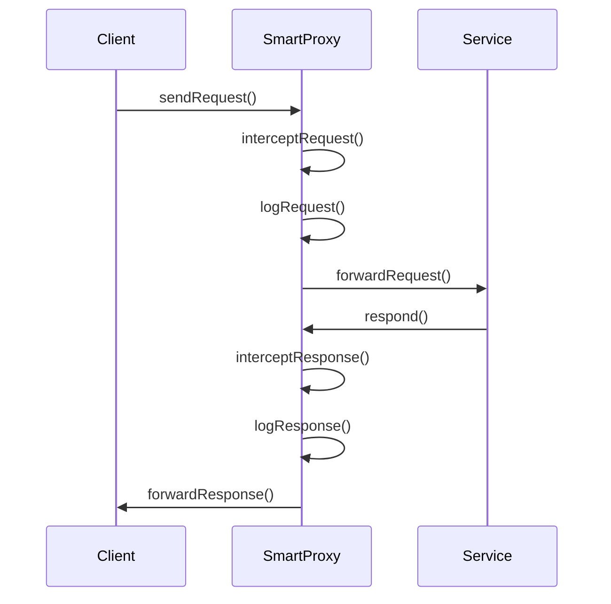

The **Smart Proxy** pattern enhances the transparency of service invocations and message traffic by intercepting requests and responses, enabling features like monitoring, logging, and adding pre/post-processing behavior.

## Intent

The main intent of the Smart Proxy pattern is to provide a mechanism through which incoming and outgoing service messages can be managed more effectively. This is done by placing a "smart" intermediary that can log, augment, or redirect these messages as needed.

## Also Known As

- Transparent Proxy
- Enhanced Proxy

## Detailed Explanation

Smart Proxy serves as an intermediary layer between the client and service. It adds capabilities like logging, adaptive routing, and transformations without modifying the client and server.



### Key Features

1. **Interception**: Ability to intercept requests and responses.
2. **Monitoring and Logging**: Logs all interactions for monitoring purposes.
3. **Pre/Post Processing**: Adds preprocessing or postprocessing logic.
4. **Security**: Can include security checks and validations.
5. **Redirection**: Can dynamically route messages to different services as needed.

### Code Examples

### Java Example using Spring AOP

```java
package com.example.smartproxy;

import org.aspectj.lang.annotation.AfterReturning;
import org.aspectj.lang.annotation.Aspect;
import org.aspectj.lang.annotation.Before;
import org.springframework.stereotype.Component;

@Aspect
@Component
public class SmartProxyAspect {

    @Before("execution(* com.example.service.*.*(..))")
    public void logBefore() {
        System.out.println("Request intercepted and logged by Smart Proxy");
    }

    @AfterReturning(pointcut = "execution(* com.example.service.*.*(..))", returning = "result")
    public void logAfterReturning(Object result) {
        System.out.println("Response intercepted and logged by Smart Proxy");
    }
}
```

### Scala Example using Akka

```scala
import akka.actor.Actor
import akka.actor.ActorLogging
import akka.actor.ActorRef
import akka.actor.Props

class SmartProxy(next: ActorRef) extends Actor with ActorLogging {
  def receive = {
    case request =>
      log.info(s"Request intercepted: $request")
      next.tell(request, sender())
    case response =>
      log.info(s"Response intercepted: $response")
      sender().tell(response, self)
  }
}

object SmartProxy {
  def props(next: ActorRef): Props = Props(new SmartProxy(next))
}
```

### Example Class Diagram



### Example Sequence Diagram



## Benefits

1. **Transparency**: Improves transparency between service interactions.
2. **Non-Intrusive**: No need to alter existing services or clients.
3. **Flexibility**: Easily add extra functionalities like logging, security checks, etc.
4. **Centralized Management**: Manages message tracking effectively in one place.

## Trade-offs

1. **Performance Overhead**: The additional processing might introduce latency.
2. **Complexity**: Adds extra complexity to the architecture.
3. **Single Point of Failure**: The proxy becomes a critical point that might affect the entire system if it fails.

## When to Use

- When you need to add logging or monitoring without altering the existing services.
- When you need to enforce security policies dynamically.
- Centralized management of request and response handling.

## Example Use Cases

- API Gateways for microservices architectures.
- Intercepting and adapting requests for third-party services.
- Implementing security checks across various services.

## When Not to Use

- When the added latency is unacceptable.
- In simple systems where the authoring complexity outweighs benefits.
- When existing tools handle your security and logging requirements.

## Related Design Patterns

- **Proxy Pattern**: A more general pattern that introduces a surrogate or placeholder.
- **Decorator Pattern**: Adds additional functionalities to an object dynamically.
- **Chain of Responsibility**: For more complex message processing requiring multiple stages.

## References

- [Enterprise Integration Patterns: Designing, Building, and Deploying Messaging Solutions](https://amzn.to/3XXncn8) by Gregor Hohpe, Bobby Woolf
- Spring Framework documentation
- Akka documentation

## Credits

- Gregor Hohpe and Bobby Woolf for formalizing many Enterprise Integration Patterns.
- Open-source communities of Apache Camel, Spring, and Akka.

## Open Source Frameworks

- **Apache Camel**: http://camel.apache.org
- **Spring Framework**: https://spring.io/
- **Akka**: https://akka.io/

## Cloud Computing

### SaaS, PaaS, and IaaS

Smart Proxy implementations can be used effectively in cloud environments for enhanced security, load distribution, and monitoring.

## Suggested Books for Further Studies

- [Enterprise Integration Patterns](https://www.enterpriseintegrationpatterns.com/) by Gregor Hohpe, Bobby Woolf
- [Designing Data-Intensive Applications](https://dataintensive.net/) by Martin Kleppmann

---

The **Smart Proxy** pattern is an effective way to add transparency and monitoring without intrusive changes to existing client and service systems. When implemented correctly, it provides robust logging, session handling, adaptive routing, and security enforcement with manageable trade-offs.
