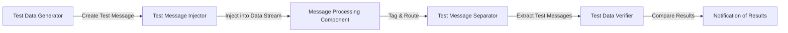

## Definition

The **Test Message** pattern helps in assuring the health and reliability of message processing components by injecting test messages into the regular data stream and verifying the outcomes.

## Intent

To validate and ensure the reliability of message processing components by sending test messages and analyzing their processing through various stages.

## Also Known As

- Message Health Check

## Detailed Explanation with Mermaid Diagram

The Test Message pattern relies on a series of components working together:

1. **Test Data Generator:** Creates messages to be sent to the component for testing. The test data can be constant, driven by a test data file, or generated randomly.
2. **Test Message Injector:** Inserts test data into the regular stream of data messages. It tags the messages to differentiate between 'real' and test messages, typically by adding a special header field.
3. **Test Message Separator:** Extracts the results of test messages from the output stream using a Content-Based Router.
4. **Test Data Verifier:** Compares actual results with expected results and flags discrepancies.

### Components and Workflow



## Key Features
- **Automated Testing:** Facilitates automated health checks of message processing components.
- **Tagging:** Differentiates between test and actual messages, allowing for seamless integration and monitoring.
- **Verification:** Ensures the accuracy of message processing by comparing actual versus expected results.

## Code Examples

### Java with Apache Camel

```java
from("direct:testDataGenerator")
    .process(exchange -> {
        // Generate Test Data
        exchange.getIn().setBody("Test Message");
        exchange.getIn().setHeader("TestMessage", true);
    })
    .to("direct:testMessageInjector");

from("direct:testMessageInjector")
    .to("direct:processMessage");

from("direct:processMessage")
    .choice()
        .when(header("TestMessage").isEqualTo(true))
            .to("direct:testMessageSeparator")
        .otherwise()
            .to("direct:realMessageProcessor");

from("direct:testMessageSeparator")
    .to("direct:testDataVerifier");

from("direct:testDataVerifier")
    .process(exchange -> {
        // Verify Test Data
        String body = exchange.getIn().getBody(String.class);
        if (!"Expected Output".equals(body)) {
            throw new Exception("Test Data Verification Failed");
        }
    });
```

### Scala with Akka

```scala
import akka.actor.Actor
import akka.actor.ActorSystem
import akka.actor.Props

case class TestMessage(content: String)
case class RealMessage(content: String)

class TestMessageInjector extends Actor {
  def receive = {
    case "GenerateTestMessage" =>
      context.actorSelection("../messageProcessor") ! TestMessage("Test Message")
  }
}

class MessageProcessor extends Actor {
  def receive = {
    case TestMessage(content) =>
      context.actorSelection("../testMessageSeparator") ! TestMessage(s"Processed $content")
    case RealMessage(content) =>
      // Process Real Message
      println(s"Processed real message: $content")
  }
}

class TestMessageSeparator extends Actor {
  def receive = {
    case TestMessage(content) =>
      context.actorSelection("../testDataVerifier") ! TestMessage(content)
  }
}

class TestDataVerifier extends Actor {
  def receive = {
    case TestMessage(content) =>
      if (content != "Processed Expected Output") {
        throw new Exception("Test Data Verification Failed")
      }
  }
}

val system = ActorSystem("TestMessageSystem")
val testMessageInjector = system.actorOf(Props[TestMessageInjector], "testMessageInjector")
val messageProcessor = system.actorOf(Props[MessageProcessor], "messageProcessor")
val testMessageSeparator = system.actorOf(Props[TestMessageSeparator], "testMessageSeparator")
val testDataVerifier = system.actorOf(Props[TestDataVerifier], "testDataVerifier")

testMessageInjector ! "GenerateTestMessage"
```

### Example Class Diagram 

```mermaid
clssDiagram
    class TestMessage {
        - String content
    }
    class RealMessage {
        - String content
    }
    class TestDataGenerator
    class TestMessageInjector
    class MessageProcessor
    class TestMessageSeparator
    class TestDataVerifier

    TestDataGenerator --> TestMessageInjector : generate()
    TestMessageInjector --> MessageProcessor : inject()
    MessageProcessor : process()
    MessageProcessor --> TestMessageSeparator : process()
    TestMessageSeparator --> TestDataVerifier : separate()
    TestDataVerifier : verify()
  ```


## Benefits
Continuous Monitoring: Ensures continuous health monitoring of message processing components.
Isolation of Issues: Helps isolate and identify processing issues early.
Automated Testing: Reduces the need for manual intervention in testing message flows.

## Trade-offs
Overhead: Introduces additional processing overhead due to the insertion and separation of test messages.
Complexity: Adds complexity to the message processing workflow.

## When to Use
- **Large Systems:** Suitable for large systems with numerous message processing components.
- **Critical Systems:** Ideal for systems where message processing accuracy is critical.
- **Continuous Integration:** Useful in setups that require continuous integration and testing.

## Example Use Cases
- **Financial Transactions:** Ensuring the integrity of transaction processing systems.
- **Order Fulfillment:** Verifying that order messages are processed correctly.
- **Real-Time Data Processing:** Constantly testing real-time data processing pipelines.

## When Not to Use and Anti-patterns
- **Low Volume Systems:** Not necessary for systems with low message volumes and simple processing requirements.
- **Latency Sensitive Applications:** Avoid in systems where even slight increases in processing time due to testing can cause issues.

## Related Design Patterns
- **Heartbeat:** Sends periodic signals to ensure components are alive but does not verify processing correctness.
- **Ping Test:** Verifies the availability of components without actual data processing.

## References
- [Enterprise Integration Patterns: Designing, Building, and Deploying Messaging Solutions](https://amzn.to/3XXncn8) by Gregor Hohpe and Bobby Woolf.

## Credits
- Inspired by the principles laid out in [Enterprise Integration Patterns: Designing, Building, and Deploying Messaging Solutions](https://amzn.to/3XXncn8) by Gregor Hohpe and Bobby Woolf.

## Open Source Frameworks
- **Apache Camel:** Provides a robust framework for integrating the Test Message pattern into existing workflows.
- **Akka:** Facilitates actor-based testing implementations in distributed systems.

## Cloud Computing, SAAS, DAAS, PAAS
- **Amazon MQ:** Fully managed message broker service for Apache ActiveMQ.
- **Azure Service Bus:** Reliable cloud messaging service with rich support for testing and monitoring.
- **Google Pub/Sub:** Provides scalable messaging middleware with capabilities for integrating test message patterns.

## Suggested Books for Further Studies
- [Enterprise Integration Patterns: Designing, Building, and Deploying Messaging Solutions](https://amzn.to/3XXncn8) by Gregor Hohpe and Bobby Woolf.
- [Designing Data-Intensive Applications](https://amzn.to/4cuX2Na) by Martin Kleppmann.
