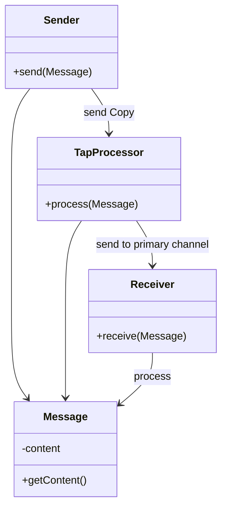
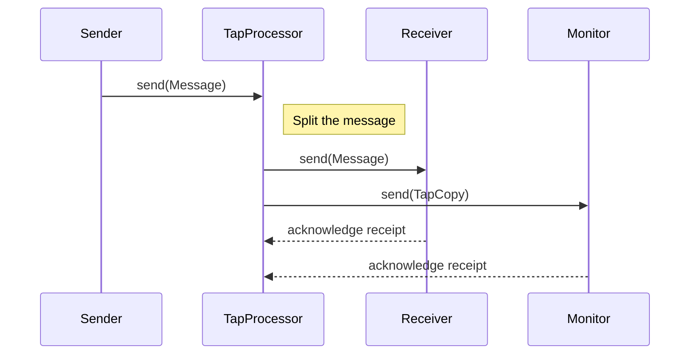

## Wire Tap

### Definition
The **Wire Tap** pattern allows messages that travel on a point-to-point channel to be inspected. It achieves this by duplicating the original message stream, sending one copy to its intended destination and another to a `tap` channel for monitoring, logging, auditing, or analytics purposes.

### Intent
To enable the non-intrusive inspection of messages as they traverse a messaging infrastructure without affecting the primary message flow.

### Also Known As
- Message Copied Channel
- Message Inspection

### Detailed Explanation

#### Key Features
- Non-intrusive: It does not interfere with the primary message process.
- Parallel Processing: It enables the concurrent inspection and logging of messages.
- Flexibility: It can be used in various contexts like debugging, monitoring, or auditing.
- Transparency: The end application remains unaffected by the tapping process.

### Diagrams

**Class Diagram**



**Sequence Diagram**



### Code Examples

#### Java - Apache Camel

```java
import org.apache.camel.builder.RouteBuilder;
import org.apache.camel.main.Main;

public class WireTapExample extends RouteBuilder {
    public static void main(String[] args) throws Exception {
        Main main = new Main();
        main.addRouteBuilder(new WireTapExample());
        main.run(args);
    }

    @Override
    public void configure() throws Exception {
        from("direct:start")
            .wireTap("log:monitor")
            .to("seda:end");
    }
}
```

#### Scala - Akka Streams 

```scala
import akka.actor.ActorSystem
import akka.stream.scaladsl.{Sink, Source, Broadcast, Flow}
import akka.stream.{FlowShape, ActorMaterializer}

object WireTapExample extends App {
  implicit val system = ActorSystem("WireTapExample")
  implicit val materializer = ActorMaterializer()

  val source = Source(List("message1", "message2", "message3"))

  val tapFlow = Flow.fromGraph(GraphDSL.create() { implicit builder =>
    import GraphDSL.Implicits._

    val broadcast = builder.add(Broadcast[String](2))
    val tap = Flow[String].map { msg =>
      println(s"Logging msg: $msg")
      msg
    }

    broadcast.out(1) ~> tap ~> Sink.ignore
    FlowShape(broadcast.in, broadcast.out(0))
  })

  source.via(tapFlow).to(Sink.foreach(msg => println(s"Processing msg: $msg"))).run()
}
```

### Benefits
- **Observability**: Improves system monitoring and diagnostics.
- **Non-disruptive**: Does not interfere with the actual message processing path.
- **Real-time**: Facilitates real-time logging and monitoring.

### Trade-offs
- **Performance impact**: Adds some overhead due to message copying and additional logging.
- **Complexity**: Increases the complexity of message routes and configurations.

### When to Use
- Debugging message flows
- Monitoring and logging message traffic
- Auditing messages for compliance and security reasons

### Example Use Cases
- Financial transactions monitoring
- Compliance in regulatory environments
- Real-time analytics in event-driven systems

### When Not to Use and Anti-patterns
- When system performance is highly critical and cannot afford additional overhead
- Directly modifying or blocking messages in the wire tap is an anti-pattern

### Related Design Patterns
- **Message Filter**: Inspects and selectively routes messages based on content or properties.
- **Message Router**: Directs messages to different destinations based on specified criteria.

### References and Credits
- [Enterprise Integration Patterns: Designing, Building, and Deploying Messaging Solutions by Gregor Hohpe and Bobby Woolf](https://www.enterpriseintegrationpatterns.com/)
- [Apache Camel Documentation](https://camel.apache.org/)
- [Akka Streams Documentation](https://doc.akka.io/docs/akka/current/stream/)

### Open Source Frameworks and Tools
- Apache Camel
- Spring Integration
- Akka Streams
- MuleSoft

### Cloud Computing Integration
- **SaaS**: Integration monitoring for cloud services.
- **PaaS**: Logging and tracking communications in platform offerings.
- **DaaS**: Ensuring data governance and compliance in hosted environments.

### Suggested Books for Further Studies
- [Enterprise Integration Patterns: Designing, Building, and Deploying Messaging Solutions](https://amzn.to/3XXncn8) by Gregor Hohpe and Bobby Woolf
- *Camel in Action* by Claus Ibsen and Jonathan Anstey
- [Designing Data-Intensive Applications](https://amzn.to/4cuX2Na) by Martin Kleppmann
