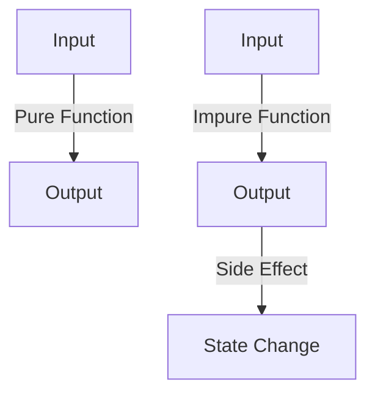
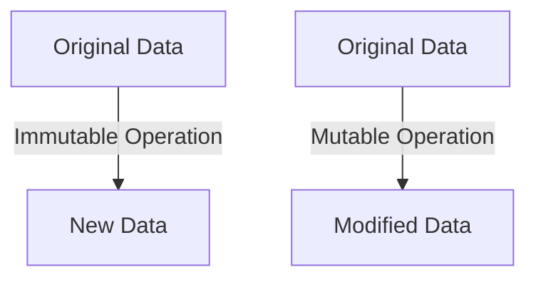

## 1.1. What Is Functional Programming?

Functional Programming (FP) is a programming paradigm that treats computation as the evaluation of mathematical functions and avoids changing state or mutable data. It emphasizes the application of functions, in contrast to the imperative programming paradigm, which emphasizes changes in state and the execution of sequences of commands. In this section, we will delve into the foundational principles of functional programming, explore its historical evolution, and compare it with imperative programming paradigms.

### Definition and Key Concepts

#### Understanding the Foundational Principles of Functional Programming

Functional programming is built on several core principles that differentiate it from other programming paradigms. Let's explore these principles in detail:

1. **Pure Functions**: A pure function is a function where the output value is determined only by its input values, without observable side effects. This means that calling a pure function with the same arguments will always produce the same result. Pure functions are the building blocks of functional programming, promoting predictability and reliability.

   ```pseudocode
   function add(a, b):
       return a + b
   ```

   In the above pseudocode, `add` is a pure function because it consistently returns the same result for the same input values.

2. **Immutability**: In functional programming, data is immutable, meaning it cannot be changed once created. Instead of modifying existing data, new data structures are created. This approach reduces bugs related to shared state and makes concurrent programming more manageable.

   ```pseudocode
   originalList = [1, 2, 3]
   newList = originalList.append(4)  // originalList remains unchanged
   ```

3. **First-Class and Higher-Order Functions**: Functions are first-class citizens in functional programming, meaning they can be passed as arguments to other functions, returned as values from other functions, and assigned to variables. Higher-order functions are functions that take other functions as arguments or return them as results.

   ```pseudocode
   function applyFunction(func, value):
       return func(value)

   function square(x):
       return x * x

   result = applyFunction(square, 5)  // result is 25
   ```

4. **Recursion Over Iteration**: Functional programming often uses recursion as a primary mechanism for looping. Recursive functions call themselves with modified arguments until a base condition is met.

   ```pseudocode
   function factorial(n):
       if n == 0:
           return 1
       else:
           return n * factorial(n - 1)
   ```

5. **Lazy Evaluation**: This is a technique where expressions are not evaluated until their values are needed. Lazy evaluation can improve performance by avoiding unnecessary calculations.

   ```pseudocode
   function lazySum(a, b):
       return () => a + b

   sum = lazySum(3, 4)
   result = sum()  // result is 7, evaluated when called
   ```

### History and Evolution of Functional Programming

Functional programming has a rich history that dates back to the early days of computer science. Understanding its evolution helps appreciate its current relevance and applications.

#### Origins of Functional Programming

Functional programming's roots can be traced back to the 1930s with the development of lambda calculus by Alonzo Church. Lambda calculus is a formal system in mathematical logic for expressing computation based on function abstraction and application. It laid the theoretical foundation for functional programming languages.

In the 1950s and 1960s, John McCarthy developed Lisp, one of the earliest programming languages, which incorporated many functional programming concepts. Lisp introduced the idea of treating code as data and data as code, a concept known as homoiconicity, which is central to many functional languages.

#### Development Over Time

The 1970s and 1980s saw the development of several functional programming languages, including ML and Scheme. These languages introduced features such as type inference and pattern matching, which are now common in modern functional languages.

Haskell, a purely functional programming language, was developed in the late 1980s and early 1990s. It introduced advanced type systems and lazy evaluation, influencing many subsequent languages.

In recent years, functional programming has gained popularity due to its suitability for concurrent and parallel programming. Languages like Scala, Clojure, and Elixir have brought functional programming concepts to the forefront of modern software development.

### Comparing Functional and Imperative Programming Paradigms

To fully appreciate functional programming, it's essential to compare it with the more traditional imperative programming paradigm.

#### Key Differences

1. **State Management**: Imperative programming relies on changing state and mutable data, whereas functional programming emphasizes immutability and statelessness.

2. **Control Structures**: Imperative programming uses loops and conditionals to control program flow, while functional programming relies on recursion and higher-order functions.

3. **Side Effects**: Imperative programming often involves side effects, such as modifying global variables or performing I/O operations. Functional programming aims to minimize side effects, making code more predictable and easier to test.

4. **Modularity and Reusability**: Functional programming promotes modularity through pure functions and higher-order functions, making code more reusable and composable.

#### Benefits of Functional Programming

Functional programming offers several advantages over imperative programming:

- **Predictability**: Pure functions and immutability lead to more predictable code, reducing bugs and making debugging easier.
- **Concurrency**: Immutability and statelessness simplify concurrent programming, as there are no shared states to manage.
- **Modularity**: Higher-order functions and function composition promote modular and reusable code.
- **Maintainability**: Functional code is often easier to read and maintain due to its declarative nature.

### Visualizing Functional Programming Concepts

To better understand the differences between functional and imperative programming, let's visualize some key concepts using Mermaid.js diagrams.

#### Pure Functions vs. Impure Functions



**Caption**: This diagram illustrates the difference between pure and impure functions. Pure functions produce output solely based on input, while impure functions may cause side effects, such as state changes.

#### Immutability vs. Mutability



**Caption**: This diagram shows the difference between immutable and mutable operations. Immutable operations create new data structures, while mutable operations modify existing ones.

### Try It Yourself

To deepen your understanding of functional programming, try modifying the code examples provided. Experiment with creating your own pure functions, implementing recursion, and using higher-order functions. Consider how you can apply these concepts to your current projects.

### References and Links

For further reading on functional programming, consider exploring the following resources:

- [MDN Web Docs on Functional Programming](https://developer.mozilla.org/en-US/docs/Glossary/Functional_programming)
- [Haskell Programming Language](https://www.haskell.org/)
- [Lisp Programming Language](https://en.wikipedia.org/wiki/Lisp_(programming_language))

### Knowledge Check

As you progress through this guide, periodically test your understanding with questions and challenges. Reflect on how functional programming principles can be applied to solve real-world problems.

### Embrace the Journey

Remember, mastering functional programming is a journey. As you continue to explore and experiment with these concepts, you'll gain a deeper understanding of how they can enhance your software development practices. Stay curious, keep learning, and enjoy the process of becoming a more proficient functional programmer.

## Quiz Time!



### What is a pure function?

- [x] A function that returns the same result for the same inputs without side effects.
- [ ] A function that can modify global variables.
- [ ] A function that relies on external state.
- [ ] A function that performs I/O operations.

> **Explanation:** A pure function is defined by its ability to return consistent results for the same inputs and not produce side effects.

### What is immutability in functional programming?

- [x] The concept that data cannot be changed once created.
- [ ] The ability to modify data in place.
- [ ] The use of global variables.
- [ ] The reliance on mutable state.

> **Explanation:** Immutability means that once data is created, it cannot be changed, promoting stability and predictability in code.

### What is a higher-order function?

- [x] A function that takes other functions as arguments or returns them as results.
- [ ] A function that performs arithmetic operations.
- [ ] A function that modifies global state.
- [ ] A function that only works with primitive data types.

> **Explanation:** Higher-order functions operate on other functions, either by taking them as arguments or returning them.

### What is the main advantage of using recursion over iteration in functional programming?

- [x] It aligns with the functional programming paradigm of using functions for control flow.
- [ ] It is always more efficient than iteration.
- [ ] It allows for modifying global state.
- [ ] It is easier to implement than loops.

> **Explanation:** Recursion is favored in functional programming because it fits the paradigm's emphasis on functions and immutability.

### What is lazy evaluation?

- [x] Delaying the evaluation of an expression until its value is needed.
- [ ] Evaluating all expressions immediately.
- [ ] Ignoring certain expressions.
- [ ] Evaluating expressions in parallel.

> **Explanation:** Lazy evaluation defers computation until necessary, which can improve performance by avoiding unnecessary calculations.

### Which of the following is a benefit of functional programming?

- [x] Predictability due to pure functions and immutability.
- [ ] Easier management of mutable state.
- [ ] Reliance on global variables.
- [ ] Frequent side effects.

> **Explanation:** Functional programming's use of pure functions and immutability leads to more predictable and reliable code.

### What is the historical significance of lambda calculus in functional programming?

- [x] It provided the theoretical foundation for functional programming languages.
- [ ] It was a programming language developed in the 1980s.
- [ ] It introduced object-oriented programming concepts.
- [ ] It was used to develop the first computer.

> **Explanation:** Lambda calculus, developed by Alonzo Church, laid the groundwork for functional programming by formalizing function abstraction and application.

### How does functional programming handle state management differently from imperative programming?

- [x] By emphasizing immutability and statelessness.
- [ ] By using global variables extensively.
- [ ] By relying on mutable state.
- [ ] By frequently modifying data in place.

> **Explanation:** Functional programming manages state through immutability and statelessness, reducing complexity and potential errors.

### What is the role of Lisp in the history of functional programming?

- [x] It was one of the earliest languages to incorporate functional programming concepts.
- [ ] It introduced object-oriented programming.
- [ ] It was the first language to use loops.
- [ ] It was developed in the 1990s.

> **Explanation:** Lisp, developed in the 1950s, was one of the first languages to embrace functional programming concepts like homoiconicity and recursion.

### True or False: Functional programming is only useful for academic purposes and has no practical applications in modern software development.

- [ ] True
- [x] False

> **Explanation:** Functional programming is widely used in modern software development, particularly for concurrent and parallel programming, due to its emphasis on immutability and pure functions.



By understanding these foundational concepts, you are well on your way to mastering functional programming and applying its principles to create robust, maintainable, and efficient software solutions.
