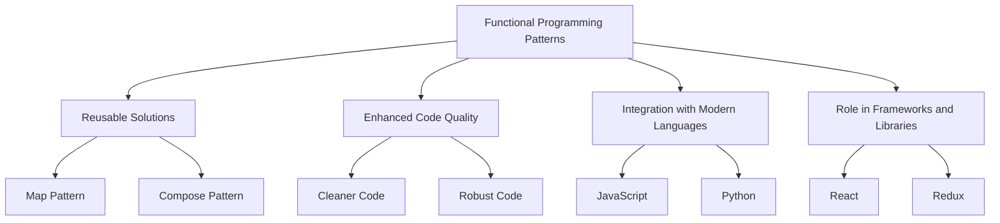

## 1.2. Importance of Functional Programming Patterns

Functional programming (FP) has emerged as a powerful paradigm for developing software that is both robust and maintainable. At the heart of FP are design patterns that provide reusable solutions to common problems, enhance code quality, and play a pivotal role in modern software development. In this section, we will delve into the importance of these patterns, exploring how they solve common problems, improve code quality, and integrate into contemporary programming languages and frameworks.

### Solving Common Problems with FP Patterns

Functional programming patterns offer a structured approach to solving recurring problems in software development. These patterns encapsulate best practices and provide a blueprint for addressing specific challenges, making them invaluable tools for developers.

#### Reusable Solutions

FP patterns are designed to be reusable, allowing developers to apply them across different projects and contexts. This reusability is a key advantage, as it reduces the time and effort required to solve similar problems repeatedly. By leveraging established patterns, developers can focus on the unique aspects of their projects, rather than reinventing the wheel.

**Example: The Map Pattern**

One of the most common FP patterns is the `map` pattern, which applies a function to each element in a collection, producing a new collection with the transformed elements. This pattern is widely used for data transformation tasks.

```pseudocode
function map(collection, transformFunction):
    result = []
    for element in collection:
        result.append(transformFunction(element))
    return result

numbers = [1, 2, 3, 4]
squaredNumbers = map(numbers, function(x) return x * x)
```

In this example, the `map` pattern provides a reusable solution for transforming collections, allowing developers to apply different transformation functions as needed.

#### Solving Complex Problems

FP patterns also excel at solving complex problems by breaking them down into smaller, more manageable components. This modular approach makes it easier to understand, test, and maintain code.

**Example: The Compose Pattern**

The `compose` pattern allows developers to combine multiple functions into a single function, enabling complex operations to be built from simpler ones.

```pseudocode
function compose(f, g):
    return function(x) return f(g(x))

function addOne(x) return x + 1
function double(x) return x * 2

addOneAndDouble = compose(double, addOne)
result = addOneAndDouble(3)  # result = 8
```

By using the `compose` pattern, developers can create complex functions by chaining simpler ones, promoting code reuse and reducing duplication.

### Enhancing Code Quality and Maintainability

Functional programming patterns contribute significantly to code quality and maintainability. They encourage the use of pure functions, immutability, and other best practices that lead to cleaner, more robust code.

#### Cleaner Code

FP patterns promote cleaner code by encouraging developers to write functions that are small, focused, and free of side effects. This leads to code that is easier to read, understand, and maintain.

**Example: Pure Functions**

Pure functions are a cornerstone of FP, as they always produce the same output for the same input and have no side effects. This predictability makes them easier to test and reason about.

```pseudocode
function pureAdd(a, b):
    return a + b

result = pureAdd(2, 3)  # result = 5
```

By using pure functions, developers can create code that is more reliable and easier to debug.

#### Robust Code

FP patterns also enhance code robustness by minimizing mutable state and side effects. This reduces the likelihood of bugs and makes it easier to reason about program behavior.

**Example: Immutability**

Immutability is a key principle in FP, as it prevents data from being modified after it is created. This leads to safer and more predictable code.

```pseudocode
function updateList(originalList, newValue):
    return originalList + [newValue]

list = [1, 2, 3]
newList = updateList(list, 4)
```

By using immutable data structures, developers can avoid common pitfalls associated with mutable state, such as race conditions and unexpected side effects.

### Functional Patterns in Modern Software Development

Functional programming patterns have become increasingly relevant in modern software development, as they align well with the demands of contemporary programming languages and frameworks.

#### Integration with Modern Languages

Many modern programming languages, such as JavaScript, Python, and Java, have embraced FP concepts and patterns. These languages provide built-in support for FP features, making it easier for developers to adopt FP patterns.

**Example: JavaScript's Array Methods**

JavaScript's array methods, such as `map`, `filter`, and `reduce`, are inspired by FP patterns and provide powerful tools for working with collections.

```pseudocode
let numbers = [1, 2, 3, 4]
let doubledNumbers = numbers.map(function(x) return x * 2)
// doubledNumbers = [2, 4, 6, 8]
```

By leveraging these built-in methods, developers can write concise and expressive code that adheres to FP principles.

#### Role in Frameworks and Libraries

FP patterns also play a crucial role in modern frameworks and libraries, which often incorporate FP concepts to improve performance, scalability, and maintainability.

**Example: React's Functional Components**

React, a popular JavaScript library for building user interfaces, embraces FP patterns through its use of functional components and hooks.

```pseudocode
function Counter():
    let [count, setCount] = useState(0)
    return (
        <div>
            <p>Count: {count}</p>
            <button onClick={() => setCount(count + 1)}>Increment</button>
        </div>
    )
```

By using functional components, React encourages developers to write stateless, pure functions that are easier to test and maintain.

### Visualizing Functional Programming Patterns

To better understand the role of functional programming patterns, let's visualize their interaction with modern software development using a flowchart.



This flowchart illustrates how functional programming patterns provide reusable solutions, enhance code quality, and integrate with modern languages and frameworks, ultimately contributing to more efficient and maintainable software development.

### Try It Yourself

To deepen your understanding of functional programming patterns, try modifying the code examples provided in this section. Experiment with different transformation functions in the `map` pattern, or create your own composed functions using the `compose` pattern. By actively engaging with these patterns, you'll gain a better appreciation for their power and versatility.

### References and Links

For further reading on functional programming patterns, consider exploring the following resources:

- [MDN Web Docs: Functional Programming](https://developer.mozilla.org/en-US/docs/Glossary/Functional_programming)
- [W3Schools: JavaScript Array Methods](https://www.w3schools.com/js/js_array_methods.asp)
- [React Documentation: Functional Components](https://reactjs.org/docs/components-and-props.html)

### Knowledge Check

Before moving on, take a moment to reflect on the key concepts covered in this section. Consider how functional programming patterns can be applied to your own projects and how they might improve code quality and maintainability.

### Embrace the Journey

Remember, this is just the beginning. As you continue to explore functional programming patterns, you'll discover new ways to solve problems and enhance your code. Keep experimenting, stay curious, and enjoy the journey!

## Quiz Time!



### What is a key advantage of functional programming patterns?

- [x] They provide reusable solutions to common problems.
- [ ] They increase code complexity.
- [ ] They require more memory.
- [ ] They are only applicable to functional languages.

> **Explanation:** Functional programming patterns offer reusable solutions, making it easier to solve common problems efficiently.

### How do functional programming patterns enhance code quality?

- [x] By promoting the use of pure functions and immutability.
- [ ] By encouraging the use of global variables.
- [ ] By increasing code verbosity.
- [ ] By requiring complex inheritance structures.

> **Explanation:** Functional programming patterns enhance code quality by encouraging practices like pure functions and immutability, leading to cleaner and more robust code.

### Which pattern allows combining multiple functions into a single function?

- [x] Compose pattern
- [ ] Map pattern
- [ ] Filter pattern
- [ ] Reduce pattern

> **Explanation:** The compose pattern allows developers to combine multiple functions into a single function, enabling complex operations to be built from simpler ones.

### What is a benefit of using immutable data structures?

- [x] They prevent data from being modified after creation.
- [ ] They allow for easier mutation of data.
- [ ] They increase the risk of race conditions.
- [ ] They require more complex algorithms.

> **Explanation:** Immutable data structures prevent data from being modified after creation, reducing the likelihood of bugs and making code more predictable.

### How do modern programming languages support functional programming patterns?

- [x] By providing built-in support for FP features.
- [ ] By discouraging the use of functions.
- [ ] By requiring manual memory management.
- [ ] By limiting the use of recursion.

> **Explanation:** Modern programming languages often provide built-in support for functional programming features, making it easier to adopt FP patterns.

### What role do functional programming patterns play in frameworks like React?

- [x] They encourage the use of functional components and hooks.
- [ ] They require the use of class-based components.
- [ ] They limit the use of state management.
- [ ] They discourage the use of pure functions.

> **Explanation:** In frameworks like React, functional programming patterns encourage the use of functional components and hooks, promoting stateless, pure functions.

### Which JavaScript array method is inspired by functional programming patterns?

- [x] Map
- [ ] Sort
- [ ] Push
- [ ] Pop

> **Explanation:** The `map` method in JavaScript is inspired by functional programming patterns and is used for transforming collections.

### What is a common use case for the map pattern?

- [x] Data transformation tasks
- [ ] Sorting algorithms
- [ ] Memory management
- [ ] Network requests

> **Explanation:** The map pattern is commonly used for data transformation tasks, applying a function to each element in a collection.

### How can developers create complex functions using the compose pattern?

- [x] By chaining simpler functions together
- [ ] By using global variables
- [ ] By implementing complex inheritance
- [ ] By avoiding recursion

> **Explanation:** Developers can create complex functions using the compose pattern by chaining simpler functions together, promoting code reuse and reducing duplication.

### True or False: Functional programming patterns are only applicable to functional programming languages.

- [ ] True
- [x] False

> **Explanation:** Functional programming patterns are not limited to functional programming languages; they can be applied in multi-paradigm languages that support functional concepts.


