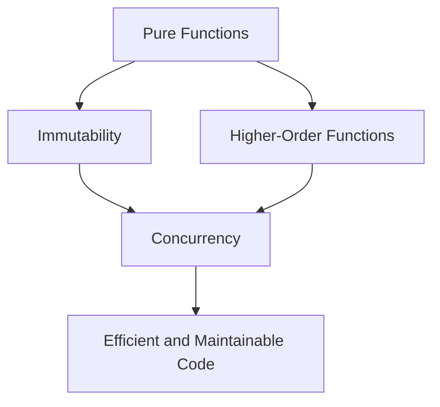

## 1.3. Core Principles of Functional Programming

Functional programming (FP) is a paradigm that treats computation as the evaluation of mathematical functions and avoids changing state or mutable data. In this section, we will delve into the core principles that define functional programming, providing a comprehensive understanding of each concept and how they contribute to writing clean, efficient, and maintainable code.

### Pure Functions

**Definition and Importance**

Pure functions are the building blocks of functional programming. A pure function is one that, given the same input, will always produce the same output and has no side effects. This means that the function does not alter any external state or interact with the outside world (e.g., modifying a global variable, writing to a file, or changing a database).

**Benefits of Pure Functions:**

- **Predictability:** Since pure functions always produce the same output for the same input, they are predictable and easier to test.
- **Composability:** Pure functions can be easily composed to build more complex functions.
- **Concurrency:** Pure functions are inherently thread-safe, making them ideal for concurrent and parallel execution.

**Pseudocode Example:**

```pseudocode
// A pure function that calculates the square of a number
function square(x) {
    return x * x
}

// Usage
let result = square(5)  // result is 25
```

In this example, the `square` function is pure because it does not modify any external state and always returns the same result for the same input.

**Try It Yourself:**

Experiment by modifying the `square` function to include a side effect, such as logging to the console, and observe how it affects the purity of the function.

### Immutability

**Understanding Immutable Data Structures**

Immutability is a core concept in functional programming where data structures cannot be modified after they are created. Instead of changing an existing data structure, a new one is created with the desired changes. This approach helps prevent unintended side effects and makes reasoning about code easier.

**Benefits of Immutability:**

- **Safety:** Reduces bugs related to shared state and concurrency.
- **Predictability:** Immutable data structures are easier to understand and predict.
- **Efficiency:** Many functional languages optimize immutable data structures to minimize memory usage and improve performance.

**Pseudocode Example:**

```pseudocode
// Immutable list example
let list = [1, 2, 3]

// Function to add an element to the list immutably
function addElement(list, element) {
    return list + [element]
}

// Usage
let newList = addElement(list, 4)  // newList is [1, 2, 3, 4]
```

In this example, the `addElement` function does not modify the original `list` but returns a new list with the added element.

**Try It Yourself:**

Modify the `addElement` function to attempt changing the original list and observe the implications on immutability.

### First-Class and Higher-Order Functions

**Functions as Values**

In functional programming, functions are first-class citizens, meaning they can be assigned to variables, passed as arguments, and returned from other functions. This flexibility allows for powerful abstractions and code reuse.

**Higher-Order Functions**

A higher-order function is a function that takes other functions as arguments or returns a function as its result. This allows for creating more abstract and reusable code.

**Pseudocode Example:**

```pseudocode
// Higher-order function that applies a function to each element in a list
function map(list, func) {
    let result = []
    for each element in list {
        result.append(func(element))
    }
    return result
}

// Usage
let numbers = [1, 2, 3]
let squares = map(numbers, square)  // squares is [1, 4, 9]
```

In this example, the `map` function is a higher-order function that applies the `square` function to each element in the `numbers` list.

**Try It Yourself:**

Create a new higher-order function that filters elements in a list based on a predicate function.

### Recursion Over Iteration

**Leveraging Recursion for Looping Constructs**

Recursion is a technique where a function calls itself to solve a problem. In functional programming, recursion is often preferred over traditional looping constructs like `for` or `while` loops because it aligns with the principles of immutability and pure functions.

**Tail Recursion and Optimization**

Tail recursion is a specific form of recursion where the recursive call is the last operation in the function. Many functional languages optimize tail-recursive functions to prevent stack overflow and improve performance.

**Pseudocode Example:**

```pseudocode
// Recursive function to calculate factorial
function factorial(n) {
    if n == 0 then
        return 1
    else
        return n * factorial(n - 1)
}

// Usage
let result = factorial(5)  // result is 120
```

In this example, the `factorial` function uses recursion to calculate the factorial of a number.

**Try It Yourself:**

Convert the `factorial` function to use tail recursion and observe the differences in performance and stack usage.

### Lazy Evaluation

**Delaying Computation Until Necessary**

Lazy evaluation is a strategy where expressions are not evaluated until their values are needed. This can improve performance by avoiding unnecessary calculations and allows for the creation of infinite data structures.

**Benefits and Use Cases:**

- **Efficiency:** Avoids computing values that are never used.
- **Infinite Structures:** Enables working with infinite lists or streams.
- **Improved Performance:** Reduces memory usage and computation time.

**Pseudocode Example:**

```pseudocode
// Lazy evaluation example with infinite list
function lazyRange(start) {
    return function() {
        return [start, lazyRange(start + 1)]
    }
}

// Usage
let numbers = lazyRange(1)
let first = numbers()  // first is [1, <function>]
let second = first[1]()  // second is [2, <function>]
```

In this example, `lazyRange` generates an infinite list of numbers starting from a given number, using lazy evaluation to compute values only when needed.

**Try It Yourself:**

Modify the `lazyRange` function to include a condition that stops the generation of numbers at a certain point.

### Visualizing Core Principles

To better understand how these principles interact, let's visualize the relationship between pure functions, immutability, and higher-order functions using a diagram.



**Diagram Description:**

This diagram illustrates how pure functions and immutability contribute to concurrency, while higher-order functions enhance code efficiency and maintainability. Together, these principles form the foundation of functional programming.

### References and Links

For further reading on functional programming principles, consider exploring the following resources:

- [MDN Web Docs: Functional Programming](https://developer.mozilla.org/en-US/docs/Glossary/Functional_programming)
- [W3Schools: Functional Programming](https://www.w3schools.com/whatis/whatis_functional_programming.asp)

### Knowledge Check

- What are the key characteristics of a pure function?
- How does immutability contribute to safer code?
- What is the difference between a first-class function and a higher-order function?
- Why is recursion preferred over iteration in functional programming?
- How does lazy evaluation improve performance?

### Embrace the Journey

Remember, this is just the beginning. As you progress, you'll build more complex and interactive programs using these core principles. Keep experimenting, stay curious, and enjoy the journey!

## Quiz Time!



### What is a pure function?

- [x] A function that always returns the same output for the same input and has no side effects.
- [ ] A function that modifies global state.
- [ ] A function that can return different outputs for the same input.
- [ ] A function that interacts with external systems.

> **Explanation:** A pure function is defined by its consistent output for the same input and lack of side effects.

### What is immutability in functional programming?

- [x] Data structures that cannot be changed after they are created.
- [ ] Data structures that can be modified in place.
- [ ] A technique to optimize memory usage.
- [ ] A method to improve performance by caching results.

> **Explanation:** Immutability refers to data structures that remain unchanged, promoting safer and more predictable code.

### What is a higher-order function?

- [x] A function that takes other functions as arguments or returns a function.
- [ ] A function that only performs arithmetic operations.
- [ ] A function that modifies its arguments.
- [ ] A function that is called recursively.

> **Explanation:** Higher-order functions can accept functions as parameters or return them, enabling powerful abstractions.

### Why is recursion preferred over iteration in functional programming?

- [x] It aligns with immutability and pure functions.
- [ ] It is easier to understand than loops.
- [ ] It always performs better than loops.
- [ ] It requires less memory than loops.

> **Explanation:** Recursion fits well with functional programming's principles of immutability and pure functions.

### What is lazy evaluation?

- [x] A strategy where expressions are evaluated only when needed.
- [ ] A method to execute code in parallel.
- [ ] A technique to optimize recursive functions.
- [ ] A way to cache function results.

> **Explanation:** Lazy evaluation delays computation until the value is required, improving efficiency.

### How do pure functions contribute to concurrency?

- [x] They are thread-safe and can be executed in parallel without issues.
- [ ] They require synchronization mechanisms.
- [ ] They modify shared state safely.
- [ ] They prevent deadlocks in concurrent systems.

> **Explanation:** Pure functions do not alter external state, making them inherently safe for concurrent execution.

### What is the benefit of using immutable data structures?

- [x] Reduces bugs related to shared state and concurrency.
- [ ] Increases memory usage.
- [ ] Requires more complex algorithms.
- [ ] Slows down program execution.

> **Explanation:** Immutability helps prevent bugs by eliminating shared state changes, especially in concurrent environments.

### How can higher-order functions improve code reusability?

- [x] By allowing functions to be passed and returned, enabling flexible code composition.
- [ ] By reducing the number of lines of code.
- [ ] By making code easier to read.
- [ ] By enforcing strict typing.

> **Explanation:** Higher-order functions enable code reuse by allowing functions to be composed and reused in different contexts.

### What is tail recursion?

- [x] A form of recursion where the recursive call is the last operation in the function.
- [ ] A recursive function that calls itself multiple times.
- [ ] A recursion technique that uses loops.
- [ ] A method to optimize memory usage in loops.

> **Explanation:** Tail recursion optimizes recursive calls by ensuring the recursive call is the final action, allowing for stack optimization.

### True or False: Lazy evaluation can be used to create infinite data structures.

- [x] True
- [ ] False

> **Explanation:** Lazy evaluation allows for the creation of infinite data structures by computing values only as needed.


