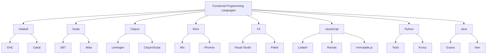

## 1.4. Functional Programming Languages and Ecosystems

Functional programming (FP) has become a cornerstone of modern software development, offering a paradigm that emphasizes immutability, pure functions, and higher-order functions. In this section, we will explore the languages that embrace functional programming, the functional features in multi-paradigm languages, and the tooling and libraries that support FP patterns. This exploration will provide you with a comprehensive understanding of the FP landscape and how it can be leveraged to build robust, maintainable software.

### Languages That Embrace FP

Functional programming languages are designed to facilitate the FP paradigm, providing features and constructs that make it easier to write functional code. Let's delve into some of the most prominent languages that embrace functional programming.

#### Haskell

Haskell is a purely functional programming language known for its strong static typing, lazy evaluation, and emphasis on immutability. It is often used in academic settings and industries where correctness and reliability are paramount.

- **Key Features:**
  - **Pure Functions:** Haskell enforces purity, meaning functions have no side effects and always produce the same output for the same input.
  - **Lazy Evaluation:** Computations are deferred until their results are needed, allowing for efficient handling of infinite data structures.
  - **Type System:** Haskell's type system is robust, with features like type inference and algebraic data types.

- **Sample Code Snippet:**

```pseudocode
-- Define a function to calculate the factorial of a number
factorial(n) = if n == 0 then 1 else n * factorial(n - 1)

-- Usage
factorial(5)  -- Output: 120
```

- **Ecosystem:**
  - **GHC (Glasgow Haskell Compiler):** The most widely used Haskell compiler.
  - **Cabal and Stack:** Tools for managing Haskell projects and dependencies.

#### Scala

Scala is a hybrid language that combines object-oriented and functional programming features. It runs on the Java Virtual Machine (JVM) and is known for its concise syntax and powerful type system.

- **Key Features:**
  - **Interoperability with Java:** Scala can seamlessly integrate with Java libraries and frameworks.
  - **Pattern Matching:** Provides a powerful mechanism for deconstructing data structures.
  - **Higher-Order Functions:** Functions can be passed as arguments and returned as values.

- **Sample Code Snippet:**

```pseudocode
// Define a function to filter even numbers from a list
def filterEvenNumbers(numbers: List[Int]): List[Int] = {
  numbers.filter(n => n % 2 == 0)
}

// Usage
filterEvenNumbers(List(1, 2, 3, 4, 5))  // Output: List(2, 4)
```

- **Ecosystem:**
  - **SBT (Simple Build Tool):** A build tool for Scala projects.
  - **Akka:** A toolkit for building concurrent, distributed applications.

#### Clojure

Clojure is a modern Lisp dialect that emphasizes immutability and concurrency. It is designed to be a functional language that runs on the JVM, making it a good choice for Java developers looking to adopt FP.

- **Key Features:**
  - **Immutable Data Structures:** Clojure provides persistent data structures that are efficient and thread-safe.
  - **Macros:** Allow for powerful code transformations and metaprogramming.
  - **REPL (Read-Eval-Print Loop):** Facilitates interactive development and testing.

- **Sample Code Snippet:**

```pseudocode
; Define a function to calculate the sum of a list
(defn sum [numbers]
  (reduce + numbers))

; Usage
(sum [1 2 3 4 5])  ; Output: 15
```

- **Ecosystem:**
  - **Leiningen:** A build automation tool for Clojure projects.
  - **ClojureScript:** A version of Clojure that compiles to JavaScript.

#### Elixir

Elixir is a functional, concurrent language built on the Erlang VM. It is known for its scalability and fault-tolerance, making it ideal for building distributed systems.

- **Key Features:**
  - **Concurrency:** Elixir leverages the Actor model for concurrent programming.
  - **Pattern Matching:** Used extensively for control flow and data manipulation.
  - **Metaprogramming:** Allows developers to extend the language with macros.

- **Sample Code Snippet:**

```pseudocode
def reverse_list(list) do
  Enum.reverse(list)
end

reverse_list([1, 2, 3, 4, 5])  # Output: [5, 4, 3, 2, 1]
```

- **Ecosystem:**
  - **Mix:** A build tool for Elixir projects.
  - **Phoenix:** A web framework for building scalable applications.

#### F#

F# is a functional-first language that runs on the .NET platform. It is known for its succinct syntax and strong type inference, making it a popular choice for data analysis and scientific computing.

- **Key Features:**
  - **Type Inference:** Reduces the need for explicit type annotations.
  - **Pattern Matching:** Simplifies complex data manipulations.
  - **Interoperability:** Can easily interact with other .NET languages.

- **Sample Code Snippet:**

```pseudocode
// Define a function to calculate the square of a number
let square x = x * x

// Usage
square 5  // Output: 25
```

- **Ecosystem:**
  - **Visual Studio and JetBrains Rider:** IDEs that support F# development.
  - **Paket:** A dependency manager for .NET projects.

### Functional Features in Multi-Paradigm Languages

While some languages are designed specifically for functional programming, many popular languages have adopted functional features, allowing developers to apply FP concepts in a multi-paradigm context.

#### JavaScript

JavaScript, a language traditionally known for its imperative style, has embraced functional programming features, especially with the advent of ES6.

- **Key Features:**
  - **First-Class Functions:** Functions can be assigned to variables, passed as arguments, and returned from other functions.
  - **Arrow Functions:** Provide a concise syntax for writing functions.
  - **Array Methods:** Methods like `map`, `filter`, and `reduce` facilitate functional programming.

- **Sample Code Snippet:**

```pseudocode
// Define a function to double the numbers in an array
const doubleNumbers = (numbers) => numbers.map(n => n * 2);

// Usage
doubleNumbers([1, 2, 3, 4, 5]);  // Output: [2, 4, 6, 8, 10]
```

- **Ecosystem:**
  - **Lodash and Ramda:** Libraries that provide utility functions for functional programming.
  - **Immutable.js:** A library for immutable data structures.

#### Python

Python is a versatile language that supports multiple programming paradigms, including functional programming.

- **Key Features:**
  - **Lambda Functions:** Anonymous functions that can be used inline.
  - **List Comprehensions:** Provide a concise way to create lists.
  - **Functional Libraries:** Libraries like `functools` and `itertools` support functional programming.

- **Sample Code Snippet:**

```pseudocode
def filter_odd_numbers(numbers):
    return list(filter(lambda x: x % 2 != 0, numbers))

filter_odd_numbers([1, 2, 3, 4, 5])  # Output: [1, 3, 5]
```

- **Ecosystem:**
  - **Toolz and Funcy:** Libraries that provide functional utilities.
  - **Pandas:** A data manipulation library that supports functional operations.

#### Java

Java, a language known for its object-oriented roots, has incorporated functional programming features since Java 8.

- **Key Features:**
  - **Lambda Expressions:** Enable concise function definitions.
  - **Streams API:** Provides a functional approach to processing sequences of elements.
  - **Optional:** A container object that may or may not contain a value.

- **Sample Code Snippet:**

```pseudocode
// Define a function to calculate the sum of squares of a list
List<Integer> numbers = Arrays.asList(1, 2, 3, 4, 5);
int sumOfSquares = numbers.stream()
                          .map(n -> n * n)
                          .reduce(0, Integer::sum);

// Output: 55
```

- **Ecosystem:**
  - **Guava:** A library that provides functional utilities.
  - **Vavr:** A library that extends Java with functional data structures.

### Tooling and Libraries

The functional programming ecosystem is enriched by a variety of tools and libraries that facilitate the adoption of FP patterns. These tools provide utilities, data structures, and frameworks that make it easier to write functional code.

#### Key Libraries

- **Lodash (JavaScript):** A utility library that provides functions for common programming tasks, including functional operations like `map`, `filter`, and `reduce`.

- **Ramda (JavaScript):** A library that emphasizes a functional approach, providing utilities for function composition, currying, and more.

- **Immutable.js (JavaScript):** A library that provides immutable data structures, allowing developers to work with data in a functional style.

- **Toolz (Python):** A library that provides a set of utility functions for functional programming, including tools for function composition and data manipulation.

- **Funcy (Python):** A library that offers functional programming utilities, including functions for working with iterators, sequences, and mappings.

- **Vavr (Java):** A library that extends Java with persistent data types and functional control structures, enabling a more functional style of programming.

#### Tooling

- **REPLs:** Interactive environments that allow developers to experiment with code in real-time. Languages like Haskell, Clojure, and Elixir provide robust REPLs that facilitate interactive development.

- **Build Tools:** Tools like SBT for Scala, Leiningen for Clojure, and Mix for Elixir streamline the process of building and managing projects.

- **IDEs and Editors:** Integrated development environments like IntelliJ IDEA, Visual Studio Code, and Emacs offer plugins and extensions that enhance the development experience for functional programming languages.

### Visualizing Functional Programming Ecosystems

To better understand the relationships between functional programming languages and their ecosystems, let's visualize these connections using a diagram.



**Diagram Description:** This diagram illustrates the relationships between various functional programming languages and their associated tools and libraries. Each language is connected to key components of its ecosystem, highlighting the tools and libraries that support functional programming.

### Try It Yourself

To deepen your understanding of functional programming languages and ecosystems, try experimenting with the following exercises:

1. **Haskell:** Write a Haskell function that calculates the Fibonacci sequence using recursion. Experiment with lazy evaluation by generating an infinite list of Fibonacci numbers.

2. **Scala:** Implement a Scala program that uses pattern matching to parse and evaluate simple arithmetic expressions.

3. **Clojure:** Create a Clojure function that processes a list of maps, filtering and transforming the data using higher-order functions.

4. **Elixir:** Build a simple Elixir application that uses the Actor model to manage state and handle concurrent tasks.

5. **JavaScript:** Use Ramda to compose a series of functions that transform an array of objects, extracting and formatting specific fields.

### Knowledge Check

Before moving on, let's summarize the key takeaways from this section:

- **Functional Programming Languages:** Haskell, Scala, Clojure, Elixir, and F# are languages that embrace functional programming, each offering unique features and ecosystems.

- **Multi-Paradigm Languages:** JavaScript, Python, and Java have incorporated functional programming features, allowing developers to apply FP concepts within a multi-paradigm context.

- **Tooling and Libraries:** A variety of tools and libraries support functional programming, providing utilities, data structures, and frameworks that facilitate the adoption of FP patterns.

### Embrace the Journey

As you explore functional programming languages and ecosystems, remember that this is just the beginning. The FP paradigm offers a wealth of opportunities to build robust, maintainable software. Keep experimenting, stay curious, and enjoy the journey!

## Quiz Time!



### Which of the following languages is known for its strong static typing and lazy evaluation?

- [x] Haskell
- [ ] Scala
- [ ] JavaScript
- [ ] Python

> **Explanation:** Haskell is known for its strong static typing and lazy evaluation, making it a purely functional programming language.

### What feature allows Scala to seamlessly integrate with Java libraries and frameworks?

- [x] Interoperability with Java
- [ ] Pattern Matching
- [ ] Higher-Order Functions
- [ ] Lazy Evaluation

> **Explanation:** Scala's interoperability with Java allows it to seamlessly integrate with Java libraries and frameworks.

### Which language is a modern Lisp dialect that emphasizes immutability and concurrency?

- [ ] Haskell
- [ ] Scala
- [x] Clojure
- [ ] Elixir

> **Explanation:** Clojure is a modern Lisp dialect that emphasizes immutability and concurrency, running on the JVM.

### What is the primary concurrency model used by Elixir?

- [ ] Threads
- [ ] Promises
- [x] Actor model
- [ ] Futures

> **Explanation:** Elixir uses the Actor model for concurrency, leveraging the Erlang VM's capabilities.

### Which JavaScript library provides immutable data structures?

- [ ] Lodash
- [ ] Ramda
- [x] Immutable.js
- [ ] Funcy

> **Explanation:** Immutable.js is a JavaScript library that provides immutable data structures.

### What feature in Python provides a concise way to create lists?

- [ ] Lambda Functions
- [x] List Comprehensions
- [ ] Decorators
- [ ] Generators

> **Explanation:** List comprehensions in Python provide a concise way to create lists.

### Which Java feature enables a functional approach to processing sequences of elements?

- [ ] Optional
- [x] Streams API
- [ ] Generics
- [ ] Annotations

> **Explanation:** The Streams API in Java enables a functional approach to processing sequences of elements.

### What tool is commonly used for building and managing Scala projects?

- [ ] Mix
- [ ] Leiningen
- [x] SBT
- [ ] Cabal

> **Explanation:** SBT (Simple Build Tool) is commonly used for building and managing Scala projects.

### Which library extends Java with persistent data types and functional control structures?

- [ ] Guava
- [x] Vavr
- [ ] Toolz
- [ ] Funcy

> **Explanation:** Vavr extends Java with persistent data types and functional control structures.

### True or False: Elixir is built on the Erlang VM and is known for its scalability and fault-tolerance.

- [x] True
- [ ] False

> **Explanation:** True. Elixir is built on the Erlang VM and is known for its scalability and fault-tolerance.


