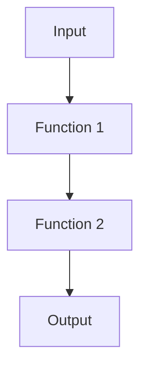

## 1.5. How to Use This Guide

Welcome to the "Functional Programming Patterns: Concepts and Pseudocode Implementations" guide. This section will help you navigate the guide effectively, understand the conventions used, and apply the concepts to real-world scenarios. Let's embark on this journey to deepen your understanding of functional programming (FP) patterns and their practical applications.

### Structure of the Book

The guide is meticulously structured to facilitate a smooth learning curve, starting from foundational concepts and advancing to more complex patterns and applications. Here's how the chapters are organized:

#### 1. **Introduction to Functional Programming Patterns**

This introductory chapter lays the groundwork by explaining what functional programming is, its history, and its evolution. It also highlights the importance of functional programming patterns in solving common problems, enhancing code quality, and their role in modern software development.

#### 2. **Fundamental Concepts in Functional Programming**

Before diving into specific patterns, this chapter covers core principles such as pure functions, immutability, higher-order functions, recursion, lazy evaluation, closures, and currying. Understanding these concepts is crucial as they form the basis for all functional programming patterns.

#### 3. **Essential Functional Programming Patterns**

This chapter introduces essential patterns like Functor, Monad, Applicative Functor, Observer, Strategy, Memoization, and Transducer. Each pattern is explained with its intent, applicability, and pseudocode examples.

#### 4. **Advanced Functional Patterns**

For those looking to deepen their expertise, this chapter covers advanced patterns such as Monoid, Algebraic Data Types, Lens, Interpreter, Dependency Injection, and Zipper. These patterns are essential for building complex and scalable functional applications.

#### 5. **Functional Error Handling**

Error handling is a critical aspect of software development. This chapter explores functional approaches to error handling using Option/Maybe, Either, Try monads, and validated data patterns.

#### 6. **Functional Data Structures**

Learn about immutable collections, trees, graphs, streams, and functional queues. This chapter provides pseudocode implementations and discusses the benefits of using functional data structures.

#### 7. **Concurrency and Parallelism in Functional Programming**

Concurrency and parallelism are vital for building high-performance applications. This chapter covers immutable state, futures, promises, the actor model, and data parallelism.

#### 8. **Integrating Functional Patterns into Imperative Languages**

Explore how to apply functional programming concepts in languages like JavaScript, Python, Java, and C#. This chapter addresses challenges and best practices for mixing paradigms.

#### 9. **Testing and Debugging Functional Code**

Testing and debugging are crucial for maintaining code quality. This chapter covers property-based testing, debugging pure functions, and managing side effects.

#### 10. **Real-World Applications and Case Studies**

See how functional programming patterns are applied in real-world scenarios, including data processing, web applications, and financial systems.

#### 11. **Advanced Topics**

For those interested in theoretical aspects, this chapter delves into category theory, continuation-passing style, free monads, and effect systems.

#### 12. **Conclusion**

The final chapter recaps key concepts, discusses the future of functional programming, and provides resources for further learning.

#### Appendices

The appendices include a pseudocode style guide, glossary of terms, exercise solutions, reference materials, bibliography, and FAQs.

### Pseudocode Conventions and Style Guide

To ensure consistency and clarity, the guide follows specific pseudocode conventions. Understanding these conventions will help you interpret the examples and apply them to your preferred programming language.

#### **Syntax and Formatting**

- **Function Definitions:** Functions are defined using the `function` keyword, followed by the function name and parameters in parentheses.
- **Variables:** Variables are declared using the `let` keyword.
- **Control Structures:** Use `if`, `else`, `for`, `while`, and `switch` for control flow.
- **Comments:** Use `//` for single-line comments and `/* */` for multi-line comments.

#### **Example:**

```pseudocode
// Function to calculate factorial
function factorial(n) {
    if n <= 1 then
        return 1
    else
        return n * factorial(n - 1)
}
```

#### **Naming Conventions**

- **Functions and Variables:** Use camelCase for naming functions and variables.
- **Constants:** Use UPPER_CASE for constants.

#### **Code Blocks and Indentation**

- Use consistent indentation (4 spaces) for code blocks to enhance readability.

### Engaging with Examples and Exercises

To maximize your learning, actively engage with the examples and exercises provided throughout the guide. Here are some tips:

#### **Experiment with Code**

- **Modify Examples:** Try changing the code examples to see how they behave. This will deepen your understanding of the concepts.
- **Create New Examples:** Use the patterns to solve problems you encounter in your projects.

#### **Practice Regularly**

- **Solve Exercises:** Each chapter includes exercises to reinforce your learning. Attempt these exercises and compare your solutions with the provided answers.
- **Challenge Yourself:** Try to implement the patterns in different programming languages to gain a broader perspective.

#### **Collaborate and Discuss**

- **Join Communities:** Engage with online communities and forums to discuss patterns and share insights.
- **Pair Programming:** Work with peers to solve exercises and exchange ideas.

### Applying Patterns in Practice

The ultimate goal of this guide is to equip you with the knowledge and skills to apply functional programming patterns in real-world scenarios. Here are some strategies to achieve this:

#### **Identify Suitable Patterns**

- **Analyze Problems:** Break down problems into smaller parts and identify patterns that can provide solutions.
- **Evaluate Trade-offs:** Consider the trade-offs of using a particular pattern in terms of complexity, performance, and maintainability.

#### **Integrate with Existing Codebases**

- **Refactor Code:** Gradually refactor existing code to incorporate functional patterns, improving readability and reducing bugs.
- **Mix Paradigms:** Combine functional and imperative paradigms where appropriate to leverage the strengths of both.

#### **Stay Updated**

- **Follow Trends:** Keep up with the latest trends and advancements in functional programming.
- **Continuous Learning:** Attend workshops, webinars, and conferences to learn from experts and practitioners.

### Visualizing Concepts

To aid understanding, the guide includes diagrams and visualizations using Mermaid.js. These visual aids help illustrate complex concepts, such as data flow, function composition, and program structure.

#### **Example Diagram: Function Composition**



This diagram illustrates how function composition works by chaining multiple functions together, where the output of one function becomes the input of the next.

### References and Links

Throughout the guide, you'll find hyperlinks to reputable external resources for further reading. These links provide deeper dives into topics and supplement the explanations provided.

- **MDN Web Docs:** Comprehensive documentation on web technologies and programming languages.
- **W3Schools:** Tutorials and references on web development languages.

### Knowledge Check

To reinforce your understanding, the guide includes knowledge checks and exercises at the end of each chapter. These challenges encourage you to apply what you've learned and assess your comprehension.

### Embrace the Journey

Remember, learning functional programming patterns is a journey. As you progress, you'll build more complex and interactive applications. Keep experimenting, stay curious, and enjoy the process. Embrace the challenges and celebrate your successes along the way.

### Formatting and Structure

The guide is organized with clear headings and subheadings to help you navigate the content easily. Bullet points are used to break down complex information, and important terms are highlighted for emphasis.

### Writing Style

The guide uses a collaborative tone, employing first-person plural (we, let's) to create an engaging learning experience. Gender-neutral language is used throughout to ensure inclusivity.

### Conclusion

By following this guide, you'll gain a comprehensive understanding of functional programming patterns and how to apply them effectively. Whether you're a seasoned developer or new to functional programming, this guide will serve as a valuable resource on your journey to mastering functional programming patterns.

## Quiz Time!



### What is the primary goal of this guide?

- [x] To equip readers with knowledge and skills to apply functional programming patterns in real-world scenarios.
- [ ] To provide a comprehensive history of functional programming.
- [ ] To teach imperative programming concepts.
- [ ] To focus solely on theoretical aspects of functional programming.

> **Explanation:** The guide aims to equip readers with practical knowledge and skills for applying functional programming patterns in real-world scenarios.

### Which chapter covers the core principles of functional programming?

- [x] Chapter 2: Fundamental Concepts in Functional Programming
- [ ] Chapter 3: Essential Functional Programming Patterns
- [ ] Chapter 4: Advanced Functional Patterns
- [ ] Chapter 5: Functional Error Handling

> **Explanation:** Chapter 2 covers the core principles such as pure functions, immutability, and higher-order functions.

### What is the purpose of pseudocode conventions in this guide?

- [x] To ensure consistency and clarity in code examples.
- [ ] To make the guide more complex.
- [ ] To focus on a specific programming language.
- [ ] To avoid using any code examples.

> **Explanation:** Pseudocode conventions ensure consistency and clarity, making it easier to understand and apply the examples.

### How can readers maximize their learning from this guide?

- [x] By engaging with examples and exercises.
- [ ] By skipping the exercises.
- [ ] By only reading the theoretical sections.
- [ ] By avoiding any code modifications.

> **Explanation:** Engaging with examples and exercises helps reinforce learning and deepen understanding.

### What is the benefit of integrating functional patterns into existing codebases?

- [x] Improving readability and reducing bugs.
- [ ] Making the code more complex.
- [ ] Eliminating all imperative code.
- [ ] Avoiding any changes to the codebase.

> **Explanation:** Integrating functional patterns can improve readability and reduce bugs, enhancing code quality.

### What visual tool is used in the guide to illustrate complex concepts?

- [x] Mermaid.js
- [ ] UML diagrams
- [ ] ASCII art
- [ ] Hand-drawn sketches

> **Explanation:** Mermaid.js is used to create diagrams and visualizations to aid understanding of complex concepts.

### How does the guide encourage readers to apply patterns in practice?

- [x] By providing strategies for real-world application.
- [ ] By focusing only on theoretical knowledge.
- [ ] By discouraging experimentation.
- [ ] By avoiding any practical examples.

> **Explanation:** The guide provides strategies and encourages readers to apply patterns in real-world scenarios.

### What tone does the guide use to create an engaging learning experience?

- [x] Collaborative and supportive
- [ ] Formal and distant
- [ ] Critical and harsh
- [ ] Indifferent and passive

> **Explanation:** The guide uses a collaborative and supportive tone to engage readers and encourage learning.

### What is the purpose of knowledge checks in the guide?

- [x] To reinforce understanding and assess comprehension.
- [ ] To make the guide longer.
- [ ] To confuse readers.
- [ ] To avoid practical application.

> **Explanation:** Knowledge checks help reinforce understanding and assess comprehension of the material.

### True or False: The guide uses gender-neutral language throughout.

- [x] True
- [ ] False

> **Explanation:** The guide uses gender-neutral language to ensure inclusivity.


