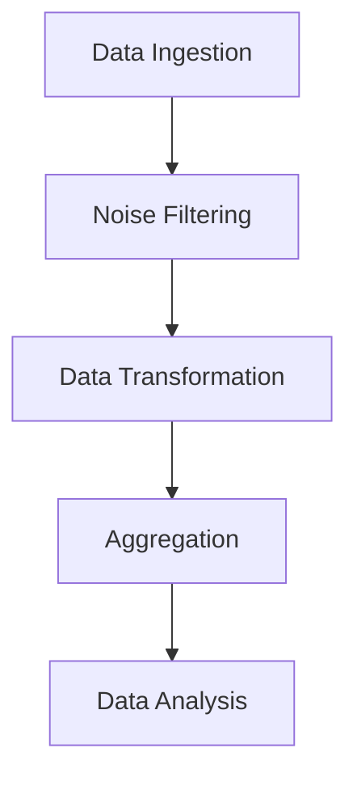
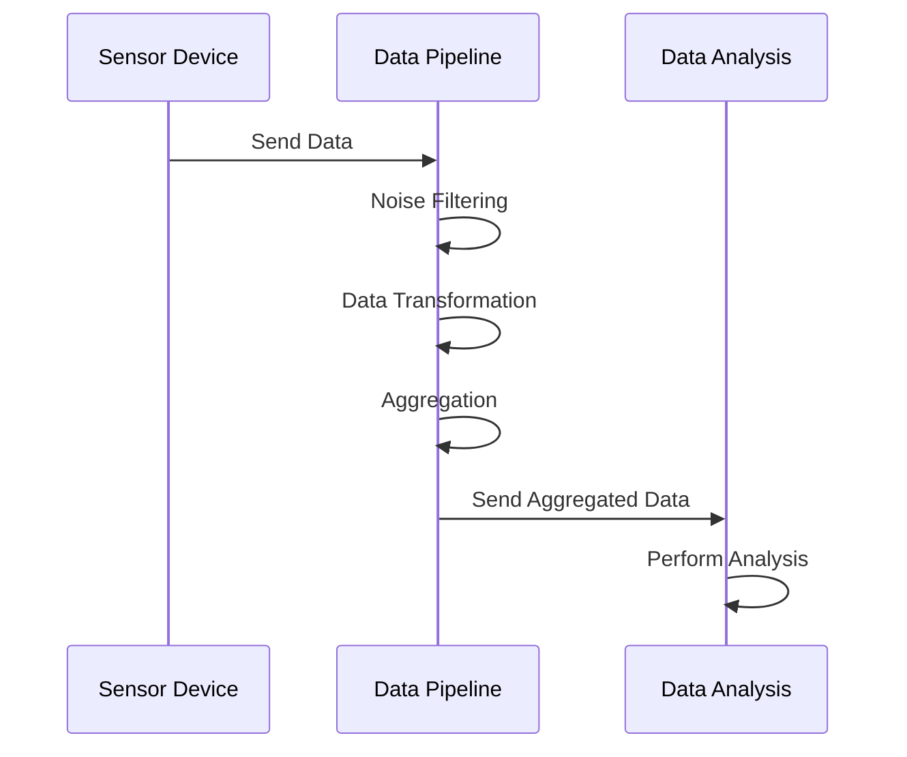

## 10.1. Functional Patterns in Data Processing

In the realm of data processing, functional programming (FP) offers powerful paradigms that enhance the way we handle and process data, especially in real-time scenarios. This section delves into the application of functional patterns in stream processing and event handling, providing insights into how these patterns can be leveraged to build efficient, scalable, and maintainable data pipelines.

### Stream Processing and Event Handling

Stream processing and event handling are critical components of modern data systems, enabling the processing of continuous data flows and reacting to events in real-time. Functional programming provides a robust framework for implementing these systems due to its emphasis on immutability, pure functions, and declarative code.

#### Understanding Stream Processing

Stream processing involves the continuous ingestion and processing of data streams. Unlike batch processing, which deals with large volumes of data at once, stream processing handles data in real-time, allowing for immediate insights and actions.

**Key Concepts:**

- **Data Streams:** Continuous flows of data that are processed in real-time.
- **Event Streams:** Sequences of events that trigger specific actions or computations.
- **Windowing:** Dividing streams into finite chunks for processing.
- **Stateful Processing:** Maintaining state across events for complex computations.

#### Functional Programming in Stream Processing

Functional programming is well-suited for stream processing due to its ability to handle infinite data structures, such as streams, using lazy evaluation and higher-order functions.

**Benefits of FP in Stream Processing:**

- **Immutability:** Ensures data consistency and thread safety.
- **Pure Functions:** Simplifies reasoning about code and facilitates testing.
- **Higher-Order Functions:** Enables powerful abstractions for stream transformations.

#### Implementing Stream Processing with FP

Let's explore how functional programming can be applied to implement a stream processing system. We'll use pseudocode to illustrate key concepts and patterns.

```pseudocode
// Define a stream processing function
function processStream(stream, transformFunction) {
    return stream.map(transformFunction)
                 .filter(isValid)
                 .reduce(aggregate, initialValue)
}

// Example usage
let dataStream = createDataStream(source)
let processedData = processStream(dataStream, transformData)
```

**Explanation:**

- **`processStream`:** A higher-order function that takes a stream and a transformation function as arguments.
- **`map`, `filter`, `reduce`:** Common higher-order functions used to transform, filter, and aggregate data in the stream.
- **`transformData`:** A pure function that defines how each data element is transformed.

#### Event Handling in Functional Programming

Event handling involves responding to events, such as user actions or system triggers, in a timely manner. Functional programming provides a clean and modular approach to event handling through the use of pure functions and immutable data structures.

**Key Concepts:**

- **Event Sources:** Origins of events, such as user interfaces or external systems.
- **Event Handlers:** Functions that process events and produce side effects.
- **Reactive Programming:** A paradigm that focuses on asynchronous data flows and the propagation of change.

#### Implementing Event Handling with FP

Functional programming allows us to define event handlers as pure functions, making them easier to test and reason about.

```pseudocode
// Define an event handler
function handleEvent(event) {
    let updatedState = updateState(event, currentState)
    render(updatedState)
}

// Example usage
let eventStream = createEventStream(source)
eventStream.forEach(handleEvent)
```

**Explanation:**

- **`handleEvent`:** A pure function that processes an event and updates the application state.
- **`updateState`:** A pure function that computes the new state based on the current state and the event.
- **`render`:** A function that updates the user interface based on the new state.

### Case Study: Implementing a Data Pipeline

To illustrate the application of functional patterns in data processing, let's consider a case study where we implement a data pipeline using functional programming principles.

#### Scenario

We need to build a data pipeline that processes real-time sensor data from IoT devices. The pipeline should filter out noise, transform the data into a usable format, and aggregate the results for analysis.

#### Design Considerations

- **Scalability:** The pipeline should handle a large volume of data efficiently.
- **Fault Tolerance:** The system should be resilient to failures and recover gracefully.
- **Extensibility:** The pipeline should be easy to extend with new processing steps.

#### Architecture

The data pipeline consists of several stages, each implemented as a pure function. Data flows through these stages in a stream, allowing for real-time processing.



**Description:**

- **Data Ingestion:** Collects data from IoT devices and feeds it into the pipeline.
- **Noise Filtering:** Removes irrelevant or erroneous data points.
- **Data Transformation:** Converts raw data into a structured format.
- **Aggregation:** Combines data points for analysis.
- **Data Analysis:** Performs computations and generates insights.

#### Implementation

Let's implement the data pipeline using functional programming patterns.

```pseudocode
// Define the pipeline stages
function noiseFilter(data) {
    return data.filter(isRelevant)
}

function transformData(data) {
    return data.map(convertToStructuredFormat)
}

function aggregateData(data) {
    return data.reduce(combine, initialAggregate)
}

// Create the data pipeline
function createPipeline(dataStream) {
    return dataStream
        .pipe(noiseFilter)
        .pipe(transformData)
        .pipe(aggregateData)
}

// Example usage
let sensorDataStream = createDataStream(sensorSource)
let processedData = createPipeline(sensorDataStream)
```

**Explanation:**

- **`noiseFilter`, `transformData`, `aggregateData`:** Pure functions that define each stage of the pipeline.
- **`pipe`:** A function that composes multiple transformations into a single operation.
- **`createPipeline`:** A higher-order function that constructs the data pipeline by chaining stages.

### Try It Yourself

Experiment with the data pipeline by modifying the transformation and aggregation functions. Consider adding new stages, such as data enrichment or anomaly detection, to enhance the pipeline's capabilities.

### Visualizing Data Flow

To better understand the flow of data through the pipeline, let's visualize the process using a sequence diagram.



**Description:**

- **Sensor Device:** Sends data to the pipeline.
- **Data Pipeline:** Processes data through various stages.
- **Data Analysis:** Receives aggregated data and performs analysis.

### References and Links

For further reading on functional programming and data processing, consider exploring the following resources:

- [Functional Programming in Scala](https://www.manning.com/books/functional-programming-in-scala)
- [Reactive Programming with RxJS](https://rxjs.dev/)
- [Apache Kafka: A Distributed Streaming Platform](https://kafka.apache.org/)

### Knowledge Check

To reinforce your understanding of functional patterns in data processing, consider the following questions:

1. What are the benefits of using functional programming for stream processing?
2. How does immutability enhance the reliability of data pipelines?
3. What role do higher-order functions play in event handling?
4. How can you implement fault tolerance in a functional data pipeline?

### Embrace the Journey

Remember, this is just the beginning. As you progress, you'll build more complex and interactive data processing systems. Keep experimenting, stay curious, and enjoy the journey!

## Quiz Time!



### What is a key benefit of using functional programming for stream processing?

- [x] Immutability ensures data consistency and thread safety.
- [ ] It allows for mutable state management.
- [ ] It requires less memory usage.
- [ ] It simplifies imperative code structures.

> **Explanation:** Immutability in functional programming ensures that data remains consistent and thread-safe, which is crucial for stream processing.

### Which function is typically used to transform data in a stream?

- [x] map
- [ ] filter
- [ ] reduce
- [ ] aggregate

> **Explanation:** The `map` function is used to transform each element in a stream, applying a given function to each element.

### What is the purpose of windowing in stream processing?

- [x] Dividing streams into finite chunks for processing.
- [ ] Aggregating data over time.
- [ ] Filtering out irrelevant data.
- [ ] Transforming data into a structured format.

> **Explanation:** Windowing divides streams into finite chunks, allowing for manageable processing of continuous data flows.

### How does functional programming handle event streams?

- [x] By using pure functions and immutable data structures.
- [ ] By relying on mutable state.
- [ ] By using imperative loops.
- [ ] By employing global variables.

> **Explanation:** Functional programming uses pure functions and immutable data structures to handle event streams, ensuring modular and testable code.

### In the provided pseudocode, what does the `pipe` function do?

- [x] Composes multiple transformations into a single operation.
- [ ] Filters data based on a condition.
- [ ] Aggregates data points.
- [ ] Converts data into a structured format.

> **Explanation:** The `pipe` function composes multiple transformations, allowing for a streamlined and efficient data processing pipeline.

### What is a key advantage of using higher-order functions in event handling?

- [x] They enable powerful abstractions for stream transformations.
- [ ] They simplify the use of global variables.
- [ ] They allow for mutable state management.
- [ ] They reduce the need for error handling.

> **Explanation:** Higher-order functions enable powerful abstractions, making it easier to transform and handle streams of data.

### How can you enhance a data pipeline with additional capabilities?

- [x] By adding new stages such as data enrichment or anomaly detection.
- [ ] By removing existing stages.
- [ ] By increasing the memory allocation.
- [ ] By using global variables.

> **Explanation:** Adding new stages like data enrichment or anomaly detection can enhance the capabilities of a data pipeline.

### What is the role of the `reduce` function in stream processing?

- [x] Aggregating data points into a single result.
- [ ] Transforming each element in a stream.
- [ ] Filtering out irrelevant data.
- [ ] Dividing streams into finite chunks.

> **Explanation:** The `reduce` function aggregates data points, combining them into a single result.

### Which of the following is a key concept in event handling?

- [x] Reactive Programming
- [ ] Mutable State
- [ ] Global Variables
- [ ] Imperative Loops

> **Explanation:** Reactive programming is a key concept in event handling, focusing on asynchronous data flows and change propagation.

### True or False: Functional programming simplifies reasoning about code and facilitates testing.

- [x] True
- [ ] False

> **Explanation:** Functional programming simplifies reasoning about code due to its use of pure functions and immutability, making it easier to test and maintain.




