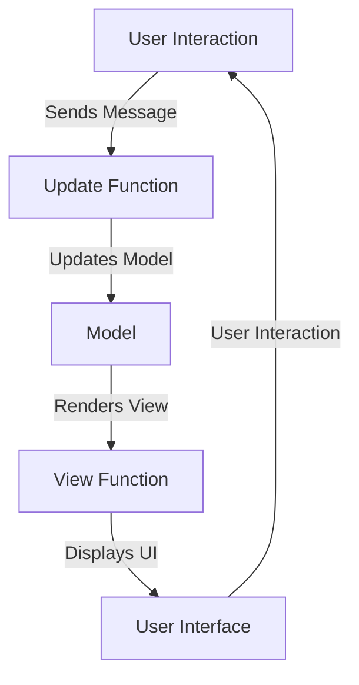

## 10.2. Building a Web Application with Functional Programming

In this section, we will explore how to build a web application using functional programming (FP) paradigms. We'll delve into the use of functional web frameworks such as Elm, PureScript, and ClojureScript, and demonstrate how these tools can be leveraged to create robust, maintainable, and scalable web applications. By the end of this guide, you will have a comprehensive understanding of how to apply functional programming concepts to web development, and you'll be equipped with practical examples and exercises to enhance your learning.

### Introduction to Functional Web Frameworks

Functional programming has gained significant traction in the realm of web development due to its emphasis on immutability, pure functions, and declarative code. Let's explore three popular functional web frameworks that embody these principles: Elm, PureScript, and ClojureScript.

#### Elm

Elm is a functional language specifically designed for building web applications. It compiles to JavaScript and offers a strong type system, which helps catch errors at compile time. Elm's architecture promotes a unidirectional data flow, making it easier to reason about state changes in your application.

**Key Features of Elm:**

- **No Runtime Exceptions:** Elm guarantees no runtime errors in practice, which significantly reduces the likelihood of bugs.
- **Friendly Error Messages:** Elm provides helpful error messages that guide developers in fixing issues.
- **Elm Architecture:** A pattern for organizing code that emphasizes simplicity and maintainability.

#### PureScript

PureScript is a strongly-typed functional programming language that compiles to JavaScript. It shares many similarities with Haskell, offering powerful type inference and a rich ecosystem of libraries.

**Key Features of PureScript:**

- **Type Safety:** PureScript's type system helps prevent many common programming errors.
- **Interoperability:** PureScript can easily interoperate with existing JavaScript libraries.
- **Functional Abstractions:** PureScript supports advanced functional programming concepts like monads and type classes.

#### ClojureScript

ClojureScript is a variant of Clojure that compiles to JavaScript. It brings the power of Lisp to the web, offering a dynamic and expressive syntax.

**Key Features of ClojureScript:**

- **Immutable Data Structures:** ClojureScript's core data structures are immutable, promoting safer concurrent programming.
- **Macros:** ClojureScript allows developers to extend the language with custom macros.
- **REPL Driven Development:** ClojureScript supports interactive development with a Read-Eval-Print Loop (REPL).

### Case Study: Developing a Frontend Application

To illustrate the application of functional programming in web development, let's walk through the process of building a simple frontend application using Elm. We'll create a basic to-do list application, demonstrating key concepts and patterns along the way.

#### Step 1: Setting Up the Environment

Before we begin coding, we need to set up our development environment. Follow these steps to get started with Elm:

1. **Install Elm:** Visit the [Elm website](https://elm-lang.org/) and follow the installation instructions for your operating system.
2. **Create a New Elm Project:** Use the Elm CLI to create a new project:
   ```bash
   elm init
   ```
3. **Set Up a Development Server:** You can use tools like `elm-live` to serve your application locally:
   ```bash
   npm install -g elm-live
   elm-live src/Main.elm --open --output=main.js
   ```

#### Step 2: Designing the Application Architecture

Elm applications follow a specific architecture pattern known as the Elm Architecture. It consists of three main parts: Model, Update, and View.

- **Model:** Represents the state of the application.
- **Update:** Defines how the state changes in response to messages.
- **View:** Renders the UI based on the current state.

Let's define the initial structure of our to-do list application:

```pseudocode
module Main exposing (..)

import Browser
import Html exposing (Html, div, text)
import Html.Events exposing (onClick)
import Html.Attributes exposing (..)

-- MODEL

type alias Model =
    { tasks : List String }

initialModel : Model
initialModel =
    { tasks = [] }

-- UPDATE

type Msg
    = AddTask String
    | RemoveTask Int

update : Msg -> Model -> Model
update msg model =
    case msg of
        AddTask task ->
            { model | tasks = model.tasks ++ [task] }

        RemoveTask index ->
            { model | tasks = List.Extra.removeAt index model.tasks }

-- VIEW

view : Model -> Html Msg
view model =
    div []
        [ Html.button [ onClick (AddTask "New Task") ] [ text "Add Task" ]
        , Html.ul []
            (List.indexedMap viewTask model.tasks)
        ]

viewTask : Int -> String -> Html Msg
viewTask index task =
    Html.li []
        [ text task
        , Html.button [ onClick (RemoveTask index) ] [ text "Remove" ]
        ]

-- MAIN

main =
    Browser.sandbox { init = initialModel, update = update, view = view }
```

**Explanation:**

- **Model:** We define a `Model` type alias to represent the state of our application, which consists of a list of tasks.
- **Update:** The `update` function takes a message and the current model, returning a new model. We handle two messages: `AddTask` and `RemoveTask`.
- **View:** The `view` function renders the UI based on the current model. We use `Html` functions to create elements and bind events.

#### Step 3: Implementing Functional Patterns

In our to-do list application, we can apply several functional programming patterns to enhance code quality and maintainability.

**1. Pure Functions:**

Ensure that all functions are pure, meaning they do not have side effects and always produce the same output for the same input. This makes reasoning about the code easier and facilitates testing.

**2. Immutability:**

Elm enforces immutability, which means that data structures cannot be modified after they are created. This eliminates a whole class of bugs related to mutable state.

**3. Higher-Order Functions:**

Use higher-order functions to abstract common patterns. For example, we can create a generic function to render a list of items:

```pseudocode
renderList : (a -> Html msg) -> List a -> Html msg
renderList renderItem items =
    Html.ul [] (List.map renderItem items)
```

**4. Function Composition:**

Compose smaller functions to build more complex functionality. This promotes code reuse and modularity.

#### Step 4: Enhancing the Application

Let's enhance our to-do list application by adding features such as task editing and filtering.

**Editing Tasks:**

To allow task editing, we need to update our model and view:

```pseudocode
type alias Model =
    { tasks : List Task }

type alias Task =
    { description : String
    , isEditing : Bool }

type Msg
    = AddTask String
    | RemoveTask Int
    | EditTask Int String
    | ToggleEdit Int

update : Msg -> Model -> Model
update msg model =
    case msg of
        AddTask description ->
            { model | tasks = model.tasks ++ [Task description False] }

        RemoveTask index ->
            { model | tasks = List.Extra.removeAt index model.tasks }

        EditTask index newDescription ->
            { model | tasks = List.Extra.updateAt index (\task -> { task | description = newDescription }) model.tasks }

        ToggleEdit index ->
            { model | tasks = List.Extra.updateAt index (\task -> { task | isEditing = not task.isEditing }) model.tasks }

viewTask : Int -> Task -> Html Msg
viewTask index task =
    if task.isEditing then
        Html.li []
            [ Html.input [ value task.description, onInput (EditTask index) ] []
            , Html.button [ onClick (ToggleEdit index) ] [ text "Save" ]
            ]
    else
        Html.li []
            [ text task.description
            , Html.button [ onClick (ToggleEdit index) ] [ text "Edit" ]
            , Html.button [ onClick (RemoveTask index) ] [ text "Remove" ]
            ]
```

**Filtering Tasks:**

We can add a filter to show only completed or pending tasks:

```pseudocode
type alias Model =
    { tasks : List Task
    , filter : Filter }

type Filter
    = All
    | Completed
    | Pending

type Msg
    = SetFilter Filter

update : Msg -> Model -> Model
update msg model =
    case msg of
        SetFilter filter ->
            { model | filter = filter }

view : Model -> Html Msg
view model =
    let
        filteredTasks =
            case model.filter of
                All ->
                    model.tasks

                Completed ->
                    List.filter (\task -> task.isCompleted) model.tasks

                Pending ->
                    List.filter (\task -> not task.isCompleted) model.tasks
    in
    div []
        [ Html.button [ onClick (SetFilter All) ] [ text "All" ]
        , Html.button [ onClick (SetFilter Completed) ] [ text "Completed" ]
        , Html.button [ onClick (SetFilter Pending) ] [ text "Pending" ]
        , renderList viewTask filteredTasks
        ]
```

### Visualizing the Elm Architecture

To better understand the Elm Architecture, let's visualize the flow of data and messages in our application.



**Diagram Explanation:**

- **User Interaction:** The user interacts with the UI, triggering messages.
- **Update Function:** Messages are processed by the update function, which modifies the model.
- **Model:** The model represents the current state of the application.
- **View Function:** The view function renders the UI based on the model.
- **User Interface:** The updated UI is displayed to the user.

### Try It Yourself

Now that we've built a basic to-do list application, try experimenting with the code. Here are some suggestions:

- **Add a Due Date:** Extend the `Task` type to include a due date and update the view to display it.
- **Implement Task Prioritization:** Allow users to set task priorities and sort tasks accordingly.
- **Persist Data:** Use local storage to save and load tasks between sessions.

### Conclusion

Building web applications with functional programming paradigms offers numerous benefits, including improved code quality, maintainability, and scalability. By leveraging frameworks like Elm, PureScript, and ClojureScript, developers can create robust applications with fewer bugs and more predictable behavior.

Remember, this is just the beginning. As you progress, you'll build more complex and interactive web applications. Keep experimenting, stay curious, and enjoy the journey!

## Quiz Time!



### What is a key feature of Elm that helps reduce runtime errors?

- [x] No runtime exceptions
- [ ] Dynamic typing
- [ ] Macros
- [ ] Interoperability with JavaScript

> **Explanation:** Elm guarantees no runtime exceptions, which significantly reduces the likelihood of bugs.

### Which functional web framework is known for its Lisp-like syntax?

- [ ] Elm
- [ ] PureScript
- [x] ClojureScript
- [ ] JavaScript

> **Explanation:** ClojureScript is a variant of Clojure, which is a Lisp dialect, and it compiles to JavaScript.

### What is the Elm Architecture composed of?

- [x] Model, Update, View
- [ ] Controller, View, Model
- [ ] State, Action, Reducer
- [ ] Component, Service, Directive

> **Explanation:** The Elm Architecture consists of Model, Update, and View, which are used to structure Elm applications.

### In the Elm Architecture, what does the Update function do?

- [x] Modifies the model based on messages
- [ ] Renders the UI
- [ ] Handles user input
- [ ] Compiles the code

> **Explanation:** The Update function processes messages and modifies the model accordingly.

### What is a benefit of using immutable data structures in functional programming?

- [x] Eliminates bugs related to mutable state
- [ ] Increases runtime performance
- [ ] Allows direct memory access
- [ ] Supports dynamic typing

> **Explanation:** Immutable data structures eliminate a whole class of bugs related to mutable state, making code safer and more predictable.

### Which of the following is a higher-order function in Elm?

- [ ] Html.div
- [x] List.map
- [ ] Browser.sandbox
- [ ] Html.button

> **Explanation:** `List.map` is a higher-order function that takes a function and a list as arguments and applies the function to each element of the list.

### What is the purpose of function composition in functional programming?

- [x] To build complex functionality from smaller functions
- [ ] To increase code execution speed
- [ ] To allow direct hardware manipulation
- [ ] To enable dynamic typing

> **Explanation:** Function composition allows developers to build complex functionality by combining smaller, reusable functions.

### How does Elm handle side effects?

- [x] Through the use of commands and subscriptions
- [ ] By allowing mutable state
- [ ] By using global variables
- [ ] By directly manipulating the DOM

> **Explanation:** Elm handles side effects through the use of commands and subscriptions, which are managed outside the core Elm Architecture.

### What is a common use case for the ClojureScript REPL?

- [x] Interactive development and testing
- [ ] Compiling JavaScript code
- [ ] Managing server-side state
- [ ] Designing user interfaces

> **Explanation:** The ClojureScript REPL is used for interactive development and testing, allowing developers to evaluate code in real-time.

### True or False: PureScript can interoperate with existing JavaScript libraries.

- [x] True
- [ ] False

> **Explanation:** PureScript can easily interoperate with existing JavaScript libraries, allowing developers to leverage existing codebases.


