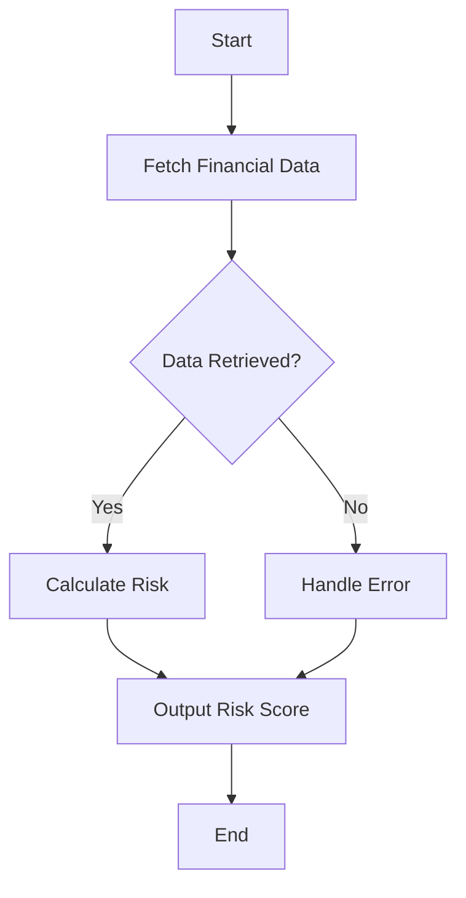

## 10.3. Financial Systems and FP

In the fast-paced world of financial technology (FinTech), the demand for reliable and correct software systems is paramount. Functional programming (FP) offers a robust paradigm that aligns well with these requirements. In this section, we will explore how functional programming patterns enhance the reliability and correctness of financial systems, and we will delve into a case study on building a risk assessment tool using FP concepts.

### Advantages in FinTech

Functional programming brings several advantages to the table when it comes to developing financial systems. Let's explore these benefits in detail:

#### Reliability and Correctness

Functional programming emphasizes immutability and pure functions, which are key to building reliable and correct systems. By avoiding side effects and mutable state, FP reduces the likelihood of bugs and makes it easier to reason about code. This is particularly important in financial systems, where errors can have significant consequences.

- **Immutability**: In FP, data structures are immutable, meaning they cannot be changed once created. This eliminates a class of bugs related to shared mutable state, which is a common source of errors in concurrent and parallel systems.
  
- **Pure Functions**: Functions in FP are pure, meaning they always produce the same output for the same input and have no side effects. This predictability simplifies testing and debugging, as functions can be tested in isolation.

- **Referential Transparency**: FP ensures that expressions can be replaced with their corresponding values without changing the program's behavior. This property makes reasoning about code and refactoring much easier.

#### Concurrency and Parallelism

Financial systems often require handling large volumes of data and performing complex computations. FP's emphasis on immutability and pure functions makes it well-suited for concurrent and parallel processing, as there are no concerns about race conditions or data corruption.

- **Concurrency**: FP languages often provide powerful abstractions for managing concurrency, such as actors and message-passing models, which simplify the development of concurrent systems.

- **Parallelism**: FP's immutability and pure functions enable safe parallel execution, allowing financial systems to leverage multi-core processors effectively.

#### Expressiveness and Modularity

FP languages offer expressive syntax and powerful abstractions that enhance code readability and maintainability. This expressiveness allows developers to write concise and clear code, which is crucial for complex financial systems.

- **Higher-Order Functions**: FP languages support higher-order functions, which enable developers to create reusable and composable components. This modularity simplifies code maintenance and enhances code reuse.

- **Pattern Matching**: Many FP languages provide pattern matching, a powerful feature for deconstructing data structures and handling different cases elegantly. This feature is particularly useful in financial systems for processing diverse data formats.

### Case Study: Building a Risk Assessment Tool

To illustrate the advantages of functional programming in financial systems, let's walk through a case study of building a risk assessment tool. This tool will analyze financial data to assess the risk associated with different investment portfolios.

#### Design Pattern: Monad Pattern

In this case study, we will utilize the Monad pattern to handle computations that may involve failure or uncertainty. The Monad pattern provides a way to chain operations while managing side effects, such as error handling or logging.

#### Key Participants

- **Data Sources**: The tool will gather data from various financial data sources, such as stock prices, economic indicators, and historical performance data.

- **Risk Models**: We will implement different risk models to evaluate the risk associated with each portfolio. These models will be represented as pure functions.

- **Monad for Error Handling**: We will use the `Either` monad to handle potential errors in data retrieval and computation. The `Either` monad allows us to represent computations that can result in a value or an error.

#### Applicability

The Monad pattern is applicable in scenarios where computations may fail or involve side effects. In our risk assessment tool, we will use the Monad pattern to handle errors gracefully and ensure that our computations remain pure and predictable.

#### Sample Code Snippets

Let's start by defining the `Either` monad in pseudocode:

```pseudocode
class Either:
    def __init__(self, value, is_right):
        self.value = value
        self.is_right = is_right

    def map(self, func):
        if self.is_right:
            return Either(func(self.value), True)
        return self

    def flat_map(self, func):
        if self.is_right:
            return func(self.value)
        return self

    @staticmethod
    def right(value):
        return Either(value, True)

    @staticmethod
    def left(value):
        return Either(value, False)
```

In this pseudocode, the `Either` class represents a computation that can either succeed (`Right`) or fail (`Left`). The `map` and `flat_map` methods allow us to chain operations while handling errors gracefully.

Next, let's define a function to retrieve financial data:

```pseudocode
def fetch_financial_data(source):
    try:
        data = retrieve_data_from_source(source)
        return Either.right(data)
    except Exception as e:
        return Either.left(f"Error fetching data: {e}")
```

This function attempts to retrieve data from a given source and returns an `Either` monad representing the success or failure of the operation.

Now, let's implement a risk model as a pure function:

```pseudocode
def calculate_risk(portfolio):
    # Perform risk calculations based on portfolio data
    risk_score = complex_risk_calculation(portfolio)
    return risk_score
```

Finally, let's chain these operations using the `Either` monad:

```pseudocode
def assess_portfolio_risk(portfolio, data_source):
    return fetch_financial_data(data_source).flat_map(lambda data:
        Either.right(calculate_risk(portfolio))
    )
```

In this code, we use the `flat_map` method to chain the data retrieval and risk calculation operations. If data retrieval fails, the computation short-circuits, and the error is propagated.

#### Design Considerations

When using the Monad pattern, it's important to consider the following:

- **Error Propagation**: Ensure that errors are propagated correctly through the chain of operations. The `Either` monad provides a structured way to handle errors without resorting to exceptions.

- **Composability**: The Monad pattern enhances composability by allowing operations to be chained together. This composability simplifies the construction of complex workflows.

- **Testing**: The use of pure functions and monads simplifies testing, as each function can be tested in isolation. Ensure that your tests cover both successful and error scenarios.

#### Programming Language Specifics

While the pseudocode examples provided here illustrate the concepts, it's important to note that different programming languages have their own idiomatic ways of implementing monads. For example, Haskell provides built-in support for monads, while languages like JavaScript and Python require libraries or custom implementations.

#### Differences and Similarities

The Monad pattern is often compared to the Functor and Applicative Functor patterns. While all three patterns deal with computations in a context, the Monad pattern provides additional capabilities for chaining operations and handling side effects.

### Visualizing the Risk Assessment Workflow

To better understand the workflow of our risk assessment tool, let's visualize it using a flowchart:



This flowchart illustrates the sequence of operations in our risk assessment tool, highlighting the decision points and error handling.

### Try It Yourself

Now that we've explored the concepts and code examples, it's time to try it yourself! Here are some suggestions for experimentation:

- **Modify the Risk Model**: Implement additional risk models and compare their outputs. Experiment with different risk factors and see how they affect the risk score.

- **Extend Data Sources**: Add more data sources to the tool and explore how the `Either` monad handles errors from different sources.

- **Visualize Data**: Create visualizations of the risk scores for different portfolios. Use charts or graphs to represent the data in a more intuitive way.

### Knowledge Check

Before we conclude, let's reinforce our understanding with a few questions:

1. What are the key advantages of using functional programming in financial systems?
2. How does the `Either` monad help in handling errors in our risk assessment tool?
3. What are the benefits of using pure functions in financial computations?

### Embrace the Journey

Remember, this is just the beginning. As you continue to explore functional programming, you'll discover more patterns and techniques that can enhance the reliability and correctness of your financial systems. Keep experimenting, stay curious, and enjoy the journey!

### References and Links

For further reading on functional programming and financial systems, consider exploring the following resources:

- [Functional Programming in Scala](https://www.manning.com/books/functional-programming-in-scala)
- [Haskell Programming from First Principles](https://haskellbook.com/)
- [Category Theory for Programmers](https://bartoszmilewski.com/category/category-theory/)

## Quiz Time!



### What is a key advantage of using functional programming in financial systems?

- [x] Reliability and correctness
- [ ] Faster execution speed
- [ ] Easier syntax
- [ ] Lower memory usage

> **Explanation:** Functional programming emphasizes immutability and pure functions, which enhance reliability and correctness.

### How does the `Either` monad help in handling errors?

- [x] It allows chaining operations while managing errors
- [ ] It automatically retries failed operations
- [ ] It logs errors to a file
- [ ] It ignores errors

> **Explanation:** The `Either` monad provides a structured way to handle errors by chaining operations and propagating errors.

### What is the benefit of using pure functions in financial computations?

- [x] Predictable behavior and easier testing
- [ ] Faster execution
- [ ] Reduced memory usage
- [ ] Simplified syntax

> **Explanation:** Pure functions always produce the same output for the same input, making them predictable and easy to test.

### What does immutability in functional programming help prevent?

- [x] Bugs related to shared mutable state
- [ ] Syntax errors
- [ ] Compilation errors
- [ ] Network latency

> **Explanation:** Immutability eliminates bugs related to shared mutable state, which is a common source of errors in concurrent systems.

### Which pattern is often compared to the Monad pattern?

- [x] Functor
- [ ] Singleton
- [x] Applicative Functor
- [ ] Observer

> **Explanation:** The Monad pattern is often compared to the Functor and Applicative Functor patterns, as they all deal with computations in a context.

### What is a common use case for the Monad pattern?

- [x] Handling computations that may fail
- [ ] Optimizing memory usage
- [ ] Improving execution speed
- [ ] Simplifying syntax

> **Explanation:** The Monad pattern is commonly used to handle computations that may fail or involve side effects.

### What does referential transparency allow in functional programming?

- [x] Replacing expressions with their corresponding values
- [ ] Faster execution
- [x] Easier refactoring
- [ ] Lower memory usage

> **Explanation:** Referential transparency allows expressions to be replaced with their corresponding values without changing the program's behavior.

### What is a benefit of using higher-order functions in FP?

- [x] Enhanced code modularity and reusability
- [ ] Faster execution
- [ ] Reduced memory usage
- [ ] Simplified syntax

> **Explanation:** Higher-order functions enable developers to create reusable and composable components, enhancing code modularity and reusability.

### What is a key feature of pattern matching in FP languages?

- [x] Deconstructing data structures elegantly
- [ ] Faster execution
- [ ] Reduced memory usage
- [ ] Simplified syntax

> **Explanation:** Pattern matching allows for elegant deconstruction of data structures and handling different cases.

### True or False: Functional programming is only suitable for academic purposes.

- [ ] True
- [x] False

> **Explanation:** Functional programming is widely used in industry, particularly in areas like FinTech, where reliability and correctness are crucial.


