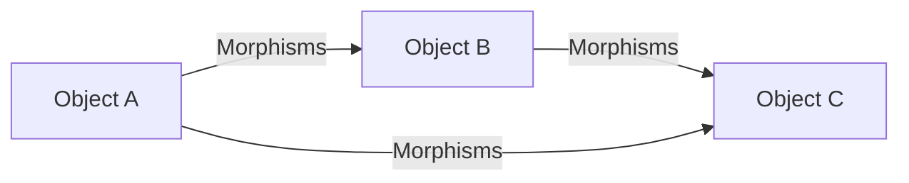
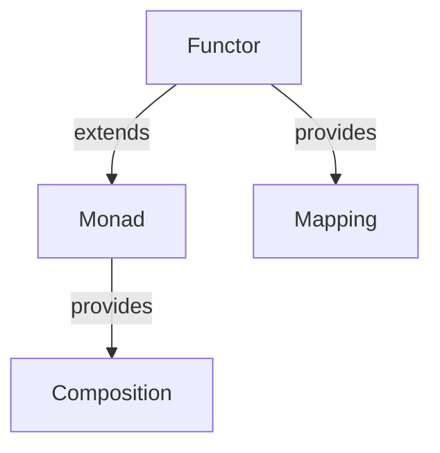

## 11.1. Category Theory and Functional Programming

Category theory, a branch of mathematics, provides a high-level, abstract framework for understanding and structuring mathematical concepts. It has found a significant place in functional programming (FP) due to its ability to abstract and generalize patterns and structures. In this section, we will explore the fundamental concepts of category theory—objects, morphisms, functors, and monads—and their relevance to functional programming.

### Fundamental Concepts

#### Objects and Morphisms

**Objects** and **morphisms** are the foundational elements of category theory. In simple terms, objects can be thought of as entities or points, while morphisms (also known as arrows) represent relationships or transformations between these objects.

- **Objects**: In the context of functional programming, objects can represent data types or values.
- **Morphisms**: Morphisms are akin to functions in FP, representing transformations from one object (or type) to another.

##### Diagram: Objects and Morphisms



*Caption: This diagram illustrates objects A, B, and C with morphisms (arrows) representing transformations between them.*

**Key Properties of Morphisms:**

1. **Identity Morphism**: For every object, there exists an identity morphism that maps the object to itself.
2. **Composition**: Morphisms can be composed, meaning if there is a morphism from object A to B and another from B to C, there is a composite morphism from A to C.

#### Functors

A **functor** is a mapping between categories that preserves the structure of categories. In functional programming, functors are often used to apply functions over wrapped values, such as those in containers or data structures.

- **Definition**: A functor is a type that implements a `map` function, which applies a function to the value inside the functor, returning a new functor.

##### Pseudocode Example: Functor

```pseudocode
class Functor:
    def __init__(self, value):
        self.value = value

    def map(self, func):
        return Functor(func(self.value))

number = Functor(5)
incremented = number.map(lambda x: x + 1)  # Functor(6)
```

*Comments: This pseudocode defines a simple functor with a `map` method that applies a function to its contained value.*

**Properties of Functors:**

1. **Identity**: Mapping the identity function over a functor should return the same functor.
2. **Composition**: Mapping a composition of two functions should be the same as mapping one function and then the other.

#### Monads

Monads are a powerful abstraction that extends the concept of functors. They are used to handle side effects, manage state, or encapsulate computations in a functional way.

- **Definition**: A monad is a type that implements two operations: `bind` (or `flatMap`) and `unit` (or `return`).

##### Pseudocode Example: Monad

```pseudocode
class Monad:
    def __init__(self, value):
        self.value = value

    def bind(self, func):
        return func(self.value)

    @staticmethod
    def unit(value):
        return Monad(value)

monad = Monad.unit(5)
result = monad.bind(lambda x: Monad.unit(x + 1))  # Monad(6)
```

*Comments: This pseudocode demonstrates a basic monad with `bind` and `unit` methods, allowing for chaining operations.*

**Monad Laws:**

1. **Left Identity**: `unit(a).bind(f)` is equivalent to `f(a)`.
2. **Right Identity**: `m.bind(unit)` is equivalent to `m`.
3. **Associativity**: `(m.bind(f)).bind(g)` is equivalent to `m.bind(lambda x: f(x).bind(g))`.

### Relevance to Functional Programming

Category theory provides a robust framework for understanding and structuring functional programming concepts. By abstracting patterns and structures, it allows developers to write more modular, reusable, and composable code.

#### Abstracting Patterns and Structures

1. **Modularity**: By using functors and monads, we can create modular code that separates concerns and encapsulates side effects.
2. **Reusability**: Functors and monads enable the creation of reusable components that can be easily composed and extended.
3. **Composability**: The ability to compose functions and operations is a core principle of functional programming, and category theory provides the mathematical foundation for this.

#### Diagram: Functor and Monad Relationships



*Caption: This diagram shows the relationship between functors and monads, highlighting how monads extend the concept of functors to provide composition.*

### Try It Yourself

To deepen your understanding of these concepts, try modifying the pseudocode examples provided:

1. **Functor Exercise**: Implement a functor for a list of numbers and apply a function that doubles each number.
2. **Monad Exercise**: Create a monad that handles optional values (similar to the Maybe monad) and implement a safe division operation.

### Knowledge Check

- **Question**: What is the primary difference between a functor and a monad?
- **Question**: How do identity and composition properties apply to functors?

### Embrace the Journey

Remember, category theory is a vast and complex field, but its principles can greatly enhance your functional programming skills. Keep exploring, experimenting, and applying these concepts to real-world problems. As you progress, you'll find that category theory provides a powerful lens through which to view and solve programming challenges.

## Quiz Time!



### What are the two main components of category theory?

- [x] Objects and morphisms
- [ ] Functions and variables
- [ ] Classes and objects
- [ ] Loops and conditions

> **Explanation:** Category theory is fundamentally about objects and morphisms, which represent entities and transformations, respectively.

### What is a functor in functional programming?

- [x] A type that implements a `map` function
- [ ] A type that implements a `bind` function
- [ ] A type that implements a `reduce` function
- [ ] A type that implements a `filter` function

> **Explanation:** A functor is a type that provides a `map` function to apply a function over a wrapped value.

### Which of the following is a property of functors?

- [x] Identity
- [x] Composition
- [ ] Associativity
- [ ] Inversion

> **Explanation:** Functors must satisfy the identity and composition properties, ensuring consistent mapping behavior.

### What is the purpose of a monad in functional programming?

- [x] To handle side effects and encapsulate computations
- [ ] To perform arithmetic operations
- [ ] To manage memory allocation
- [ ] To create user interfaces

> **Explanation:** Monads are used to manage side effects and encapsulate computations in a functional way.

### Which operation is specific to monads?

- [x] Bind
- [ ] Map
- [ ] Filter
- [ ] Reduce

> **Explanation:** The `bind` operation is specific to monads, allowing for chaining computations.

### What is the left identity law for monads?

- [x] `unit(a).bind(f)` is equivalent to `f(a)`
- [ ] `m.bind(unit)` is equivalent to `m`
- [ ] `(m.bind(f)).bind(g)` is equivalent to `m.bind(lambda x: f(x).bind(g))`
- [ ] `f(a).bind(unit)` is equivalent to `unit(a)`

> **Explanation:** The left identity law states that wrapping a value in a monad and then binding it to a function is equivalent to applying the function directly.

### How do functors and monads relate?

- [x] Monads extend the concept of functors
- [ ] Functors extend the concept of monads
- [ ] They are unrelated
- [ ] They are identical

> **Explanation:** Monads extend functors by providing additional operations like `bind` for chaining computations.

### What is the identity morphism?

- [x] A morphism that maps an object to itself
- [ ] A morphism that maps an object to another object
- [ ] A morphism that maps a function to a variable
- [ ] A morphism that maps a class to an object

> **Explanation:** The identity morphism is a morphism that maps an object to itself, maintaining its identity.

### What is the primary benefit of using category theory in functional programming?

- [x] Abstracting patterns and structures
- [ ] Increasing execution speed
- [ ] Reducing memory usage
- [ ] Simplifying syntax

> **Explanation:** Category theory helps abstract patterns and structures, making code more modular and composable.

### True or False: Functors and monads are only applicable in functional programming languages.

- [ ] True
- [x] False

> **Explanation:** While functors and monads are prominent in functional programming, they can be applied in other paradigms as well.



By understanding and applying the principles of category theory, you can enhance your functional programming skills and create more robust, modular, and reusable code. Keep exploring these concepts, and you'll find new ways to solve complex programming challenges.
