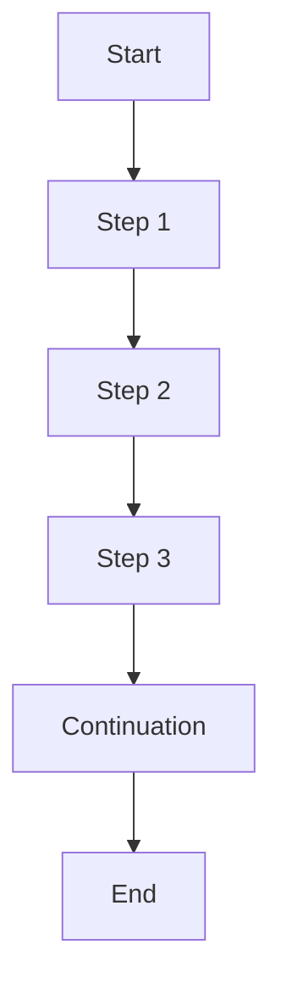

## 11.2. Continuation-Passing Style (CPS)

In the realm of functional programming, Continuation-Passing Style (CPS) is a powerful pattern that transforms the way we manage control flow and asynchronous operations. By converting functions to CPS, we can gain finer control over execution order, handle asynchronous tasks more gracefully, and even simplify complex control structures. In this section, we will delve into the intricacies of CPS, explore its applications, and provide comprehensive pseudocode implementations to solidify your understanding.

### Understanding Continuation-Passing Style

**Continuation-Passing Style (CPS)** is a style of programming where control is passed explicitly in the form of a continuation. A continuation represents "the rest of the computation" at any given point in a program. Instead of returning results directly, functions in CPS receive an additional argument: a continuation function that specifies what to do next.

#### Key Concepts

- **Continuation**: A function that represents the future steps of computation. It is passed as an argument to other functions.
- **Direct Style vs. CPS**: In direct style, functions return values directly. In CPS, functions pass results to continuation functions.
- **Non-blocking Execution**: CPS is particularly useful for non-blocking operations, such as asynchronous I/O, where the program can continue executing other tasks while waiting for a result.

### Transforming Code for Control Flow

CPS can transform code to manage complex control flows, such as loops, conditionals, and asynchronous operations. By using continuations, we can decouple the logic of what to do next from the current computation, allowing for more flexible and modular code.

#### Example: Simple Function in Direct Style

Let's start with a simple function in direct style that adds two numbers:

```pseudocode
function add(x, y) {
    return x + y
}
```

#### Transforming to CPS

To convert this function to CPS, we introduce a continuation function `k` that will receive the result of the addition:

```pseudocode
function addCPS(x, y, k) {
    k(x + y)
}
```

Here, `addCPS` does not return a value directly. Instead, it calls the continuation `k` with the result.

### Managing Asynchronous Operations

CPS is particularly advantageous for handling asynchronous operations, such as network requests or file I/O, where the program should not block waiting for a result.

#### Example: Asynchronous Operation in Direct Style

Consider a function that fetches data from a server:

```pseudocode
function fetchData(url) {
    // Simulate a network request
    let data = networkRequest(url)
    return data
}
```

In a synchronous environment, this function would block until the network request completes.

#### Transforming to CPS for Asynchronous Handling

In CPS, we can handle this operation asynchronously by passing a continuation that processes the data once it's available:

```pseudocode
function fetchDataCPS(url, k) {
    networkRequestAsync(url, function(data) {
        k(data)
    })
}
```

Here, `networkRequestAsync` is a non-blocking function that takes a callback (our continuation `k`) to handle the data once the request completes.

### Pseudocode Implementations

Let's explore more complex examples and pseudocode implementations to deepen our understanding of CPS.

#### Example: CPS with Nested Computations

Consider a scenario where we need to perform multiple computations in sequence. In direct style, this might look like:

```pseudocode
function compute(x) {
    let result1 = step1(x)
    let result2 = step2(result1)
    return step3(result2)
}
```

In CPS, we can transform this into a series of nested continuations:

```pseudocode
function computeCPS(x, k) {
    step1CPS(x, function(result1) {
        step2CPS(result1, function(result2) {
            step3CPS(result2, k)
        })
    })
}
```

Each step is transformed into a CPS function that takes a continuation, allowing us to chain computations seamlessly.

#### Example: Error Handling in CPS

CPS also provides a natural way to handle errors by introducing an error continuation. Let's modify our previous example to include error handling:

```pseudocode
function computeCPSWithErrorHandling(x, k, errorK) {
    step1CPS(x, function(result1) {
        step2CPS(result1, function(result2) {
            step3CPS(result2, k, errorK)
        }, errorK)
    }, errorK)
}
```

Here, `errorK` is a continuation that handles errors, allowing us to propagate errors through the computation chain.

### Visualizing CPS

To better understand CPS, let's visualize the flow of control using a diagram. This diagram represents the flow of a simple CPS computation with three steps.



**Diagram Description**: This flowchart illustrates a CPS computation with three sequential steps, each passing control to the next via a continuation.

### Try It Yourself

To truly grasp CPS, try modifying the provided pseudocode examples. Here are some suggestions:

- **Add More Steps**: Extend the `computeCPS` function with additional steps, each with its own continuation.
- **Introduce Delays**: Simulate asynchronous operations by introducing delays in the continuations.
- **Implement Error Handling**: Modify the examples to include error handling continuations, experimenting with different error scenarios.

### Design Considerations

When using CPS, consider the following:

- **Readability**: CPS can lead to deeply nested code, sometimes referred to as "callback hell." Use helper functions to flatten the structure.
- **Performance**: CPS can introduce overhead due to additional function calls. Consider the trade-offs between flexibility and performance.
- **Debugging**: Debugging CPS code can be challenging due to the non-linear control flow. Use logging and tracing to track execution.

### Differences and Similarities

CPS is often compared to other asynchronous patterns, such as promises and async/await in JavaScript. While promises and async/await provide syntactic sugar for handling asynchronous operations, CPS offers more granular control over execution flow.

### Programming Language Specifics

CPS is a concept that can be implemented in any language that supports first-class functions. However, some languages, like Scheme and Haskell, have built-in support for CPS transformations, making it easier to work with continuations.

### References and Links

For further reading on CPS and its applications, consider the following resources:

- [MDN Web Docs on Asynchronous Programming](https://developer.mozilla.org/en-US/docs/Learn/JavaScript/Asynchronous)
- [Wikipedia on Continuation-Passing Style](https://en.wikipedia.org/wiki/Continuation-passing_style)

### Knowledge Check

To reinforce your understanding of CPS, consider the following questions:

- What is a continuation in the context of CPS?
- How does CPS differ from direct style programming?
- What are the benefits of using CPS for asynchronous operations?

### Embrace the Journey

Remember, mastering CPS is a journey. As you experiment with the examples and explore new applications, you'll gain a deeper understanding of control flow and asynchronous programming. Keep experimenting, stay curious, and enjoy the journey!

## Quiz Time!



### What is a continuation in CPS?

- [x] A function representing the rest of the computation
- [ ] A variable storing intermediate results
- [ ] A loop controlling execution flow
- [ ] A data structure for managing state

> **Explanation:** In CPS, a continuation is a function that represents the future steps of computation.

### How does CPS differ from direct style programming?

- [x] Functions pass results to continuations instead of returning them
- [ ] Functions return results directly
- [ ] Functions use global variables for state management
- [ ] Functions rely on loops for control flow

> **Explanation:** In CPS, functions pass results to continuation functions, whereas direct style functions return results directly.

### What is a key benefit of using CPS for asynchronous operations?

- [x] Non-blocking execution
- [ ] Simplified syntax
- [ ] Reduced memory usage
- [ ] Increased execution speed

> **Explanation:** CPS allows for non-blocking execution, making it ideal for handling asynchronous operations.

### In CPS, what role does the continuation function play?

- [x] It specifies what to do next with the result
- [ ] It stores the result of the computation
- [ ] It initializes the computation
- [ ] It terminates the program

> **Explanation:** The continuation function in CPS specifies the next steps to take with the result of a computation.

### What is a common challenge when working with CPS?

- [x] Deeply nested code
- [ ] Lack of flexibility
- [ ] Limited language support
- [ ] Inability to handle errors

> **Explanation:** CPS can lead to deeply nested code, sometimes referred to as "callback hell."

### How can CPS be used to handle errors?

- [x] By introducing an error continuation
- [ ] By using global error flags
- [ ] By returning error codes
- [ ] By ignoring errors

> **Explanation:** CPS can handle errors by introducing an error continuation that propagates errors through the computation chain.

### What is a potential performance consideration when using CPS?

- [x] Overhead from additional function calls
- [ ] Increased memory usage
- [ ] Slower execution speed
- [ ] Reduced code readability

> **Explanation:** CPS can introduce overhead due to additional function calls, impacting performance.

### Which languages have built-in support for CPS transformations?

- [x] Scheme and Haskell
- [ ] JavaScript and Python
- [ ] Java and C#
- [ ] C++ and Rust

> **Explanation:** Languages like Scheme and Haskell have built-in support for CPS transformations.

### What is a common use case for CPS?

- [x] Managing asynchronous operations
- [ ] Optimizing memory usage
- [ ] Simplifying syntax
- [ ] Enhancing code readability

> **Explanation:** CPS is commonly used for managing asynchronous operations due to its non-blocking nature.

### True or False: CPS can only be implemented in functional programming languages.

- [ ] True
- [x] False

> **Explanation:** CPS can be implemented in any language that supports first-class functions, not just functional programming languages.


