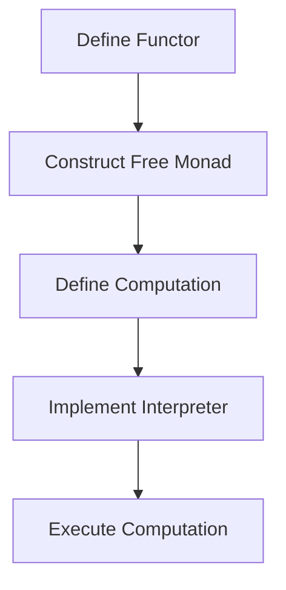

## 11.3. Free Monads and Interpreters

In the realm of functional programming, monads are a powerful abstraction that allows us to encapsulate computations with context, such as handling side effects, managing state, or dealing with errors. However, traditional monads can sometimes be too rigid, especially when we want to build interpreters that can execute or transform computations in different ways. This is where **Free Monads** come into play, offering a flexible way to define computations that can be interpreted in multiple contexts.

### Introduction to Free Monads

#### What Are Free Monads?

Free Monads are a type of monad that provides a way to build computations as data structures that can be interpreted later. They are called "free" because they are constructed without any specific interpretation in mind, allowing for maximum flexibility. This makes them particularly useful for building interpreters, as they separate the definition of a computation from its execution.

#### Why Use Free Monads?

Free Monads offer several advantages:

- **Separation of Concerns**: They allow you to define the structure of computations independently from their execution logic.
- **Flexibility**: You can interpret the same computation in different ways, such as logging, testing, or executing in different environments.
- **Composability**: They enable the composition of complex computations from simpler ones, enhancing modularity and reusability.

#### Key Concepts

Before diving into Free Monads, let's revisit some foundational concepts:

- **Functor**: A type that implements a `map` function, allowing you to apply a function to the values inside the functor.
- **Monad**: A type that implements `bind` (or `flatMap`) and `unit` (or `return`), enabling chaining of computations.
- **Interpreter**: A component that executes or transforms a computation, often by traversing a data structure representing the computation.

### Building Free Monads

To understand Free Monads, we need to explore how they are constructed and used. Let's break down the process step by step.

#### Defining a Functor

The first step in creating a Free Monad is to define a functor that represents the basic operations of your computation. This functor will serve as the building block for constructing the Free Monad.

```pseudocode
// Define a simple functor for a logging operation
data LogF[A] = 
  | Info(String, A)
  | Warn(String, A)
  | Error(String, A)

// Implement the Functor interface
function map(f: A -> B, log: LogF[A]): LogF[B] {
  match log {
    case Info(msg, a) => Info(msg, f(a))
    case Warn(msg, a) => Warn(msg, f(a))
    case Error(msg, a) => Error(msg, f(a))
  }
}
```

In this example, `LogF` is a functor that represents logging operations with three levels: `Info`, `Warn`, and `Error`. The `map` function applies a transformation to the result of each operation.

#### Constructing the Free Monad

With the functor defined, we can construct the Free Monad. A Free Monad is essentially a recursive data structure that represents a sequence of operations.

```pseudocode
// Define the Free Monad
data Free[F[_], A] = 
  | Pure(A)
  | Suspend(F[Free[F, A]])

// Implement the Monad interface
function flatMap(f: A -> Free[F, B], free: Free[F, A]): Free[F, B] {
  match free {
    case Pure(a) => f(a)
    case Suspend(fa) => Suspend(map(freeA => flatMap(f, freeA), fa))
  }
}

function unit(a: A): Free[F, A] {
  return Pure(a)
}
```

The `Free` type has two constructors: `Pure`, which represents a completed computation, and `Suspend`, which represents a suspended computation that can be resumed. The `flatMap` function allows chaining of computations, while `unit` lifts a value into the Free Monad.

#### Example: Building a Logging Monad

Let's use the `LogF` functor to build a Free Monad for logging operations.

```pseudocode
// Define a logging operation using the Free Monad
function logInfo(msg: String): Free[LogF, Unit] {
  return Suspend(Info(msg, Pure(Unit)))
}

function logWarn(msg: String): Free[LogF, Unit] {
  return Suspend(Warn(msg, Pure(Unit)))
}

function logError(msg: String): Free[LogF, Unit] {
  return Suspend(Error(msg, Pure(Unit)))
}

// Example usage
let program = flatMap(_ => logWarn("This is a warning"),
              flatMap(_ => logInfo("This is an info"),
              logError("This is an error")))
```

In this example, we define three logging operations (`logInfo`, `logWarn`, `logError`) using the Free Monad. We then compose these operations into a program using `flatMap`.

### Interpreting Free Monads

Once we have defined a computation using a Free Monad, we need an interpreter to execute it. An interpreter traverses the Free Monad structure and performs the corresponding actions.

#### Implementing an Interpreter

Let's implement an interpreter for our logging Free Monad that simply prints the log messages to the console.

```pseudocode
// Define an interpreter for the logging Free Monad
function interpretLog[A](free: Free[LogF, A]): A {
  match free {
    case Pure(a) => return a
    case Suspend(logF) => 
      match logF {
        case Info(msg, next) => 
          print("INFO: " + msg)
          return interpretLog(next)
        case Warn(msg, next) => 
          print("WARN: " + msg)
          return interpretLog(next)
        case Error(msg, next) => 
          print("ERROR: " + msg)
          return interpretLog(next)
      }
  }
}

// Execute the program
interpretLog(program)
```

The `interpretLog` function recursively traverses the Free Monad, executing each logging operation and continuing with the next computation.

### Advanced Concepts

#### Composing Interpreters

One of the powerful features of Free Monads is the ability to compose interpreters. This allows you to define multiple interpretations for the same computation, such as logging to a file or sending logs to a remote server.

```pseudocode
// Define a file-based interpreter
function interpretLogToFile[A](free: Free[LogF, A], file: File): A {
  match free {
    case Pure(a) => return a
    case Suspend(logF) => 
      match logF {
        case Info(msg, next) => 
          file.write("INFO: " + msg)
          return interpretLogToFile(next, file)
        case Warn(msg, next) => 
          file.write("WARN: " + msg)
          return interpretLogToFile(next, file)
        case Error(msg, next) => 
          file.write("ERROR: " + msg)
          return interpretLogToFile(next, file)
      }
  }
}

// Example usage
let logFile = openFile("logs.txt")
interpretLogToFile(program, logFile)
```

In this example, we define a file-based interpreter that writes log messages to a file instead of printing them to the console.

#### Combining Free Monads

Free Monads can also be combined to represent computations involving multiple effects. This is achieved by defining a coproduct of functors.

```pseudocode
// Define a coproduct of two functors
data Coproduct[F[_], G[_], A] = 
  | Inl(F[A])
  | Inr(G[A])

// Example: Combining logging and state functors
data StateF[S, A] = 
  | Get(S -> A)
  | Put(S, A)

type CombinedF[A] = Coproduct[LogF, StateF, A]
```

The `Coproduct` type represents a choice between two functors, allowing you to combine their operations into a single Free Monad.

### Visualizing Free Monads and Interpreters

To better understand the flow of Free Monads and Interpreters, let's visualize the process using a diagram.



**Diagram Description**: This flowchart illustrates the process of using Free Monads and Interpreters. We start by defining a functor, construct a Free Monad, define a computation, implement an interpreter, and finally execute the computation.

### Try It Yourself

Now that we've covered the basics of Free Monads and Interpreters, it's time to experiment with the concepts. Here are some suggestions for modifications and extensions:

- **Modify the Functor**: Add new operations to the `LogF` functor, such as `Debug` or `Trace`, and update the interpreter to handle them.
- **Create a New Interpreter**: Implement an interpreter that sends log messages to a remote server using HTTP requests.
- **Combine Effects**: Define a new functor for state management and combine it with `LogF` using a coproduct. Implement an interpreter that handles both logging and state operations.

### Key Takeaways

- **Free Monads** provide a flexible way to define computations as data structures, separating their definition from execution.
- **Interpreters** traverse Free Monads to execute or transform computations, allowing for multiple interpretations.
- **Composability** and **flexibility** are key advantages of Free Monads, enabling complex computations to be built from simpler ones.

### References and Further Reading

- [Free Monads on Wikipedia](https://en.wikipedia.org/wiki/Free_monad)
- [Functional Programming in Scala](https://www.manning.com/books/functional-programming-in-scala)
- [Haskell Wiki on Free Monads](https://wiki.haskell.org/Free_monad)

## Quiz Time!



### What is a Free Monad?

- [x] A monad that represents computations as data structures, allowing for flexible interpretation.
- [ ] A monad that is predefined and cannot be modified.
- [ ] A monad that only works with pure functions.
- [ ] A monad that is specific to logging operations.

> **Explanation:** A Free Monad is a monad that represents computations as data structures, allowing them to be interpreted in various ways.

### What is the primary advantage of using Free Monads?

- [x] They separate the definition of computations from their execution.
- [ ] They are faster than traditional monads.
- [ ] They are easier to implement than other monads.
- [ ] They only work with immutable data.

> **Explanation:** Free Monads separate the definition of computations from their execution, allowing for flexible interpretation.

### What is the role of an interpreter in the context of Free Monads?

- [x] To execute or transform computations represented by Free Monads.
- [ ] To define the structure of computations.
- [ ] To create new functors.
- [ ] To manage state within computations.

> **Explanation:** An interpreter executes or transforms computations represented by Free Monads, traversing their structure.

### How can Free Monads be combined to represent multiple effects?

- [x] By using a coproduct of functors.
- [ ] By nesting Free Monads within each other.
- [ ] By defining multiple interpreters.
- [ ] By using higher-order functions.

> **Explanation:** Free Monads can be combined using a coproduct of functors, allowing multiple effects to be represented.

### What is a functor in the context of Free Monads?

- [x] A type that implements a `map` function, serving as a building block for Free Monads.
- [ ] A type that implements a `flatMap` function.
- [ ] A type that represents a completed computation.
- [ ] A type that only works with logging operations.

> **Explanation:** A functor is a type that implements a `map` function, serving as a building block for Free Monads.

### Which of the following is NOT a benefit of using Free Monads?

- [ ] Separation of concerns.
- [ ] Flexibility in interpretation.
- [ ] Composability of computations.
- [x] Guaranteed performance improvement.

> **Explanation:** While Free Monads offer separation of concerns, flexibility, and composability, they do not inherently guarantee performance improvement.

### What does the `Suspend` constructor represent in a Free Monad?

- [x] A suspended computation that can be resumed.
- [ ] A completed computation.
- [ ] A functor operation.
- [ ] An error state.

> **Explanation:** The `Suspend` constructor represents a suspended computation that can be resumed in a Free Monad.

### How can you modify the behavior of a Free Monad computation?

- [x] By implementing different interpreters.
- [ ] By changing the functor definition.
- [ ] By using nested Free Monads.
- [ ] By altering the `Pure` constructor.

> **Explanation:** You can modify the behavior of a Free Monad computation by implementing different interpreters.

### What is the purpose of the `flatMap` function in a Free Monad?

- [x] To allow chaining of computations.
- [ ] To execute the computation.
- [ ] To define new functor operations.
- [ ] To handle errors within computations.

> **Explanation:** The `flatMap` function allows chaining of computations in a Free Monad.

### True or False: Free Monads can only be used for logging operations.

- [ ] True
- [x] False

> **Explanation:** False. Free Monads can be used for a wide range of operations, not just logging.


