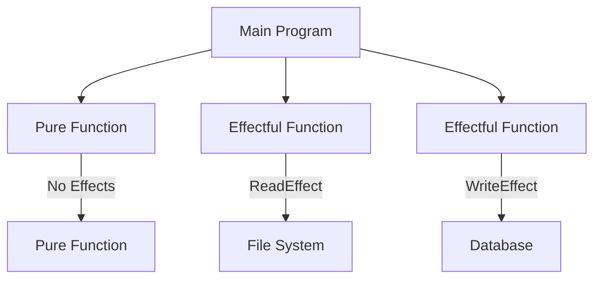
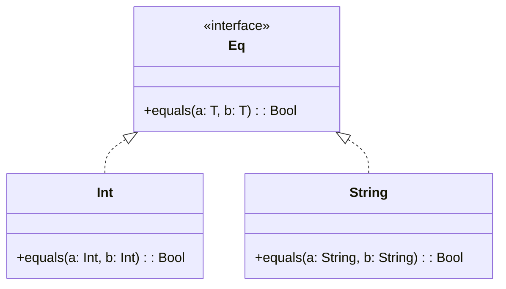

## 11.4. Effect Systems and Type-Level Programming

In the realm of functional programming, managing side effects and enforcing constraints are crucial for maintaining code safety, reliability, and predictability. Effect systems and type-level programming are two advanced concepts that address these challenges. This section delves into these topics, providing a comprehensive understanding of how they enhance functional programming paradigms.

### Managing Side Effects Safely

Functional programming emphasizes pure functions and immutability, but real-world applications often require interactions with external systems, such as databases, file systems, or user interfaces, which inherently involve side effects. Effect systems provide a structured way to handle these side effects, ensuring that they are managed safely and predictably.

#### What Are Effect Systems?

Effect systems extend the type system of a programming language to track and manage side effects. They allow developers to specify the effects that a function may have, such as reading from or writing to a file, modifying a global variable, or performing network operations. By doing so, effect systems help ensure that side effects are explicit and controlled, reducing the risk of unintended consequences.

##### Key Concepts of Effect Systems

- **Effect Annotations**: Functions are annotated with the effects they may produce. This makes the effects explicit and allows the compiler to enforce constraints on how these effects are used.
- **Effect Polymorphism**: Similar to type polymorphism, effect polymorphism allows functions to be written generically, operating over a range of effects.
- **Effect Inference**: Some languages can infer the effects of a function automatically, reducing the burden on the programmer.

#### Example: Effect System in Action

Consider a simple example where we want to read a file and process its contents. In a language with an effect system, we might annotate the function as follows:

```pseudocode
function readFileAndProcess(filePath: String): [ReadEffect] -> ProcessedData {
    // Read the file contents
    let contents = readFile(filePath)
    // Process the contents
    return processData(contents)
}
```

In this pseudocode, `[ReadEffect]` indicates that the function has a side effect of reading from a file. The effect system ensures that this effect is handled appropriately, preventing the function from being used in contexts where reading from a file is not allowed.

#### Benefits of Effect Systems

- **Explicit Side Effects**: By making side effects explicit, effect systems improve code readability and maintainability.
- **Compile-Time Safety**: Effect systems can catch potential side effect-related errors at compile time, reducing runtime errors.
- **Modular Code**: Effect systems encourage modular code by separating pure logic from side-effecting operations.

#### Visualizing Effect Systems

To better understand how effect systems work, consider the following diagram that illustrates the flow of effects through a program:



**Diagram Description**: This diagram shows how pure functions and effectful functions interact within a program. Pure functions have no effects, while effectful functions interact with external systems like the file system and database, with their effects explicitly annotated.

### Advanced Type Features

Type-level programming involves using types to enforce constraints and encode logic at the type level, providing additional safety and expressiveness in functional programming. This section explores advanced type features such as dependent types and type classes.

#### Dependent Types

Dependent types are types that depend on values. They allow for more expressive type systems by enabling types to be parameterized by values, leading to stronger guarantees about program behavior.

##### Example: Dependent Types

Consider a function that takes an array and an index, returning the element at that index. With dependent types, we can ensure that the index is always within the bounds of the array:

```pseudocode
function getElementAtIndex<T, N>(array: Array<T, N>, index: Int): T where 0 <= index < N {
    return array[index]
}
```

In this pseudocode, `Array<T, N>` represents an array of type `T` with length `N`, and the function signature ensures that the index is within bounds.

#### Benefits of Dependent Types

- **Stronger Guarantees**: Dependent types provide stronger guarantees about program correctness by encoding invariants directly in the type system.
- **Reduced Runtime Errors**: By catching more errors at compile time, dependent types reduce the likelihood of runtime errors.

#### Type Classes

Type classes are a feature of some functional programming languages that allow for ad-hoc polymorphism. They enable functions to operate on a variety of types, provided those types implement certain behaviors.

##### Example: Type Classes

Consider a type class for equality:

```pseudocode
typeclass Eq<T> {
    function equals(a: T, b: T): Bool
}

instance Eq<Int> {
    function equals(a: Int, b: Int): Bool {
        return a == b
    }
}

instance Eq<String> {
    function equals(a: String, b: String): Bool {
        return a.equals(b)
    }
}
```

In this pseudocode, `Eq` is a type class that defines an `equals` function. We provide instances for `Int` and `String`, allowing us to compare these types for equality.

#### Benefits of Type Classes

- **Code Reusability**: Type classes promote code reusability by allowing functions to operate on any type that implements the required behavior.
- **Abstraction**: Type classes provide a way to abstract over behavior, making code more flexible and adaptable.

#### Visualizing Type-Level Programming

The following diagram illustrates how type classes and dependent types interact within a program:



**Diagram Description**: This diagram shows the relationship between the `Eq` type class and its instances for `Int` and `String`. The `Eq` type class defines the `equals` method, which is implemented by both `Int` and `String`.

### Try It Yourself

To deepen your understanding of effect systems and type-level programming, try modifying the provided examples:

1. **Effect Systems**: Add a `WriteEffect` to the `readFileAndProcess` function, allowing it to write the processed data to a file. Ensure that the effect system enforces this new effect.

2. **Dependent Types**: Modify the `getElementAtIndex` function to work with a two-dimensional array, ensuring that both row and column indices are within bounds.

3. **Type Classes**: Create a new type class `Show` that defines a `show` method for converting values to strings. Implement instances for `Int` and `String`.

### References and Links

- [Effect Systems](https://en.wikipedia.org/wiki/Effect_system)
- [Dependent Types](https://en.wikipedia.org/wiki/Dependent_type)
- [Type Classes](https://en.wikipedia.org/wiki/Type_class)

### Knowledge Check

- **What are the benefits of using effect systems in functional programming?**
- **How do dependent types enhance the expressiveness of a type system?**
- **What role do type classes play in promoting code reusability?**

### Embrace the Journey

Remember, mastering effect systems and type-level programming is a journey. As you explore these advanced concepts, you'll gain a deeper understanding of how to write safer, more expressive code. Keep experimenting, stay curious, and enjoy the journey!

## Quiz Time!



### What is the primary purpose of effect systems in functional programming?

- [x] To manage and track side effects safely
- [ ] To enhance performance of pure functions
- [ ] To simplify syntax of functional languages
- [ ] To provide runtime error handling

> **Explanation:** Effect systems are designed to manage and track side effects safely, ensuring that they are explicit and controlled.

### Which of the following is a benefit of using dependent types?

- [x] Stronger guarantees about program correctness
- [ ] Simplified syntax for complex operations
- [ ] Improved runtime performance
- [ ] Easier debugging of side effects

> **Explanation:** Dependent types provide stronger guarantees about program correctness by encoding invariants directly in the type system.

### What is a type class in functional programming?

- [x] A feature that allows for ad-hoc polymorphism
- [ ] A class that defines data structures
- [ ] A type that represents a collection of values
- [ ] A function that operates on multiple types

> **Explanation:** A type class is a feature that allows for ad-hoc polymorphism, enabling functions to operate on a variety of types that implement certain behaviors.

### How do effect systems improve code readability?

- [x] By making side effects explicit
- [ ] By reducing the number of lines of code
- [ ] By simplifying function signatures
- [ ] By eliminating the need for comments

> **Explanation:** Effect systems improve code readability by making side effects explicit, allowing developers to understand the effects a function may have.

### What is the role of effect polymorphism in effect systems?

- [x] To allow functions to be written generically over a range of effects
- [ ] To simplify the implementation of effectful functions
- [ ] To enhance the performance of effectful operations
- [ ] To reduce the need for effect annotations

> **Explanation:** Effect polymorphism allows functions to be written generically, operating over a range of effects, similar to type polymorphism.

### Which of the following is an example of a type class?

- [x] Eq
- [ ] Array
- [ ] Int
- [ ] Function

> **Explanation:** `Eq` is an example of a type class that defines an `equals` function for comparing values for equality.

### What is the benefit of using type classes in functional programming?

- [x] Promoting code reusability
- [ ] Simplifying syntax
- [ ] Enhancing runtime performance
- [ ] Reducing compile-time errors

> **Explanation:** Type classes promote code reusability by allowing functions to operate on any type that implements the required behavior.

### How do dependent types reduce runtime errors?

- [x] By catching more errors at compile time
- [ ] By simplifying error handling
- [ ] By improving performance
- [ ] By reducing code complexity

> **Explanation:** Dependent types reduce runtime errors by catching more errors at compile time, ensuring that invariants are maintained.

### What is the significance of effect annotations in effect systems?

- [x] They make side effects explicit and enforce constraints
- [ ] They simplify the implementation of functions
- [ ] They enhance performance of effectful operations
- [ ] They reduce the need for comments

> **Explanation:** Effect annotations make side effects explicit and allow the compiler to enforce constraints on how these effects are used.

### True or False: Type-level programming can encode logic at the type level.

- [x] True
- [ ] False

> **Explanation:** True. Type-level programming involves using types to encode logic and enforce constraints at the type level, providing additional safety and expressiveness.


