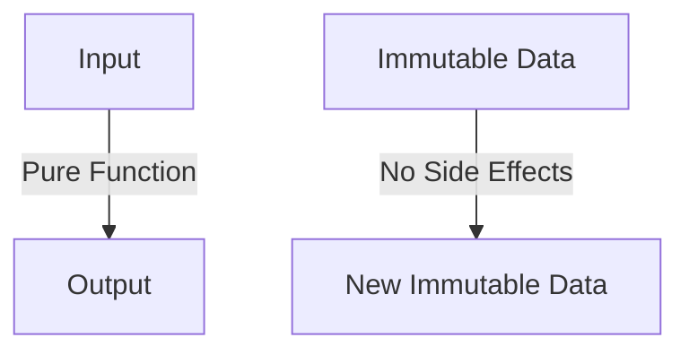
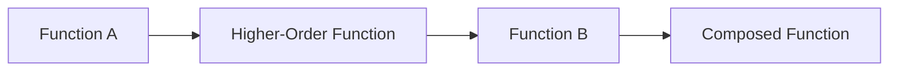
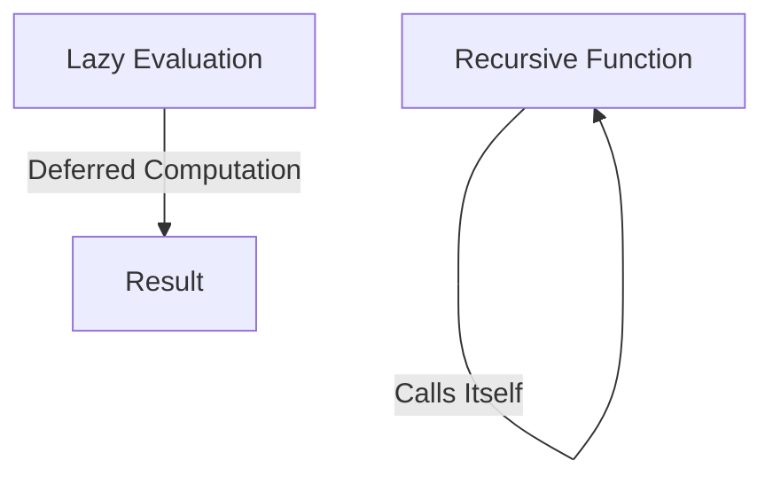

## 12.1. Recap of Key Concepts

As we reach the conclusion of our exploration into functional programming patterns, it's essential to reflect on the journey we've undertaken. This recap will summarize the main points, reinforce the key concepts, and assess your understanding of the material. Let's delve into the core principles and patterns that form the backbone of functional programming.

### Summarizing Main Points

#### Pure Functions

**Definition and Importance**

Pure functions are the cornerstone of functional programming. They are defined by two main characteristics: they always produce the same output for the same input, and they have no side effects. This predictability makes them easy to test and reason about.

**Example:**

```pseudocode
function add(a, b):
    return a + b
```

In this example, `add` is a pure function because it consistently returns the sum of `a` and `b` without altering any external state.

**Benefits:**

- **Predictability:** Pure functions are deterministic, making them easier to debug and test.
- **Concurrency:** Since pure functions don't modify shared state, they are inherently thread-safe.

#### Immutability

**Concept and Advantages**

Immutability refers to the practice of creating data structures that cannot be altered after they are created. This approach reduces bugs related to state changes and enhances the reliability of concurrent programs.

**Example:**

```pseudocode
immutable list = [1, 2, 3]
newList = list.append(4)  // returns a new list [1, 2, 3, 4]
```

Here, `list` remains unchanged, and `newList` is a new structure with the added element.

**Benefits:**

- **Safety:** Reduces the risk of unintended side effects.
- **Concurrency:** Simplifies concurrent programming by eliminating race conditions.

#### Higher-Order Functions

**Understanding and Usage**

Higher-order functions are functions that can take other functions as arguments or return them as results. This capability allows for powerful abstractions and code reuse.

**Example:**

```pseudocode
function map(array, func):
    result = []
    for element in array:
        result.append(func(element))
    return result
```

In this example, `map` is a higher-order function that applies `func` to each element of `array`.

**Benefits:**

- **Abstraction:** Encapsulates behavior, reducing code duplication.
- **Flexibility:** Enables dynamic behavior by passing different functions.

#### Function Composition

**Building Complex Functions**

Function composition involves combining simple functions to build more complex ones. This approach enhances modularity and reusability.

**Example:**

```pseudocode
function compose(f, g):
    return function(x):
        return f(g(x))
```

Here, `compose` creates a new function that applies `g` to `x` and then `f` to the result.

**Benefits:**

- **Modularity:** Breaks down complex operations into simpler, reusable components.
- **Clarity:** Enhances readability by expressing operations in a declarative manner.

#### Recursion

**Alternative to Iteration**

Recursion is a technique where a function calls itself to solve a problem. It is often used in place of loops in functional programming.

**Example:**

```pseudocode
function factorial(n):
    if n == 0:
        return 1
    else:
        return n * factorial(n - 1)
```

This recursive function calculates the factorial of `n`.

**Benefits:**

- **Elegance:** Provides a clean and concise way to express iterative processes.
- **Suitability:** Ideal for problems that naturally fit a recursive structure, such as tree traversal.

#### Lazy Evaluation

**Deferring Computation**

Lazy evaluation delays the computation of expressions until their values are needed. This approach can improve performance by avoiding unnecessary calculations.

**Example:**

```pseudocode
function lazyRange(start, end):
    return function():
        if start < end:
            return start
        else:
            return lazyRange(start + 1, end)
```

This pseudocode represents a lazy range generator.

**Benefits:**

- **Efficiency:** Reduces computation time by evaluating only what is necessary.
- **Infinite Structures:** Enables the creation of infinite data structures, such as streams.

#### Closures and Lexical Scope

**Encapsulation and Data Privacy**

Closures are functions that capture the lexical scope in which they were defined. They allow for data encapsulation and privacy.

**Example:**

```pseudocode
function makeCounter():
    count = 0
    return function():
        count = count + 1
        return count
```

The inner function retains access to `count`, even after `makeCounter` has finished executing.

**Benefits:**

- **Encapsulation:** Protects data by keeping it within the function scope.
- **State Management:** Maintains state across function calls without global variables.

#### Partial Application and Currying

**Function Specialization**

Partial application involves fixing a few arguments of a function, producing another function. Currying transforms a function with multiple arguments into a series of functions with single arguments.

**Example:**

```pseudocode
function add(a, b):
    return a + b

function partiallyApplyAdd(a):
    return function(b):
        return add(a, b)

addFive = partiallyApplyAdd(5)
result = addFive(10)  // returns 15
```

**Benefits:**

- **Reusability:** Creates specialized functions for common use cases.
- **Modularity:** Breaks down complex functions into simpler, reusable parts.

### Reflecting on Learning Outcomes

As we reflect on the learning outcomes, it's crucial to assess how these concepts can be applied in real-world scenarios. Functional programming patterns offer a robust framework for building reliable, maintainable, and efficient software. By embracing these principles, developers can enhance code quality and tackle complex problems with elegance and precision.

#### Key Takeaways

- **Embrace Pure Functions:** Prioritize pure functions to ensure predictability and ease of testing.
- **Adopt Immutability:** Use immutable data structures to reduce bugs and simplify concurrent programming.
- **Leverage Higher-Order Functions:** Utilize higher-order functions to create flexible and reusable code.
- **Compose Functions:** Build complex operations through function composition for modularity and clarity.
- **Utilize Recursion:** Apply recursion for problems that fit naturally into recursive structures.
- **Implement Lazy Evaluation:** Optimize performance by deferring computation until necessary.
- **Use Closures:** Encapsulate data and manage state effectively with closures.
- **Apply Partial Application and Currying:** Specialize functions for specific tasks and enhance modularity.

### Visualizing Functional Programming Concepts

To further solidify your understanding, let's visualize some of these concepts using diagrams.

#### Pure Functions and Immutability



**Description:** This diagram illustrates the flow of data through a pure function, emphasizing the lack of side effects and the creation of new immutable data.

#### Higher-Order Functions and Function Composition



**Description:** This diagram shows how higher-order functions can be used to compose new functions, enhancing modularity and reusability.

#### Recursion and Lazy Evaluation



**Description:** This diagram depicts the self-referential nature of recursion and the deferred computation characteristic of lazy evaluation.

### Try It Yourself

To deepen your understanding, try modifying the code examples provided. Experiment with creating your own pure functions, implementing higher-order functions, and composing functions. Consider how you might apply these concepts in your current projects.

### References and Links

For further reading, explore these resources:

- [MDN Web Docs on Functional Programming](https://developer.mozilla.org/en-US/docs/Web/JavaScript/Guide/Functions)
- [W3Schools Functional Programming Tutorial](https://www.w3schools.com/js/js_function_closures.asp)

### Knowledge Check

To reinforce your learning, consider these questions:

- How do pure functions differ from impure functions?
- What are the benefits of using immutable data structures?
- How can higher-order functions enhance code flexibility?
- Why is function composition important in functional programming?
- What are the advantages of using recursion over iteration?

### Embrace the Journey

Remember, this is just the beginning. As you progress, you'll build more complex and interactive applications using functional programming patterns. Keep experimenting, stay curious, and enjoy the journey!

## Quiz Time!



### What is a key characteristic of pure functions?

- [x] They have no side effects.
- [ ] They modify global state.
- [ ] They produce different outputs for the same inputs.
- [ ] They are always recursive.

> **Explanation:** Pure functions have no side effects and always produce the same output for the same input.

### What is the main advantage of immutability?

- [x] It reduces bugs related to state changes.
- [ ] It increases memory usage.
- [ ] It makes code harder to read.
- [ ] It requires more complex algorithms.

> **Explanation:** Immutability reduces bugs by preventing unintended state changes, making code more reliable.

### How do higher-order functions enhance code?

- [x] By allowing functions to be passed as arguments.
- [ ] By increasing code complexity.
- [ ] By reducing code readability.
- [ ] By eliminating the need for variables.

> **Explanation:** Higher-order functions allow functions to be passed as arguments, enabling powerful abstractions and code reuse.

### What is function composition used for?

- [x] Building complex operations from simple functions.
- [ ] Eliminating the need for loops.
- [ ] Increasing code verbosity.
- [ ] Reducing code performance.

> **Explanation:** Function composition builds complex operations by combining simple functions, enhancing modularity and reusability.

### What is a benefit of recursion?

- [x] It provides a clean way to express iterative processes.
- [ ] It always improves performance.
- [ ] It eliminates the need for functions.
- [ ] It requires more memory.

> **Explanation:** Recursion provides a clean and concise way to express iterative processes, especially for problems that naturally fit a recursive structure.

### What does lazy evaluation do?

- [x] Delays computation until necessary.
- [ ] Increases immediate computation.
- [ ] Reduces code readability.
- [ ] Eliminates the need for functions.

> **Explanation:** Lazy evaluation delays computation until the value is needed, improving performance by avoiding unnecessary calculations.

### How do closures help in functional programming?

- [x] By encapsulating data and managing state.
- [ ] By increasing global state usage.
- [ ] By making code less modular.
- [ ] By reducing code readability.

> **Explanation:** Closures encapsulate data and manage state effectively, allowing functions to retain access to their defining environment.

### What is partial application?

- [x] Fixing a few arguments of a function to produce another function.
- [ ] Eliminating the need for arguments.
- [ ] Increasing function complexity.
- [ ] Reducing code readability.

> **Explanation:** Partial application involves fixing a few arguments of a function, producing another function that can be used for specific tasks.

### What is currying?

- [x] Transforming a function with multiple arguments into a series of single-argument functions.
- [ ] Eliminating the need for functions.
- [ ] Increasing code verbosity.
- [ ] Reducing code performance.

> **Explanation:** Currying transforms a function with multiple arguments into a series of single-argument functions, enhancing modularity and reusability.

### True or False: Functional programming patterns can enhance code quality and maintainability.

- [x] True
- [ ] False

> **Explanation:** Functional programming patterns enhance code quality and maintainability by promoting pure functions, immutability, and modularity.



By revisiting these concepts and engaging with the quiz, you can solidify your understanding and prepare to apply functional programming patterns in your projects. Keep exploring and refining your skills, and you'll find that functional programming offers a powerful toolkit for building robust and efficient software.
