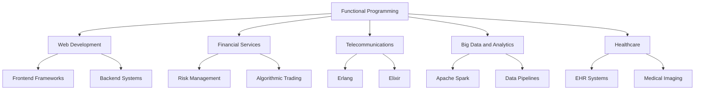

## 12.2. The Future of Functional Programming

Functional programming (FP) has been gaining momentum in the software development world, with its principles and patterns being increasingly adopted across various industries. In this section, we will explore the trends and developments that are shaping the future of functional programming, as well as its growing influence and adoption in different sectors.

### Trends and Developments in Functional Programming

#### 1. Increasing Popularity of Functional Languages

Functional programming languages such as Haskell, Scala, Clojure, and Elixir are gaining traction due to their ability to handle complex problems with elegance and efficiency. These languages offer features like immutability, first-class functions, and powerful type systems that make them well-suited for modern software development challenges.

- **Haskell**: Known for its strong static typing and lazy evaluation, Haskell is often used in academic settings and industries that require high assurance software.
- **Scala**: Combining object-oriented and functional programming paradigms, Scala is popular in the big data ecosystem, particularly with Apache Spark.
- **Clojure**: A modern Lisp dialect, Clojure is appreciated for its simplicity and concurrency support, making it a favorite for building robust, scalable systems.
- **Elixir**: Built on the Erlang VM, Elixir is designed for building scalable and maintainable applications, particularly in the telecommunications and web development sectors.

#### 2. Functional Features in Multi-Paradigm Languages

Languages like JavaScript, Python, Java, and C# are incorporating functional programming features, allowing developers to leverage FP patterns without switching languages. This trend is making functional programming more accessible and encouraging its adoption in existing codebases.

- **JavaScript**: With the introduction of ES6, JavaScript now supports arrow functions, higher-order functions, and promises, making it easier to write functional code.
- **Python**: Python's support for lambda functions, map, filter, and reduce allows developers to apply functional concepts in their projects.
- **Java**: The addition of lambda expressions and the Stream API in Java 8 has brought functional programming to the forefront of Java development.
- **C#**: With LINQ and lambda expressions, C# developers can write more declarative and functional-style code.

#### 3. Emphasis on Immutability and Concurrency

As software systems become more complex and distributed, the need for reliable and concurrent programming models is increasing. Functional programming's emphasis on immutability and pure functions makes it an ideal choice for building concurrent and parallel systems.

- **Immutability**: By avoiding mutable state, functional programming reduces the risk of race conditions and makes concurrent programming more predictable.
- **Concurrency Models**: Functional languages often provide powerful concurrency models, such as the Actor model in Erlang and Elixir, which simplify the development of concurrent applications.

#### 4. Adoption of Functional Patterns in Machine Learning and Data Science

Functional programming is finding its way into machine learning and data science, where its ability to handle complex transformations and data pipelines is highly valued.

- **Data Transformation**: Functional programming's emphasis on pure functions and immutability makes it well-suited for transforming and processing large datasets.
- **Parallel Processing**: Functional patterns like map-reduce enable efficient parallel processing, which is crucial for handling big data workloads.

#### 5. Rise of Functional Reactive Programming (FRP)

Functional Reactive Programming (FRP) is gaining popularity as a way to handle asynchronous data streams and event-driven architectures. FRP allows developers to compose and transform streams of data in a declarative manner, making it easier to build responsive and interactive applications.

- **Reactive Extensions (Rx)**: Libraries like RxJS and RxJava provide powerful abstractions for working with asynchronous data streams, enabling developers to apply FRP principles in their applications.
- **UI Development**: FRP is being used in UI frameworks to manage state and handle user interactions in a more declarative and functional way.

### Functional Programming in Industry

#### 1. Adoption in Web Development

Functional programming is making significant inroads in web development, where its principles are being used to build robust and maintainable applications.

- **Frontend Frameworks**: Frameworks like React and Elm embrace functional programming concepts, allowing developers to build complex UIs with ease.
- **Backend Systems**: Functional languages like Elixir and Clojure are being used to build scalable and fault-tolerant backend systems.

#### 2. Impact on Financial Services

The financial services industry is increasingly adopting functional programming to build reliable and high-performance systems.

- **Risk Management**: Functional programming's emphasis on correctness and immutability makes it well-suited for building risk management systems that require high assurance.
- **Algorithmic Trading**: Functional languages are being used to implement complex trading algorithms that require precise and predictable behavior.

#### 3. Role in Telecommunications

Functional programming has a long history in the telecommunications industry, where it is used to build highly reliable and concurrent systems.

- **Erlang**: Originally developed for telecommunications, Erlang's functional programming model and concurrency support make it ideal for building telecom systems.
- **Elixir**: Built on the Erlang VM, Elixir is being used to build scalable and maintainable telecom applications.

#### 4. Influence in Big Data and Analytics

Functional programming is playing a crucial role in the big data and analytics space, where its ability to handle complex data transformations and parallel processing is highly valued.

- **Apache Spark**: Scala, a functional programming language, is the primary language for developing applications on Apache Spark, a popular big data processing framework.
- **Data Pipelines**: Functional programming patterns are being used to build data pipelines that can efficiently process and analyze large datasets.

#### 5. Applications in Healthcare

The healthcare industry is leveraging functional programming to build systems that require high reliability and correctness.

- **Electronic Health Records (EHR)**: Functional programming is being used to build EHR systems that require strict data integrity and security.
- **Medical Imaging**: Functional languages are being used to implement algorithms for processing and analyzing medical images.

### Visualizing the Future of Functional Programming

To better understand the trends and developments in functional programming, let's visualize the key areas where FP is making an impact:

### Conclusion

The future of functional programming is bright, with its principles and patterns being increasingly adopted across various industries. As software systems become more complex and distributed, the need for reliable and concurrent programming models will continue to drive the adoption of functional programming. By embracing functional programming, developers can build robust, maintainable, and scalable systems that meet the demands of modern software development.

### Try It Yourself

To get a hands-on experience with functional programming, try implementing a simple data transformation pipeline using a functional language of your choice. Experiment with different functional patterns, such as map, filter, and reduce, to process and analyze data. This exercise will help you understand the power and flexibility of functional programming in handling complex data transformations.

### Knowledge Check

- What are the key features of functional programming languages that make them suitable for modern software development?
- How are functional programming patterns being used in machine learning and data science?
- What is Functional Reactive Programming (FRP), and how is it being used in UI development?
- How is functional programming being adopted in the financial services industry?
- What role does functional programming play in the telecommunications industry?

Remember, this is just the beginning. As you progress, you'll discover more ways to apply functional programming principles and patterns in your projects. Keep experimenting, stay curious, and enjoy the journey!

## Quiz Time!



### What is one of the main reasons functional programming is gaining popularity?

- [x] Its ability to handle complex problems with elegance and efficiency.
- [ ] Its focus on mutable state and side effects.
- [ ] Its reliance on object-oriented principles.
- [ ] Its lack of support for concurrency.

> **Explanation:** Functional programming is gaining popularity due to its ability to handle complex problems with elegance and efficiency, thanks to features like immutability and first-class functions.

### Which language is known for its strong static typing and lazy evaluation?

- [x] Haskell
- [ ] Scala
- [ ] Clojure
- [ ] Elixir

> **Explanation:** Haskell is known for its strong static typing and lazy evaluation, making it a popular choice for high assurance software.

### What feature of functional programming reduces the risk of race conditions?

- [x] Immutability
- [ ] Mutable state
- [ ] Inheritance
- [ ] Polymorphism

> **Explanation:** Immutability reduces the risk of race conditions by avoiding mutable state, making concurrent programming more predictable.

### What is Functional Reactive Programming (FRP) used for?

- [x] Handling asynchronous data streams and event-driven architectures.
- [ ] Implementing object-oriented design patterns.
- [ ] Managing mutable state in applications.
- [ ] Building monolithic applications.

> **Explanation:** Functional Reactive Programming (FRP) is used for handling asynchronous data streams and event-driven architectures, allowing developers to compose and transform streams of data in a declarative manner.

### Which industry is increasingly adopting functional programming for building reliable and high-performance systems?

- [x] Financial Services
- [ ] Retail
- [ ] Hospitality
- [ ] Agriculture

> **Explanation:** The financial services industry is increasingly adopting functional programming to build reliable and high-performance systems, such as risk management and algorithmic trading systems.

### What is one of the key benefits of using functional programming in big data and analytics?

- [x] Efficient parallel processing
- [ ] Complex inheritance hierarchies
- [ ] Mutable data structures
- [ ] Lack of concurrency support

> **Explanation:** Functional programming enables efficient parallel processing, which is crucial for handling big data workloads and complex data transformations.

### Which language is built on the Erlang VM and is used for building scalable and maintainable applications?

- [x] Elixir
- [ ] Scala
- [ ] Haskell
- [ ] Clojure

> **Explanation:** Elixir is built on the Erlang VM and is designed for building scalable and maintainable applications, particularly in the telecommunications and web development sectors.

### What is one of the main reasons functional programming is being adopted in web development?

- [x] Its principles help build robust and maintainable applications.
- [ ] It relies heavily on mutable state and side effects.
- [ ] It is incompatible with modern web technologies.
- [ ] It discourages the use of declarative programming.

> **Explanation:** Functional programming is being adopted in web development because its principles help build robust and maintainable applications, particularly in frontend frameworks like React and Elm.

### What is one of the main advantages of using functional programming in healthcare?

- [x] High reliability and correctness
- [ ] Complex inheritance hierarchies
- [ ] Mutable data structures
- [ ] Lack of concurrency support

> **Explanation:** Functional programming offers high reliability and correctness, making it well-suited for building systems that require strict data integrity and security, such as electronic health records (EHR) systems.

### True or False: Functional programming is only suitable for academic settings and not for real-world applications.

- [ ] True
- [x] False

> **Explanation:** False. Functional programming is increasingly being adopted in various industries for real-world applications, such as web development, financial services, telecommunications, big data, and healthcare.


