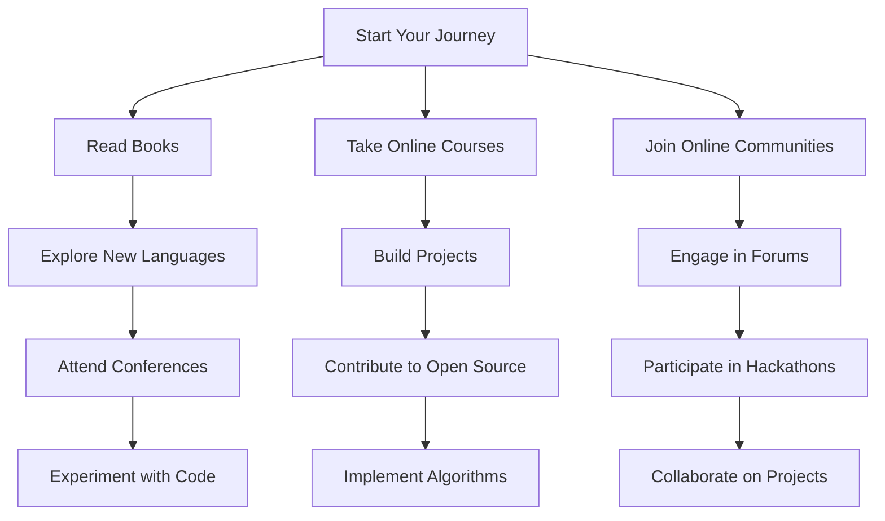

## 12.3. Continuing Your Journey in Functional Programming

Embarking on the journey of mastering functional programming (FP) is both exciting and rewarding. As we conclude this guide, it's essential to provide you with resources and strategies to continue your learning and application of FP concepts. This section will explore various avenues for further education, community engagement, and practical application.

### Resources for Further Learning

To deepen your understanding of functional programming, consider exploring the following resources:

#### Books

1. **"Functional Programming in Scala" by Paul Chiusano and Rúnar Bjarnason**
   - This book provides a comprehensive introduction to functional programming using Scala, a language that blends object-oriented and functional programming paradigms. It covers essential concepts and patterns, making it an excellent resource for both beginners and experienced developers.

2. **"Haskell Programming from First Principles" by Christopher Allen and Julie Moronuki**
   - A thorough guide to learning Haskell, this book starts from the basics and gradually introduces more complex concepts. It's perfect for those who want to dive deep into a purely functional language.

3. **"Real World Haskell" by Bryan O'Sullivan, Don Stewart, and John Goerzen**
   - This book offers practical insights into using Haskell for real-world applications, covering topics like concurrency, performance optimization, and interfacing with other languages.

4. **"Programming Elixir" by Dave Thomas**
   - Elixir is a functional language built on the Erlang VM, known for its scalability and fault tolerance. This book provides a solid foundation in Elixir, focusing on its functional aspects and concurrent programming capabilities.

5. **"The Joy of Clojure" by Michael Fogus and Chris Houser**
   - Clojure is a modern Lisp dialect that emphasizes functional programming. This book explores Clojure's unique features and how they enable expressive and efficient code.

#### Online Courses

1. **Coursera's "Functional Programming Principles in Scala"**
   - Offered by École Polytechnique Fédérale de Lausanne, this course provides a solid introduction to functional programming concepts using Scala. It's suitable for those new to FP or looking to refresh their knowledge.

2. **edX's "Introduction to Functional Programming"**
   - This course, offered by Delft University of Technology, covers the basics of functional programming using Haskell. It's a great starting point for those interested in learning a purely functional language.

3. **Udemy's "Learn Functional Programming with JavaScript"**
   - This course focuses on applying functional programming concepts in JavaScript, a language widely used in web development. It covers topics like higher-order functions, closures, and immutability.

4. **Pluralsight's "Functional Programming: The Big Picture"**
   - This course provides an overview of functional programming, its benefits, and how it differs from other paradigms. It's ideal for those looking to understand the broader context of FP.

#### Online Communities

Engaging with the functional programming community can provide valuable insights, support, and opportunities for collaboration. Consider joining the following communities:

1. **Reddit's r/functionalprogramming**
   - A vibrant community where developers discuss functional programming concepts, share resources, and seek advice.

2. **Stack Overflow**
   - A platform where you can ask questions, share knowledge, and learn from experienced developers in the functional programming space.

3. **Haskell-Cafe Mailing List**
   - A mailing list for Haskell enthusiasts to discuss language features, libraries, and projects.

4. **Elixir Forum**
   - A community for Elixir developers to share knowledge, ask questions, and collaborate on projects.

5. **ClojureVerse**
   - A forum for Clojure developers to discuss language features, libraries, and best practices.

### Engaging with the FP Community

Participating in the functional programming community can enhance your learning experience and provide opportunities for growth. Here are some ways to engage with the community:

#### Conferences

Attending conferences is an excellent way to learn from experts, network with peers, and stay updated on the latest developments in functional programming. Consider attending the following conferences:

1. **LambdaConf**
   - A conference focused on functional programming, featuring talks, workshops, and networking opportunities.

2. **Functional Programming eXchange (FPX)**
   - An annual event that brings together functional programming enthusiasts to share knowledge and experiences.

3. **Clojure/conj**
   - A conference dedicated to Clojure, featuring talks from leading developers and community members.

4. **Haskell Symposium**
   - An academic conference that explores the latest research and developments in Haskell.

5. **ElixirConf**
   - A conference focused on Elixir, featuring talks, workshops, and networking opportunities.

#### Forums and Collaborative Projects

Participating in forums and collaborative projects can help you apply your knowledge, gain practical experience, and contribute to the community. Consider the following platforms:

1. **GitHub**
   - Explore open-source functional programming projects, contribute to existing projects, or start your own.

2. **Functional Programming Slack Channels**
   - Join Slack channels dedicated to functional programming languages like Haskell, Scala, and Elixir to connect with other developers and share knowledge.

3. **Meetup Groups**
   - Look for local functional programming meetup groups to connect with developers in your area, attend events, and participate in coding sessions.

4. **Codewars**
   - A platform where you can solve coding challenges using functional programming languages, improve your skills, and compete with other developers.

### Practical Application and Experimentation

To truly master functional programming, it's essential to apply what you've learned in real-world scenarios. Here are some strategies to help you do that:

#### Build Projects

1. **Create a Personal Project**
   - Choose a project that interests you and implement it using functional programming concepts. This could be a web application, a data processing tool, or a game.

2. **Contribute to Open Source**
   - Find an open-source project that uses functional programming and contribute to it. This will help you gain practical experience and learn from other developers.

3. **Participate in Hackathons**
   - Join hackathons that focus on functional programming or allow you to use functional languages. This will challenge you to apply your skills in a competitive environment.

#### Experiment with Code

1. **Try It Yourself: Modify Code Examples**
   - Take the code examples from this guide and modify them to explore different functional programming concepts. Experiment with different patterns, data structures, and algorithms.

2. **Explore New Languages**
   - Try learning a new functional programming language to broaden your understanding of FP concepts. Each language has its unique features and strengths.

3. **Implement Algorithms Functionally**
   - Take common algorithms and implement them using functional programming techniques. This will help you understand how FP can be applied to solve various problems.

### Visualizing Your Learning Path

To help you visualize your learning path, consider the following diagram that outlines the steps to continue your journey in functional programming:

### Knowledge Check

To reinforce your learning, consider the following questions and challenges:

1. **What are the key benefits of functional programming over imperative programming?**
   - Reflect on the advantages of FP, such as immutability, pure functions, and higher-order functions.

2. **How can you apply functional programming concepts in a language that is not purely functional?**
   - Explore how languages like JavaScript and Python can incorporate FP principles.

3. **What are some common functional programming patterns, and how do they solve specific problems?**
   - Review patterns like map, filter, reduce, and monads, and consider their applications.

4. **Challenge: Implement a simple web application using a functional programming language.**
   - Choose a language like Elm or ClojureScript and build a basic web app to practice your skills.

5. **Exercise: Refactor an existing project to use functional programming techniques.**
   - Take a project you've previously worked on and refactor it to incorporate FP concepts.

### Embrace the Journey

Remember, this is just the beginning. As you progress, you'll build more complex and interactive applications, solve challenging problems, and contribute to the functional programming community. Keep experimenting, stay curious, and enjoy the journey!

## Quiz Time!



### What is a key advantage of functional programming?

- [x] Immutability reduces state-related bugs.
- [ ] It allows for more complex code structures.
- [ ] It requires less memory usage.
- [ ] It is easier to learn than imperative programming.

> **Explanation:** Immutability in functional programming helps reduce state-related bugs by ensuring that data cannot be changed once created.

### Which book is recommended for learning Haskell?

- [x] "Haskell Programming from First Principles"
- [ ] "Functional Programming in Scala"
- [ ] "Programming Elixir"
- [ ] "The Joy of Clojure"

> **Explanation:** "Haskell Programming from First Principles" is a comprehensive guide to learning Haskell, a purely functional programming language.

### What is a benefit of engaging with the FP community?

- [x] Networking with peers and learning from experts.
- [ ] Reducing the need for formal education.
- [ ] Avoiding the use of online resources.
- [ ] Focusing solely on theoretical knowledge.

> **Explanation:** Engaging with the FP community allows you to network with peers, learn from experts, and gain practical insights.

### Which online course focuses on functional programming in JavaScript?

- [x] Udemy's "Learn Functional Programming with JavaScript"
- [ ] Coursera's "Functional Programming Principles in Scala"
- [ ] edX's "Introduction to Functional Programming"
- [ ] Pluralsight's "Functional Programming: The Big Picture"

> **Explanation:** Udemy's course "Learn Functional Programming with JavaScript" focuses on applying FP concepts in JavaScript.

### What is a recommended strategy for applying FP concepts?

- [x] Build personal projects using functional programming.
- [ ] Focus only on theoretical knowledge.
- [ ] Avoid experimenting with new languages.
- [ ] Limit participation in hackathons.

> **Explanation:** Building personal projects using functional programming helps you apply concepts in real-world scenarios and gain practical experience.

### Which conference is dedicated to Clojure?

- [x] Clojure/conj
- [ ] LambdaConf
- [ ] Haskell Symposium
- [ ] ElixirConf

> **Explanation:** Clojure/conj is a conference dedicated to the Clojure programming language, featuring talks and discussions from community members.

### What is a benefit of contributing to open-source projects?

- [x] Gaining practical experience and learning from others.
- [ ] Avoiding collaboration with other developers.
- [ ] Focusing solely on personal projects.
- [ ] Reducing the need for formal education.

> **Explanation:** Contributing to open-source projects allows you to gain practical experience, learn from other developers, and collaborate on real-world applications.

### What is a common functional programming pattern?

- [x] Map
- [ ] Inheritance
- [ ] Polymorphism
- [ ] Encapsulation

> **Explanation:** Map is a common functional programming pattern used to apply a function to each element in a collection.

### Which online community is recommended for Elixir developers?

- [x] Elixir Forum
- [ ] Haskell-Cafe Mailing List
- [ ] ClojureVerse
- [ ] Stack Overflow

> **Explanation:** Elixir Forum is a community for Elixir developers to share knowledge, ask questions, and collaborate on projects.

### True or False: Functional programming can be applied in languages that are not purely functional.

- [x] True
- [ ] False

> **Explanation:** Functional programming concepts can be applied in languages that are not purely functional, such as JavaScript and Python, by using higher-order functions, immutability, and other FP principles.


