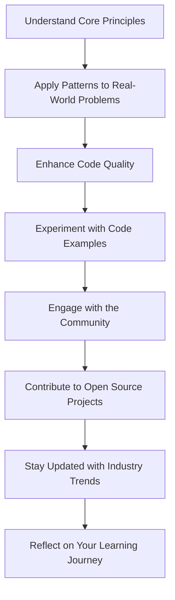

## 12.4. Final Thoughts

As we conclude our exploration of functional programming patterns, it's essential to reflect on the journey we've undertaken and the transformative power these patterns hold. Functional programming (FP) offers a paradigm shift from traditional imperative programming, emphasizing immutability, pure functions, and higher-order functions. By embracing these principles, developers can write cleaner, more maintainable, and robust code. Let's delve into how you can apply this knowledge to real-world problems and take the next steps in your career.

### Embracing Functional Patterns

Functional programming patterns are not just theoretical constructs; they are practical tools that can be applied to solve real-world problems. By understanding and utilizing these patterns, you can enhance your ability to tackle complex software challenges. Here are some key takeaways on how to embrace functional patterns:

#### 1. **Understand the Core Principles**

Before diving into specific patterns, it's crucial to have a solid grasp of the core principles of functional programming:

- **Pure Functions**: Functions that produce the same output for the same input without side effects.
- **Immutability**: Data structures that cannot be modified after creation, reducing bugs and enhancing concurrency.
- **Higher-Order Functions**: Functions that take other functions as arguments or return them as results, enabling powerful abstractions.
- **Recursion**: A technique to solve problems by breaking them down into smaller, more manageable sub-problems.
- **Lazy Evaluation**: Delaying computation until the result is needed, improving performance in certain scenarios.

#### 2. **Apply Patterns to Real-World Problems**

Functional programming patterns provide a structured approach to solving common software problems. Here are some examples of how these patterns can be applied:

- **Functor and Monad Patterns**: Use these patterns to handle computations within a context, such as managing nullable values or asynchronous operations.
- **Observer Pattern**: Implement reactive systems that respond to changes in data streams, ideal for real-time applications.
- **Strategy Pattern**: Replace complex inheritance hierarchies with simple function compositions, enhancing code flexibility.
- **Memoization**: Optimize performance by caching expensive function calls, particularly in recursive algorithms.

#### 3. **Enhance Code Quality and Maintainability**

Functional programming patterns encourage writing code that is easier to understand, test, and maintain. By adhering to these patterns, you can achieve:

- **Modularity**: Break down complex systems into smaller, reusable components.
- **Reusability**: Write functions that can be easily reused across different parts of your application.
- **Testability**: Pure functions are inherently easier to test due to their deterministic nature.
- **Concurrency**: Immutability and pure functions reduce the risk of race conditions, making concurrent programming safer.

### Encouragement for Practice and Application

The journey to mastering functional programming patterns is ongoing. Here are some steps you can take to continue your growth and apply these concepts in your career:

#### 1. **Experiment with Code Examples**

Practice is key to mastering functional programming patterns. Experiment with the code examples provided in this guide, and try modifying them to suit your needs. For instance, you can:

- Implement a custom functor for a new data structure.
- Create a reactive system using the observer pattern.
- Optimize a recursive function with memoization.

#### 2. **Engage with the Community**

Join online communities, forums, and social media groups dedicated to functional programming. Engaging with other developers can provide valuable insights, feedback, and support. Consider attending conferences or meetups to network with like-minded individuals.

#### 3. **Contribute to Open Source Projects**

Contributing to open source projects is an excellent way to apply your knowledge in real-world scenarios. Look for projects that use functional programming languages or patterns and offer your skills to help improve them.

#### 4. **Stay Updated with Industry Trends**

The field of functional programming is constantly evolving. Stay informed about the latest trends, tools, and languages by following industry blogs, podcasts, and newsletters. This will help you stay ahead of the curve and continue to grow as a developer.

#### 5. **Reflect on Your Learning Journey**

Take time to reflect on what you've learned and how you've applied it. Consider keeping a journal or blog to document your progress and share your experiences with others. This can be a valuable resource for both personal growth and professional development.

### Try It Yourself: Experiment with Functional Patterns

To solidify your understanding of functional programming patterns, try the following exercises:

1. **Create a Custom Monad**: Design a monad for a specific use case, such as handling configuration settings or managing state in a web application.

2. **Implement a Reactive System**: Build a simple reactive system using the observer pattern to handle real-time data updates.

3. **Optimize a Recursive Algorithm**: Use memoization to improve the performance of a recursive algorithm, such as calculating Fibonacci numbers.

4. **Compose Functions**: Practice function composition by creating a pipeline of functions to process data, such as transforming and filtering a list of records.

5. **Explore a New Functional Language**: If you're familiar with one functional language, try exploring another to broaden your understanding. For example, if you know JavaScript, experiment with Haskell or Clojure.

### Visualizing the Journey: A Roadmap to Mastery

To help visualize your journey in mastering functional programming patterns, consider the following roadmap:

This roadmap illustrates the progression from understanding the core principles of functional programming to applying patterns in real-world scenarios, enhancing code quality, and engaging with the community. By following this path, you can continue to grow and excel in your career.

### Conclusion

Functional programming patterns offer a powerful toolkit for solving complex software problems. By embracing these patterns, you can write cleaner, more maintainable code and enhance your ability to tackle real-world challenges. Remember, this is just the beginning. As you continue to practice and apply these concepts, you'll build more robust and efficient applications. Keep experimenting, stay curious, and enjoy the journey!

## Quiz Time!



### What is a key benefit of using pure functions in functional programming?

- [x] They produce consistent outputs for the same inputs without side effects.
- [ ] They allow for mutable state changes.
- [ ] They require complex inheritance hierarchies.
- [ ] They are only applicable in object-oriented programming.

> **Explanation:** Pure functions produce consistent outputs for the same inputs without side effects, making them predictable and easier to test.

### Which pattern is used to handle computations within a context, such as managing nullable values?

- [x] Monad Pattern
- [ ] Observer Pattern
- [ ] Strategy Pattern
- [ ] Transducer Pattern

> **Explanation:** The Monad Pattern is used to handle computations within a context, such as managing nullable values or asynchronous operations.

### What is the main advantage of using immutability in functional programming?

- [x] It reduces bugs and enhances concurrency.
- [ ] It allows for direct state manipulation.
- [ ] It requires more complex data structures.
- [ ] It is only useful in single-threaded applications.

> **Explanation:** Immutability reduces bugs and enhances concurrency by preventing state changes, making code safer in multi-threaded environments.

### How can memoization improve the performance of recursive algorithms?

- [x] By caching expensive function calls.
- [ ] By increasing the number of recursive calls.
- [ ] By using mutable state.
- [ ] By avoiding function calls altogether.

> **Explanation:** Memoization improves performance by caching expensive function calls, reducing redundant calculations in recursive algorithms.

### Which pattern is ideal for implementing reactive systems that respond to changes in data streams?

- [x] Observer Pattern
- [ ] Functor Pattern
- [ ] Strategy Pattern
- [ ] Monad Pattern

> **Explanation:** The Observer Pattern is ideal for implementing reactive systems that respond to changes in data streams, making it suitable for real-time applications.

### What is a higher-order function?

- [x] A function that takes other functions as arguments or returns them as results.
- [ ] A function that only operates on primitive data types.
- [ ] A function that modifies global state.
- [ ] A function that is only used in object-oriented programming.

> **Explanation:** A higher-order function is a function that takes other functions as arguments or returns them as results, enabling powerful abstractions.

### What is the purpose of lazy evaluation in functional programming?

- [x] To delay computation until the result is needed.
- [ ] To execute all computations immediately.
- [ ] To increase the complexity of algorithms.
- [ ] To modify data structures in place.

> **Explanation:** Lazy evaluation delays computation until the result is needed, improving performance by avoiding unnecessary calculations.

### How can you enhance code modularity in functional programming?

- [x] By breaking down complex systems into smaller, reusable components.
- [ ] By using global variables extensively.
- [ ] By relying on complex inheritance hierarchies.
- [ ] By avoiding function composition.

> **Explanation:** Enhancing code modularity involves breaking down complex systems into smaller, reusable components, making code easier to manage and maintain.

### What is a key advantage of engaging with the functional programming community?

- [x] Gaining valuable insights, feedback, and support.
- [ ] Avoiding collaboration with other developers.
- [ ] Focusing solely on individual projects.
- [ ] Ignoring industry trends and developments.

> **Explanation:** Engaging with the functional programming community provides valuable insights, feedback, and support, helping developers grow and improve their skills.

### True or False: Functional programming patterns are only applicable in functional programming languages.

- [ ] True
- [x] False

> **Explanation:** Functional programming patterns can be applied in multi-paradigm languages that support functional concepts, such as JavaScript, Python, and Java.


