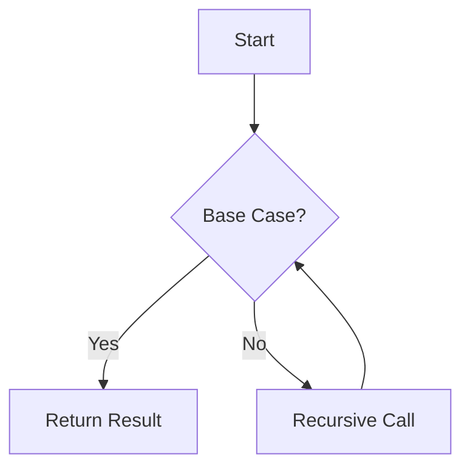

## A.1. Pseudocode Style Guide

Welcome to the Pseudocode Style Guide for Functional Programming Patterns. This guide is designed to help you understand the syntax rules, conventions, and common constructs used in pseudocode examples throughout this guide. By adhering to these standards, you'll be able to write clear, concise, and consistent pseudocode that effectively communicates functional programming concepts.

### Introduction

Pseudocode serves as a bridge between human language and programming languages. It allows us to express algorithms and design patterns in a way that is easy to understand, without getting bogged down by the syntax of a specific programming language. In this guide, we'll focus on pseudocode tailored for functional programming patterns, emphasizing clarity, consistency, and readability.

### Syntax Rules and Conventions

#### 1. Basic Structure

- **Use Indentation for Blocks**: Indentation is crucial for indicating blocks of code, such as function bodies, conditionals, and loops. Use consistent indentation (e.g., 2 or 4 spaces) to enhance readability.

```pseudocode
function calculateFactorial(n)
    if n == 0
        return 1
    else
        return n * calculateFactorial(n - 1)
```

- **Use Descriptive Names**: Choose meaningful names for functions, variables, and parameters to make the pseudocode self-explanatory.

- **Avoid Language-Specific Syntax**: Pseudocode should be language-agnostic. Avoid using specific syntax from programming languages, such as curly braces or semicolons.

#### 2. Functions and Procedures

- **Define Functions Clearly**: Use the `function` keyword to define functions, followed by the function name and parameters in parentheses.

```pseudocode
function add(a, b)
    return a + b
```

- **Use `return` for Output**: Clearly indicate the output of a function using the `return` keyword.

#### 3. Conditionals

- **Use `if`, `else if`, and `else`**: Structure conditional statements using these keywords, ensuring each block is properly indented.

```pseudocode
if condition1
    // code block
else if condition2
    // code block
else
    // code block
```

#### 4. Loops and Recursion

- **Prefer Recursion Over Iteration**: In functional programming, recursion is often preferred over traditional loops. Use recursive function calls to express iterative processes.

```pseudocode
function sumList(list)
    if list is empty
        return 0
    else
        return head(list) + sumList(tail(list))
```

#### 5. Data Structures

- **Use Lists and Tuples**: Represent collections of data using lists and tuples. Use square brackets for lists and parentheses for tuples.

```pseudocode
list = [1, 2, 3, 4]
tuple = (1, "apple", true)
```

- **Access Elements Clearly**: Use zero-based indexing to access elements in lists and tuples.

```pseudocode
firstElement = list[0]
```

#### 6. Comments

- **Use Comments for Clarity**: Add comments to explain complex logic or important steps in the pseudocode. Use `//` for single-line comments.

```pseudocode
// Calculate the factorial of a number
function factorial(n)
    if n == 0
        return 1
    else
        return n * factorial(n - 1)
```

### Common Constructs and Patterns

#### 1. Higher-Order Functions

- **Map, Filter, and Reduce**: These are common higher-order functions in functional programming. Use them to operate on lists and collections.

```pseudocode
// Map function to square each element in a list
function squareList(list)
    return map(square, list)

// Filter function to get even numbers
function filterEven(list)
    return filter(isEven, list)

// Reduce function to sum elements
function sumList(list)
    return reduce(add, 0, list)
```

#### 2. Function Composition

- **Compose Functions**: Use function composition to build complex operations from simpler functions.

```pseudocode
// Compose two functions f and g
function compose(f, g)
    return function(x)
        return f(g(x))
```

#### 3. Immutability

- **Immutable Data Structures**: Emphasize the use of immutable data structures to prevent side effects.

```pseudocode
// Create an immutable list
immutableList = [1, 2, 3]

// Attempting to modify the list creates a new list
newList = append(immutableList, 4)
```

#### 4. Lazy Evaluation

- **Delay Computation**: Use lazy evaluation to defer computation until necessary.

```pseudocode
// Create a lazy sequence
function lazyRange(start, end)
    if start >= end
        return []
    else
        return [start] + lazyRange(start + 1, end)
```

#### 5. Pattern Matching

- **Match Patterns**: Use pattern matching to destructure data and handle different cases.

```pseudocode
// Pattern match on a tuple
function processTuple(tuple)
    match tuple
        case (x, y) when x > y
            return "x is greater"
        case (x, y) when x < y
            return "y is greater"
        case (x, y)
            return "x and y are equal"
```

### Visualizing Pseudocode

To enhance understanding, let's visualize some of the concepts using diagrams.

#### Function Composition Diagram

```mermaid
graph TD;
    A[Input] --> B[f(x)];
    B --> C[g(f(x))];
    C --> D[Output];
```

*Caption: Visualizing the flow of function composition where `g` is applied to the result of `f`.*

#### Recursive Function Flow



*Caption: Flowchart illustrating the recursive function process, checking for a base case and making recursive calls.*

### Try It Yourself

Experiment with the following pseudocode examples by modifying them:

1. **Modify the `factorial` function** to handle negative numbers by returning an error message.
2. **Create a new function** that composes three functions instead of two.
3. **Implement a lazy evaluation** for generating Fibonacci numbers.

### References and Links

For further reading on functional programming and pseudocode, consider these resources:

- [MDN Web Docs on Functional Programming](https://developer.mozilla.org/en-US/docs/Web/JavaScript/Guide/Functions#functional_programming)
- [W3Schools on Pseudocode](https://www.w3schools.com/)

### Knowledge Check

- **What is the purpose of pseudocode in functional programming?**
- **How does immutability benefit functional programming?**
- **Why is recursion preferred over iteration in functional programming?**

### Embrace the Journey

Remember, this is just the beginning. As you progress, you'll build more complex and interactive functional programs. Keep experimenting, stay curious, and enjoy the journey!

### Quiz Time!



### What is the primary purpose of pseudocode?

- [x] To express algorithms in a human-readable format
- [ ] To execute code in a specific programming language
- [ ] To compile code into machine language
- [ ] To generate documentation automatically

> **Explanation:** Pseudocode is used to express algorithms in a way that is easy for humans to understand, without focusing on the syntax of a specific programming language.

### Which keyword is used to define a function in pseudocode?

- [x] function
- [ ] def
- [ ] func
- [ ] method

> **Explanation:** The keyword `function` is used to define a function in pseudocode, making it clear and language-agnostic.

### How should blocks of code be indicated in pseudocode?

- [x] Using consistent indentation
- [ ] Using curly braces
- [ ] Using semicolons
- [ ] Using parentheses

> **Explanation:** Indentation is used to indicate blocks of code in pseudocode, enhancing readability and structure.

### What is the benefit of using descriptive names in pseudocode?

- [x] It makes the pseudocode self-explanatory
- [ ] It reduces the length of the pseudocode
- [ ] It allows for faster execution
- [ ] It enables automatic translation to code

> **Explanation:** Descriptive names make pseudocode self-explanatory, helping readers understand the purpose of functions and variables.

### What is the preferred method for iteration in functional programming?

- [x] Recursion
- [ ] For loops
- [ ] While loops
- [ ] Do-while loops

> **Explanation:** Recursion is preferred in functional programming because it aligns with the paradigm's emphasis on immutability and pure functions.

### How are collections of data represented in pseudocode?

- [x] Using lists and tuples
- [ ] Using arrays and objects
- [ ] Using dictionaries and sets
- [ ] Using maps and vectors

> **Explanation:** Lists and tuples are commonly used to represent collections of data in pseudocode, providing a clear and simple structure.

### What is the purpose of lazy evaluation?

- [x] To defer computation until necessary
- [ ] To execute code immediately
- [ ] To optimize memory usage
- [ ] To simplify code syntax

> **Explanation:** Lazy evaluation defers computation until necessary, improving performance by avoiding unnecessary calculations.

### How is pattern matching used in pseudocode?

- [x] To destructure data and handle different cases
- [ ] To iterate over collections
- [ ] To define functions
- [ ] To declare variables

> **Explanation:** Pattern matching is used to destructure data and handle different cases, making it easier to work with complex data structures.

### What is the role of comments in pseudocode?

- [x] To explain complex logic or important steps
- [ ] To execute code
- [ ] To define variables
- [ ] To optimize performance

> **Explanation:** Comments are used to explain complex logic or important steps in pseudocode, aiding understanding and communication.

### True or False: Pseudocode should include language-specific syntax.

- [ ] True
- [x] False

> **Explanation:** Pseudocode should avoid language-specific syntax to remain language-agnostic and focus on the logic of the algorithm.


