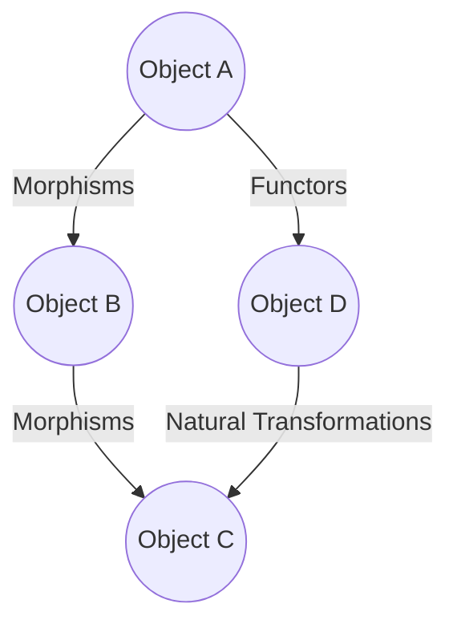

## A.4. Reference Materials

In this section, we delve into the mathematical underpinnings and essential tools that form the backbone of functional programming patterns. Understanding these concepts and leveraging the right tools can significantly enhance your ability to implement functional programming paradigms effectively.

### Mathematical Background

#### Basics of Category Theory

Category theory is a branch of mathematics that deals with abstract structures and relationships between them. It provides a high-level framework for understanding the composition and transformation of functions, which is central to functional programming.

**Key Concepts:**

1. **Categories**: A category consists of objects and morphisms (arrows) between these objects. In programming, objects can be types, and morphisms can be functions.

2. **Functors**: Functors map objects and morphisms from one category to another, preserving the structure. In functional programming, functors are often used to apply functions over wrapped values, like lists or options.

3. **Monads**: Monads are a type of functor that provide a way to chain operations together. They encapsulate computations and manage side effects, making them crucial for handling asynchronous operations and stateful computations.

4. **Natural Transformations**: These are mappings between functors, providing a way to transform one functor into another while preserving the categorical structure.

**Visualizing Category Theory:**



**Applications in Functional Programming:**

- **Function Composition**: Category theory provides the foundation for composing functions, a core concept in functional programming.
- **Type Systems**: Many functional languages use category theory to define and enforce type systems, ensuring code correctness and safety.

#### Basics of Algebra

Algebra in the context of functional programming often refers to algebraic data types (ADTs) and operations that can be performed on them.

**Key Concepts:**

1. **Algebraic Data Types**: These are composite types formed by combining other types. They include:
   - **Sum Types**: Represented by the `Either` type, allowing a value to be one of several types.
   - **Product Types**: Represented by tuples or records, combining multiple values into one.

2. **Monoids**: A monoid is an algebraic structure with a single associative binary operation and an identity element. In programming, strings and numbers often form monoids with operations like concatenation and addition.

3. **Group Theory**: While not as commonly applied directly, understanding groups can help in designing operations that are invertible, such as undo functionalities.

**Pseudocode Example of Algebraic Data Types:**

```pseudocode
// Define a sum type for a simple result
type Result = Success(value: Any) | Failure(error: String)

// Define a product type for a point in 2D space
type Point = (x: Number, y: Number)

// Function to add two points
function addPoints(p1: Point, p2: Point) -> Point:
    return (p1.x + p2.x, p1.y + p2.y)
```

**Applications in Functional Programming:**

- **Pattern Matching**: Algebraic data types enable pattern matching, allowing for concise and expressive code.
- **Data Modeling**: ADTs provide a robust way to model complex data structures and their interactions.

### Common Libraries and Tools

Functional programming is supported by a rich ecosystem of libraries and tools that facilitate the implementation of functional patterns across various languages.

#### Libraries for Functional Programming

1. **Ramda (JavaScript)**:
   - A practical library for functional programming in JavaScript, offering a wide range of utilities for working with functions and data.
   - **Key Features**: Currying, function composition, and immutability.

2. **Lodash (JavaScript)**:
   - A utility library that provides functional programming helpers, including map, reduce, and filter.
   - **Key Features**: Modular methods, lazy evaluation, and chaining.

3. **Immutable.js (JavaScript)**:
   - Provides immutable data structures, ensuring data cannot be changed once created.
   - **Key Features**: Persistent data structures, structural sharing, and efficient updates.

4. **Scalaz (Scala)**:
   - A library for functional programming in Scala, offering abstractions like monads, functors, and lenses.
   - **Key Features**: Type classes, functional data structures, and effect systems.

5. **Cats (Scala)**:
   - Another Scala library that provides abstractions for functional programming, focusing on simplicity and ease of use.
   - **Key Features**: Type classes, data types, and functional patterns.

6. **F# Core Library (F#)**:
   - The standard library for F#, a functional-first language on the .NET platform.
   - **Key Features**: Immutable collections, asynchronous workflows, and pattern matching.

7. **Elm Core Libraries (Elm)**:
   - Libraries for the Elm language, designed for building web applications with a focus on simplicity and robustness.
   - **Key Features**: Pure functions, immutable data, and a strong type system.

#### Tools for Functional Programming

1. **Haskell Compiler (GHC)**:
   - The Glasgow Haskell Compiler is the most widely used Haskell compiler, known for its performance and extensive library support.
   - **Key Features**: Advanced type system, lazy evaluation, and concurrency support.

2. **REPLs (Read-Eval-Print Loops)**:
   - Interactive environments for experimenting with functional programming languages, such as the Haskell REPL (GHCi) and the Scala REPL.
   - **Key Features**: Immediate feedback, interactive debugging, and rapid prototyping.

3. **Functional IDEs and Plugins**:
   - IDEs like IntelliJ IDEA and Visual Studio Code offer plugins for functional languages, providing syntax highlighting, code completion, and refactoring tools.
   - **Key Features**: Language support, integration with build tools, and version control.

4. **Build Tools**:
   - Tools like SBT (Scala Build Tool) and Stack (Haskell) manage dependencies, build processes, and project configurations for functional projects.
   - **Key Features**: Dependency management, task automation, and project scaffolding.

5. **Testing Frameworks**:
   - Frameworks like QuickCheck (Haskell) and ScalaTest (Scala) support property-based testing, a powerful technique for testing functional code.
   - **Key Features**: Generative testing, test case minimization, and integration with CI/CD pipelines.

### References and Links

To deepen your understanding of functional programming and its mathematical foundations, consider exploring the following resources:

- **Category Theory for Programmers** by Bartosz Milewski: A comprehensive guide to understanding category theory in the context of programming.
- **Functional Programming in Scala** by Paul Chiusano and Rúnar Bjarnason: A detailed exploration of functional programming concepts using Scala.
- **Learn You a Haskell for Great Good!** by Miran Lipovača: An accessible introduction to Haskell and functional programming.
- **The Haskell Book** by Christopher Allen and Julie Moronuki: A practical guide to learning Haskell from the ground up.

### Knowledge Check

To reinforce your understanding, consider the following questions and exercises:

1. **Explain the role of functors in functional programming. How do they relate to function composition?**

2. **Demonstrate how monads can be used to handle side effects in a functional program. Provide a pseudocode example.**

3. **What are algebraic data types, and how do they facilitate pattern matching in functional languages?**

4. **Explore the use of a functional programming library in your preferred language. Implement a simple program using its features.**

5. **Discuss the benefits of using immutable data structures in concurrent programming. Provide examples.**

### Embrace the Journey

Remember, mastering functional programming patterns is a journey. As you explore these concepts and tools, you'll gain a deeper understanding of how to write clean, efficient, and maintainable code. Keep experimenting, stay curious, and enjoy the process!

## Quiz Time!



### What is a functor in functional programming?

- [x] A structure that can be mapped over
- [ ] A function that takes another function as an argument
- [ ] A type of monad
- [ ] A data structure that holds multiple values

> **Explanation:** A functor is a structure that can be mapped over, allowing functions to be applied to values within the structure.

### Which of the following is a key feature of monads?

- [x] Chaining operations together
- [ ] Storing multiple values
- [ ] Providing a type system
- [ ] Enforcing immutability

> **Explanation:** Monads allow for chaining operations together, encapsulating computations and managing side effects.

### What is the primary purpose of algebraic data types?

- [x] To model complex data structures
- [ ] To enforce type safety
- [ ] To provide a way to handle side effects
- [ ] To optimize performance

> **Explanation:** Algebraic data types are used to model complex data structures, enabling pattern matching and concise code.

### Which library is known for providing immutable data structures in JavaScript?

- [x] Immutable.js
- [ ] Lodash
- [ ] Ramda
- [ ] Scalaz

> **Explanation:** Immutable.js is a library that provides immutable data structures for JavaScript, ensuring data cannot be changed once created.

### What is the role of a REPL in functional programming?

- [x] To provide an interactive environment for experimentation
- [ ] To compile code into machine language
- [ ] To manage project dependencies
- [ ] To enforce coding standards

> **Explanation:** A REPL (Read-Eval-Print Loop) provides an interactive environment for experimenting with functional programming languages.

### Which of the following is a benefit of using immutable data structures?

- [x] Avoiding race conditions in concurrent programming
- [ ] Reducing memory usage
- [ ] Increasing execution speed
- [ ] Simplifying syntax

> **Explanation:** Immutable data structures help avoid race conditions in concurrent programming by ensuring data cannot be changed unexpectedly.

### What is the primary advantage of using property-based testing?

- [x] Ensuring correctness over a range of inputs
- [ ] Simplifying test case creation
- [ ] Reducing test execution time
- [ ] Increasing code coverage

> **Explanation:** Property-based testing ensures correctness over a range of inputs by generating test cases based on properties of the code.

### Which tool is commonly used for building Scala projects?

- [x] SBT (Scala Build Tool)
- [ ] Maven
- [ ] Gradle
- [ ] Ant

> **Explanation:** SBT (Scala Build Tool) is commonly used for building Scala projects, managing dependencies, and automating tasks.

### What is the significance of monoids in functional programming?

- [x] They provide a structure for combining values
- [ ] They enforce type safety
- [ ] They manage side effects
- [ ] They optimize performance

> **Explanation:** Monoids provide a structure for combining values using an associative binary operation and an identity element.

### True or False: Category theory is only applicable to functional programming.

- [ ] True
- [x] False

> **Explanation:** False. Category theory is a branch of mathematics that can be applied to various fields, including functional programming, but is not limited to it.


