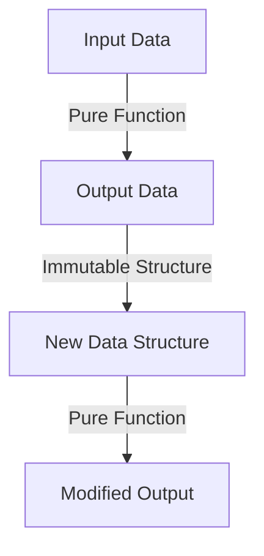

## 2.1. Pure Functions and Immutability

In the realm of functional programming, two fundamental concepts stand out for their profound impact on code quality and maintainability: **pure functions** and **immutability**. These principles not only enhance the predictability and reliability of software but also facilitate concurrent and parallel programming by minimizing side effects and state-related bugs. Let's delve deeper into these concepts, explore their benefits, and examine how they can be implemented through pseudocode examples.

### Definition and Characteristics of Pure Functions

**Pure functions** are the cornerstone of functional programming. They are defined by two main characteristics:

1. **No Side Effects**: A pure function does not alter any external state or interact with the outside world. This means no modifying global variables, no I/O operations, and no changing the state of mutable objects.

2. **Consistent Outputs for Same Inputs**: Given the same input, a pure function will always produce the same output. This deterministic behavior makes pure functions predictable and easy to test.

#### Key Benefits of Pure Functions

- **Predictability**: Since pure functions always produce the same output for the same input, they are highly predictable, making debugging and testing straightforward.
- **Composability**: Pure functions can be easily composed to build more complex functions, enhancing modularity and reusability.
- **Parallelism**: Pure functions can be executed in parallel without concerns about race conditions or shared state, as they do not depend on or modify external state.

#### Example of a Pure Function

Consider a simple mathematical function that calculates the square of a number:

```pseudocode
function square(x):
    return x * x
```

This function is pure because it does not modify any external state and always returns the same result for a given input.

### Benefits of Immutability

**Immutability** refers to the concept of data that cannot be changed once created. In functional programming, data structures are often immutable, meaning any modification results in the creation of a new data structure rather than altering the existing one.

#### Key Benefits of Immutability

- **State-Related Bug Reduction**: By eliminating mutable state, immutability reduces the likelihood of bugs related to unexpected state changes.
- **Concurrency and Parallelism**: Immutable data structures can be shared across threads without the need for synchronization, simplifying concurrent programming.
- **Ease of Reasoning**: With immutable data, the state of a program is easier to reason about, as data does not change unexpectedly.

#### Example of an Immutable Data Structure

Consider an immutable list where any modification results in a new list:

```pseudocode
function addElementToList(list, element):
    return list + [element]
```

In this example, `addElementToList` does not modify the original list but returns a new list with the added element.

### Pseudocode Examples: Implementing Pure Functions and Immutable Structures

Let's explore more complex examples to solidify our understanding of pure functions and immutability.

#### Example: Pure Function for Calculating Factorial

A classic example of a pure function is one that calculates the factorial of a number:

```pseudocode
function factorial(n):
    if n == 0:
        return 1
    else:
        return n * factorial(n - 1)
```

This recursive function is pure because it relies solely on its input and does not modify any external state.

#### Example: Immutable Data Structure - Persistent Stack

A persistent stack is an immutable data structure where operations like push and pop return new stacks rather than modifying the existing one.

```pseudocode
class Stack:
    def __init__(self, elements=[]):
        self.elements = elements

    def push(self, element):
        return Stack(self.elements + [element])

    def pop(self):
        if self.is_empty():
            raise Exception("Stack is empty")
        return Stack(self.elements[:-1])

    def is_empty(self):
        return len(self.elements) == 0

    def top(self):
        if self.is_empty():
            raise Exception("Stack is empty")
        return self.elements[-1]
```

In this implementation, `push` and `pop` operations return new instances of `Stack`, preserving immutability.

### Visualizing Pure Functions and Immutability

To better understand the interaction between pure functions and immutable data structures, let's visualize the flow of data and function calls.



**Figure 1**: This flowchart illustrates how pure functions operate on input data to produce output data, which is then used to create new immutable data structures.

### Try It Yourself

To deepen your understanding, try modifying the pseudocode examples:

- **Modify the `factorial` function** to use an iterative approach while maintaining purity.
- **Implement a persistent queue** similar to the persistent stack, ensuring immutability.

### Knowledge Check

- **What makes a function pure?**
- **How does immutability benefit concurrent programming?**
- **Can you identify any potential drawbacks of using immutable data structures?**

### Embrace the Journey

Remember, mastering pure functions and immutability is a significant step towards writing robust and maintainable functional programs. As you continue to explore these concepts, you'll find that they form the foundation for many advanced functional programming patterns. Keep experimenting, stay curious, and enjoy the journey!

## Quiz Time!



### What is a characteristic of a pure function?

- [x] No side effects
- [ ] Modifies global state
- [ ] Depends on external variables
- [ ] Produces different outputs for the same inputs

> **Explanation:** Pure functions do not have side effects and always produce the same output for the same input.

### Why is immutability beneficial in concurrent programming?

- [x] It eliminates the need for synchronization
- [ ] It allows for faster execution
- [ ] It reduces memory usage
- [ ] It simplifies code syntax

> **Explanation:** Immutability allows data to be shared across threads without synchronization, reducing concurrency issues.

### Which of the following is NOT a benefit of pure functions?

- [ ] Predictability
- [ ] Composability
- [x] Increased memory usage
- [ ] Easier testing

> **Explanation:** Pure functions are predictable, composable, and easy to test, but they do not inherently increase memory usage.

### What does immutability mean in functional programming?

- [x] Data cannot be changed once created
- [ ] Data can be modified in place
- [ ] Functions can alter global state
- [ ] Variables can be reassigned

> **Explanation:** Immutability means that data structures cannot be changed once created, promoting stability and predictability.

### How does a pure function handle input and output?

- [x] It produces the same output for the same input
- [ ] It modifies the input data
- [ ] It relies on external state
- [ ] It produces random outputs

> **Explanation:** Pure functions consistently produce the same output for the same input, without modifying the input data.

### What is a potential drawback of immutability?

- [x] Increased memory usage
- [ ] Difficulty in testing
- [ ] Unpredictable behavior
- [ ] Complex syntax

> **Explanation:** Immutability can lead to increased memory usage due to the creation of new data structures rather than modifying existing ones.

### Which operation is NOT typically associated with pure functions?

- [ ] Mathematical calculations
- [ ] Data transformations
- [x] File I/O operations
- [ ] String manipulations

> **Explanation:** File I/O operations are not associated with pure functions as they involve side effects.

### What is the result of calling a pure function with the same arguments multiple times?

- [x] The same result each time
- [ ] Different results each time
- [ ] A modified global state
- [ ] An error

> **Explanation:** A pure function will always return the same result when called with the same arguments.

### How can immutability help in debugging?

- [x] By providing predictable state
- [ ] By reducing code size
- [ ] By increasing execution speed
- [ ] By allowing state changes

> **Explanation:** Immutability provides a predictable state, making it easier to trace and debug issues.

### True or False: Pure functions can modify global variables.

- [ ] True
- [x] False

> **Explanation:** Pure functions cannot modify global variables as they do not have side effects.


