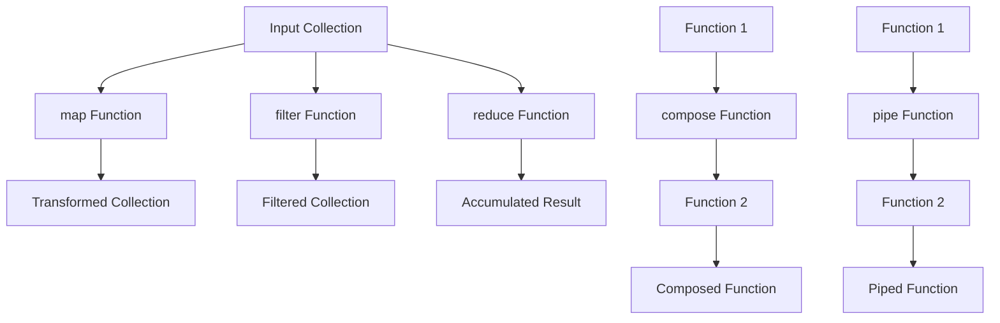

## 2.2. Higher-Order Functions

Higher-order functions (HOFs) are a cornerstone of functional programming, enabling developers to write more abstract, concise, and reusable code. In this section, we will delve into the concept of higher-order functions, explore common examples such as `map`, `filter`, `reduce`, `compose`, and `pipe`, and provide pseudocode implementations to illustrate their usage.

### Understanding Higher-Order Functions

Higher-order functions are functions that can take other functions as arguments or return them as results. This capability allows for a high degree of abstraction and flexibility in programming. By using higher-order functions, we can create more modular and reusable code, as they enable us to encapsulate behavior and pass it around as data.

#### Key Characteristics of Higher-Order Functions

1. **Function as Argument**: A higher-order function can accept one or more functions as parameters. This allows us to pass behavior into functions, enabling customization and flexibility.

2. **Function as Return Value**: A higher-order function can return a function as its result. This is useful for creating function factories or for implementing techniques like currying.

3. **Abstraction and Reusability**: By abstracting behavior into functions, higher-order functions promote code reuse and separation of concerns.

4. **Composability**: Higher-order functions facilitate function composition, allowing us to build complex operations by combining simpler functions.

### Common Higher-Order Functions

Let's explore some of the most common higher-order functions used in functional programming: `map`, `filter`, `reduce`, `compose`, and `pipe`.

#### Map

The `map` function is used to transform each element in a collection by applying a given function to each element. It returns a new collection containing the transformed elements.

**Pseudocode Example:**

```pseudocode
function map(collection, transformFunction):
    result = []
    for element in collection:
        result.append(transformFunction(element))
    return result

// Usage
numbers = [1, 2, 3, 4, 5]
squaredNumbers = map(numbers, function(x) { return x * x })
// squaredNumbers = [1, 4, 9, 16, 25]
```

#### Filter

The `filter` function is used to select elements from a collection that satisfy a given predicate function. It returns a new collection containing only the elements for which the predicate returns true.

**Pseudocode Example:**

```pseudocode
function filter(collection, predicateFunction):
    result = []
    for element in collection:
        if predicateFunction(element):
            result.append(element)
    return result

// Usage
numbers = [1, 2, 3, 4, 5]
evenNumbers = filter(numbers, function(x) { return x % 2 == 0 })
// evenNumbers = [2, 4]
```

#### Reduce

The `reduce` function is used to accumulate a single result from a collection by iteratively applying a combining function. It processes each element in the collection and combines them into a single output value.

**Pseudocode Example:**

```pseudocode
function reduce(collection, combineFunction, initialValue):
    accumulator = initialValue
    for element in collection:
        accumulator = combineFunction(accumulator, element)
    return accumulator

// Usage
numbers = [1, 2, 3, 4, 5]
sum = reduce(numbers, function(acc, x) { return acc + x }, 0)
// sum = 15
```

#### Compose

The `compose` function is used to combine multiple functions into a single function. It takes a series of functions as arguments and returns a new function that applies them from right to left.

**Pseudocode Example:**

```pseudocode
function compose(...functions):
    return function(x):
        for function in reverse(functions):
            x = function(x)
        return x

// Usage
addOne = function(x) { return x + 1 }
double = function(x) { return x * 2 }
addOneAndDouble = compose(double, addOne)
result = addOneAndDouble(3) // result = 8
```

#### Pipe

The `pipe` function is similar to `compose`, but it applies functions from left to right. This can be more intuitive when reading code, as it mirrors the order of operations.

**Pseudocode Example:**

```pseudocode
function pipe(...functions):
    return function(x):
        for function in functions:
            x = function(x)
        return x

// Usage
addOne = function(x) { return x + 1 }
double = function(x) { return x * 2 }
doubleAndAddOne = pipe(addOne, double)
result = doubleAndAddOne(3) // result = 7
```

### Pseudocode Implementations

Let's dive deeper into each of these higher-order functions with more detailed pseudocode implementations and explanations.

#### Map Implementation

The `map` function iterates over each element in the input collection, applies the transformation function, and collects the results in a new collection.

**Detailed Pseudocode:**

```pseudocode
function map(collection, transformFunction):
    result = []
    for element in collection:
        transformedElement = transformFunction(element)
        result.append(transformedElement)
    return result

// Example usage
names = ["Alice", "Bob", "Charlie"]
uppercaseNames = map(names, function(name) { return name.toUpperCase() })
// uppercaseNames = ["ALICE", "BOB", "CHARLIE"]
```

**Explanation:**

- The `map` function takes two arguments: a collection and a transformation function.
- It initializes an empty list `result` to store the transformed elements.
- It iterates over each element in the collection, applies the transformation function, and appends the result to `result`.
- Finally, it returns the `result` list containing the transformed elements.

#### Filter Implementation

The `filter` function iterates over each element in the input collection, applies the predicate function, and collects the elements that satisfy the predicate in a new collection.

**Detailed Pseudocode:**

```pseudocode
function filter(collection, predicateFunction):
    result = []
    for element in collection:
        if predicateFunction(element):
            result.append(element)
    return result

// Example usage
ages = [15, 22, 17, 30, 19]
adults = filter(ages, function(age) { return age >= 18 })
// adults = [22, 30, 19]
```

**Explanation:**

- The `filter` function takes two arguments: a collection and a predicate function.
- It initializes an empty list `result` to store the elements that satisfy the predicate.
- It iterates over each element in the collection, applies the predicate function, and appends the element to `result` if the predicate returns true.
- Finally, it returns the `result` list containing the filtered elements.

#### Reduce Implementation

The `reduce` function iterates over each element in the input collection, applies the combining function, and accumulates the result in a single value.

**Detailed Pseudocode:**

```pseudocode
function reduce(collection, combineFunction, initialValue):
    accumulator = initialValue
    for element in collection:
        accumulator = combineFunction(accumulator, element)
    return accumulator

// Example usage
expenses = [100, 200, 150, 50]
totalExpense = reduce(expenses, function(total, expense) { return total + expense }, 0)
// totalExpense = 500
```

**Explanation:**

- The `reduce` function takes three arguments: a collection, a combining function, and an initial value.
- It initializes the `accumulator` with the initial value.
- It iterates over each element in the collection, applies the combining function, and updates the `accumulator`.
- Finally, it returns the `accumulator` containing the accumulated result.

#### Compose Implementation

The `compose` function creates a new function by chaining multiple functions together, applying them from right to left.

**Detailed Pseudocode:**

```pseudocode
function compose(...functions):
    return function(x):
        for function in reverse(functions):
            x = function(x)
        return x

// Example usage
increment = function(x) { return x + 1 }
square = function(x) { return x * x }
incrementAndSquare = compose(square, increment)
result = incrementAndSquare(2) // result = 9
```

**Explanation:**

- The `compose` function takes a variable number of functions as arguments.
- It returns a new function that applies the input functions in reverse order.
- The returned function takes an input `x`, applies each function in reverse order, and returns the final result.

#### Pipe Implementation

The `pipe` function creates a new function by chaining multiple functions together, applying them from left to right.

**Detailed Pseudocode:**

```pseudocode
function pipe(...functions):
    return function(x):
        for function in functions:
            x = function(x)
        return x

// Example usage
increment = function(x) { return x + 1 }
square = function(x) { return x * x }
squareAndIncrement = pipe(increment, square)
result = squareAndIncrement(2) // result = 5
```

**Explanation:**

- The `pipe` function takes a variable number of functions as arguments.
- It returns a new function that applies the input functions in order.
- The returned function takes an input `x`, applies each function in order, and returns the final result.

### Visualizing Higher-Order Functions

To better understand the flow of data through higher-order functions, let's visualize the process using a flowchart.



**Diagram Description:**

- The flowchart illustrates the process of applying higher-order functions to a collection.
- The `map`, `filter`, and `reduce` functions transform, filter, and accumulate data, respectively.
- The `compose` and `pipe` functions combine multiple functions into a single function.

### Try It Yourself

To deepen your understanding of higher-order functions, try modifying the pseudocode examples provided above. Here are some suggestions:

1. **Modify the Transformation Function**: Change the transformation function in the `map` example to perform a different operation, such as converting strings to lowercase or calculating the square root of numbers.

2. **Experiment with Different Predicates**: In the `filter` example, try using different predicate functions to filter elements based on different criteria, such as filtering out negative numbers or selecting elements that start with a specific letter.

3. **Implement a Custom Combining Function**: In the `reduce` example, create a custom combining function to perform a different accumulation operation, such as finding the maximum value or concatenating strings.

4. **Create New Composed Functions**: Use the `compose` and `pipe` functions to create new composed functions by chaining different operations together. Experiment with different combinations to see how the order of operations affects the result.

### References and Links

For further reading on higher-order functions and functional programming, consider exploring the following resources:

- [MDN Web Docs: Functions](https://developer.mozilla.org/en-US/docs/Web/JavaScript/Guide/Functions)
- [W3Schools: JavaScript Functions](https://www.w3schools.com/js/js_functions.asp)
- [Eloquent JavaScript: Higher-Order Functions](https://eloquentjavascript.net/05_higher_order.html)

### Knowledge Check

To reinforce your understanding of higher-order functions, consider the following questions and challenges:

1. What is a higher-order function, and how does it differ from a regular function?
2. How can higher-order functions improve code reusability and modularity?
3. Implement a higher-order function that takes a function and a collection as arguments and applies the function to each element in the collection.
4. Create a composed function using `compose` that applies three different transformations to an input value.
5. Use `pipe` to create a function that filters, maps, and reduces a collection in a single operation.

### Embrace the Journey

Remember, mastering higher-order functions is a journey that requires practice and experimentation. As you continue to explore functional programming, you'll discover new ways to leverage higher-order functions to write more expressive and efficient code. Keep experimenting, stay curious, and enjoy the journey!

## Quiz Time!



### What is a higher-order function?

- [x] A function that takes other functions as arguments or returns them.
- [ ] A function that only performs arithmetic operations.
- [ ] A function that cannot be nested within other functions.
- [ ] A function that only operates on numbers.

> **Explanation:** A higher-order function is one that can take other functions as arguments or return them as results, allowing for greater abstraction and flexibility.

### Which of the following is NOT a common higher-order function?

- [ ] map
- [ ] filter
- [ ] reduce
- [x] loop

> **Explanation:** `loop` is not a higher-order function. Common higher-order functions include `map`, `filter`, and `reduce`.

### What does the `map` function do?

- [x] Transforms each element in a collection using a given function.
- [ ] Filters elements in a collection based on a predicate.
- [ ] Accumulates a single result from a collection.
- [ ] Combines multiple functions into one.

> **Explanation:** The `map` function applies a transformation function to each element in a collection, returning a new collection of transformed elements.

### How does the `filter` function work?

- [x] It selects elements from a collection that satisfy a given predicate.
- [ ] It transforms each element in a collection.
- [ ] It accumulates a single result from a collection.
- [ ] It combines multiple functions into one.

> **Explanation:** The `filter` function selects elements from a collection that satisfy a given predicate, returning a new collection of those elements.

### What is the purpose of the `reduce` function?

- [x] To accumulate a single result from a collection by applying a combining function.
- [ ] To transform each element in a collection.
- [ ] To filter elements in a collection based on a predicate.
- [ ] To combine multiple functions into one.

> **Explanation:** The `reduce` function accumulates a single result from a collection by iteratively applying a combining function to each element.

### How does the `compose` function operate?

- [x] It combines multiple functions into a single function, applying them from right to left.
- [ ] It combines multiple functions into a single function, applying them from left to right.
- [ ] It transforms each element in a collection.
- [ ] It filters elements in a collection based on a predicate.

> **Explanation:** The `compose` function combines multiple functions into a single function, applying them from right to left.

### What is the difference between `compose` and `pipe`?

- [x] `compose` applies functions from right to left, while `pipe` applies them from left to right.
- [ ] `compose` applies functions from left to right, while `pipe` applies them from right to left.
- [ ] `compose` is used for filtering, while `pipe` is used for mapping.
- [ ] `compose` is used for reducing, while `pipe` is used for transforming.

> **Explanation:** `compose` applies functions from right to left, while `pipe` applies them from left to right, affecting the order of operations.

### Which higher-order function would you use to select elements from a collection?

- [ ] map
- [x] filter
- [ ] reduce
- [ ] compose

> **Explanation:** The `filter` function is used to select elements from a collection that satisfy a given predicate.

### What is a key benefit of using higher-order functions?

- [x] They promote code reusability and modularity.
- [ ] They make code more difficult to understand.
- [ ] They are only useful in imperative programming.
- [ ] They eliminate the need for variables.

> **Explanation:** Higher-order functions promote code reusability and modularity by allowing behavior to be encapsulated and passed around as data.

### True or False: Higher-order functions can only take functions as arguments, not return them.

- [ ] True
- [x] False

> **Explanation:** False. Higher-order functions can both take functions as arguments and return them as results.


