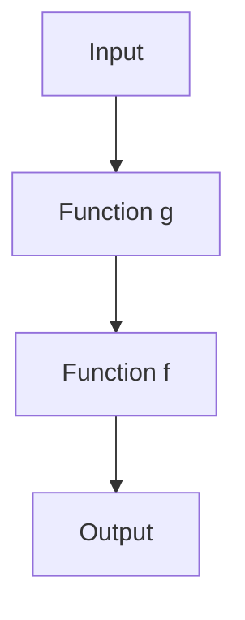

## 2.3. Function Composition

Function composition is a cornerstone of functional programming, allowing developers to build complex operations by combining simple functions. This technique enhances code modularity and reusability, making it easier to manage, understand, and maintain. In this section, we will delve into the concept of function composition, explore its benefits, and provide pseudocode examples to illustrate its implementation.

### Composing Functions

Function composition is the process of combining two or more functions to produce a new function. This new function represents the application of the original functions in sequence. In mathematical terms, if we have two functions, `f` and `g`, the composition of these functions is denoted as `f(g(x))`. In functional programming, this concept is often implemented using a `compose` function.

#### Understanding Function Composition

To understand function composition, let's consider a simple example. Suppose we have two functions:

- `increment(x)`: Adds 1 to the input `x`.
- `double(x)`: Multiplies the input `x` by 2.

If we want to create a new function that first doubles a number and then increments it, we can compose these two functions:

```pseudocode
function increment(x):
    return x + 1

function double(x):
    return x * 2

function composedFunction(x):
    return increment(double(x))

// Usage
result = composedFunction(3)  // Output: 7
```

In this example, `composedFunction` is the result of composing `increment` and `double`. The input `3` is first doubled to `6`, and then incremented to `7`.

#### Implementing the Compose Function

To facilitate function composition, we can implement a `compose` function that takes two functions as arguments and returns their composition. Here's how it can be done in pseudocode:

```pseudocode
function compose(f, g):
    return function(x):
        return f(g(x))

// Define the functions
function increment(x):
    return x + 1

function double(x):
    return x * 2

// Compose the functions
composedFunction = compose(increment, double)

// Usage
result = composedFunction(3)  // Output: 7
```

In this implementation, `compose` takes two functions, `f` and `g`, and returns a new function that applies `g` to its input and then applies `f` to the result.

### Benefits of Function Composition

Function composition offers several benefits that make it a powerful tool in functional programming:

1. **Modularity**: By breaking down complex operations into smaller, reusable functions, we can create modular code that is easier to understand and maintain.

2. **Reusability**: Composed functions can be reused in different parts of a program, reducing code duplication and improving maintainability.

3. **Readability**: Function composition allows us to express complex operations in a clear and concise manner, making the code more readable.

4. **Testability**: Smaller, composed functions are easier to test individually, leading to more reliable and robust code.

5. **Abstraction**: Function composition abstracts away the details of how functions are combined, allowing developers to focus on the overall logic of the program.

### Pseudocode Examples

Let's explore some pseudocode examples to illustrate the implementation of function composition in different scenarios.

#### Example 1: Composing Mathematical Functions

Consider a scenario where we need to apply a series of mathematical transformations to a number. We can achieve this using function composition:

```pseudocode
function square(x):
    return x * x

function halve(x):
    return x / 2

function negate(x):
    return -x

// Compose the functions
composedFunction = compose(negate, compose(halve, square))

// Usage
result = composedFunction(4)  // Output: -8
```

In this example, `composedFunction` first squares the input `4` to get `16`, then halves it to get `8`, and finally negates it to get `-8`.

#### Example 2: Composing String Manipulation Functions

Function composition is not limited to mathematical operations. It can also be used for string manipulation:

```pseudocode
function toUpperCase(s):
    return s.toUpperCase()

function trim(s):
    return s.trim()

function addExclamation(s):
    return s + "!"

// Compose the functions
composedFunction = compose(addExclamation, compose(trim, toUpperCase))

// Usage
result = composedFunction("  hello world  ")  // Output: "HELLO WORLD!"
```

Here, `composedFunction` first converts the input string to uppercase, trims any leading or trailing whitespace, and then adds an exclamation mark.

#### Example 3: Composing Functions with Different Signatures

Function composition can also be used with functions that have different input and output types. Consider the following example:

```pseudocode
function parseNumber(s):
    return parseInt(s)

function increment(x):
    return x + 1

function toString(x):
    return x.toString()

// Compose the functions
composedFunction = compose(toString, compose(increment, parseNumber))

// Usage
result = composedFunction("42")  // Output: "43"
```

In this example, `composedFunction` parses the input string `"42"` to a number, increments it to `43`, and then converts it back to a string.

### Visualizing Function Composition

To better understand function composition, let's visualize the process using a flowchart. This diagram illustrates how functions are applied in sequence:



In this flowchart, the input is first processed by `Function g`, and the result is then passed to `Function f`, producing the final output.

### Pipe Function

In addition to the `compose` function, functional programming often uses a `pipe` function, which applies functions from left to right, rather than right to left. This can make the code more readable, especially when dealing with a sequence of transformations.

#### Implementing the Pipe Function

Here's how we can implement a `pipe` function in pseudocode:

```pseudocode
function pipe(f, g):
    return function(x):
        return g(f(x))

// Define the functions
function increment(x):
    return x + 1

function double(x):
    return x * 2

// Pipe the functions
pipedFunction = pipe(increment, double)

// Usage
result = pipedFunction(3)  // Output: 8
```

In this implementation, `pipe` takes two functions, `f` and `g`, and returns a new function that applies `f` to its input and then applies `g` to the result.

### Try It Yourself

To deepen your understanding of function composition, try modifying the code examples provided. Here are some suggestions:

- **Experiment with Different Functions**: Create your own functions and compose them to see how they interact.
- **Change the Order of Composition**: Swap the order of functions in the composition to observe how it affects the output.
- **Combine More Functions**: Extend the examples by composing three or more functions to create more complex operations.

### Knowledge Check

Before we conclude, let's pose some questions to reinforce your understanding of function composition:

- What is the primary purpose of function composition in functional programming?
- How does function composition enhance code modularity and reusability?
- What is the difference between `compose` and `pipe` functions?
- How can function composition improve the testability of code?

### Summary

Function composition is a powerful technique in functional programming that allows developers to build complex operations by combining simple functions. It enhances code modularity, reusability, readability, and testability, making it an essential tool for creating maintainable and robust software. By understanding and applying function composition, you can write cleaner and more efficient code.

Remember, this is just the beginning. As you progress, you'll discover more advanced techniques and patterns in functional programming. Keep experimenting, stay curious, and enjoy the journey!

## Quiz Time!



### What is function composition?

- [x] Combining two or more functions to create a new function.
- [ ] A method for optimizing code execution.
- [ ] A technique for debugging functional code.
- [ ] A way to handle errors in functional programming.

> **Explanation:** Function composition involves combining two or more functions to create a new function that represents the application of the original functions in sequence.

### What is the primary benefit of function composition?

- [x] Enhancing code modularity and reusability.
- [ ] Improving code execution speed.
- [ ] Simplifying error handling.
- [ ] Reducing memory usage.

> **Explanation:** Function composition enhances code modularity and reusability by allowing developers to build complex operations from simple, reusable functions.

### How does the `compose` function apply functions?

- [x] From right to left.
- [ ] From left to right.
- [ ] In parallel.
- [ ] Randomly.

> **Explanation:** The `compose` function applies functions from right to left, meaning the rightmost function is applied first.

### How does the `pipe` function differ from `compose`?

- [x] It applies functions from left to right.
- [ ] It applies functions from right to left.
- [ ] It applies functions in parallel.
- [ ] It applies functions randomly.

> **Explanation:** The `pipe` function applies functions from left to right, making it more intuitive for reading a sequence of transformations.

### Which of the following is a benefit of function composition?

- [x] Improved testability.
- [ ] Increased memory usage.
- [ ] Slower code execution.
- [ ] More complex code.

> **Explanation:** Function composition improves testability by allowing developers to test smaller, composed functions individually.

### What is the output of the composed function in Example 1?

- [x] -8
- [ ] 8
- [ ] 16
- [ ] -16

> **Explanation:** The composed function first squares the input `4` to get `16`, then halves it to get `8`, and finally negates it to get `-8`.

### What is the output of the piped function in the `pipe` example?

- [x] 8
- [ ] 6
- [ ] 7
- [ ] 9

> **Explanation:** The piped function first increments the input `3` to get `4`, and then doubles it to get `8`.

### What is the purpose of the `pipe` function?

- [x] To apply functions from left to right.
- [ ] To apply functions from right to left.
- [ ] To handle errors in functional programming.
- [ ] To optimize code execution.

> **Explanation:** The `pipe` function applies functions from left to right, making it easier to read a sequence of transformations.

### How can function composition improve code readability?

- [x] By expressing complex operations in a clear and concise manner.
- [ ] By increasing the number of lines of code.
- [ ] By using more complex syntax.
- [ ] By reducing the number of functions.

> **Explanation:** Function composition improves code readability by allowing developers to express complex operations in a clear and concise manner.

### True or False: Function composition is only applicable to mathematical functions.

- [ ] True
- [x] False

> **Explanation:** False. Function composition can be applied to any type of function, including string manipulation and other operations.


