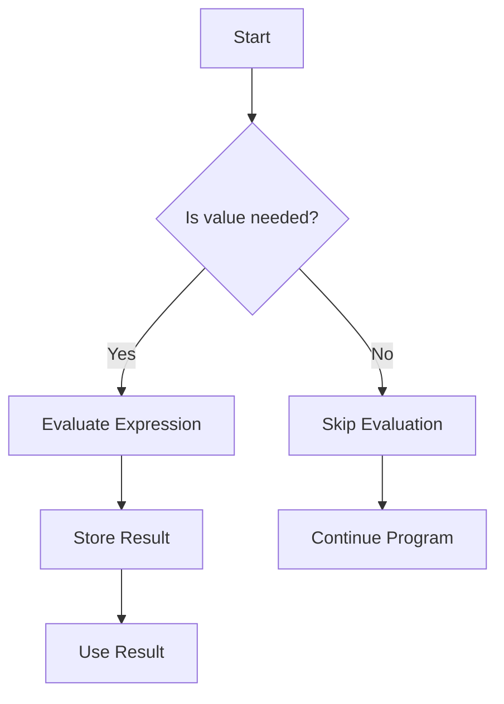

## 2.5. Lazy Evaluation

Lazy evaluation is a powerful concept in functional programming that allows us to defer the computation of expressions until their values are actually needed. This approach can lead to significant performance improvements, especially in scenarios where not all computed values are required. In this section, we will delve into the intricacies of lazy evaluation, explore its benefits and use cases, and provide pseudocode examples to illustrate its implementation.

### Deferring Computation

Lazy evaluation, also known as call-by-need, is a strategy that delays the evaluation of an expression until its value is needed by the program. This contrasts with eager evaluation, where expressions are evaluated as soon as they are bound to a variable. Lazy evaluation can be particularly useful in optimizing programs by avoiding unnecessary calculations, thus saving computational resources.

#### Key Concepts

- **Thunks**: A thunk is a deferred computation. In lazy evaluation, expressions are wrapped in thunks, which are evaluated only when their values are required.
- **Memoization**: Once a thunk is evaluated, its result is cached, so subsequent accesses do not require re-evaluation.
- **Infinite Data Structures**: Lazy evaluation enables the creation of infinite data structures, such as streams, which can be processed element by element without computing the entire structure upfront.

### Benefits and Use Cases

Lazy evaluation offers several advantages, making it a valuable tool in functional programming:

1. **Performance Optimization**: By deferring computations, lazy evaluation can reduce the number of calculations performed, leading to faster execution times.
2. **Memory Efficiency**: It allows for the creation of large or infinite data structures without consuming excessive memory, as only the necessary parts are computed.
3. **Improved Modularity**: Lazy evaluation can simplify code by allowing the separation of data generation from data consumption.
4. **Enhanced Expressiveness**: It enables the definition of complex data structures and algorithms in a more natural and declarative manner.

#### Use Cases

- **Infinite Lists**: Lazy evaluation is ideal for working with infinite lists or streams, where only a finite portion of the list is needed at any given time.
- **Conditional Computations**: In scenarios where certain computations may not be required based on runtime conditions, lazy evaluation can prevent unnecessary processing.
- **Complex Algorithms**: Algorithms that involve multiple stages of computation can benefit from lazy evaluation by deferring intermediate calculations until they are needed.

### Pseudocode Examples

To illustrate lazy evaluation, let's explore some pseudocode examples that demonstrate its application in creating lazy sequences and infinite lists.

#### Creating Lazy Sequences

A lazy sequence is a sequence whose elements are computed on demand. Here's a simple example of a lazy sequence generator:

```pseudocode
function lazySequence(generatorFunction):
    return function():
        return generatorFunction()

function generateNumbers(start):
    return function():
        current = start
        while true:
            yield current
            current = current + 1

lazyNumbers = lazySequence(generateNumbers(0))

// Accessing the first 5 numbers
for i in range(5):
    print(lazyNumbers())
```

In this example, `lazySequence` takes a generator function and returns a function that, when called, produces the next element in the sequence. The `generateNumbers` function creates an infinite sequence of numbers starting from a given value.

#### Implementing Infinite Lists

Infinite lists are a common use case for lazy evaluation. Here's how you can implement an infinite list of Fibonacci numbers using lazy evaluation:

```pseudocode
function lazyFibonacci():
    a = 0
    b = 1
    while true:
        yield a
        next = a + b
        a = b
        b = next

fibonacciSequence = lazyFibonacci()

// Accessing the first 10 Fibonacci numbers
for i in range(10):
    print(fibonacciSequence())
```

This pseudocode defines a `lazyFibonacci` function that generates Fibonacci numbers indefinitely. The sequence is computed lazily, meaning each number is only calculated when requested.

### Visualizing Lazy Evaluation

To better understand lazy evaluation, let's visualize the process using a flowchart that illustrates how expressions are evaluated only when needed.



This flowchart shows that if a value is needed, the expression is evaluated, and the result is stored for future use. If the value is not needed, the evaluation is skipped, and the program continues.

### Try It Yourself

To deepen your understanding of lazy evaluation, try modifying the pseudocode examples provided. Experiment with different generator functions, or create your own infinite sequences. Observe how lazy evaluation affects performance and memory usage.

### Knowledge Check

Before we conclude, let's reinforce your understanding of lazy evaluation with a few questions:

- What is the primary advantage of using lazy evaluation in functional programming?
- How does lazy evaluation enable the creation of infinite data structures?
- In what scenarios might lazy evaluation be particularly beneficial?

### Embrace the Journey

Remember, lazy evaluation is just one of the many powerful tools in the functional programming toolkit. As you continue your journey, keep exploring and experimenting with different patterns and techniques. Stay curious, and enjoy the process of learning and applying functional programming concepts to solve real-world problems.

## Quiz Time!



### What is lazy evaluation?

- [x] A strategy that delays the evaluation of expressions until their values are needed
- [ ] A method of evaluating expressions as soon as they are bound to a variable
- [ ] A technique for optimizing memory usage by precomputing values
- [ ] A way to execute all expressions in parallel

> **Explanation:** Lazy evaluation defers the computation of expressions until their values are actually required, which can optimize performance and memory usage.

### Which of the following is a benefit of lazy evaluation?

- [x] Performance optimization by avoiding unnecessary calculations
- [ ] Immediate computation of all expressions
- [ ] Increased memory usage
- [ ] Reduced expressiveness in code

> **Explanation:** Lazy evaluation can optimize performance by deferring computations that are not needed, thus avoiding unnecessary calculations.

### How does lazy evaluation handle infinite data structures?

- [x] By computing only the necessary parts of the structure on demand
- [ ] By precomputing the entire structure in memory
- [ ] By limiting the size of the structure
- [ ] By using eager evaluation to process the structure

> **Explanation:** Lazy evaluation allows for the creation of infinite data structures by computing only the parts that are needed, thus avoiding the need to store the entire structure in memory.

### What is a thunk in the context of lazy evaluation?

- [x] A deferred computation that is evaluated only when needed
- [ ] A precomputed value stored in memory
- [ ] A function that immediately computes its result
- [ ] A data structure used for storing infinite lists

> **Explanation:** A thunk is a deferred computation that encapsulates an expression, which is evaluated only when its value is required.

### In which scenario is lazy evaluation particularly useful?

- [x] When working with infinite lists or streams
- [x] When certain computations may not be required based on runtime conditions
- [ ] When all computations must be performed immediately
- [ ] When memory usage is not a concern

> **Explanation:** Lazy evaluation is beneficial when working with infinite lists or when computations may not be needed, as it defers unnecessary calculations.

### What is memoization in lazy evaluation?

- [x] Caching the result of a computation to avoid re-evaluation
- [ ] Precomputing all possible values of an expression
- [ ] Storing the entire data structure in memory
- [ ] Evaluating expressions in parallel

> **Explanation:** Memoization involves caching the result of a computation so that subsequent accesses do not require re-evaluation, improving efficiency.

### How can lazy evaluation improve modularity in code?

- [x] By separating data generation from data consumption
- [ ] By combining all computations into a single function
- [ ] By requiring all expressions to be evaluated immediately
- [ ] By limiting the use of functions

> **Explanation:** Lazy evaluation allows for the separation of data generation from data consumption, enhancing modularity and simplifying code.

### What is the role of a generator function in lazy evaluation?

- [x] To produce elements of a sequence on demand
- [ ] To precompute all elements of a sequence
- [ ] To store the entire sequence in memory
- [ ] To evaluate all expressions immediately

> **Explanation:** A generator function produces elements of a sequence on demand, allowing for lazy evaluation of the sequence.

### True or False: Lazy evaluation can lead to significant performance improvements by avoiding unnecessary calculations.

- [x] True
- [ ] False

> **Explanation:** Lazy evaluation can optimize performance by deferring computations that are not needed, thus avoiding unnecessary calculations.

### True or False: Lazy evaluation requires all expressions to be evaluated as soon as they are bound to a variable.

- [ ] True
- [x] False

> **Explanation:** Lazy evaluation defers the computation of expressions until their values are actually required, unlike eager evaluation, which evaluates expressions immediately.


