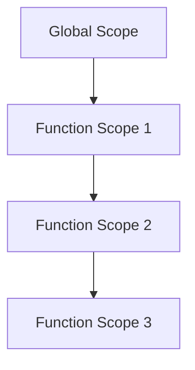
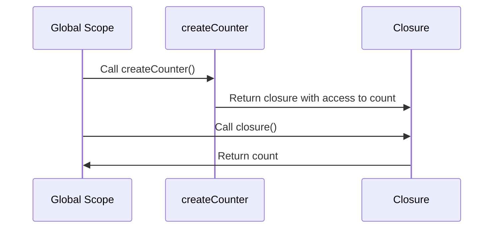

## 2.6. Closures and Lexical Scope

Closures and lexical scope are fundamental concepts in functional programming that enable powerful patterns such as encapsulation, data privacy, and partial application. Understanding these concepts is crucial for mastering functional programming and writing efficient, maintainable code. In this section, we will delve into the intricacies of closures and lexical scope, providing clear explanations, practical applications, and pseudocode examples to illustrate their effects.

### Understanding Closures

**Closures** are a feature of programming languages that allow functions to retain access to their lexical scope, even when the function is executed outside that scope. This means that a closure can "remember" the environment in which it was created, including any variables that were in scope at the time.

#### Key Characteristics of Closures

1. **Function Retention**: Closures retain access to their defining environment, allowing them to access variables and functions that were in scope when they were created.
2. **State Preservation**: Closures can maintain state across multiple invocations, making them useful for creating functions with persistent state.
3. **Encapsulation**: By retaining access to their lexical scope, closures can encapsulate data and behavior, providing a mechanism for data privacy.

#### Lexical Scope

**Lexical scope** refers to the region of a program where a binding of a variable is valid. In languages with lexical scoping, the scope of a variable is determined by its position within the source code, and nested functions have access to variables declared in their outer scope.

#### Visualizing Lexical Scope

To better understand lexical scope, consider the following diagram that illustrates the scope chain in a nested function structure:



In this diagram, each function scope has access to its own variables and the variables of its parent scopes, forming a chain of scopes.

### Practical Applications of Closures

Closures are versatile and can be used in various programming scenarios. Here are some practical applications:

1. **Encapsulation and Data Privacy**: Closures can encapsulate variables, preventing them from being accessed directly from outside the function. This is useful for creating private variables and methods.

2. **Partial Application and Currying**: Closures enable partial application and currying by allowing functions to be pre-configured with some arguments, returning a new function that takes the remaining arguments.

3. **Event Handling and Callbacks**: Closures are often used in event handling and callbacks, where they can capture and maintain state across asynchronous operations.

4. **Memoization**: Closures can be used to implement memoization, a technique for caching the results of expensive function calls to improve performance.

### Pseudocode Examples

Let's explore some pseudocode examples to demonstrate the power of closures and lexical scope.

#### Example 1: Encapsulation and Data Privacy

```pseudocode
function createCounter() {
    let count = 0  // Private variable

    return function() {
        count = count + 1
        return count
    }
}

let counter = createCounter()
print(counter())  // Output: 1
print(counter())  // Output: 2
```

In this example, the `createCounter` function returns a closure that has access to the `count` variable. The `count` variable is encapsulated within the closure, providing data privacy.

#### Example 2: Partial Application

```pseudocode
function add(x) {
    return function(y) {
        return x + y
    }
}

let addFive = add(5)
print(addFive(10))  // Output: 15
```

Here, the `add` function returns a closure that partially applies the `x` argument. The returned function takes the `y` argument and computes the sum.

#### Example 3: Memoization

```pseudocode
function memoize(fn) {
    let cache = {}

    return function(arg) {
        if (cache[arg] != null) {
            return cache[arg]
        } else {
            let result = fn(arg)
            cache[arg] = result
            return result
        }
    }
}

function slowFunction(x) {
    // Simulate a slow computation
    return x * x
}

let memoizedFunction = memoize(slowFunction)
print(memoizedFunction(5))  // Computed and cached
print(memoizedFunction(5))  // Retrieved from cache
```

In this example, the `memoize` function returns a closure that caches the results of the `slowFunction`, improving performance by avoiding redundant calculations.

### Visualizing Closure Execution

To visualize how closures retain access to their lexical scope, consider the following diagram:



This sequence diagram illustrates the interaction between the global scope, the `createCounter` function, and the closure it returns. The closure retains access to the `count` variable, even after the `createCounter` function has completed execution.

### Try It Yourself

To deepen your understanding of closures and lexical scope, try modifying the pseudocode examples provided:

1. **Modify the Counter**: Change the `createCounter` function to allow decrementing the counter as well. How does this affect the closure's behavior?

2. **Extend Partial Application**: Create a new function that uses partial application to multiply two numbers. How does this compare to the `add` function example?

3. **Enhance Memoization**: Modify the `memoize` function to handle multiple arguments. What changes are necessary to support this functionality?

### References and Links

For further reading on closures and lexical scope, consider the following resources:

- [MDN Web Docs: Closures](https://developer.mozilla.org/en-US/docs/Web/JavaScript/Closures)
- [W3Schools: JavaScript Closures](https://www.w3schools.com/js/js_function_closures.asp)

### Knowledge Check

Let's reinforce your understanding of closures and lexical scope with some questions and exercises:

1. **What is a closure, and how does it differ from a regular function?**

2. **Explain how lexical scope affects variable access in nested functions.**

3. **Describe a scenario where closures can be used to encapsulate data.**

4. **Implement a closure that maintains a list of items and provides methods to add and remove items.**

5. **How can closures be used to implement memoization? Provide an example.**

### Embrace the Journey

Remember, mastering closures and lexical scope is a journey. As you continue to explore functional programming, you'll discover new ways to leverage these concepts to write more efficient and maintainable code. Keep experimenting, stay curious, and enjoy the journey!

## Quiz Time!



### What is a closure?

- [x] A function that retains access to its lexical scope
- [ ] A function that does not have access to its lexical scope
- [ ] A function that only operates on global variables
- [ ] A function that cannot be nested

> **Explanation:** A closure is a function that retains access to its lexical scope, allowing it to access variables from its defining environment.

### How does lexical scope affect variable access?

- [x] It determines the visibility of variables based on their position in the source code
- [ ] It allows variables to be accessed from anywhere in the program
- [ ] It restricts variable access to the global scope only
- [ ] It has no effect on variable access

> **Explanation:** Lexical scope determines the visibility of variables based on their position in the source code, allowing nested functions to access variables from their outer scope.

### What is a practical application of closures?

- [x] Encapsulation and data privacy
- [ ] Global variable management
- [ ] Loop iteration
- [ ] File I/O operations

> **Explanation:** Closures can be used for encapsulation and data privacy by retaining access to private variables within a function.

### How can closures be used in event handling?

- [x] By capturing and maintaining state across asynchronous operations
- [ ] By preventing events from being triggered
- [ ] By accessing global event handlers only
- [ ] By disabling event listeners

> **Explanation:** Closures can capture and maintain state across asynchronous operations, making them useful in event handling and callbacks.

### What is partial application?

- [x] A technique where a function is pre-configured with some arguments
- [ ] A method for dividing a function into smaller parts
- [ ] A way to execute a function partially
- [ ] A process for optimizing function execution

> **Explanation:** Partial application is a technique where a function is pre-configured with some arguments, returning a new function that takes the remaining arguments.

### How does memoization improve performance?

- [x] By caching the results of expensive function calls
- [ ] By executing functions faster
- [ ] By reducing the number of function calls
- [ ] By optimizing memory usage

> **Explanation:** Memoization improves performance by caching the results of expensive function calls, avoiding redundant calculations.

### What is the role of closures in partial application?

- [x] They allow functions to be pre-configured with arguments
- [ ] They prevent functions from being partially applied
- [ ] They restrict functions to a single argument
- [ ] They disable function composition

> **Explanation:** Closures allow functions to be pre-configured with arguments, enabling partial application.

### How can closures provide data privacy?

- [x] By encapsulating variables within a function
- [ ] By exposing all variables to the global scope
- [ ] By preventing variable access entirely
- [ ] By deleting variables after use

> **Explanation:** Closures provide data privacy by encapsulating variables within a function, preventing them from being accessed directly from outside.

### What is a common use case for closures in functional programming?

- [x] Implementing higher-order functions
- [ ] Managing global state
- [ ] Performing file operations
- [ ] Executing system commands

> **Explanation:** Closures are commonly used in functional programming to implement higher-order functions, which can take other functions as arguments or return them.

### True or False: Closures can only be used in functional programming languages.

- [ ] True
- [x] False

> **Explanation:** False. Closures can be used in many programming languages, not just functional ones. They are a feature of languages that support first-class functions and lexical scoping.


