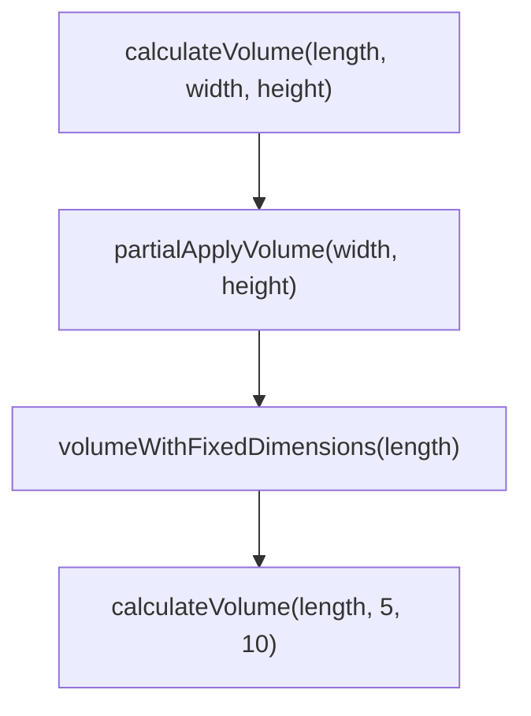
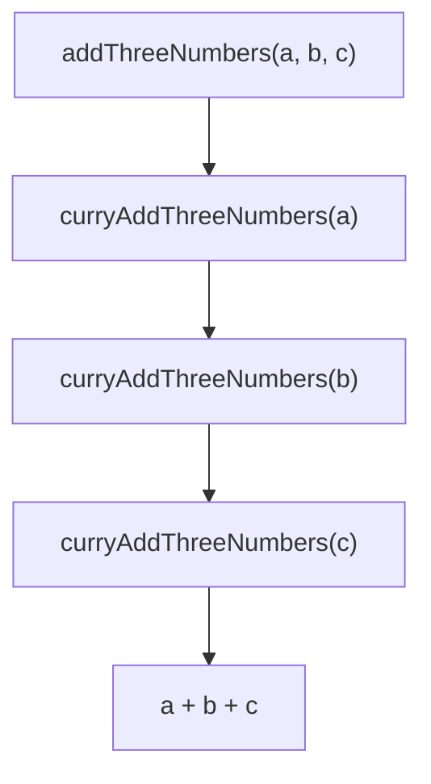

## 2.7. Partial Application and Currying

In the realm of functional programming, two powerful techniques—Partial Application and Currying—play a crucial role in enhancing code modularity, reusability, and readability. These concepts allow developers to create more flexible and composable functions, leading to cleaner and more maintainable codebases. In this section, we will delve into the intricacies of Partial Application and Currying, providing clear explanations, pseudocode examples, and practical insights.

### Defining Partial Application

Partial Application is a technique in functional programming where a function is transformed into another function by fixing a number of its arguments. This results in a new function that takes fewer arguments than the original. Partial Application is particularly useful for creating specialized functions from more general ones, allowing for code reuse and simplification.

#### Key Concepts of Partial Application

- **Function Specialization**: By fixing some arguments, we create a more specific version of a general function.
- **Reusability**: Partial Application promotes code reuse by allowing the creation of new functions from existing ones.
- **Simplification**: It simplifies function calls by reducing the number of arguments needed.

#### Pseudocode Example of Partial Application

Let's consider a simple example to illustrate Partial Application. Suppose we have a function that calculates the volume of a rectangular prism:

```pseudocode
function calculateVolume(length, width, height) {
    return length * width * height
}
```

Using Partial Application, we can create a new function that calculates the volume of a prism with a fixed width and height:

```pseudocode
function partialApplyVolume(width, height) {
    return function(length) {
        return calculateVolume(length, width, height)
    }
}

let volumeWithFixedDimensions = partialApplyVolume(5, 10)
let volume = volumeWithFixedDimensions(2)  // Output: 100
```

In this example, `partialApplyVolume` is a partially applied function that fixes the `width` and `height` arguments, resulting in a new function that only requires the `length` argument.

### Currying Explained

Currying is a functional programming technique that transforms a function with multiple arguments into a series of nested functions, each taking a single argument. This transformation allows for more flexible function composition and application.

#### Key Concepts of Currying

- **Single Argument Functions**: Currying breaks down a multi-argument function into a chain of single-argument functions.
- **Function Composition**: It facilitates function composition by allowing functions to be applied one argument at a time.
- **Modularity**: Currying enhances modularity by enabling the creation of small, reusable function components.

#### Pseudocode Example of Currying

Consider a function that adds three numbers:

```pseudocode
function addThreeNumbers(a, b, c) {
    return a + b + c
}
```

We can transform this function into a curried version:

```pseudocode
function curryAddThreeNumbers(a) {
    return function(b) {
        return function(c) {
            return a + b + c
        }
    }
}

let addWithOne = curryAddThreeNumbers(1)
let addWithOneAndTwo = addWithOne(2)
let result = addWithOneAndTwo(3)  // Output: 6
```

In this example, `curryAddThreeNumbers` is a curried function that takes one argument at a time, allowing for partial application at each step.

### Visualizing Partial Application and Currying

To better understand the flow of Partial Application and Currying, let's visualize these concepts using Mermaid.js diagrams.

#### Partial Application Diagram



**Description**: This diagram illustrates how Partial Application transforms the `calculateVolume` function into a specialized version with fixed `width` and `height`.

#### Currying Diagram



**Description**: This diagram shows the transformation of `addThreeNumbers` into a curried version, breaking it down into a series of single-argument functions.

### Practical Applications of Partial Application and Currying

Partial Application and Currying are not just theoretical concepts; they have practical applications in real-world programming scenarios. Let's explore some common use cases:

#### Use Case 1: Event Handling in JavaScript

In JavaScript, Partial Application can be used to create event handlers with pre-configured parameters. Consider a function that logs a message with a specific log level:

```pseudocode
function logMessage(level, message) {
    console.log(`[${level}] ${message}`)
}

let infoLogger = partialApply(logMessage, "INFO")
infoLogger("Application started")  // Output: [INFO] Application started
```

#### Use Case 2: Configuration Functions

Currying is useful for creating configuration functions that gradually build up a configuration object. For example, consider a function that configures a database connection:

```pseudocode
function configureDatabase(host) {
    return function(port) {
        return function(user) {
            return function(password) {
                return { host: host, port: port, user: user, password: password }
            }
        }
    }
}

let configureLocalDB = configureDatabase("localhost")(5432)
let dbConfig = configureLocalDB("admin")("secret")
```

### Try It Yourself

To deepen your understanding of Partial Application and Currying, try modifying the provided examples:

- **Experiment with Partial Application**: Create a partially applied function for a different mathematical operation, such as multiplication or division.
- **Explore Currying**: Transform a function with four arguments into a curried version and test its behavior.

### Knowledge Check

Before we conclude, let's reinforce your understanding with a few questions:

- What is the primary difference between Partial Application and Currying?
- How does Currying enhance function composition?
- Can Partial Application be used with any function, or are there specific requirements?

### Conclusion

Partial Application and Currying are powerful techniques in functional programming that promote code reusability, modularity, and flexibility. By mastering these concepts, you can create more expressive and maintainable codebases, leveraging the full potential of functional programming.

Remember, this is just the beginning. As you progress, you'll discover more advanced applications and patterns that build upon these foundational concepts. Keep experimenting, stay curious, and enjoy the journey!

## Quiz Time!



### What is Partial Application?

- [x] Fixing a number of arguments to a function, producing another function.
- [ ] Transforming a function with multiple arguments into a nested series of single-argument functions.
- [ ] A technique to optimize recursive functions.
- [ ] A method to handle asynchronous operations.

> **Explanation:** Partial Application involves fixing some arguments of a function to produce a new function with fewer arguments.

### What is Currying?

- [ ] Fixing a number of arguments to a function, producing another function.
- [x] Transforming a function with multiple arguments into a nested series of single-argument functions.
- [ ] A technique to optimize recursive functions.
- [ ] A method to handle asynchronous operations.

> **Explanation:** Currying transforms a multi-argument function into a series of single-argument functions.

### How does Currying enhance function composition?

- [x] By allowing functions to be applied one argument at a time.
- [ ] By reducing the number of arguments needed.
- [ ] By optimizing recursive functions.
- [ ] By handling asynchronous operations.

> **Explanation:** Currying enhances function composition by enabling functions to be applied one argument at a time, facilitating modularity.

### Which of the following is a benefit of Partial Application?

- [x] Function specialization.
- [ ] Handling asynchronous operations.
- [ ] Optimizing recursive functions.
- [ ] Managing state in concurrent programs.

> **Explanation:** Partial Application allows for function specialization by fixing some arguments, creating a more specific function.

### Can Partial Application be used with any function?

- [x] Yes, it can be used with any function.
- [ ] No, it requires specific function signatures.
- [ ] Only with functions that have more than two arguments.
- [ ] Only with functions that return numbers.

> **Explanation:** Partial Application can be applied to any function, regardless of its signature.

### What is a practical application of Currying?

- [x] Creating configuration functions.
- [ ] Handling asynchronous operations.
- [ ] Optimizing recursive functions.
- [ ] Managing state in concurrent programs.

> **Explanation:** Currying is useful for creating configuration functions that gradually build up a configuration object.

### How does Partial Application promote code reuse?

- [x] By creating specialized functions from general ones.
- [ ] By handling asynchronous operations.
- [ ] By optimizing recursive functions.
- [ ] By managing state in concurrent programs.

> **Explanation:** Partial Application promotes code reuse by allowing the creation of specialized functions from general ones.

### What is the result of Currying a function with three arguments?

- [x] A series of three nested functions, each taking one argument.
- [ ] A function with two arguments.
- [ ] A function with no arguments.
- [ ] A function with four arguments.

> **Explanation:** Currying a function with three arguments results in a series of three nested functions, each taking one argument.

### Which of the following is a key concept of Currying?

- [x] Single Argument Functions.
- [ ] Handling asynchronous operations.
- [ ] Optimizing recursive functions.
- [ ] Managing state in concurrent programs.

> **Explanation:** Currying involves breaking down a multi-argument function into a chain of single-argument functions.

### True or False: Currying and Partial Application are the same.

- [ ] True
- [x] False

> **Explanation:** Currying and Partial Application are distinct concepts; Currying transforms functions into single-argument functions, while Partial Application fixes some arguments to create a new function.


