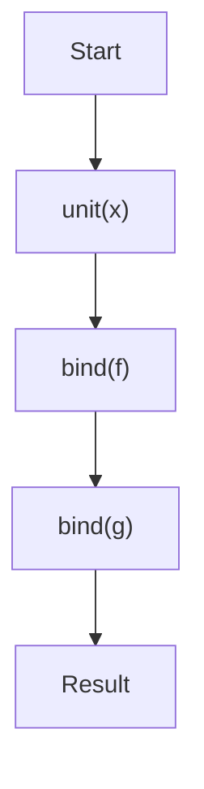

## 3.2. Monad Pattern

In the realm of functional programming, monads are a powerful and ubiquitous pattern that encapsulate computations within a context. They provide a way to structure programs generically while managing side effects, sequencing operations, and handling errors gracefully. In this section, we'll delve into the concept of monads, explore their laws, and demonstrate their application through common examples like the Maybe, Either, IO, and List monads.

### Understanding Monads

Monads can be thought of as design patterns that allow us to build complex computations by chaining simpler ones. They encapsulate values within a context and provide a mechanism to apply functions to these values while maintaining the context. This abstraction helps manage side effects, handle errors, and sequence operations in a functional way.

#### Key Concepts

- **Encapsulation**: Monads wrap values in a context, allowing us to operate on these values without leaving the context.
- **Chaining**: Monads provide a way to chain operations, ensuring that each step in the computation is executed in sequence.
- **Context Management**: By encapsulating values, monads manage the context in which computations occur, such as handling null values or errors.

### Monad Laws

To be considered a monad, a type must satisfy three fundamental laws: Left Identity, Right Identity, and Associativity. These laws ensure that monads behave predictably and consistently.

#### Left Identity

The Left Identity law states that if you take a value, put it in a default context using `unit` (or `return`), and then apply a function using `bind` (or `flatMap`), it is the same as just applying the function to the value.

```pseudocode
unit(x).bind(f) == f(x)
```

#### Right Identity

The Right Identity law states that if you have a monadic value and you apply `unit` to it using `bind`, the result is the same as the original monadic value.

```pseudocode
m.bind(unit) == m
```

#### Associativity

The Associativity law ensures that the order in which operations are performed does not affect the result. It states that chaining multiple operations together should yield the same result regardless of how they are nested.

```pseudocode
m.bind(f).bind(g) == m.bind(x => f(x).bind(g))
```

### Common Monads

Monads are prevalent in functional programming, and several common monads are used to solve specific problems. Let's explore some of these monads and their applications.

#### Maybe Monad

The Maybe monad is used to represent computations that may fail or return nothing. It encapsulates a value that may or may not be present, providing a way to handle null or undefined values gracefully.

```pseudocode
class Maybe {
    static unit(value) {
        return new Just(value);
    }

    bind(f) {
        if (this instanceof Just) {
            return f(this.value);
        } else {
            return this; // Nothing
        }
    }
}

class Just extends Maybe {
    constructor(value) {
        super();
        this.value = value;
    }
}

class Nothing extends Maybe {}
```

#### Either Monad

The Either monad is used for computations that may result in an error. It encapsulates a value that can be either a success (`Right`) or a failure (`Left`), allowing for error handling without exceptions.

```pseudocode
class Either {
    static unit(value) {
        return new Right(value);
    }

    bind(f) {
        if (this instanceof Right) {
            return f(this.value);
        } else {
            return this; // Left
        }
    }
}

class Right extends Either {
    constructor(value) {
        super();
        this.value = value;
    }
}

class Left extends Either {
    constructor(error) {
        super();
        this.error = error;
    }
}
```

#### IO Monad

The IO monad is used to handle side effects in a functional way. It encapsulates actions that interact with the outside world, such as reading from a file or printing to the console, allowing these actions to be composed and sequenced.

```pseudocode
class IO {
    constructor(effect) {
        this.effect = effect;
    }

    static unit(value) {
        return new IO(() => value);
    }

    bind(f) {
        return new IO(() => {
            const result = this.effect();
            return f(result).effect();
        });
    }
}
```

#### List Monad

The List monad is used to represent computations that can return multiple values. It encapsulates a list of values and provides a way to apply functions to each element, collecting the results.

```pseudocode
class List {
    constructor(values) {
        this.values = values;
    }

    static unit(value) {
        return new List([value]);
    }

    bind(f) {
        return new List(this.values.flatMap(value => f(value).values));
    }
}
```

### Pseudocode Implementation

To implement a monad, we need to define two primary operations: `bind` (or `flatMap`) and `unit` (or `return`). These operations allow us to chain computations and encapsulate values within a context.

#### Defining `bind` and `unit`

The `bind` operation applies a function to a monadic value, returning a new monadic value. The `unit` operation wraps a value in a monad, providing a default context.

```pseudocode
class Monad {
    static unit(value) {
        // Wrap the value in a monad
    }

    bind(f) {
        // Apply the function to the monadic value
    }
}
```

### Examples

Let's explore some examples of using monads to handle errors and manage computations.

#### Error Handling with Maybe Monad

The Maybe monad provides a way to handle computations that may fail without using exceptions. It allows us to chain operations, returning `Nothing` if any step fails.

```pseudocode
function safeDivide(a, b) {
    if (b === 0) {
        return new Nothing();
    } else {
        return new Just(a / b);
    }
}

const result = Maybe.unit(10)
    .bind(x => safeDivide(x, 2))
    .bind(x => safeDivide(x, 0)); // Returns Nothing
```

#### Error Handling with Either Monad

The Either monad allows us to handle errors by encapsulating success and failure cases. It provides a way to chain operations, propagating errors without exceptions.

```pseudocode
function divide(a, b) {
    if (b === 0) {
        return new Left("Division by zero");
    } else {
        return new Right(a / b);
    }
}

const result = Either.unit(10)
    .bind(x => divide(x, 2))
    .bind(x => divide(x, 0)); // Returns Left("Division by zero")
```

### Visualizing Monad Operations

To better understand how monads work, let's visualize the flow of operations using a Mermaid.js diagram.



This diagram illustrates the chaining of operations using `unit` and `bind`, showing how each step in the computation is executed in sequence.

### Design Considerations

When using monads, it's important to consider the following:

- **When to Use**: Monads are useful for managing side effects, handling errors, and sequencing operations in a functional way.
- **Pitfalls**: Overusing monads can lead to complex and difficult-to-understand code. It's important to use them judiciously and only when they provide clear benefits.
- **Performance**: Monads can introduce overhead, so it's important to consider performance implications, especially in performance-critical applications.

### Programming Language Specifics

Different programming languages have varying support for monads. Languages like Haskell have built-in support for monads, while others like JavaScript and Python require additional libraries or custom implementations.

### Differences and Similarities

Monads are often confused with other patterns like functors and applicative functors. While all three patterns involve encapsulating values and applying functions, monads provide additional capabilities for chaining operations and managing context.

### Try It Yourself

To deepen your understanding of monads, try modifying the code examples provided. Experiment with different monadic operations, such as chaining additional functions or handling different error cases. This hands-on practice will help solidify your understanding of how monads work and how they can be applied in real-world scenarios.

## Quiz Time!



### What is the primary purpose of a monad in functional programming?

- [x] To encapsulate computations within a context
- [ ] To perform imperative programming
- [ ] To replace all functions with classes
- [ ] To eliminate all side effects

> **Explanation:** Monads encapsulate computations within a context, allowing for structured and predictable handling of operations and side effects.

### Which of the following is NOT a monad law?

- [ ] Left Identity
- [ ] Right Identity
- [x] Commutativity
- [ ] Associativity

> **Explanation:** Commutativity is not a monad law. The monad laws are Left Identity, Right Identity, and Associativity.

### What does the Maybe monad represent?

- [x] Computations that may fail or return nothing
- [ ] Computations that always succeed
- [ ] Computations that involve side effects
- [ ] Computations that require user input

> **Explanation:** The Maybe monad represents computations that may fail or return nothing, providing a way to handle null or undefined values gracefully.

### How does the Either monad handle errors?

- [x] By encapsulating success and failure cases
- [ ] By throwing exceptions
- [ ] By logging errors to the console
- [ ] By ignoring errors

> **Explanation:** The Either monad encapsulates success and failure cases, allowing for error handling without exceptions.

### What is the purpose of the `bind` operation in a monad?

- [x] To apply a function to a monadic value
- [ ] To create a new monad
- [ ] To destroy a monad
- [ ] To convert a monad to a list

> **Explanation:** The `bind` operation applies a function to a monadic value, returning a new monadic value.

### Which monad is commonly used to handle side effects?

- [ ] Maybe
- [ ] Either
- [x] IO
- [ ] List

> **Explanation:** The IO monad is used to handle side effects in a functional way, encapsulating actions that interact with the outside world.

### What does the Right Identity law state?

- [x] Applying `unit` to a monadic value using `bind` returns the original monadic value
- [ ] Applying `bind` to a monadic value using `unit` returns a new monadic value
- [ ] Applying `unit` to a monadic value using `bind` returns a list
- [ ] Applying `bind` to a monadic value using `unit` returns a function

> **Explanation:** The Right Identity law states that applying `unit` to a monadic value using `bind` returns the original monadic value.

### What is the result of chaining operations with the Maybe monad if any step fails?

- [x] Nothing
- [ ] Just
- [ ] Left
- [ ] Right

> **Explanation:** If any step in the chain of operations with the Maybe monad fails, the result is `Nothing`.

### What is the purpose of the `unit` operation in a monad?

- [x] To wrap a value in a monad
- [ ] To unwrap a value from a monad
- [ ] To apply a function to a monad
- [ ] To convert a monad to a string

> **Explanation:** The `unit` operation wraps a value in a monad, providing a default context.

### True or False: Monads can be used to manage side effects in functional programming.

- [x] True
- [ ] False

> **Explanation:** True. Monads can be used to manage side effects in functional programming by encapsulating actions and providing a way to compose and sequence them.



Remember, mastering monads takes practice and patience. As you continue to explore functional programming, you'll find that monads are a versatile and powerful tool for managing complexity and ensuring code reliability. Keep experimenting, stay curious, and enjoy the journey!
