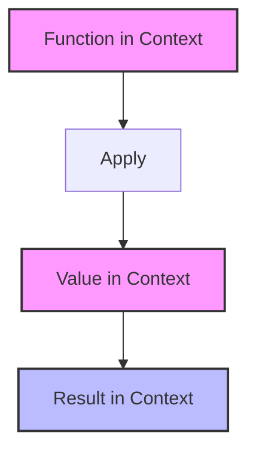

## 3.3. Applicative Functor Pattern

In the realm of functional programming, the Applicative Functor Pattern stands as a powerful abstraction that extends the capabilities of functors. This pattern allows us to apply functions wrapped in a context to values also wrapped in a context, enabling more complex computations while maintaining a high level of abstraction and composability.

### Concept and Motivation

The Applicative Functor Pattern is a design pattern that allows us to work with functions and values that are wrapped in a context, such as a computational context or a data structure. This pattern is particularly useful when dealing with multiple independent computations that need to be combined.

#### Key Concepts

- **Contextual Computation**: In functional programming, a context can be thought of as an environment in which computations occur. This could be a list, an optional value, or any other structure that holds values.
- **Function Application**: The core idea of the Applicative Functor Pattern is to apply a function that is itself wrapped in a context to a value that is also wrapped in a context.
- **Parallel Composition**: Unlike monads, which require sequencing of operations, applicative functors allow for parallel composition of computations, making them ideal for scenarios where operations are independent.

#### Motivation

The motivation behind the Applicative Functor Pattern is to provide a way to work with computations that are independent of each other, allowing for more modular and reusable code. By using applicative functors, we can:

- **Combine Independent Computations**: Applicative functors allow us to combine computations that do not depend on each other, enabling parallel execution.
- **Enhance Code Reusability**: By abstracting the application of functions to values in a context, we can write more generic and reusable code.
- **Simplify Complex Operations**: Applicative functors provide a way to simplify complex operations by breaking them down into smaller, independent computations.

### Differences from Functors and Monads

To fully appreciate the Applicative Functor Pattern, it's important to understand how it differs from other related patterns, namely functors and monads.

#### Functors

- **Definition**: A functor is a type that implements a `map` function, allowing us to apply a function to a value wrapped in a context.
- **Limitation**: Functors only allow for the application of a single-argument function to a value in a context. They do not support functions that take multiple arguments.

#### Monads

- **Definition**: A monad is a type that implements `bind` (or `flatMap`), allowing for the sequencing of operations.
- **Limitation**: Monads require sequencing, meaning that each operation depends on the result of the previous one. This can limit parallelism.

#### Applicative Functors

- **Definition**: An applicative functor is a type that implements `apply`, allowing us to apply a function wrapped in a context to a value wrapped in a context.
- **Advantage**: Applicative functors do not require sequencing, enabling parallel composition of independent computations.

### Pseudocode Implementation

To illustrate the Applicative Functor Pattern, let's define a simple pseudocode implementation. We'll start by defining the `apply` function, which is the core of the pattern.

```pseudocode
// Define a generic Applicative Functor interface
interface ApplicativeFunctor<T> {
    // Apply a function wrapped in a context to a value wrapped in a context
    apply<U>(func: ApplicativeFunctor<(T) -> U>): ApplicativeFunctor<U>
}

// Example implementation for a List context
class List<T> implements ApplicativeFunctor<T> {
    private elements: Array<T>

    constructor(elements: Array<T>) {
        this.elements = elements
    }

    // Map function for functor behavior
    map<U>(func: (T) -> U): List<U> {
        return new List<U>(this.elements.map(func))
    }

    // Apply function for applicative functor behavior
    apply<U>(funcList: List<(T) -> U>): List<U> {
        let result = []
        for (func in funcList.elements) {
            for (element in this.elements) {
                result.push(func(element))
            }
        }
        return new List<U>(result)
    }
}

// Example usage
let numbers = new List([1, 2, 3])
let functions = new List([(x) -> x + 1, (x) -> x * 2])

let result = numbers.apply(functions)
// result: List([2, 3, 4, 2, 4, 6])
```

In this pseudocode, we define an `ApplicativeFunctor` interface with an `apply` method. We then implement this interface for a `List` context, allowing us to apply a list of functions to a list of values.

### Examples

Let's explore some practical examples of using the Applicative Functor Pattern to combine computations in parallel.

#### Example 1: Combining Optional Values

Consider a scenario where we have two optional values and a function that combines them. We can use the Applicative Functor Pattern to apply the function to the values if they are both present.

```pseudocode
// Define an Optional type
class Optional<T> implements ApplicativeFunctor<T> {
    private value: T?

    constructor(value: T?) {
        this.value = value
    }

    // Apply function for applicative functor behavior
    apply<U>(funcOpt: Optional<(T) -> U>): Optional<U> {
        if (this.value != null && funcOpt.value != null) {
            return new Optional<U>(funcOpt.value(this.value))
        }
        return new Optional<U>(null)
    }
}

// Example usage
let opt1 = new Optional(5)
let opt2 = new Optional(10)
let add = new Optional((x, y) -> x + y)

let result = opt1.apply(opt2.apply(add))
// result: Optional(15)
```

In this example, we define an `Optional` type that implements the `ApplicativeFunctor` interface. We then use the `apply` method to combine two optional values using a function.

#### Example 2: Parallel Computation with Futures

The Applicative Functor Pattern is particularly useful in scenarios involving parallel computation, such as working with futures or promises.

```pseudocode
// Define a Future type
class Future<T> implements ApplicativeFunctor<T> {
    private computation: () -> T

    constructor(computation: () -> T) {
        this.computation = computation
    }

    // Apply function for applicative functor behavior
    apply<U>(funcFuture: Future<(T) -> U>): Future<U> {
        return new Future<U>(() -> {
            let func = funcFuture.computation()
            let value = this.computation()
            return func(value)
        })
    }
}

// Example usage
let future1 = new Future(() -> 5)
let future2 = new Future(() -> 10)
let addFuture = new Future(() -> (x, y) -> x + y)

let resultFuture = future1.apply(future2.apply(addFuture))
// resultFuture: Future(15)
```

In this example, we define a `Future` type that represents a computation that will be completed in the future. We use the `apply` method to combine two futures using a function, allowing for parallel computation.

### Visualizing the Applicative Functor Pattern

To better understand the Applicative Functor Pattern, let's visualize the process of applying functions wrapped in a context to values wrapped in a context.



In this diagram, we see the flow of applying a function in a context to a value in a context, resulting in a new value in a context.

### Design Considerations

When using the Applicative Functor Pattern, there are several important considerations to keep in mind:

- **Independence of Computations**: Ensure that the computations being combined are independent of each other, as applicative functors do not handle dependencies between computations.
- **Contextual Consistency**: The contexts in which functions and values are wrapped should be consistent, as the `apply` method relies on this consistency.
- **Performance Implications**: Consider the performance implications of applying functions in a context, especially when dealing with large data structures or complex computations.

### Programming Language Specifics

The Applicative Functor Pattern can be implemented in various programming languages, each with its own syntax and idioms. Here are some language-specific considerations:

- **Haskell**: Haskell has built-in support for applicative functors through the `Applicative` type class, making it easy to work with this pattern.
- **Scala**: Scala's standard library includes support for applicative functors, allowing for concise and expressive code.
- **JavaScript**: While JavaScript does not have built-in support for applicative functors, libraries like Ramda and Folktale provide utilities for working with this pattern.

### Differences and Similarities

The Applicative Functor Pattern is often compared to other patterns, such as functors and monads. Here are some key differences and similarities:

- **Functors vs. Applicative Functors**: Functors allow for the application of single-argument functions, while applicative functors support functions with multiple arguments.
- **Monads vs. Applicative Functors**: Monads require sequencing of operations, whereas applicative functors allow for parallel composition.

### Try It Yourself

To deepen your understanding of the Applicative Functor Pattern, try modifying the code examples provided. Experiment with different contexts, such as lists, optionals, or futures, and see how the pattern can be applied to solve different problems.

### Knowledge Check

Before we conclude, let's pose a few questions to reinforce your understanding of the Applicative Functor Pattern:

- What is the main advantage of using the Applicative Functor Pattern over monads?
- How does the `apply` function differ from the `map` function in a functor?
- In what scenarios would you choose to use an applicative functor over a monad?

### Embrace the Journey

Remember, mastering the Applicative Functor Pattern is just one step in your journey to becoming a proficient functional programmer. As you continue to explore functional programming patterns, you'll discover new ways to write more expressive and efficient code. Keep experimenting, stay curious, and enjoy the journey!

## Quiz Time!



### What is the primary advantage of the Applicative Functor Pattern over monads?

- [x] It allows for parallel composition of computations.
- [ ] It requires sequencing of operations.
- [ ] It only supports single-argument functions.
- [ ] It is more complex to implement.

> **Explanation:** The primary advantage of the Applicative Functor Pattern is that it allows for parallel composition of computations, unlike monads which require sequencing.

### How does the `apply` function differ from the `map` function in a functor?

- [x] `apply` can handle functions with multiple arguments.
- [ ] `apply` is used for sequencing operations.
- [ ] `map` can handle functions with multiple arguments.
- [ ] `map` is used for parallel composition.

> **Explanation:** The `apply` function can handle functions with multiple arguments, whereas `map` is limited to single-argument functions.

### In what scenarios would you choose to use an applicative functor over a monad?

- [x] When computations are independent and can be composed in parallel.
- [ ] When computations depend on the result of previous computations.
- [ ] When only single-argument functions are involved.
- [ ] When sequencing is required.

> **Explanation:** Applicative functors are ideal when computations are independent and can be composed in parallel, unlike monads which require sequencing.

### Which of the following is a key characteristic of an applicative functor?

- [x] It allows applying functions wrapped in a context to values wrapped in a context.
- [ ] It requires sequencing of operations.
- [ ] It only supports single-argument functions.
- [ ] It is limited to list contexts.

> **Explanation:** An applicative functor allows applying functions wrapped in a context to values wrapped in a context, enabling parallel composition.

### What is the role of the `apply` method in an applicative functor?

- [x] To apply a function wrapped in a context to a value wrapped in a context.
- [ ] To sequence operations in a monadic context.
- [ ] To map a single-argument function over a value.
- [ ] To handle side effects in a context.

> **Explanation:** The `apply` method is used to apply a function wrapped in a context to a value wrapped in a context, which is the core of the Applicative Functor Pattern.

### Which of the following is NOT a characteristic of applicative functors?

- [ ] They allow for parallel composition of computations.
- [ ] They can handle functions with multiple arguments.
- [x] They require sequencing of operations.
- [ ] They enhance code reusability.

> **Explanation:** Applicative functors do not require sequencing of operations, which is a characteristic of monads.

### How do applicative functors enhance code reusability?

- [x] By abstracting the application of functions to values in a context.
- [ ] By requiring sequencing of operations.
- [ ] By limiting computations to single-argument functions.
- [ ] By enforcing strict evaluation.

> **Explanation:** Applicative functors enhance code reusability by abstracting the application of functions to values in a context, allowing for more generic and reusable code.

### What is a common use case for applicative functors?

- [x] Combining independent computations in parallel.
- [ ] Sequencing dependent operations.
- [ ] Handling side effects in a context.
- [ ] Mapping single-argument functions over values.

> **Explanation:** A common use case for applicative functors is combining independent computations in parallel, which is not possible with monads.

### Which programming language has built-in support for applicative functors through the `Applicative` type class?

- [x] Haskell
- [ ] JavaScript
- [ ] Python
- [ ] Java

> **Explanation:** Haskell has built-in support for applicative functors through the `Applicative` type class, making it easy to work with this pattern.

### True or False: Applicative functors require sequencing of operations.

- [ ] True
- [x] False

> **Explanation:** False. Applicative functors do not require sequencing of operations, allowing for parallel composition of computations.


