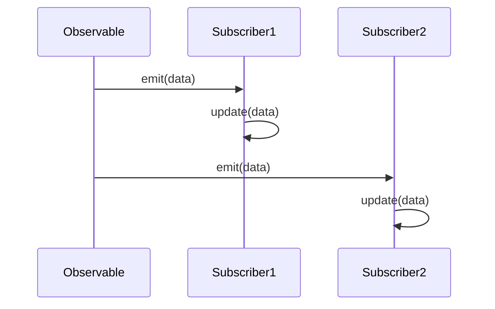

## 3.4. Observer Pattern in Functional Reactive Programming (FRP)

In this section, we delve into the Observer Pattern within the realm of Functional Reactive Programming (FRP). This pattern is pivotal in managing streams of data over time, allowing developers to build responsive and interactive applications. We will explore the concepts of Observables and Subscribers, provide pseudocode implementations, and demonstrate handling events in a functional manner.

### Functional Approach to Observer Pattern

The Observer Pattern is a design pattern that establishes a one-to-many dependency between objects, allowing multiple observers to listen and react to changes in a subject. In the context of Functional Reactive Programming, this pattern is adapted to handle streams of data, enabling applications to react to asynchronous data flows.

#### Managing Streams of Data Over Time

In traditional imperative programming, managing data streams often involves complex state management and callback functions. However, FRP offers a more declarative approach, where data streams are treated as first-class citizens. This allows developers to compose and transform streams using functional operators, leading to cleaner and more maintainable code.

**Key Concepts:**

- **Data Streams:** Continuous flows of data that can be observed and manipulated.
- **Reactive Programming:** A paradigm focused on asynchronous data streams and the propagation of change.
- **Functional Composition:** Building complex operations by combining simple functions.

### Reactive Extensions

Reactive Extensions (Rx) are libraries that enable the use of observable sequences and LINQ-style query operators to compose asynchronous and event-based programs. They provide a powerful abstraction for handling asynchronous data flows, making it easier to work with streams in a functional manner.

#### Implementing Observables and Subscribers

Observables and Subscribers are the core components of Reactive Extensions. An Observable represents a data stream, while a Subscriber listens to the stream and reacts to emitted values.

**Observable:**

- **Definition:** An entity that emits a sequence of values over time.
- **Creation:** Observables can be created from various sources, such as arrays, events, or asynchronous operations.
- **Operators:** Functions that allow transformation, filtering, and aggregation of data streams.

**Subscriber:**

- **Definition:** An entity that consumes values emitted by an Observable.
- **Subscription:** The process of connecting a Subscriber to an Observable, allowing it to receive data.
- **Unsubscription:** The ability to disconnect a Subscriber from an Observable, stopping the data flow.

### Pseudocode Implementation

Let's explore how to create a simple functional reactive system using pseudocode. We'll implement a basic Observable and Subscriber, demonstrating how they interact to manage data streams.

```pseudocode
// Define an Observable class
class Observable:
    def __init__(self):
        self.subscribers = []

    // Method to add a subscriber
    def subscribe(self, subscriber):
        self.subscribers.append(subscriber)

    // Method to emit data to subscribers
    def emit(self, data):
        for subscriber in self.subscribers:
            subscriber.update(data)

// Define a Subscriber class
class Subscriber:
    def __init__(self, name):
        self.name = name

    // Method to handle received data
    def update(self, data):
        print(f"{self.name} received data: {data}")

// Create an observable instance
observable = Observable()

// Create subscriber instances
subscriber1 = Subscriber("Subscriber 1")
subscriber2 = Subscriber("Subscriber 2")

// Subscribe to the observable
observable.subscribe(subscriber1)
observable.subscribe(subscriber2)

// Emit data
observable.emit("Hello, World!")
```

**Explanation:**

- We define an `Observable` class with methods to subscribe and emit data.
- The `Subscriber` class has an `update` method to handle incoming data.
- We create instances of `Observable` and `Subscriber`, subscribe the subscribers to the observable, and emit data to demonstrate the interaction.

### Examples

Let's explore some practical examples of handling events in a functional manner using the Observer Pattern.

#### Example 1: Temperature Monitoring System

Consider a temperature monitoring system where sensors emit temperature readings, and multiple display units need to update their readings in real-time.

```pseudocode
// Define a TemperatureSensor class
class TemperatureSensor(Observable):
    def __init__(self):
        super().__init__()

    // Method to simulate temperature change
    def change_temperature(self, temperature):
        print(f"Temperature changed to: {temperature}")
        self.emit(temperature)

// Define a DisplayUnit class
class DisplayUnit(Subscriber):
    def update(self, temperature):
        print(f"Display updated with temperature: {temperature}")

// Create a temperature sensor instance
sensor = TemperatureSensor()

// Create display unit instances
display1 = DisplayUnit("Display 1")
display2 = DisplayUnit("Display 2")

// Subscribe display units to the sensor
sensor.subscribe(display1)
sensor.subscribe(display2)

// Simulate temperature changes
sensor.change_temperature(25)
sensor.change_temperature(30)
```

**Explanation:**

- We extend the `Observable` class to create a `TemperatureSensor` that emits temperature changes.
- The `DisplayUnit` class extends `Subscriber` to update its display with new temperature readings.
- We simulate temperature changes and observe how display units react.

#### Example 2: Stock Price Tracker

Imagine a stock price tracker where multiple clients need to receive updates on stock prices.

```pseudocode
// Define a StockMarket class
class StockMarket(Observable):
    def __init__(self):
        super().__init__()

    // Method to simulate stock price update
    def update_stock_price(self, stock, price):
        print(f"Stock {stock} price updated to: {price}")
        self.emit((stock, price))

// Define a StockClient class
class StockClient(Subscriber):
    def update(self, stock_price):
        stock, price = stock_price
        print(f"Client received update: {stock} is now {price}")

// Create a stock market instance
market = StockMarket()

// Create stock client instances
client1 = StockClient("Client 1")
client2 = StockClient("Client 2")

// Subscribe clients to the stock market
market.subscribe(client1)
market.subscribe(client2)

// Simulate stock price updates
market.update_stock_price("AAPL", 150)
market.update_stock_price("GOOGL", 2800)
```

**Explanation:**

- We create a `StockMarket` class that emits stock price updates.
- The `StockClient` class listens for updates and processes them.
- We simulate stock price changes and observe client reactions.

### Visualizing Observer Pattern in FRP

To better understand the flow of data in the Observer Pattern within FRP, let's visualize the interaction between Observables and Subscribers.



**Diagram Explanation:**

- The diagram illustrates how an `Observable` emits data to multiple `Subscribers`.
- Each `Subscriber` receives the data and updates itself accordingly.

### Design Considerations

When implementing the Observer Pattern in FRP, consider the following:

- **Memory Management:** Ensure proper unsubscription to avoid memory leaks.
- **Error Handling:** Implement error propagation mechanisms to handle exceptions gracefully.
- **Concurrency:** Consider thread safety when dealing with concurrent data streams.

### Programming Language Specifics

While the pseudocode examples provide a general understanding, different programming languages offer specific libraries and tools for implementing FRP. For instance:

- **JavaScript:** Use libraries like RxJS to work with Observables and Subscribers.
- **Python:** Libraries like RxPY provide similar functionality for reactive programming.
- **Java:** Utilize Project Reactor or RxJava for building reactive systems.

### Differences and Similarities

The Observer Pattern in FRP shares similarities with the traditional Observer Pattern but differs in its focus on functional composition and asynchronous data streams. Unlike the imperative approach, FRP emphasizes immutability and declarative transformations.

### Try It Yourself

To deepen your understanding, try modifying the pseudocode examples:

- **Add More Subscribers:** Create additional subscribers and observe how they react to data changes.
- **Implement Error Handling:** Introduce error handling mechanisms to manage exceptions in data streams.
- **Experiment with Operators:** Explore different operators to transform and filter data streams.

### Knowledge Check

Before moving on, consider the following questions:

- How does the Observer Pattern in FRP differ from its traditional implementation?
- What are the benefits of using Observables and Subscribers in managing data streams?
- How can you ensure proper memory management in a reactive system?

### Embrace the Journey

Remember, mastering the Observer Pattern in FRP is just the beginning. As you continue your journey, you'll discover more advanced patterns and techniques to build responsive and scalable applications. Keep experimenting, stay curious, and enjoy the process!

## Quiz Time!



### What is the primary purpose of the Observer Pattern in Functional Reactive Programming?

- [x] To manage streams of data over time
- [ ] To handle synchronous data processing
- [ ] To implement complex algorithms
- [ ] To manage database connections

> **Explanation:** The Observer Pattern in FRP is primarily used to manage streams of data over time, allowing applications to react to asynchronous data flows.

### What is an Observable in the context of Reactive Extensions?

- [x] An entity that emits a sequence of values over time
- [ ] A function that processes data
- [ ] A data structure for storing values
- [ ] A method for handling errors

> **Explanation:** An Observable is an entity that emits a sequence of values over time, allowing subscribers to listen and react to these values.

### What role does a Subscriber play in Reactive Extensions?

- [x] It consumes values emitted by an Observable
- [ ] It generates data streams
- [ ] It filters data
- [ ] It stores data

> **Explanation:** A Subscriber consumes values emitted by an Observable, reacting to the data as it is received.

### How can you ensure proper memory management in a reactive system?

- [x] By implementing proper unsubscription mechanisms
- [ ] By using global variables
- [ ] By avoiding the use of Observables
- [ ] By minimizing the number of Subscribers

> **Explanation:** Proper unsubscription mechanisms are essential to ensure memory management and avoid memory leaks in a reactive system.

### Which of the following is a key benefit of using Functional Reactive Programming?

- [x] Declarative transformation of data streams
- [ ] Increased complexity in code
- [ ] Synchronous data processing
- [ ] Manual state management

> **Explanation:** Functional Reactive Programming allows for declarative transformation of data streams, leading to cleaner and more maintainable code.

### What is the main difference between traditional Observer Pattern and FRP?

- [x] FRP focuses on functional composition and asynchronous data streams
- [ ] Traditional Observer Pattern is more efficient
- [ ] FRP requires more manual state management
- [ ] Traditional Observer Pattern is only used in imperative programming

> **Explanation:** FRP emphasizes functional composition and asynchronous data streams, unlike the traditional Observer Pattern which is more imperative.

### Which library can be used for implementing FRP in JavaScript?

- [x] RxJS
- [ ] NumPy
- [ ] jQuery
- [ ] Lodash

> **Explanation:** RxJS is a library used for implementing Functional Reactive Programming in JavaScript.

### What is a common use case for the Observer Pattern in FRP?

- [x] Real-time data monitoring
- [ ] Static data analysis
- [ ] Batch processing
- [ ] File I/O operations

> **Explanation:** The Observer Pattern in FRP is commonly used for real-time data monitoring, allowing applications to react to changes as they occur.

### How does FRP handle errors in data streams?

- [x] By implementing error propagation mechanisms
- [ ] By ignoring errors
- [ ] By using try-catch blocks
- [ ] By terminating the data stream

> **Explanation:** FRP handles errors by implementing error propagation mechanisms, allowing for graceful handling of exceptions.

### True or False: Functional Reactive Programming requires manual state management.

- [ ] True
- [x] False

> **Explanation:** Functional Reactive Programming abstracts state management through functional composition and declarative transformations, reducing the need for manual state management.


