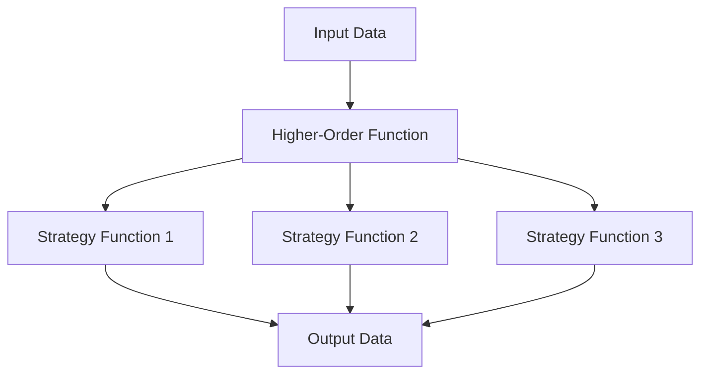

## 3.5. Strategy Pattern in Functional Programming

The Strategy Pattern is a powerful design pattern that enables developers to define a family of algorithms, encapsulate each one, and make them interchangeable. In functional programming (FP), this pattern is implemented using higher-order functions, which allows for greater flexibility and modularity in code design. This section will delve into the Strategy Pattern in FP, exploring its concepts, applications, and pseudocode implementations.

### Defining Strategies as Functions

In traditional object-oriented programming (OOP), the Strategy Pattern is often implemented using classes and interfaces. However, in FP, we leverage the power of functions as first-class citizens to achieve the same goal. By passing algorithms as parameters, we can dynamically change the behavior of a function without altering its structure.

#### Key Concepts

- **Higher-Order Functions**: Functions that take other functions as arguments or return them as results.
- **Function Composition**: Combining simple functions to build more complex operations.
- **Immutability**: Ensuring that data structures remain unchanged, promoting safer and more predictable code.

#### Example: Sorting Strategies

Let's consider a classic example of sorting algorithms. We can define different sorting strategies as functions and pass them to a higher-order function that performs the sorting.

```pseudocode
// Define sorting strategies
function bubbleSort(array) {
    // Implementation of bubble sort algorithm
}

function quickSort(array) {
    // Implementation of quick sort algorithm
}

// Higher-order function that takes a sorting strategy
function sortArray(array, strategy) {
    return strategy(array)
}

// Usage
let numbers = [5, 3, 8, 1, 2]
let sortedNumbers = sortArray(numbers, bubbleSort)
```

In this example, `bubbleSort` and `quickSort` are strategies that can be passed to the `sortArray` function. This approach allows us to easily switch between different sorting algorithms without modifying the `sortArray` function itself.

### Replacing Inheritance with Composition

One of the key advantages of using the Strategy Pattern in FP is the ability to replace inheritance with composition. Instead of creating a complex class hierarchy, we can compose functions to achieve the desired behavior.

#### Benefits of Composition

- **Flexibility**: Easily swap out or extend functionality by composing different functions.
- **Reusability**: Reuse existing functions across different parts of the application.
- **Simplicity**: Reduce complexity by avoiding deep class hierarchies.

#### Example: Payment Processing Strategies

Consider a scenario where we need to process payments using different methods such as credit card, PayPal, or bank transfer. We can define each payment method as a function and compose them as needed.

```pseudocode
// Define payment strategies
function creditCardPayment(amount) {
    // Process payment using credit card
}

function paypalPayment(amount) {
    // Process payment using PayPal
}

function bankTransferPayment(amount) {
    // Process payment using bank transfer
}

// Higher-order function to process payment
function processPayment(amount, paymentStrategy) {
    return paymentStrategy(amount)
}

// Usage
let amount = 100
processPayment(amount, creditCardPayment)
```

By using function composition, we can easily add new payment methods or modify existing ones without affecting the overall structure of the payment processing system.

### Pseudocode Examples

To further illustrate the Strategy Pattern in FP, let's explore additional examples and scenarios where this pattern can be applied.

#### Example 1: Logging Strategies

In a logging system, we may want to log messages to different outputs such as console, file, or remote server. By defining logging strategies as functions, we can dynamically change the logging behavior.

```pseudocode
// Define logging strategies
function consoleLogger(message) {
    printToConsole(message)
}

function fileLogger(message) {
    writeToFile(message)
}

function remoteLogger(message) {
    sendToRemoteServer(message)
}

// Higher-order function to log message
function logMessage(message, logger) {
    logger(message)
}

// Usage
let message = "Application started"
logMessage(message, consoleLogger)
```

#### Example 2: Discount Strategies

In an e-commerce application, we may have different discount strategies such as percentage discount, fixed amount discount, or buy-one-get-one-free. By defining these strategies as functions, we can easily apply different discounts to a product.

```pseudocode
// Define discount strategies
function percentageDiscount(price, percent) {
    return price - (price * percent / 100)
}

function fixedAmountDiscount(price, amount) {
    return price - amount
}

function bogofDiscount(price, quantity) {
    return (quantity % 2 === 0) ? price * (quantity / 2) : price * ((quantity - 1) / 2 + 1)
}

// Higher-order function to apply discount
function applyDiscount(price, quantity, discountStrategy) {
    return discountStrategy(price, quantity)
}

// Usage
let price = 100
let quantity = 3
let discountedPrice = applyDiscount(price, quantity, percentageDiscount)
```

### Visualizing the Strategy Pattern

To better understand the Strategy Pattern in FP, let's visualize the flow of data and function composition using a diagram.



**Diagram Description**: This diagram illustrates how input data flows through a higher-order function, which then applies one of the strategy functions to produce the output data. The strategy functions are interchangeable, allowing for dynamic behavior changes.

### Design Considerations

When implementing the Strategy Pattern in FP, consider the following:

- **Function Signatures**: Ensure that all strategy functions have compatible signatures to be interchangeable.
- **Error Handling**: Implement appropriate error handling within strategy functions to manage unexpected inputs or failures.
- **Performance**: Evaluate the performance implications of different strategies, especially for computationally intensive tasks.

### Differences and Similarities

The Strategy Pattern is often compared to other design patterns such as the Template Method Pattern and the State Pattern. Here are some key differences and similarities:

- **Strategy vs. Template Method**: The Strategy Pattern focuses on encapsulating algorithms, while the Template Method Pattern defines the skeleton of an algorithm and allows subclasses to override specific steps.
- **Strategy vs. State**: Both patterns involve interchangeable behaviors, but the State Pattern is used to manage state transitions, whereas the Strategy Pattern is used to select algorithms.

### Try It Yourself

To deepen your understanding of the Strategy Pattern in FP, try modifying the provided examples:

- **Experiment with New Strategies**: Create additional sorting, logging, or discount strategies and integrate them into the existing examples.
- **Combine Strategies**: Implement a scenario where multiple strategies are combined to achieve a complex behavior.
- **Optimize Performance**: Analyze the performance of different strategies and optimize them for specific use cases.

### References and Further Reading

- [MDN Web Docs: Functions](https://developer.mozilla.org/en-US/docs/Web/JavaScript/Guide/Functions)
- [W3Schools: JavaScript Functions](https://www.w3schools.com/js/js_functions.asp)
- [Refactoring Guru: Strategy Pattern](https://refactoring.guru/design-patterns/strategy)

### Knowledge Check

- **What are higher-order functions and how are they used in the Strategy Pattern?**
- **How does function composition enhance code modularity in FP?**
- **What are the benefits of replacing inheritance with composition in FP?**

### Embrace the Journey

Remember, mastering the Strategy Pattern in FP is just one step in your functional programming journey. As you continue to explore and apply these concepts, you'll discover new ways to create flexible, modular, and efficient code. Keep experimenting, stay curious, and enjoy the journey!

## Quiz Time!



### What is the primary purpose of the Strategy Pattern in functional programming?

- [x] To define a family of algorithms and make them interchangeable
- [ ] To manage state transitions in an application
- [ ] To encapsulate object creation logic
- [ ] To enforce a strict class hierarchy

> **Explanation:** The Strategy Pattern is used to define a family of algorithms, encapsulate each one, and make them interchangeable, allowing for dynamic behavior changes.

### How are strategies typically implemented in functional programming?

- [x] As higher-order functions
- [ ] As classes and interfaces
- [ ] As global variables
- [ ] As static methods

> **Explanation:** In functional programming, strategies are implemented as higher-order functions, which can take other functions as arguments or return them as results.

### What is a key advantage of using function composition in the Strategy Pattern?

- [x] It enhances code modularity and reusability
- [ ] It increases the complexity of the code
- [ ] It requires more memory usage
- [ ] It limits the flexibility of the code

> **Explanation:** Function composition allows developers to build complex operations by combining simple functions, enhancing code modularity and reusability.

### Which of the following is a benefit of replacing inheritance with composition in FP?

- [x] Increased flexibility and simplicity
- [ ] More complex class hierarchies
- [ ] Reduced code reusability
- [ ] Increased dependency on global state

> **Explanation:** Replacing inheritance with composition increases flexibility and simplicity by allowing developers to compose functions rather than creating complex class hierarchies.

### In the provided pseudocode example, what is the role of the `sortArray` function?

- [x] It acts as a higher-order function that applies a sorting strategy
- [ ] It directly implements the bubble sort algorithm
- [ ] It manages state transitions for sorting
- [ ] It encapsulates object creation logic

> **Explanation:** The `sortArray` function is a higher-order function that takes a sorting strategy as an argument and applies it to the array.

### What is a potential pitfall when implementing the Strategy Pattern in FP?

- [x] Ensuring all strategy functions have compatible signatures
- [ ] Over-reliance on global variables
- [ ] Lack of function reusability
- [ ] Increased complexity due to deep class hierarchies

> **Explanation:** A potential pitfall is ensuring that all strategy functions have compatible signatures to be interchangeable.

### How can performance be optimized when using the Strategy Pattern in FP?

- [x] By evaluating and selecting the most efficient strategy for the task
- [ ] By using global variables to store intermediate results
- [ ] By creating deep class hierarchies
- [ ] By avoiding the use of higher-order functions

> **Explanation:** Performance can be optimized by evaluating and selecting the most efficient strategy for the specific task at hand.

### What is a common use case for the Strategy Pattern in FP?

- [x] Implementing different algorithms for sorting, logging, or payment processing
- [ ] Managing state transitions in a state machine
- [ ] Encapsulating object creation logic
- [ ] Enforcing strict class hierarchies

> **Explanation:** A common use case for the Strategy Pattern in FP is implementing different algorithms for tasks such as sorting, logging, or payment processing.

### What is the main difference between the Strategy Pattern and the State Pattern?

- [x] The Strategy Pattern focuses on selecting algorithms, while the State Pattern manages state transitions
- [ ] The Strategy Pattern is used for object creation, while the State Pattern is used for algorithm selection
- [ ] The Strategy Pattern enforces class hierarchies, while the State Pattern uses global variables
- [ ] The Strategy Pattern is less flexible than the State Pattern

> **Explanation:** The main difference is that the Strategy Pattern focuses on selecting algorithms, while the State Pattern is used to manage state transitions.

### True or False: In FP, the Strategy Pattern can be implemented without using classes or interfaces.

- [x] True
- [ ] False

> **Explanation:** True. In functional programming, the Strategy Pattern can be implemented using higher-order functions without the need for classes or interfaces.


